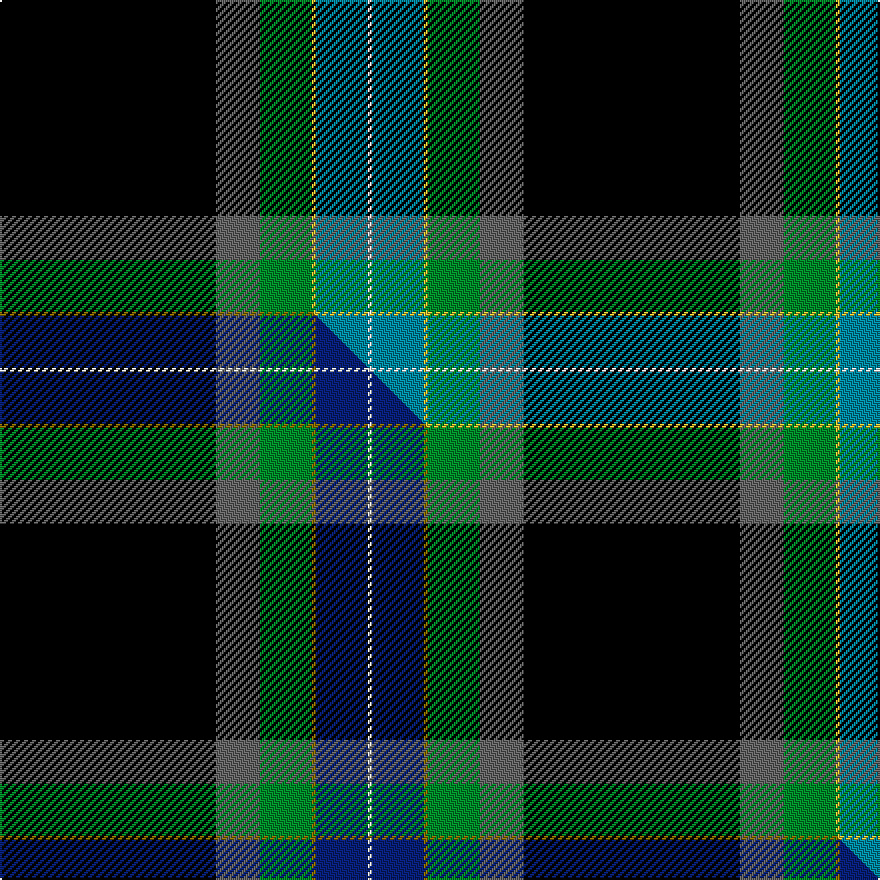

This page is one **sett** — a single exact thread-count. It belongs to the [tartan](/setts/k54n11g13ly1t13w1/)
(the same proportion at any scale), whose colour order is pattern [KBGYBW](/stripes/kbgybw/).

Part of the [Kilmaine Saints](/tartans/kilmaine-saints/) tartan — the named design grouping this sett with its other cloths.

Sourced from tartans-authority.  It is a [6 stripe tartan](/stripes/stripes6/).

Original link https://www.tartanregister.gov.uk/tartanDetails.aspx?ref=10423

Dataset <small>— provenance for this record, inherited from the source manifest</small>

<dl class="dataset-prov">
<dt>source</dt><dd><a href="/sources/tartans-authority/">Scottish Tartans Authority</a></dd>
<dt>data captured from</dt><dd><a href="https://github.com/thetartan/tartan-database/blob/master/data/tartans-authority/data.csv">https://github.com/thetartan/tartan-database/blob/master/data/tartans-authority/data.csv</a></dd>
<dt>data date</dt><dd>1st Feb 2011 <small>(this record)</small></dd>
<dt>licence</dt><dd><a href="https://creativecommons.org/licenses/by-nc-nd/4.0/">CC BY-NC-ND 4.0</a></dd>
</dl>

Capture chain <small>— the hands this data passed through, oldest first; each capture carries its own licence</small>

<ol class="capture-chain">
<li><a href="https://www.tartansauthority.com/">Scottish Tartans Authority</a> <small>the heritage body's archive — its tartan-ferret record browser is retired (links repaired to the SRT, above)</small></li>
<li><a href="https://github.com/thetartan/tartan-database">thetartan/tartan-database</a> <small>2016-2017</small> · <a href="https://creativecommons.org/licenses/by-nc-nd/4.0/">CC BY-NC-ND 4.0</a> <small>Levko Kravets's frozen compilation — the capture we vendored, and where its CC licence text came from</small></li>
<li>this dictionary <small>captured 2026-06-10 · commit 5bf86c7566</small> <small>each re-capture is a git commit to data/sources</small></li>
</ol>

## Register references

External register numbers recorded for this tartan.

- Scottish Register of Tartans: [10423](https://www.tartanregister.gov.uk/tartanDetails?ref=10423)
- Scottish Tartans Authority (ITI): 10423

## Thread count
K/108 N22 G26 LY2 T26 W/2

One full sett is **262 threads**.

## Palette
<table><thead><tr><th>Colour</th><th>Shade</th><th>OKLCh</th></tr></thead><tbody><tr><td>T</td><td><code style="background-color:#00879F;">#00879F</code> <small style="color:#888">#00879F</small></td><td><small style="color:#888">oklch(57.4% 0.102 216.1)</small></td></tr><tr><td>LY</td><td><code style="background-color:#DCBC32;">#DCBC32</code> <small style="color:#888">#DCBC32</small></td><td><small style="color:#888">oklch(80.0% 0.150 95.2)</small></td></tr><tr><td>G</td><td><code style="background-color:#008B2A;">#008B2A</code> <small style="color:#888">#008B2A</small></td><td><small style="color:#888">oklch(55.4% 0.170 145.9)</small></td></tr><tr><td>K</td><td><code style="background-color:#000000;">#000000</code> <small style="color:#888">#000000</small></td><td><small style="color:#888">oklch(0.0% 0.000 0.0)</small></td></tr><tr><td>W</td><td><code style="background-color:#F7F7F7;">#F7F7F7</code> <small style="color:#888">#F7F7F7</small></td><td><small style="color:#888">oklch(97.6% 0.000 89.9)</small></td></tr><tr><td>N</td><td><code style="background-color:#636363;">#636363</code> <small style="color:#888">#636363</small></td><td><small style="color:#888">oklch(50.0% 0.000 89.9)</small></td></tr></tbody></table>

# Sample pattern

## Compared to the master

This cloth is one sett of its design; the master sett (the exemplar the design is anchored on) is below for comparison.

Its **ΔTartan distance** from the master is **0.09** — the same measure the nearest-tartans table ranks by (0 is identical; a re-scale of the same cloth is near 0, a recolour or a different proportion further).

<figure class="master-compare" style="margin:0">

this sett
master sett ★

<figcaption style="color:#888;font-size:smaller">One weave of this sett against the <a href="/setts/k54n11g13y1db13w1/">master sett ★</a>, split on the diagonal: a shared proportion runs seamlessly across it with only the shades shifting; a different proportion breaks on it.</figcaption>
</figure>

## Nearest tartan variants

The nearest existing variants by ΔTartan distance, with this cloth at the top so the swatches line up against it.

ΔTartan

Threads

Variant

Sett

—

262

<a href="/variants/s6/k54n11g13ly1t13w1~x2/">Kilmaine Saints (Corporate)</a>

<a href="/ttd/edit/#slug=k54n11g13y1db13w1~x2&amp;base=k54n11g13ly1t13w1~x2" title="compare in the TTD">0.09</a>

262

<a href="/variants/s6/k54n11g13y1db13w1~x2/">Kilmaine Saints</a>

<a href="/ttd/edit/#slug=db25k84w5g23y5dp8~x2&amp;base=k54n11g13ly1t13w1~x2" title="compare in the TTD">1.22</a>

534

<a href="/variants/s6/db25k84w5g23y5dp8~x2/">Woodward, R Glenn (Personal)</a>

<a href="/ttd/edit/#slug=db25k84w5g32y5dp8~x2&amp;base=k54n11g13ly1t13w1~x2" title="compare in the TTD">1.28</a>

570

<a href="/variants/s6/db25k84w5g32y5dp8~x2/">Woodward, R Glenn</a>

<a href="/ttd/edit/#slug=k62r9w7lb6y3g6~x2&amp;base=k54n11g13ly1t13w1~x2" title="compare in the TTD">1.47</a>

236

<a href="/variants/s6/k62r9w7lb6y3g6~x2/">Tainsh (2016)</a>

<a href="/ttd/edit/#slug=k49dr1o4db5g5ly5~x2&amp;base=k54n11g13ly1t13w1~x2" title="compare in the TTD">1.49</a>

168

<a href="/variants/s6/k49dr1o4db5g5ly5~x2/">CREATeGlasgow</a>

<a href="/ttd/edit/#slug=db1lb2k50dg50ly2r1~x2&amp;base=k54n11g13ly1t13w1~x2" title="compare in the TTD">1.60</a>

420

<a href="/variants/s6/db1lb2k50dg50ly2r1~x2/">Josse (Personal)</a>

<a href="/ttd/edit/#slug=db1lb2k50dg50dy2r1~x2&amp;base=k54n11g13ly1t13w1~x2" title="compare in the TTD">1.60</a>

420

<a href="/variants/s6/db1lb2k50dg50dy2r1~x2/">Josse (Bro Sant Malo), Gilbert (Personal)</a>

<a href="/ttd/edit/#slug=dg42y1k23dr7w1db4y3~x2&amp;base=k54n11g13ly1t13w1~x2" title="compare in the TTD">1.65</a>

234

<a href="/variants/s7/dg42y1k23dr7w1db4y3~x2/">Henschke, Felix (Personal)</a>

<a href="/ttd/edit/#slug=w3k48ly5w3ly3g2db5lb3~x2&amp;base=k54n11g13ly1t13w1~x2" title="compare in the TTD">1.76</a>

276

<a href="/variants/s8/w3k48ly5w3ly3g2db5lb3~x2/">Pavelka Limited</a>

<a href="/ttd/edit/#slug=k50g6db6r6n6w3~x2&amp;base=k54n11g13ly1t13w1~x2" title="compare in the TTD">1.76</a>

202

<a href="/variants/s6/k50g6db6r6n6w3~x2/">Friends of Nordegg</a>

## Neighbour map

Every grey dot is one of 13620 variants placed by the first two principal components of the ΔTartan feature space (42% of its variance). Red is this tartan; blue dots are its nearest — click one to open its page.

<svg viewBox="0 0 640 380" role="img" style="max-width:100%;height:auto;border:1px solid #e0e0e0;border-radius:4px;display:block" xmlns="http://www.w3.org/2000/svg"><image href="/nn/cloud.v1.png" width="640" height="380"/><a href="/variants/s6/k54n11g13y1db13w1~x2/"><circle cx="297.2" cy="82.7" r="4" fill="#3465a4"><title>Kilmaine Saints</title></circle></a><a href="/variants/s6/db25k84w5g23y5dp8~x2/"><circle cx="242.8" cy="124.9" r="4" fill="#3465a4"><title>Woodward, R Glenn (Personal)</title></circle></a><a href="/variants/s6/db25k84w5g32y5dp8~x2/"><circle cx="220.2" cy="129.8" r="4" fill="#3465a4"><title>Woodward, R Glenn</title></circle></a><a href="/variants/s6/k62r9w7lb6y3g6~x2/"><circle cx="305.9" cy="89.1" r="4" fill="#3465a4"><title>Tainsh (2016)</title></circle></a><a href="/variants/s6/k49dr1o4db5g5ly5~x2/"><circle cx="388.1" cy="59.4" r="4" fill="#3465a4"><title>CREATeGlasgow</title></circle></a><a href="/variants/s6/db1lb2k50dg50ly2r1~x2/"><circle cx="320.3" cy="87.4" r="4" fill="#3465a4"><title>Josse (Personal)</title></circle></a><a href="/variants/s6/db1lb2k50dg50dy2r1~x2/"><circle cx="335.7" cy="92.0" r="4" fill="#3465a4"><title>Josse (Bro Sant Malo), Gilbert (Personal)</title></circle></a><a href="/variants/s7/dg42y1k23dr7w1db4y3~x2/"><circle cx="311.1" cy="96.3" r="4" fill="#3465a4"><title>Henschke, Felix (Personal)</title></circle></a><a href="/variants/s8/w3k48ly5w3ly3g2db5lb3~x2/"><circle cx="321.7" cy="66.4" r="4" fill="#3465a4"><title>Pavelka Limited</title></circle></a><a href="/variants/s6/k50g6db6r6n6w3~x2/"><circle cx="298.6" cy="105.3" r="4" fill="#3465a4"><title>Friends of Nordegg</title></circle></a><circle cx="285.7" cy="80.7" r="5" fill="#c00000"/><text x="320" y="376" text-anchor="middle" font-size="11" fill="#999">ground</text><text x="11" y="190" text-anchor="middle" font-size="11" fill="#999" transform="rotate(-90 11 190)">complexity</text></svg>

ID: /variants/s6/k54n11g13ly1t13w1~x2/
