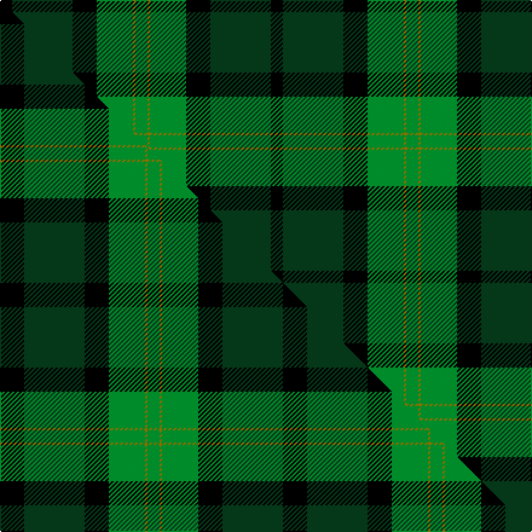

This is one **variant** — a specific cloth: this exact thread count and colourway, with its own
provenance below. It is one weaving of the [sett](/tartans/d/de/delaware-fine-spirits-guild/) (the scale-free proportion — the
same cloth at any scale or shade), whose colour order is pattern [GGGKGK](/stripes/gggkgk/).

Part of the [Delaware Fine Spirits Guild](/tartans/d/de/delaware-fine-spirits-guild/) tartan — the named design grouping this sett with its other cloths.

Sourced from tartans-authority.  It is a [6 stripe tartan](/stripes/stripes6/).

Original link <code>http://www.tartansauthority.com/tartan-ferret/display/10204/</code> — retired · [Internet Archive copy](https://web.archive.org/web/*/http://www.tartansauthority.com/tartan-ferret/display/10204/*)

Dataset <small>— provenance for this record, inherited from the source manifest</small>

<dl class="dataset-prov">
<dt>source</dt><dd><a href="/sources/tartans-authority/">Scottish Tartans Authority</a></dd>
<dt>data captured from</dt><dd><a href="https://github.com/thetartan/tartan-database/blob/master/data/tartans-authority/data.csv">https://github.com/thetartan/tartan-database/blob/master/data/tartans-authority/data.csv</a></dd>
<dt>data date</dt><dd>pre 2010 <small>(this record)</small></dd>
<dt>licence</dt><dd><a href="https://creativecommons.org/licenses/by-nc-nd/4.0/">CC BY-NC-ND 4.0</a></dd>
</dl>

Capture chain <small>— the hands this data passed through, oldest first; each capture carries its own licence</small>

<ol class="capture-chain">
<li><a href="https://www.tartansauthority.com/">Scottish Tartans Authority</a> <small>the heritage body’s archive — its tartan-ferret record browser is retired; dead record links are shown unlinked, with an Internet Archive copy (ITI numbers are not SRT references)</small></li>
<li><a href="https://github.com/thetartan/tartan-database">thetartan/tartan-database</a> <small>2016-2017</small> · <a href="https://creativecommons.org/licenses/by-nc-nd/4.0/">CC BY-NC-ND 4.0</a> <small>Levko Kravets's frozen compilation — the capture we vendored, and where its CC licence text came from</small></li>
<li>this dictionary <small>captured 2026-06-10 · commit 5bf86c7566</small> <small>each re-capture is a git commit to data/sources</small></li>
</ol>

## Register references

External register numbers recorded for this tartan.

- Scottish Register of Tartans: [10204](https://www.tartanregister.gov.uk/tartanDetails?ref=10204)
- Scottish Tartans Authority (ITI): 10204

## Thread count
K/10 DG50 K20 G30 Y2 G/10

One full sett is **224 threads**.

## Palette
<table><thead><tr><th>Colour</th><th>Shade</th><th>OKLCh</th></tr></thead><tbody><tr><td>K</td><td><code style="background-color:#000000;">#000000</code> <small style="color:#888">#000000</small></td><td><small style="color:#888">oklch(0.0% 0.000 0.0)</small></td></tr><tr><td>DG</td><td><code style="background-color:#053819;">#053819</code> <small style="color:#888">#053819</small></td><td><small style="color:#888">oklch(30.0% 0.075 151.3)</small></td></tr><tr><td>G</td><td><code style="background-color:#008B2A;">#008B2A</code> <small style="color:#888">#008B2A</small></td><td><small style="color:#888">oklch(55.4% 0.170 145.9)</small></td></tr><tr><td>Y</td><td><code style="background-color:#8B6E00;">#8B6E00</code> <small style="color:#888">#8B6E00</small></td><td><small style="color:#888">oklch(55.1% 0.113 90.4)</small></td></tr></tbody></table>

# Sample pattern

## Compared to the master

This cloth is one sett of its design; the master sett (the exemplar the design is anchored on) is below for comparison.

Its **ΔTartan distance** from the master is **0.18** — the same measure the nearest-tartans table ranks by (0 is identical; a re-scale of the same cloth is near 0, a recolour or a different proportion further).

<figure class="master-compare" style="margin:0">

this sett
master sett ★

<figcaption style="color:#888;font-size:smaller">One weave of this sett against the <a href="/setts/k10dg25k10g15y1g5/">master sett ★</a>, split on the diagonal: a shared proportion runs seamlessly across it with only the shades shifting; a different proportion breaks on it.</figcaption>
</figure>

## Nearest tartan variants

The nearest existing variants by ΔTartan distance, with this cloth at the top so the swatches line up against it.

ΔTartan

Threads

Variant

Sett

—

224

<a href="/variants/s6/k5dg25k10g15y1g5~x2/">Delaware Fine Spirits Guild (Corp)</a>

<a href="/ttd/edit/#slug=k10dg25k10g15y1g5~x2&amp;base=k5dg25k10g15y1g5~x2" title="compare in the TTD">0.18</a>

234

<a href="/variants/s6/k10dg25k10g15y1g5~x2/">Delaware Fine Spirits Guild</a>

<a href="/ttd/edit/#slug=g21w2g21k17dg12dp6k2w1~x2&amp;base=k5dg25k10g15y1g5~x2" title="compare in the TTD">1.77</a>

284

<a href="/variants/s8/g21w2g21k17dg12dp6k2w1~x2/">Hibernian F. C. (2004) (C orporate)</a>

<a href="/ttd/edit/#slug=g22w2g22k18dg12dp6k2w1~x2&amp;base=k5dg25k10g15y1g5~x2" title="compare in the TTD">1.77</a>

294

<a href="/variants/s8/g22w2g22k18dg12dp6k2w1~x2/">Hibernian Football Club</a>

<a href="/ttd/edit/#slug=r3k11dg29k28g19y2db1~x2~dg1504144-g2408144&amp;base=k5dg25k10g15y1g5~x2" title="compare in the TTD">1.96</a>

364

<a href="/variants/s7/r3k11dg29k28g19y2db1~x2~dg1504144-g2408144/">PMMC</a>

<a href="/ttd/edit/#slug=g5k2g28k10dy26db4g4~x2&amp;base=k5dg25k10g15y1g5~x2" title="compare in the TTD">2.60</a>

298

<a href="/variants/s7/g5k2g28k10dy26db4g4~x2/">John Telfar Dunbar/Hunting Tartan</a>

<a href="/ttd/edit/#slug=dg14k1dg2k1dg2k10g14r2&amp;base=k5dg25k10g15y1g5~x2" title="compare in the TTD">2.68</a>

76

<a href="/variants/s8/dg14k1dg2k1dg2k10g14r2/">Manor (Corporate)</a>

<a href="/ttd/edit/#slug=r4k4dt24k24g24k2r3~x2&amp;base=k5dg25k10g15y1g5~x2" title="compare in the TTD">2.73</a>

326

<a href="/variants/s7/r4k4dt24k24g24k2r3~x2/">Black Watch (Coarse Kilt)</a>

<a href="/ttd/edit/#slug=k3g3k3g21dg21k3g1~x2&amp;base=k5dg25k10g15y1g5~x2" title="compare in the TTD">2.80</a>

212

<a href="/variants/s7/k3g3k3g21dg21k3g1~x2/">Granite City (Silver Granite) Fashion Tartan</a>

<a href="/ttd/edit/#slug=db2k6g2k6dg12y1~x4~g2408144-dg1806142&amp;base=k5dg25k10g15y1g5~x2" title="compare in the TTD">2.92</a>

220

<a href="/variants/s6/db2k6g2k6dg12y1~x4~g2408144-dg1806142/">Leahy (Australia) (Personal)</a>

<a href="/ttd/edit/#slug=g68k22n28dr3n12~x2&amp;base=k5dg25k10g15y1g5~x2" title="compare in the TTD">2.92</a>

372

<a href="/variants/s5/g68k22n28dr3n12~x2/">Herbage of Laggan (Personal)</a>

## Neighbour map

Every grey dot is one of 13656 variants placed by the first two principal components of the ΔTartan feature space (42% of its variance). Red is this tartan; blue dots are its nearest — click one to open its page. The map is a flat projection of a many-dimensional space — [how to read it](/posts/neighbourhood-maps/).

<svg viewBox="0 0 640 380" role="img" style="max-width:100%;height:auto;border:1px solid #e0e0e0;border-radius:4px;display:block" xmlns="http://www.w3.org/2000/svg"><image href="/nn/cloud.v1.png" width="640" height="380"/><a href="/variants/s6/k10dg25k10g15y1g5~x2/"><circle cx="206.0" cy="184.3" r="4" fill="#3465a4"><title>Delaware Fine Spirits Guild</title></circle></a><a href="/variants/s8/g21w2g21k17dg12dp6k2w1~x2/"><circle cx="210.1" cy="149.7" r="4" fill="#3465a4"><title>Hibernian F. C. (2004) (C orporate)</title></circle></a><a href="/variants/s8/g22w2g22k18dg12dp6k2w1~x2/"><circle cx="215.8" cy="146.6" r="4" fill="#3465a4"><title>Hibernian Football Club</title></circle></a><a href="/variants/s7/r3k11dg29k28g19y2db1~x2~dg1504144-g2408144/"><circle cx="175.2" cy="122.2" r="4" fill="#3465a4"><title>PMMC</title></circle></a><a href="/variants/s7/g5k2g28k10dy26db4g4~x2/"><circle cx="241.3" cy="180.8" r="4" fill="#3465a4"><title>John Telfar Dunbar/Hunting Tartan</title></circle></a><a href="/variants/s8/dg14k1dg2k1dg2k10g14r2/"><circle cx="198.5" cy="170.1" r="4" fill="#3465a4"><title>Manor (Corporate)</title></circle></a><a href="/variants/s7/r4k4dt24k24g24k2r3~x2/"><circle cx="156.3" cy="181.9" r="4" fill="#3465a4"><title>Black Watch (Coarse Kilt)</title></circle></a><a href="/variants/s7/k3g3k3g21dg21k3g1~x2/"><circle cx="287.2" cy="172.1" r="4" fill="#3465a4"><title>Granite City (Silver Granite) Fashion Tartan</title></circle></a><a href="/variants/s6/db2k6g2k6dg12y1~x4~g2408144-dg1806142/"><circle cx="181.3" cy="183.6" r="4" fill="#3465a4"><title>Leahy (Australia) (Personal)</title></circle></a><a href="/variants/s5/g68k22n28dr3n12~x2/"><circle cx="284.3" cy="183.5" r="4" fill="#3465a4"><title>Herbage of Laggan (Personal)</title></circle></a><circle cx="229.5" cy="177.4" r="5" fill="#c00000"/><text x="320" y="376" text-anchor="middle" font-size="11" fill="#999">ground</text><text x="11" y="190" text-anchor="middle" font-size="11" fill="#999" transform="rotate(-90 11 190)">complexity</text></svg>

ID: /variants/s6/k5dg25k10g15y1g5~x2/
