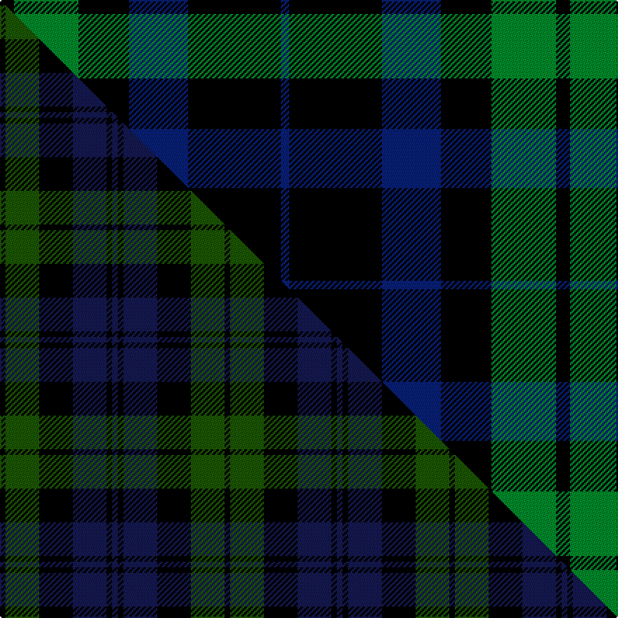

This page is one **sett** — a single exact thread-count. It belongs to the [tartan](/setts/k5g23k18db21k33db3/)
(the same proportion at any scale), whose colour order is pattern [BKBKGK](/stripes/bkbkgk/).

Part of the [Black Watch](/tartans/black-watch-3/) tartan — the named design grouping this sett with its other cloths.

Sourced from register-of-tartans.  It is a [6 stripe tartan](/stripes/stripes6/).

Original link https://www.tartanregister.gov.uk/tartanDetails.aspx?ref=280

2 attestations — the source records this cloth was collapsed from (oldest owns this page)

<ul>
<li>undated — Black Watch (variation) (register-of-tartans, <a href="https://www.tartanregister.gov.uk/tartanDetails.aspx?ref=280">record</a>)  <em>An unusual variation of the Black Watch sett.</em></li>
<li>undated — Black Watch (weddslist, <a href="http://www.weddslist.com/cgi-bin/tartans/pg.pl?source=sts">record</a>) </li>
</ul>

## Register references

External register numbers recorded for this tartan.

- Scottish Register of Tartans: [280](https://www.tartanregister.gov.uk/tartanDetails.aspx?ref=280)
- Scottish Tartans World Register: 256

## Thread count
K/10 G46 K36 DB42 K66 DB/6

One full sett is **396 threads**.

## Palette
<table><thead><tr><th>Colour</th><th>Shade</th><th>OKLCh</th></tr></thead><tbody><tr><td>DB</td><td><code style="background-color:#082077;">#082077</code> <small style="color:#888">#082077</small></td><td><small style="color:#888">oklch(30.0% 0.149 265.1)</small></td></tr><tr><td>G</td><td><code style="background-color:#008B2A;">#008B2A</code> <small style="color:#888">#008B2A</small></td><td><small style="color:#888">oklch(55.4% 0.170 145.9)</small></td></tr><tr><td>K</td><td><code style="background-color:#000000;">#000000</code> <small style="color:#888">#000000</small></td><td><small style="color:#888">oklch(0.0% 0.000 0.0)</small></td></tr></tbody></table>

# Sample pattern

## Compared to the master

This cloth is one sett of its design; the master sett (the exemplar the design is anchored on) is below for comparison.

Its **ΔTartan distance** from the master is **2.19** — the same measure the nearest-tartans table ranks by (0 is identical; a re-scale of the same cloth is near 0, a recolour or a different proportion further).

<figure class="master-compare" style="margin:0">

this sett
master sett ★

<figcaption style="color:#888;font-size:smaller">One weave of this sett against the <a href="/setts/k1dg6k6db6k1db1/">master sett ★</a>, split on the diagonal: a shared proportion runs seamlessly across it with only the shades shifting; a different proportion breaks on it.</figcaption>
</figure>

## Nearest variants

The nearest existing variants by ΔTartan distance, with this cloth at the top so the swatches line up against it.

ΔTartan

Threads

Variant

Sett

—

396

<a href="/variants/s6/k5g23k18db21k33db3~x2/">Black Watch (variation)</a>

<a href="/ttd/edit/#slug=db1k6db6k6g6k1w1~x6&amp;base=k5g23k18db21k33db3~x2" title="compare in the TTD">0.97</a>

312

<a href="/variants/s7/db1k6db6k6g6k1w1~x6/">Forbes - 1947 (Lyon Court)</a>

<a href="/ttd/edit/#slug=db1k6db6k6g6k1w1&amp;base=k5g23k18db21k33db3~x2" title="compare in the TTD">0.97</a>

52

<a href="/variants/s7/db1k6db6k6g6k1w1/">Forbes LC</a>

<a href="/ttd/edit/#slug=db1k6db6k6g6k1w1~x2&amp;base=k5g23k18db21k33db3~x2" title="compare in the TTD">0.97</a>

104

<a href="/variants/s7/db1k6db6k6g6k1w1~x2/">Forbes Ancient</a>

<a href="/ttd/edit/#slug=db18k1db2k18y2g16k16&amp;base=k5g23k18db21k33db3~x2" title="compare in the TTD">1.03</a>

112

<a href="/variants/s7/db18k1db2k18y2g16k16/">Mowat</a>

<a href="/ttd/edit/#slug=db18k1db2k18y2g16k16~x2&amp;base=k5g23k18db21k33db3~x2" title="compare in the TTD">1.03</a>

224

<a href="/variants/s7/db18k1db2k18y2g16k16~x2/">Mowat</a>

<a href="/ttd/edit/#slug=k42w5k5dg16k5db21~x2&amp;base=k5g23k18db21k33db3~x2" title="compare in the TTD">1.54</a>

250

<a href="/variants/s6/k42w5k5dg16k5db21~x2/">Givens (Arizona)</a>

<a href="/ttd/edit/#slug=k3dg11k3b11k18o3~x2&amp;base=k5g23k18db21k33db3~x2" title="compare in the TTD">1.56</a>

184

<a href="/variants/s6/k3dg11k3b11k18o3~x2/">The Harbour Town, Hilton Head</a>

<a href="/ttd/edit/#slug=k2db11k26g11k2~x2&amp;base=k5g23k18db21k33db3~x2" title="compare in the TTD">1.64</a>

200

<a href="/variants/s5/k2db11k26g11k2~x2/">Campbell of Loch Awe</a>

<a href="/ttd/edit/#slug=k2g11k26t11k2~x2&amp;base=k5g23k18db21k33db3~x2" title="compare in the TTD">1.64</a>

200

<a href="/variants/s5/k2g11k26t11k2~x2/">Campbell of Loch Awe (Clan)</a>

<a href="/ttd/edit/#slug=k20lb2k6g16dp4k9~x2&amp;base=k5g23k18db21k33db3~x2" title="compare in the TTD">1.89</a>

170

<a href="/variants/s6/k20lb2k6g16dp4k9~x2/">Wilson's, No 167</a>

## Neighbour map

Every grey dot is one of 13620 variants placed by the first two principal components of the ΔTartan feature space (42% of its variance). Red is this tartan; blue dots are its nearest — click one to open its page.

<svg viewBox="0 0 640 380" role="img" style="max-width:100%;height:auto;border:1px solid #e0e0e0;border-radius:4px;display:block" xmlns="http://www.w3.org/2000/svg"><image href="/nn/cloud.v1.png" width="640" height="380"/><a href="/variants/s7/db1k6db6k6g6k1w1~x6/"><circle cx="170.3" cy="222.0" r="4" fill="#3465a4"><title>Forbes - 1947 (Lyon Court)</title></circle></a><a href="/variants/s7/db1k6db6k6g6k1w1/"><circle cx="170.3" cy="222.0" r="4" fill="#3465a4"><title>Forbes LC</title></circle></a><a href="/variants/s7/db1k6db6k6g6k1w1~x2/"><circle cx="170.3" cy="222.0" r="4" fill="#3465a4"><title>Forbes Ancient</title></circle></a><a href="/variants/s7/db18k1db2k18y2g16k16/"><circle cx="224.6" cy="176.8" r="4" fill="#3465a4"><title>Mowat</title></circle></a><a href="/variants/s7/db18k1db2k18y2g16k16~x2/"><circle cx="224.6" cy="176.8" r="4" fill="#3465a4"><title>Mowat</title></circle></a><a href="/variants/s6/k42w5k5dg16k5db21~x2/"><circle cx="252.0" cy="196.9" r="4" fill="#3465a4"><title>Givens (Arizona)</title></circle></a><a href="/variants/s6/k3dg11k3b11k18o3~x2/"><circle cx="190.0" cy="222.0" r="4" fill="#3465a4"><title>The Harbour Town, Hilton Head</title></circle></a><a href="/variants/s5/k2db11k26g11k2~x2/"><circle cx="294.3" cy="197.8" r="4" fill="#3465a4"><title>Campbell of Loch Awe</title></circle></a><a href="/variants/s5/k2g11k26t11k2~x2/"><circle cx="277.7" cy="194.8" r="4" fill="#3465a4"><title>Campbell of Loch Awe (Clan)</title></circle></a><a href="/variants/s6/k20lb2k6g16dp4k9~x2/"><circle cx="264.8" cy="197.2" r="4" fill="#3465a4"><title>Wilson's, No 167</title></circle></a><circle cx="253.6" cy="225.0" r="5" fill="#c00000"/><text x="320" y="376" text-anchor="middle" font-size="11" fill="#999">ground</text><text x="11" y="190" text-anchor="middle" font-size="11" fill="#999" transform="rotate(-90 11 190)">complexity</text></svg>

ID: /variants/s6/k5g23k18db21k33db3~x2/
