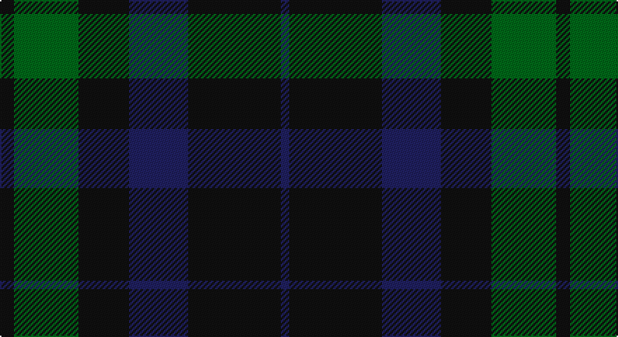

This page is one **sett** — a single exact thread-count. It belongs to the [tartan](/setts/k5g23k18db21k33db3/)
(the same proportion at any scale), whose colour order is pattern [BKBKGK](/stripes/bkbkgk/).

Part of the [Black Watch](/tartans/black-watch/) tartan — the named design grouping this sett with its other cloths.

Sourced from register-of-tartans.  It is a [6 stripe tartan](/stripes/stripes6/).

Original link https://www.tartanregister.gov.uk/tartanDetails.aspx?ref=280

## Also known as

This cloth is also recorded under:

- Black Watch, Plaid for Band

2 attestations — the source records this cloth was collapsed from (oldest owns this page)

<ul>
<li>undated — Black Watch (variation) (register-of-tartans, <a href="https://www.tartanregister.gov.uk/tartanDetails.aspx?ref=280">record</a>)</li>
<li>undated — Black Watch (weddslist, <a href="http://www.weddslist.com/cgi-bin/tartans/pg.pl?source=sts">record</a>)</li>
</ul>

## Register references

External register numbers recorded for this tartan.

- Scottish Register of Tartans: [280](https://www.tartanregister.gov.uk/tartanDetails.aspx?ref=280)
- Scottish Tartans World Register: 256

## Thread count
K/10 G46 K36 DB42 K66 DB/6

One full sett is **396 threads**.

## Palette

Palette: <strong>Tartan Register</strong>
<table><thead><tr><th>Colour</th><th>Threads</th><th>Shade</th><th>Base</th><th>OKLCh</th></tr></thead><tbody><tr><td>K/</td><td style="text-align:right;font-variant-numeric:tabular-nums">10</td><td><code style="background-color:#101010;">#101010</code> <small style="color:#888">#101010</small></td><td>K <code style="background-color:#000000;">#000000</code></td><td><small style="color:#888">oklch(17.3% 0.000 89.9)</small></td></tr><tr><td>G</td><td style="text-align:right;font-variant-numeric:tabular-nums">46</td><td><code style="background-color:#006818;">#006818</code> <small style="color:#888">#006818</small></td><td>G <code style="background-color:#006100;">#006100</code></td><td><small style="color:#888">oklch(45.0% 0.142 145.0)</small></td></tr><tr><td>K</td><td style="text-align:right;font-variant-numeric:tabular-nums">36</td><td><code style="background-color:#101010;">#101010</code> <small style="color:#888">#101010</small></td><td>K <code style="background-color:#000000;">#000000</code></td><td><small style="color:#888">oklch(17.3% 0.000 89.9)</small></td></tr><tr><td>DB</td><td style="text-align:right;font-variant-numeric:tabular-nums">42</td><td><code style="background-color:#202060;">#202060</code> <small style="color:#888">#202060</small></td><td>B <code style="background-color:#2A418A;">#2A418A</code></td><td><small style="color:#888">oklch(28.9% 0.111 276.9)</small></td></tr><tr><td>K</td><td style="text-align:right;font-variant-numeric:tabular-nums">66</td><td><code style="background-color:#101010;">#101010</code> <small style="color:#888">#101010</small></td><td>K <code style="background-color:#000000;">#000000</code></td><td><small style="color:#888">oklch(17.3% 0.000 89.9)</small></td></tr><tr><td>DB/</td><td style="text-align:right;font-variant-numeric:tabular-nums">6</td><td><code style="background-color:#202060;">#202060</code> <small style="color:#888">#202060</small></td><td>B <code style="background-color:#2A418A;">#2A418A</code></td><td><small style="color:#888">oklch(28.9% 0.111 276.9)</small></td></tr></tbody></table>

# Sample pattern

## Compared to the master

This cloth is one sett of its design; the master sett (the exemplar the design is anchored on) is below for comparison.

<figure style="margin:0"><figcaption style="color:#888;font-size:smaller">this sett</figcaption></figure>
<figure style="margin:0"><figcaption style="color:#888;font-size:smaller"><a href="/setts/b3k2b8db8g8db2/">master sett →</a></figcaption></figure>

## Nearest tartans

The nearest existing variants by ΔTartan distance, with this tartan at the top so the swatches line up against it.

ΔTartan

Tartan

Sett

—

<a href="/ttd/edit/#slug=k5g23k18db21k33db3~x2">Black Watch (variation)</a> <a class="nn-out" href="/variants/s6/k5g23k18db21k33db3~x2/" title="open its dictionary page">↗</a>

1.27

<a href="/ttd/edit/#slug=dg2k12dg1k12dg12r2~x2&amp;base=k5g23k18db21k33db3~x2">Gunn (Logan)</a> <a class="nn-out" href="/variants/s6/dg2k12dg1k12dg12r2~x2/" title="open its dictionary page">↗</a>

1.30

<a href="/ttd/edit/#slug=db37r10dg22db11dg3r3~x2&amp;base=k5g23k18db21k33db3~x2">Perthshire, New /Tourist Board</a> <a class="nn-out" href="/variants/s6/db37r10dg22db11dg3r3~x2/" title="open its dictionary page">↗</a>

1.49

<a href="/ttd/edit/#slug=dt16k13dt7dy3r2dy3dt7k13dt16~x2&amp;base=k5g23k18db21k33db3~x2">Klappert, Denmark (Personal)</a> <a class="nn-out" href="/variants/s9/dt16k13dt7dy3r2dy3dt7k13dt16~x2/" title="open its dictionary page">↗</a>

1.57

<a href="/ttd/edit/#slug=k1db12k12g1k12db12g1~x4&amp;base=k5g23k18db21k33db3~x2">Marchmont (Personal)</a> <a class="nn-out" href="/variants/s7/k1db12k12g1k12db12g1~x4/" title="open its dictionary page">↗</a>

1.57

<a href="/ttd/edit/#slug=k26r6dg16k8dg3r2~x2&amp;base=k5g23k18db21k33db3~x2">Perthshire Tourist Board</a> <a class="nn-out" href="/variants/s6/k26r6dg16k8dg3r2~x2/" title="open its dictionary page">↗</a>

1.58

<a href="/ttd/edit/#slug=db2dg15do3db7dg7db2~x4&amp;base=k5g23k18db21k33db3~x2">Green Highland, The (Fashion)</a> <a class="nn-out" href="/variants/s6/db2dg15do3db7dg7db2~x4/" title="open its dictionary page">↗</a>

1.58

<a href="/ttd/edit/#slug=t3k16dg16k16db3t3~x2&amp;base=k5g23k18db21k33db3~x2">Murray</a> <a class="nn-out" href="/variants/s6/t3k16dg16k16db3t3~x2/" title="open its dictionary page">↗</a>

1.60

<a href="/ttd/edit/#slug=dt6r15dg41r15dt20dg41db6&amp;base=k5g23k18db21k33db3~x2">Bean of Freeport (Personal)</a> <a class="nn-out" href="/variants/s7/dt6r15dg41r15dt20dg41db6/" title="open its dictionary page">↗</a>

1.61

<a href="/ttd/edit/#slug=k6t1dg7k1~x2&amp;base=k5g23k18db21k33db3~x2">Innes (Miniature)</a> <a class="nn-out" href="/variants/s4/k6t1dg7k1~x2/" title="open its dictionary page">↗</a>

1.63

<a href="/ttd/edit/#slug=k15db4k15db28r2~x2&amp;base=k5g23k18db21k33db3~x2">MacKay (Blue) #2</a> <a class="nn-out" href="/variants/s5/k15db4k15db28r2~x2/" title="open its dictionary page">↗</a>

## Neighbour map

Every grey dot is one of 14360 variants placed by the first two principal components of the ΔTartan feature space (44% of its variance). Red is this tartan; blue dots are its nearest — click one to open its page.

<svg viewBox="0 0 640 380" role="img" style="max-width:100%;height:auto;border:1px solid #e0e0e0;border-radius:4px;display:block" xmlns="http://www.w3.org/2000/svg"><image href="/nn/cloud.v1.png" width="640" height="380"/><a href="/variants/s6/dg2k12dg1k12dg12r2~x2/"><circle cx="403.1" cy="269.8" r="4" fill="#3465a4"><title>Gunn (Logan)</title></circle></a><a href="/variants/s6/db37r10dg22db11dg3r3~x2/"><circle cx="387.9" cy="266.5" r="4" fill="#3465a4"><title>Perthshire, New /Tourist Board</title></circle></a><a href="/variants/s9/dt16k13dt7dy3r2dy3dt7k13dt16~x2/"><circle cx="342.3" cy="268.4" r="4" fill="#3465a4"><title>Klappert, Denmark (Personal)</title></circle></a><a href="/variants/s7/k1db12k12g1k12db12g1~x4/"><circle cx="366.9" cy="265.4" r="4" fill="#3465a4"><title>Marchmont (Personal)</title></circle></a><a href="/variants/s6/k26r6dg16k8dg3r2~x2/"><circle cx="405.0" cy="262.3" r="4" fill="#3465a4"><title>Perthshire Tourist Board</title></circle></a><a href="/variants/s6/db2dg15do3db7dg7db2~x4/"><circle cx="389.1" cy="291.2" r="4" fill="#3465a4"><title>Green Highland, The (Fashion)</title></circle></a><a href="/variants/s6/t3k16dg16k16db3t3~x2/"><circle cx="300.9" cy="282.5" r="4" fill="#3465a4"><title>Murray</title></circle></a><a href="/variants/s7/dt6r15dg41r15dt20dg41db6/"><circle cx="311.0" cy="263.3" r="4" fill="#3465a4"><title>Bean of Freeport (Personal)</title></circle></a><a href="/variants/s4/k6t1dg7k1~x2/"><circle cx="336.5" cy="309.1" r="4" fill="#3465a4"><title>Innes (Miniature)</title></circle></a><a href="/variants/s5/k15db4k15db28r2~x2/"><circle cx="378.2" cy="271.0" r="4" fill="#3465a4"><title>MacKay (Blue) #2</title></circle></a><circle cx="346.5" cy="290.3" r="5" fill="#c00000"/></svg>

ID: /variants/s6/k5g23k18db21k33db3~x2/
