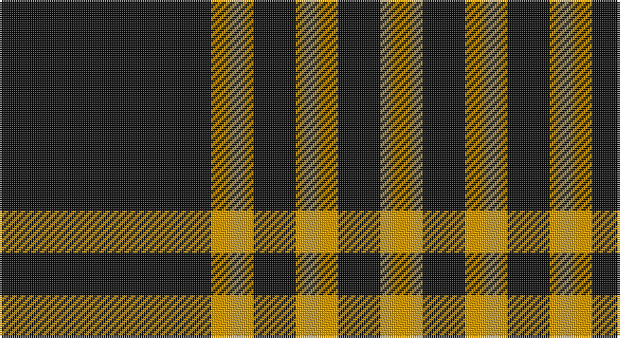

This page is one **sett** — a single exact thread-count. It belongs to the [tartan](/setts/k5lo1k1lo1/)
(the same proportion at any scale), whose colour order is pattern [KYKYKY](/stripes/kykyky/).

Part of the [Justus](/tartans/justus/) tartan — the named design grouping this sett with its other cloths.

Sourced from register-of-tartans.  It is a [6 stripe tartan](/stripes/stripes6/).

Original link https://www.tartanregister.gov.uk/tartanDetails.aspx?ref=1917

## Also known as

This cloth is also recorded under:

- Justus #1
- Justus #2

## Register references

External register numbers recorded for this tartan.

- Scottish Register of Tartans: [1917](https://www.tartanregister.gov.uk/tartanDetails.aspx?ref=1917)
- Scottish Tartans Authority (ITI): 1276
- Scottish Tartans World Register: 1276

## Thread count
K/100 DY20 K20 DY20 K20 DY/20

One full sett is **280 threads**.

## Palette

Palette: <strong>Logan (The Scottish Gael, 1831)</strong> <small style="color:#888">(1 of 2 colours)</small>
<table><thead><tr><th>Colour</th><th>Threads</th><th>Shade</th><th>Base</th><th>OKLCh</th></tr></thead><tbody><tr><td>K/</td><td style="text-align:right;font-variant-numeric:tabular-nums">100</td><td><code style="background-color:#101010;">#101010</code> <small style="color:#888">#101010</small></td><td>K <code style="background-color:#000000;">#000000</code></td><td><small style="color:#888">oklch(17.3% 0.000 89.9)</small></td></tr><tr><td>DY</td><td style="text-align:right;font-variant-numeric:tabular-nums">20</td><td><code style="background-color:#D09800;">#D09800</code> <small style="color:#888">#D09800</small></td><td>Y <code style="background-color:#F2BF00;">#F2BF00</code></td><td><small style="color:#888">oklch(71.4% 0.147 82.1)</small></td></tr><tr><td>K</td><td style="text-align:right;font-variant-numeric:tabular-nums">20</td><td><code style="background-color:#101010;">#101010</code> <small style="color:#888">#101010</small></td><td>K <code style="background-color:#000000;">#000000</code></td><td><small style="color:#888">oklch(17.3% 0.000 89.9)</small></td></tr><tr><td>DY</td><td style="text-align:right;font-variant-numeric:tabular-nums">20</td><td><code style="background-color:#D09800;">#D09800</code> <small style="color:#888">#D09800</small></td><td>Y <code style="background-color:#F2BF00;">#F2BF00</code></td><td><small style="color:#888">oklch(71.4% 0.147 82.1)</small></td></tr><tr><td>K</td><td style="text-align:right;font-variant-numeric:tabular-nums">20</td><td><code style="background-color:#101010;">#101010</code> <small style="color:#888">#101010</small></td><td>K <code style="background-color:#000000;">#000000</code></td><td><small style="color:#888">oklch(17.3% 0.000 89.9)</small></td></tr><tr><td>DY/</td><td style="text-align:right;font-variant-numeric:tabular-nums">20</td><td><code style="background-color:#D09800;">#D09800</code> <small style="color:#888">#D09800</small></td><td>Y <code style="background-color:#F2BF00;">#F2BF00</code></td><td><small style="color:#888">oklch(71.4% 0.147 82.1)</small></td></tr></tbody></table>

# Sample pattern

## Compared to the master

This cloth is one sett of its design; the master sett (the exemplar the design is anchored on) is below for comparison.

<figure style="margin:0"><figcaption style="color:#888;font-size:smaller">this sett</figcaption></figure>
<figure style="margin:0"><figcaption style="color:#888;font-size:smaller"><a href="/setts/db1k4r1k1lo1k4db1/">master sett →</a></figcaption></figure>

## Nearest tartans

The nearest existing variants by ΔTartan distance, with this tartan at the top so the swatches line up against it.

ΔTartan

Tartan

Sett

—

<a href="/ttd/edit/#slug=k5lo1k1lo1~x20">Justus #2 (Personal)</a> <a class="nn-out" href="/variants/s6/k5lo1k1lo1~x20/" title="open its dictionary page">↗</a>

1.05

<a href="/variants/s4/k5lo1k1~x20/">Justus #2 (Personal)</a>

1.61

<a href="/variants/s4/k5ly1k1~x12/">Justus</a>

1.63

<a href="/ttd/edit/#slug=ly7k4ly4k39r4~x2&amp;base=k5lo1k1lo1~x20">Welsh National #3</a> <a class="nn-out" href="/variants/s5/ly7k4ly4k39r4~x2/" title="open its dictionary page">↗</a>

1.79

<a href="/ttd/edit/#slug=k21w2k5w9k13g2~x4&amp;base=k5lo1k1lo1~x20">New Zealand District Tartan</a> <a class="nn-out" href="/variants/s6/k21w2k5w9k13g2~x4/" title="open its dictionary page">↗</a>

1.79

<a href="/ttd/edit/#slug=k2lb5k1lb1k10r1k1~x4&amp;base=k5lo1k1lo1~x20">Lundy Reform</a> <a class="nn-out" href="/variants/s7/k2lb5k1lb1k10r1k1~x4/" title="open its dictionary page">↗</a>

1.81

<a href="/ttd/edit/#slug=ly9k4ly4k45r4~x2&amp;base=k5lo1k1lo1~x20">Gwynn (Name)</a> <a class="nn-out" href="/variants/s5/ly9k4ly4k45r4~x2/" title="open its dictionary page">↗</a>

1.82

<a href="/ttd/edit/#slug=k46dy7k8w20~x2&amp;base=k5lo1k1lo1~x20">Lords of Skye (Fashion?)</a> <a class="nn-out" href="/variants/s4/k46dy7k8w20~x2/" title="open its dictionary page">↗</a>

1.86

<a href="/ttd/edit/#slug=y8k3y17k13y6k3y4~x2&amp;base=k5lo1k1lo1~x20">Scott Black and Grey</a> <a class="nn-out" href="/variants/s7/y8k3y17k13y6k3y4~x2/" title="open its dictionary page">↗</a>

1.88

<a href="/ttd/edit/#slug=o8k3o17k13o6k3o4~x2&amp;base=k5lo1k1lo1~x20">Scott Black &amp; Grey (Corporate)</a> <a class="nn-out" href="/variants/s7/o8k3o17k13o6k3o4~x2/" title="open its dictionary page">↗</a>

1.92

<a href="/ttd/edit/#slug=k3lo1k8lo9k1lo1k1lo1k2~x4&amp;base=k5lo1k1lo1~x20">Justus Black &amp; Gold (Angus) (Persona</a> <a class="nn-out" href="/variants/s9/k3lo1k8lo9k1lo1k1lo1k2~x4/" title="open its dictionary page">↗</a>

## Neighbour map

Every grey dot is one of 14360 variants placed by the first two principal components of the ΔTartan feature space (44% of its variance). Red is this tartan; blue dots are its nearest — click one to open its page.

<svg viewBox="0 0 640 380" role="img" style="max-width:100%;height:auto;border:1px solid #e0e0e0;border-radius:4px;display:block" xmlns="http://www.w3.org/2000/svg"><image href="/nn/cloud.v1.png" width="640" height="380"/><a href="/variants/s4/k5lo1k1~x20/"><circle cx="442.6" cy="284.8" r="4" fill="#3465a4"><title>Justus #2 (Personal)</title></circle></a><a href="/variants/s4/k5ly1k1~x12/"><circle cx="425.6" cy="282.8" r="4" fill="#3465a4"><title>Justus</title></circle></a><a href="/variants/s5/ly7k4ly4k39r4~x2/"><circle cx="444.0" cy="208.1" r="4" fill="#3465a4"><title>Welsh National #3</title></circle></a><a href="/variants/s6/k21w2k5w9k13g2~x4/"><circle cx="414.8" cy="228.2" r="4" fill="#3465a4"><title>New Zealand District Tartan</title></circle></a><a href="/variants/s7/k2lb5k1lb1k10r1k1~x4/"><circle cx="376.1" cy="196.2" r="4" fill="#3465a4"><title>Lundy Reform</title></circle></a><a href="/variants/s5/ly9k4ly4k45r4~x2/"><circle cx="452.2" cy="202.0" r="4" fill="#3465a4"><title>Gwynn (Name)</title></circle></a><a href="/variants/s4/k46dy7k8w20~x2/"><circle cx="334.9" cy="250.9" r="4" fill="#3465a4"><title>Lords of Skye (Fashion?)</title></circle></a><a href="/variants/s7/y8k3y17k13y6k3y4~x2/"><circle cx="361.9" cy="274.7" r="4" fill="#3465a4"><title>Scott Black and Grey</title></circle></a><a href="/variants/s7/o8k3o17k13o6k3o4~x2/"><circle cx="355.1" cy="270.7" r="4" fill="#3465a4"><title>Scott Black &amp; Grey (Corporate)</title></circle></a><a href="/variants/s9/k3lo1k8lo9k1lo1k1lo1k2~x4/"><circle cx="345.6" cy="207.8" r="4" fill="#3465a4"><title>Justus Black &amp; Gold (Angus) (Persona</title></circle></a><circle cx="398.9" cy="260.1" r="5" fill="#c00000"/></svg>

ID: /variants/s6/k5lo1k1lo1~x20/
