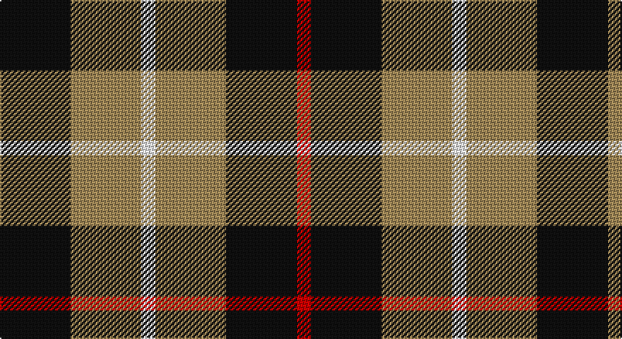

This page is one **sett** — a single exact thread-count. It belongs to the [tartan](/setts/k5lo5w1lo5k5r1/)
(the same proportion at any scale), whose colour order is pattern [KYWYKR](/stripes/kywykr/).

Sourced from register-of-tartans.  It is a [6 stripe tartan](/stripes/stripes6/).

Original link https://www.tartanregister.gov.uk/tartanDetails.aspx?ref=556

2 attestations — the source records this cloth was collapsed from (oldest owns this page)

<ul>
<li>01/01/2006 — Canyon County Idaho Sheriff (register-of-tartans, <a href="https://www.tartanregister.gov.uk/tartanDetails.aspx?ref=556">record</a>)</li>
<li>2006 January — Canyon County Idaho Sheriff (Corp) (tartans-authority, <a href="http://www.tartansauthority.com/tartan-ferret/display/6829/">record</a>)</li>
</ul>

## Register references

External register numbers recorded for this tartan.

- Scottish Register of Tartans: [556](https://www.tartanregister.gov.uk/tartanDetails.aspx?ref=556)
- Scottish Tartans Authority (ITI): 6829

## Thread count
K/50 LT50 W10 LT50 K50 R/10

One full sett is **380 threads**.

## Palette

Palette: <strong>Tartan Register</strong>
<table><thead><tr><th>Colour</th><th>Threads</th><th>Shade</th><th>Base</th><th>OKLCh</th></tr></thead><tbody><tr><td>K/</td><td style="text-align:right;font-variant-numeric:tabular-nums">50</td><td><code style="background-color:#101010;">#101010</code> <small style="color:#888">#101010</small></td><td>K <code style="background-color:#000000;">#000000</code></td><td><small style="color:#888">oklch(17.3% 0.000 89.9)</small></td></tr><tr><td>LT</td><td style="text-align:right;font-variant-numeric:tabular-nums">50</td><td><code style="background-color:#A08858;">#A08858</code> <small style="color:#888">#A08858</small></td><td>Y <code style="background-color:#F2BF00;">#F2BF00</code></td><td><small style="color:#888">oklch(63.7% 0.071 84.0)</small></td></tr><tr><td>W</td><td style="text-align:right;font-variant-numeric:tabular-nums">10</td><td><code style="background-color:#F8F8F8;">#F8F8F8</code> <small style="color:#888">#F8F8F8</small></td><td>W <code style="background-color:#F7F7F7;">#F7F7F7</code></td><td><small style="color:#888">oklch(97.9% 0.000 89.9)</small></td></tr><tr><td>LT</td><td style="text-align:right;font-variant-numeric:tabular-nums">50</td><td><code style="background-color:#A08858;">#A08858</code> <small style="color:#888">#A08858</small></td><td>Y <code style="background-color:#F2BF00;">#F2BF00</code></td><td><small style="color:#888">oklch(63.7% 0.071 84.0)</small></td></tr><tr><td>K</td><td style="text-align:right;font-variant-numeric:tabular-nums">50</td><td><code style="background-color:#101010;">#101010</code> <small style="color:#888">#101010</small></td><td>K <code style="background-color:#000000;">#000000</code></td><td><small style="color:#888">oklch(17.3% 0.000 89.9)</small></td></tr><tr><td>R/</td><td style="text-align:right;font-variant-numeric:tabular-nums">10</td><td><code style="background-color:#C80000;">#C80000</code> <small style="color:#888">#C80000</small></td><td>R <code style="background-color:#CC0000;">#CC0000</code></td><td><small style="color:#888">oklch(52.3% 0.215 29.2)</small></td></tr></tbody></table>

# Sample pattern

## Nearest tartans

The nearest existing variants by ΔTartan distance, with this tartan at the top so the swatches line up against it.

ΔTartan

Tartan

Sett

—

<a href="/ttd/edit/#slug=k5lo5w1lo5k5r1~x10">Canyon County Idaho Sheriff</a> <a class="nn-out" href="/variants/s6/k5lo5w1lo5k5r1~x10/" title="open its dictionary page">↗</a>

1.19

<a href="/ttd/edit/#slug=w7k6lo15k16k8w3~x2&amp;base=k5lo5w1lo5k5r1~x10">Longford County, Crest Range</a> <a class="nn-out" href="/variants/s6/w7k6lo15k16k8w3~x2/" title="open its dictionary page">↗</a>

1.31

<a href="/ttd/edit/#slug=r35g52db18g17r12g17k18&amp;base=k5lo5w1lo5k5r1~x10">MacDona</a> <a class="nn-out" href="/variants/s7/r35g52db18g17r12g17k18/" title="open its dictionary page">↗</a>

1.33

<a href="/ttd/edit/#slug=g3dp3w1dp3g3r1~x4&amp;base=k5lo5w1lo5k5r1~x10">Wilson's No.113</a> <a class="nn-out" href="/variants/s6/g3dp3w1dp3g3r1~x4/" title="open its dictionary page">↗</a>

1.37

<a href="/variants/s8/db20k5db18lo26k6~x2/">Johore Regiment</a>

1.38

<a href="/ttd/edit/#slug=o5dp3o18k16ly3~x4&amp;base=k5lo5w1lo5k5r1~x10">New York State Police Pipe Band</a> <a class="nn-out" href="/variants/s5/o5dp3o18k16ly3~x4/" title="open its dictionary page">↗</a>

1.40

<a href="/ttd/edit/#slug=db20k5db18ly26k6~x2&amp;base=k5lo5w1lo5k5r1~x10">Jahore</a> <a class="nn-out" href="/variants/s5/db20k5db18ly26k6~x2/" title="open its dictionary page">↗</a>

1.40

<a href="/ttd/edit/#slug=dg14o5dg14w5k2o5k2w9~x4&amp;base=k5lo5w1lo5k5r1~x10">Unnamed (Hip Flask)</a> <a class="nn-out" href="/variants/s8/dg14o5dg14w5k2o5k2w9~x4/" title="open its dictionary page">↗</a>

1.42

<a href="/ttd/edit/#slug=r3o16k16lb3~x4&amp;base=k5lo5w1lo5k5r1~x10">Thompson, Dress (Clan)</a> <a class="nn-out" href="/variants/s4/r3o16k16lb3~x4/" title="open its dictionary page">↗</a>

1.47

<a href="/ttd/edit/#slug=db3dg6ly1r3~x10&amp;base=k5lo5w1lo5k5r1~x10">Delroeux, John Michael (Personal)</a> <a class="nn-out" href="/variants/s4/db3dg6ly1r3~x10/" title="open its dictionary page">↗</a>

1.48

<a href="/ttd/edit/#slug=k4w3k4y9r1~x4&amp;base=k5lo5w1lo5k5r1~x10">Oban Grey</a> <a class="nn-out" href="/variants/s5/k4w3k4y9r1~x4/" title="open its dictionary page">↗</a>

## Neighbour map

Every grey dot is one of 14360 variants placed by the first two principal components of the ΔTartan feature space (44% of its variance). Red is this tartan; blue dots are its nearest — click one to open its page.

<svg viewBox="0 0 640 380" role="img" style="max-width:100%;height:auto;border:1px solid #e0e0e0;border-radius:4px;display:block" xmlns="http://www.w3.org/2000/svg"><image href="/nn/cloud.v1.png" width="640" height="380"/><a href="/variants/s6/w7k6lo15k16k8w3~x2/"><circle cx="217.3" cy="262.4" r="4" fill="#3465a4"><title>Longford County, Crest Range</title></circle></a><a href="/variants/s7/r35g52db18g17r12g17k18/"><circle cx="181.5" cy="255.2" r="4" fill="#3465a4"><title>MacDona</title></circle></a><a href="/variants/s6/g3dp3w1dp3g3r1~x4/"><circle cx="148.6" cy="298.4" r="4" fill="#3465a4"><title>Wilson's No.113</title></circle></a><a href="/variants/s8/db20k5db18lo26k6~x2/"><circle cx="195.4" cy="253.2" r="4" fill="#3465a4"><title>Johore Regiment</title></circle></a><a href="/variants/s5/o5dp3o18k16ly3~x4/"><circle cx="234.9" cy="235.1" r="4" fill="#3465a4"><title>New York State Police Pipe Band</title></circle></a><a href="/variants/s5/db20k5db18ly26k6~x2/"><circle cx="205.7" cy="266.2" r="4" fill="#3465a4"><title>Jahore</title></circle></a><a href="/variants/s8/dg14o5dg14w5k2o5k2w9~x4/"><circle cx="188.6" cy="213.0" r="4" fill="#3465a4"><title>Unnamed (Hip Flask)</title></circle></a><a href="/variants/s4/r3o16k16lb3~x4/"><circle cx="192.2" cy="254.4" r="4" fill="#3465a4"><title>Thompson, Dress (Clan)</title></circle></a><a href="/variants/s4/db3dg6ly1r3~x10/"><circle cx="170.4" cy="258.1" r="4" fill="#3465a4"><title>Delroeux, John Michael (Personal)</title></circle></a><a href="/variants/s5/k4w3k4y9r1~x4/"><circle cx="186.9" cy="224.9" r="4" fill="#3465a4"><title>Oban Grey</title></circle></a><circle cx="186.7" cy="255.3" r="5" fill="#c00000"/></svg>

ID: /variants/s6/k5lo5w1lo5k5r1~x10/
