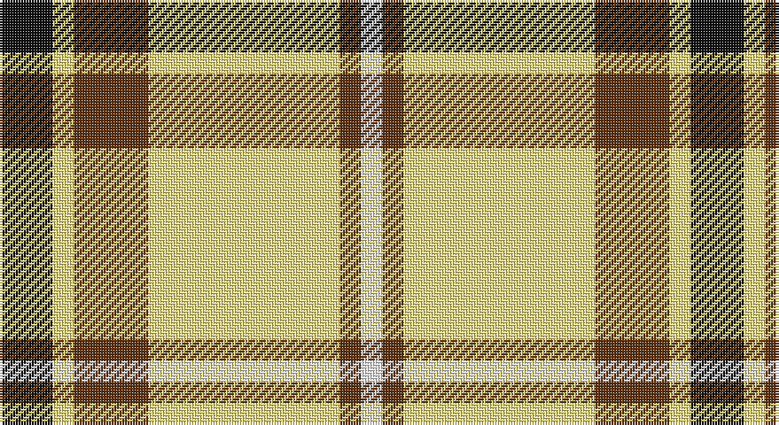

This page is one **sett** — a single exact thread-count. It belongs to the [tartan](/setts/k5ly2dy7lyi18dy2w2/)
(the same proportion at any scale), whose colour order is pattern [KYGYGW](/stripes/kygygw/).

Sourced from register-of-tartans.  It is a [6 stripe tartan](/stripes/stripes6/).

Original link https://www.tartanregister.gov.uk/tartanDetails.aspx?ref=10160

## Also known as

This cloth is also recorded under:

- Shepherd, Derek

## Register references

External register numbers recorded for this tartan.

- Scottish Register of Tartans: [10160](https://www.tartanregister.gov.uk/tartanDetails.aspx?ref=10160)

## Thread count
K/20 LYa8 T28 LY72 T8 W/8

One full sett is **260 threads**.

## Palette

Palette: <strong>Tartan Register</strong> <small style="color:#888">(2 of 5 colours)</small>
<table><thead><tr><th>Colour</th><th>Threads</th><th>Shade</th><th>Base</th><th>OKLCh</th></tr></thead><tbody><tr><td>K/</td><td style="text-align:right;font-variant-numeric:tabular-nums">20</td><td><code style="background-color:#101010;">#101010</code> <small style="color:#888">#101010</small></td><td>K <code style="background-color:#000000;">#000000</code></td><td><small style="color:#888">oklch(17.3% 0.000 89.9)</small></td></tr><tr><td>LYa</td><td style="text-align:right;font-variant-numeric:tabular-nums">8</td><td><code style="background-color:#FEE885;">#FEE885</code> <small style="color:#888">#FEE885</small></td><td>Y <code style="background-color:#F2BF00;">#F2BF00</code></td><td><small style="color:#888">oklch(92.8% 0.122 97.1)</small></td></tr><tr><td>T</td><td style="text-align:right;font-variant-numeric:tabular-nums">28</td><td><code style="background-color:#603311;">#603311</code> <small style="color:#888">#603311</small></td><td>G <code style="background-color:#006100;">#006100</code></td><td><small style="color:#888">oklch(37.2% 0.079 53.9)</small></td></tr><tr><td>LY</td><td style="text-align:right;font-variant-numeric:tabular-nums">72</td><td><code style="background-color:#FFEC8B;">#FFEC8B</code> <small style="color:#888">#FFEC8B</small></td><td>Y <code style="background-color:#F2BF00;">#F2BF00</code></td><td><small style="color:#888">oklch(93.8% 0.120 98.5)</small></td></tr><tr><td>T</td><td style="text-align:right;font-variant-numeric:tabular-nums">8</td><td><code style="background-color:#603311;">#603311</code> <small style="color:#888">#603311</small></td><td>G <code style="background-color:#006100;">#006100</code></td><td><small style="color:#888">oklch(37.2% 0.079 53.9)</small></td></tr><tr><td>W/</td><td style="text-align:right;font-variant-numeric:tabular-nums">8</td><td><code style="background-color:#FFFFFF;">#FFFFFF</code> <small style="color:#888">#FFFFFF</small></td><td>W <code style="background-color:#F7F7F7;">#F7F7F7</code></td><td><small style="color:#888">oklch(100.0% 0.000 89.9)</small></td></tr></tbody></table>

# Sample pattern

## Nearest tartans

The nearest existing variants by ΔTartan distance, with this tartan at the top so the swatches line up against it.

ΔTartan

Tartan

Sett

—

<a href="/ttd/edit/#slug=k5ly2dy7lyi18dy2w2~x4">Shepherd, Derek (Piping)</a> <a class="nn-out" href="/variants/s6/k5ly2dy7lyi18dy2w2~x4/" title="open its dictionary page">↗</a>

0.93

<a href="/ttd/edit/#slug=k5lyi2dy7ly18dy2w2~x4&amp;base=k5ly2dy7lyi18dy2w2~x4">Shepherd Piping (Personal)</a> <a class="nn-out" href="/variants/s6/k5lyi2dy7ly18dy2w2~x4/" title="open its dictionary page">↗</a>

1.21

<a href="/ttd/edit/#slug=r2w2ly27dg14ly2db14ly2~x2&amp;base=k5ly2dy7lyi18dy2w2~x4">Fraser Yellow</a> <a class="nn-out" href="/variants/s7/r2w2ly27dg14ly2db14ly2~x2/" title="open its dictionary page">↗</a>

1.27

<a href="/ttd/edit/#slug=r2w2ly27g14ly2db14ly2~x2&amp;base=k5ly2dy7lyi18dy2w2~x4">Fraser, Yellow</a> <a class="nn-out" href="/variants/s7/r2w2ly27g14ly2db14ly2~x2/" title="open its dictionary page">↗</a>

1.42

<a href="/ttd/edit/#slug=r3w33dp8dg18r9g3~x2&amp;base=k5ly2dy7lyi18dy2w2~x4">MacKintosh Dress (Dance)</a> <a class="nn-out" href="/variants/s6/r3w33dp8dg18r9g3~x2/" title="open its dictionary page">↗</a>

1.43

<a href="/ttd/edit/#slug=k4r5k2ly21g8k2~x2&amp;base=k5ly2dy7lyi18dy2w2~x4">MacDuck (Corporate)</a> <a class="nn-out" href="/variants/s6/k4r5k2ly21g8k2~x2/" title="open its dictionary page">↗</a>

1.52

<a href="/ttd/edit/#slug=g5lg5ly26k4ly6r5k15w4~x2&amp;base=k5ly2dy7lyi18dy2w2~x4">Cornish Christophers (Personal)</a> <a class="nn-out" href="/variants/s8/g5lg5ly26k4ly6r5k15w4~x2/" title="open its dictionary page">↗</a>

1.58

<a href="/ttd/edit/#slug=lb12lo75k22w12k22w16lb8&amp;base=k5ly2dy7lyi18dy2w2~x4">Orange Fanaticos</a> <a class="nn-out" href="/variants/s7/lb12lo75k22w12k22w16lb8/" title="open its dictionary page">↗</a>

1.58

<a href="/ttd/edit/#slug=w1ly8dg3ly1db3ly1~x4&amp;base=k5ly2dy7lyi18dy2w2~x4">Fraser Yellow #2</a> <a class="nn-out" href="/variants/s6/w1ly8dg3ly1db3ly1~x4/" title="open its dictionary page">↗</a>

1.59

<a href="/ttd/edit/#slug=o3w3k3lo10r1~x6&amp;base=k5ly2dy7lyi18dy2w2~x4">Burberry Counterfeit</a> <a class="nn-out" href="/variants/s5/o3w3k3lo10r1~x6/" title="open its dictionary page">↗</a>

1.63

<a href="/ttd/edit/#slug=w4k2w18k11db2y18ly2~x2&amp;base=k5ly2dy7lyi18dy2w2~x4">Barbour - Ancient</a> <a class="nn-out" href="/variants/s7/w4k2w18k11db2y18ly2~x2/" title="open its dictionary page">↗</a>

## Neighbour map

Every grey dot is one of 14360 variants placed by the first two principal components of the ΔTartan feature space (44% of its variance). Red is this tartan; blue dots are its nearest — click one to open its page.

<svg viewBox="0 0 640 380" role="img" style="max-width:100%;height:auto;border:1px solid #e0e0e0;border-radius:4px;display:block" xmlns="http://www.w3.org/2000/svg"><image href="/nn/cloud.v1.png" width="640" height="380"/><a href="/variants/s6/k5lyi2dy7ly18dy2w2~x4/"><circle cx="207.0" cy="162.7" r="4" fill="#3465a4"><title>Shepherd Piping (Personal)</title></circle></a><a href="/variants/s7/r2w2ly27dg14ly2db14ly2~x2/"><circle cx="223.1" cy="142.7" r="4" fill="#3465a4"><title>Fraser Yellow</title></circle></a><a href="/variants/s7/r2w2ly27g14ly2db14ly2~x2/"><circle cx="227.8" cy="143.9" r="4" fill="#3465a4"><title>Fraser, Yellow</title></circle></a><a href="/variants/s6/r3w33dp8dg18r9g3~x2/"><circle cx="175.2" cy="158.8" r="4" fill="#3465a4"><title>MacKintosh Dress (Dance)</title></circle></a><a href="/variants/s6/k4r5k2ly21g8k2~x2/"><circle cx="226.9" cy="172.7" r="4" fill="#3465a4"><title>MacDuck (Corporate)</title></circle></a><a href="/variants/s8/g5lg5ly26k4ly6r5k15w4~x2/"><circle cx="128.1" cy="151.8" r="4" fill="#3465a4"><title>Cornish Christophers (Personal)</title></circle></a><a href="/variants/s7/lb12lo75k22w12k22w16lb8/"><circle cx="187.8" cy="161.6" r="4" fill="#3465a4"><title>Orange Fanaticos</title></circle></a><a href="/variants/s6/w1ly8dg3ly1db3ly1~x4/"><circle cx="271.1" cy="192.3" r="4" fill="#3465a4"><title>Fraser Yellow #2</title></circle></a><a href="/variants/s5/o3w3k3lo10r1~x6/"><circle cx="211.7" cy="187.0" r="4" fill="#3465a4"><title>Burberry Counterfeit</title></circle></a><a href="/variants/s7/w4k2w18k11db2y18ly2~x2/"><circle cx="129.6" cy="159.4" r="4" fill="#3465a4"><title>Barbour - Ancient</title></circle></a><circle cx="191.4" cy="151.5" r="5" fill="#c00000"/></svg>

ID: /variants/s6/k5ly2dy7lyi18dy2w2~x4/
