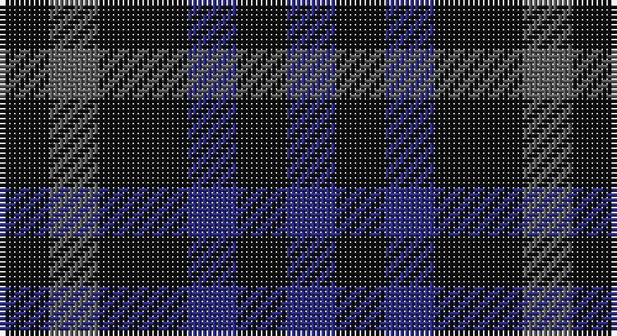

This page is one **sett** — a single exact thread-count. It belongs to the [tartan](/setts/k5n5k9db5k5db5/)
(the same proportion at any scale), whose colour order is pattern [BKBKBK](/stripes/bkbkbk/).

Sourced from tartans-authority.  It is a [6 stripe tartan](/stripes/stripes6/).

Original link http://www.tartansauthority.com/tartan-ferret/display/10047/

## Register references

External register numbers recorded for this tartan.

- Scottish Register of Tartans: [10047](https://www.tartanregister.gov.uk/tartanDetails?ref=10047)
- Scottish Tartans Authority (ITI): 10047

## Thread count
K/10 N10 K18 DB10 K10 DB/10

One full sett is **116 threads**.

## Palette

Palette: <strong>Tartan Register</strong> <small style="color:#888">(2 of 3 colours)</small>
<table><thead><tr><th>Colour</th><th>Threads</th><th>Shade</th><th>Base</th><th>OKLCh</th></tr></thead><tbody><tr><td>K/</td><td style="text-align:right;font-variant-numeric:tabular-nums">10</td><td><code style="background-color:#101010;">#101010</code> <small style="color:#888">#101010</small></td><td>K <code style="background-color:#000000;">#000000</code></td><td><small style="color:#888">oklch(17.3% 0.000 89.9)</small></td></tr><tr><td>N</td><td style="text-align:right;font-variant-numeric:tabular-nums">10</td><td><code style="background-color:#5C5C5C;">#5C5C5C</code> <small style="color:#888">#5C5C5C</small></td><td>B <code style="background-color:#2A418A;">#2A418A</code></td><td><small style="color:#888">oklch(47.5% 0.000 89.9)</small></td></tr><tr><td>K</td><td style="text-align:right;font-variant-numeric:tabular-nums">18</td><td><code style="background-color:#101010;">#101010</code> <small style="color:#888">#101010</small></td><td>K <code style="background-color:#000000;">#000000</code></td><td><small style="color:#888">oklch(17.3% 0.000 89.9)</small></td></tr><tr><td>DB</td><td style="text-align:right;font-variant-numeric:tabular-nums">10</td><td><code style="background-color:#2C2C80;">#2C2C80</code> <small style="color:#888">#2C2C80</small></td><td>B <code style="background-color:#2A418A;">#2A418A</code></td><td><small style="color:#888">oklch(35.0% 0.138 276.6)</small></td></tr><tr><td>K</td><td style="text-align:right;font-variant-numeric:tabular-nums">10</td><td><code style="background-color:#101010;">#101010</code> <small style="color:#888">#101010</small></td><td>K <code style="background-color:#000000;">#000000</code></td><td><small style="color:#888">oklch(17.3% 0.000 89.9)</small></td></tr><tr><td>DB/</td><td style="text-align:right;font-variant-numeric:tabular-nums">10</td><td><code style="background-color:#2C2C80;">#2C2C80</code> <small style="color:#888">#2C2C80</small></td><td>B <code style="background-color:#2A418A;">#2A418A</code></td><td><small style="color:#888">oklch(35.0% 0.138 276.6)</small></td></tr></tbody></table>

# Sample pattern

## Nearest tartans

The nearest existing variants by ΔTartan distance, with this tartan at the top so the swatches line up against it.

ΔTartan

Tartan

Sett

—

<a href="/ttd/edit/#slug=k5n5k9db5k5db5~x2">Macintosh, Charles Rennie (Commem)</a> <a class="nn-out" href="/variants/s6/k5n5k9db5k5db5~x2/" title="open its dictionary page">↗</a>

0.92

<a href="/ttd/edit/#slug=dti5dt5dti9b5dti5b5~x2&amp;base=k5n5k9db5k5db5~x2">Charles Rennie Mackintosh</a> <a class="nn-out" href="/variants/s6/dti5dt5dti9b5dti5b5~x2/" title="open its dictionary page">↗</a>

1.96

<a href="/ttd/edit/#slug=db2k2g2db1k1~x20&amp;base=k5n5k9db5k5db5~x2">Wandering Shepherd (Personal)</a> <a class="nn-out" href="/variants/s5/db2k2g2db1k1~x20/" title="open its dictionary page">↗</a>

2.22

<a href="/ttd/edit/#slug=k1dg3k3db3k1db1~x4&amp;base=k5n5k9db5k5db5~x2">Sutherland 42nd</a> <a class="nn-out" href="/variants/s6/k1dg3k3db3k1db1~x4/" title="open its dictionary page">↗</a>

2.40

<a href="/ttd/edit/#slug=dt12g8t4g8dt12t5&amp;base=k5n5k9db5k5db5~x2">Sheffield High School</a> <a class="nn-out" href="/variants/s6/dt12g8t4g8dt12t5/" title="open its dictionary page">↗</a>

2.45

<a href="/ttd/edit/#slug=r3k6dy4k6y3~x2&amp;base=k5n5k9db5k5db5~x2">Daks (Black)</a> <a class="nn-out" href="/variants/s5/r3k6dy4k6y3~x2/" title="open its dictionary page">↗</a>

2.49

<a href="/ttd/edit/#slug=k3dg4k1dg4k3db4k1~x2&amp;base=k5n5k9db5k5db5~x2">Unidentified No 63</a> <a class="nn-out" href="/variants/s7/k3dg4k1dg4k3db4k1~x2/" title="open its dictionary page">↗</a>

2.50

<a href="/ttd/edit/#slug=g4dp5g4t2~x2&amp;base=k5n5k9db5k5db5~x2">Wilson's No.209</a> <a class="nn-out" href="/variants/s4/g4dp5g4t2~x2/" title="open its dictionary page">↗</a>

2.52

<a href="/ttd/edit/#slug=k15db10k15r7k15w5k15db10&amp;base=k5n5k9db5k5db5~x2">Millarkie, Will (Personal)</a> <a class="nn-out" href="/variants/s8/k15db10k15r7k15w5k15db10/" title="open its dictionary page">↗</a>

2.64

<a href="/ttd/edit/#slug=dt1k2r1~x42&amp;base=k5n5k9db5k5db5~x2">Allen, Nicholas (Personal)</a> <a class="nn-out" href="/variants/s3/dt1k2r1~x42/" title="open its dictionary page">↗</a>

2.65

<a href="/ttd/edit/#slug=dg1db3dg3r1~x4&amp;base=k5n5k9db5k5db5~x2">Barwell</a> <a class="nn-out" href="/variants/s4/dg1db3dg3r1~x4/" title="open its dictionary page">↗</a>

## Neighbour map

Every grey dot is one of 14360 variants placed by the first two principal components of the ΔTartan feature space (44% of its variance). Red is this tartan; blue dots are its nearest — click one to open its page.

<svg viewBox="0 0 640 380" role="img" style="max-width:100%;height:auto;border:1px solid #e0e0e0;border-radius:4px;display:block" xmlns="http://www.w3.org/2000/svg"><image href="/nn/cloud.v1.png" width="640" height="380"/><a href="/variants/s6/dti5dt5dti9b5dti5b5~x2/"><circle cx="244.0" cy="366.0" r="4" fill="#3465a4"><title>Charles Rennie Mackintosh</title></circle></a><a href="/variants/s5/db2k2g2db1k1~x20/"><circle cx="155.3" cy="366.0" r="4" fill="#3465a4"><title>Wandering Shepherd (Personal)</title></circle></a><a href="/variants/s6/k1dg3k3db3k1db1~x4/"><circle cx="234.1" cy="350.3" r="4" fill="#3465a4"><title>Sutherland 42nd</title></circle></a><a href="/variants/s6/dt12g8t4g8dt12t5/"><circle cx="242.6" cy="365.6" r="4" fill="#3465a4"><title>Sheffield High School</title></circle></a><a href="/variants/s5/r3k6dy4k6y3~x2/"><circle cx="184.7" cy="350.0" r="4" fill="#3465a4"><title>Daks (Black)</title></circle></a><a href="/variants/s7/k3dg4k1dg4k3db4k1~x2/"><circle cx="235.9" cy="345.5" r="4" fill="#3465a4"><title>Unidentified No 63</title></circle></a><a href="/variants/s4/g4dp5g4t2~x2/"><circle cx="217.3" cy="366.0" r="4" fill="#3465a4"><title>Wilson's No.209</title></circle></a><a href="/variants/s8/k15db10k15r7k15w5k15db10/"><circle cx="262.5" cy="318.7" r="4" fill="#3465a4"><title>Millarkie, Will (Personal)</title></circle></a><a href="/variants/s3/dt1k2r1~x42/"><circle cx="207.5" cy="366.0" r="4" fill="#3465a4"><title>Allen, Nicholas (Personal)</title></circle></a><a href="/variants/s4/dg1db3dg3r1~x4/"><circle cx="334.5" cy="366.0" r="4" fill="#3465a4"><title>Barwell</title></circle></a><circle cx="254.6" cy="366.0" r="5" fill="#c00000"/></svg>

ID: /variants/s6/k5n5k9db5k5db5~x2/
