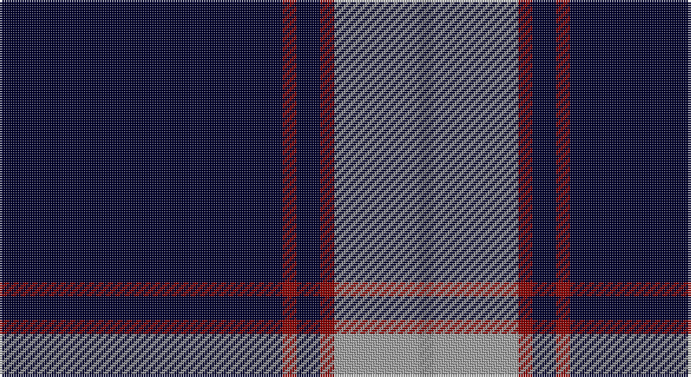

This page is one **sett** — a single exact thread-count. It belongs to the [tartan](/setts/k60r3k5r3lr18o3/)
(the same proportion at any scale), whose colour order is pattern [KRKRYR](/stripes/krkryr/).

Part of the [Ailsa Navy](/tartans/ailsa-navy/) tartan — the named design grouping this sett with its other cloths.

Sourced from tartans-authority.  It is a [6 stripe tartan](/stripes/stripes6/).

Original link http://www.tartansauthority.com/tartan-ferret/display/8105/

## Also known as

This cloth is also recorded under:

- Ailsa, Navy

## Register references

External register numbers recorded for this tartan.

- Scottish Tartans Authority (ITI): 8105

## Thread count
DB/120 DR6 DB10 DR6 N36 Na/6

One full sett is **242 threads**.

## Palette

Palette: <strong>Tartan Register</strong> <small style="color:#888">(3 of 4 colours)</small>
<table><thead><tr><th>Colour</th><th>Threads</th><th>Shade</th><th>Base</th><th>OKLCh</th></tr></thead><tbody><tr><td>DB/</td><td style="text-align:right;font-variant-numeric:tabular-nums">120</td><td><code style="background-color:#00002C;">#00002C</code> <small style="color:#888">#00002C</small></td><td>K <code style="background-color:#000000;">#000000</code></td><td><small style="color:#888">oklch(13.2% 0.092 264.1)</small></td></tr><tr><td>DR</td><td style="text-align:right;font-variant-numeric:tabular-nums">6</td><td><code style="background-color:#880000;">#880000</code> <small style="color:#888">#880000</small></td><td>R <code style="background-color:#CC0000;">#CC0000</code></td><td><small style="color:#888">oklch(39.4% 0.162 29.2)</small></td></tr><tr><td>DB</td><td style="text-align:right;font-variant-numeric:tabular-nums">10</td><td><code style="background-color:#00002C;">#00002C</code> <small style="color:#888">#00002C</small></td><td>K <code style="background-color:#000000;">#000000</code></td><td><small style="color:#888">oklch(13.2% 0.092 264.1)</small></td></tr><tr><td>DR</td><td style="text-align:right;font-variant-numeric:tabular-nums">6</td><td><code style="background-color:#880000;">#880000</code> <small style="color:#888">#880000</small></td><td>R <code style="background-color:#CC0000;">#CC0000</code></td><td><small style="color:#888">oklch(39.4% 0.162 29.2)</small></td></tr><tr><td>N</td><td style="text-align:right;font-variant-numeric:tabular-nums">36</td><td><code style="background-color:#A0A0A0;">#A0A0A0</code> <small style="color:#888">#A0A0A0</small></td><td>Y <code style="background-color:#F2BF00;">#F2BF00</code></td><td><small style="color:#888">oklch(70.6% 0.000 89.9)</small></td></tr><tr><td>Na/</td><td style="text-align:right;font-variant-numeric:tabular-nums">6</td><td><code style="background-color:#888888;">#888888</code> <small style="color:#888">#888888</small></td><td>R <code style="background-color:#CC0000;">#CC0000</code></td><td><small style="color:#888">oklch(62.7% 0.000 89.9)</small></td></tr></tbody></table>

# Sample pattern

## Compared to the master

This cloth is one sett of its design; the master sett (the exemplar the design is anchored on) is below for comparison.

<figure style="margin:0"><figcaption style="color:#888;font-size:smaller">this sett</figcaption></figure>
<figure style="margin:0"><figcaption style="color:#888;font-size:smaller"><a href="/setts/db8w3db28w32k3w4/">master sett →</a></figcaption></figure>

## Nearest tartans

The nearest existing variants by ΔTartan distance, with this tartan at the top so the swatches line up against it.

ΔTartan

Tartan

Sett

—

<a href="/ttd/edit/#slug=k60r3k5r3lr18o3~x2">Ailsa, Navy (Fashion)</a> <a class="nn-out" href="/variants/s6/k60r3k5r3lr18o3~x2/" title="open its dictionary page">↗</a>

1.07

<a href="/ttd/edit/#slug=k3lo2k36dt16k5dt2w3~x2&amp;base=k60r3k5r3lr18o3~x2">Pride of Nova Scotia (Corporate)</a> <a class="nn-out" href="/variants/s7/k3lo2k36dt16k5dt2w3~x2/" title="open its dictionary page">↗</a>

1.22

<a href="/ttd/edit/#slug=db75k4r25db6k6w2~x2&amp;base=k60r3k5r3lr18o3~x2">Hong Kong St Andrew's Society</a> <a class="nn-out" href="/variants/s6/db75k4r25db6k6w2~x2/" title="open its dictionary page">↗</a>

1.29

<a href="/ttd/edit/#slug=db4r14dp6r5db12dg8db70m4&amp;base=k60r3k5r3lr18o3~x2">Loretto School</a> <a class="nn-out" href="/variants/s8/db4r14dp6r5db12dg8db70m4/" title="open its dictionary page">↗</a>

1.36

<a href="/ttd/edit/#slug=db26t6dg1o1w2~x2&amp;base=k60r3k5r3lr18o3~x2">Special Air Service</a> <a class="nn-out" href="/variants/s5/db26t6dg1o1w2~x2/" title="open its dictionary page">↗</a>

1.36

<a href="/ttd/edit/#slug=w1db5ly1db1ly1k4db15w1db2ly1~x4&amp;base=k60r3k5r3lr18o3~x2">SPA Association (Corporate)</a> <a class="nn-out" href="/variants/s10/w1db5ly1db1ly1k4db15w1db2ly1~x4/" title="open its dictionary page">↗</a>

1.37

<a href="/ttd/edit/#slug=db50ly4db3ly4db8k2dbi12w5~x2&amp;base=k60r3k5r3lr18o3~x2">Indiana #2</a> <a class="nn-out" href="/variants/s8/db50ly4db3ly4db8k2dbi12w5~x2/" title="open its dictionary page">↗</a>

1.38

<a href="/ttd/edit/#slug=db18r1db1r1db1k7db13w2~x4&amp;base=k60r3k5r3lr18o3~x2">Tokyo Bluebells</a> <a class="nn-out" href="/variants/s8/db18r1db1r1db1k7db13w2~x4/" title="open its dictionary page">↗</a>

1.41

<a href="/ttd/edit/#slug=k62db15w6ly4~x2&amp;base=k60r3k5r3lr18o3~x2">C-Tec N.I. Ltd</a> <a class="nn-out" href="/variants/s4/k62db15w6ly4~x2/" title="open its dictionary page">↗</a>

1.53

<a href="/ttd/edit/#slug=db40k8ly8db4ly1db4lr8~x4&amp;base=k60r3k5r3lr18o3~x2">Wcwm 4907-2</a> <a class="nn-out" href="/variants/s7/db40k8ly8db4ly1db4lr8~x4/" title="open its dictionary page">↗</a>

1.58

<a href="/ttd/edit/#slug=db60dg16w8lo3~x2&amp;base=k60r3k5r3lr18o3~x2">MaleHsuHK (Hong Kong) (Personal)</a> <a class="nn-out" href="/variants/s4/db60dg16w8lo3~x2/" title="open its dictionary page">↗</a>

## Neighbour map

Every grey dot is one of 14360 variants placed by the first two principal components of the ΔTartan feature space (44% of its variance). Red is this tartan; blue dots are its nearest — click one to open its page.

<svg viewBox="0 0 640 380" role="img" style="max-width:100%;height:auto;border:1px solid #e0e0e0;border-radius:4px;display:block" xmlns="http://www.w3.org/2000/svg"><image href="/nn/cloud.v1.png" width="640" height="380"/><a href="/variants/s7/k3lo2k36dt16k5dt2w3~x2/"><circle cx="413.7" cy="178.0" r="4" fill="#3465a4"><title>Pride of Nova Scotia (Corporate)</title></circle></a><a href="/variants/s6/db75k4r25db6k6w2~x2/"><circle cx="457.6" cy="142.7" r="4" fill="#3465a4"><title>Hong Kong St Andrew's Society</title></circle></a><a href="/variants/s8/db4r14dp6r5db12dg8db70m4/"><circle cx="410.7" cy="138.3" r="4" fill="#3465a4"><title>Loretto School</title></circle></a><a href="/variants/s5/db26t6dg1o1w2~x2/"><circle cx="452.7" cy="149.5" r="4" fill="#3465a4"><title>Special Air Service</title></circle></a><a href="/variants/s10/w1db5ly1db1ly1k4db15w1db2ly1~x4/"><circle cx="419.9" cy="149.1" r="4" fill="#3465a4"><title>SPA Association (Corporate)</title></circle></a><a href="/variants/s8/db50ly4db3ly4db8k2dbi12w5~x2/"><circle cx="411.8" cy="124.1" r="4" fill="#3465a4"><title>Indiana #2</title></circle></a><a href="/variants/s8/db18r1db1r1db1k7db13w2~x4/"><circle cx="459.7" cy="169.1" r="4" fill="#3465a4"><title>Tokyo Bluebells</title></circle></a><a href="/variants/s4/k62db15w6ly4~x2/"><circle cx="423.8" cy="200.2" r="4" fill="#3465a4"><title>C-Tec N.I. Ltd</title></circle></a><a href="/variants/s7/db40k8ly8db4ly1db4lr8~x4/"><circle cx="402.8" cy="131.8" r="4" fill="#3465a4"><title>Wcwm 4907-2</title></circle></a><a href="/variants/s4/db60dg16w8lo3~x2/"><circle cx="420.9" cy="199.1" r="4" fill="#3465a4"><title>MaleHsuHK (Hong Kong) (Personal)</title></circle></a><circle cx="435.8" cy="160.8" r="5" fill="#c00000"/></svg>

ID: /variants/s6/k60r3k5r3lr18o3~x2/
