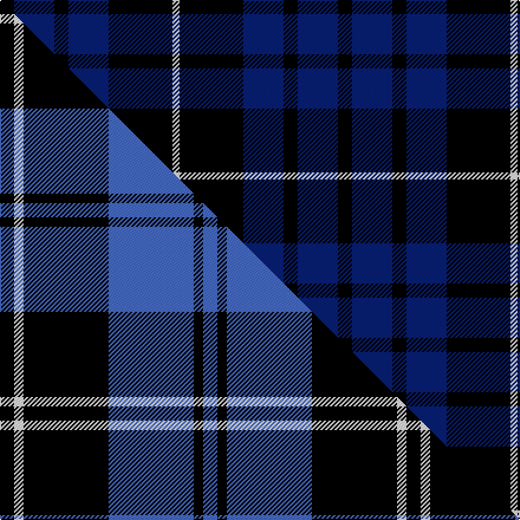

This page is one **sett** — a single exact thread-count. It belongs to the [tartan](/setts/k6db17k6db17k27w3/)
(the same proportion at any scale), whose colour order is pattern [KBKBKW](/stripes/kbkbkw/).

Part of the [Swan](/tartans/swan/) tartan — the named design grouping this sett with its other cloths.

Sourced from register-of-tartans.  It is a [6 stripe tartan](/stripes/stripes6/).

Original link https://www.tartanregister.gov.uk/tartanDetails.aspx?ref=10432

2 attestations — the source records this cloth was collapsed from (oldest owns this page)

<ul>
<li>25/05/2011 — Swan, Brian E (register-of-tartans, <a href="https://www.tartanregister.gov.uk/tartanDetails.aspx?ref=10432">record</a>)  <em>This tartan contains four bars of colour, much like the tartans of the clans that claim Swans, Swansons, etc. as septs; though this tartan incorporates the blue and white generally associated with grants of arms to those with the Swan surname. While this is registered as a personal tartan, any person with a connection to the Swan name is more than welcome to wear it.</em></li>
<li>25th May 2011 — Swan (Name) (tartans-authority, <a href="http://www.tartansauthority.com/tartan-ferret/display/10432/">record</a>)  <em>This tartan contains four bars of colour, much like the tartans of the clans that claim Swans, Swansons, etc. as septs; though this tartan incorporates the blue and white generally associated with grants of arms to those with the Swan surname. While this is registered as a personal tartan, any person with a connection to the Swan name is more than welcome to wear it.</em></li>
</ul>

## Register references

External register numbers recorded for this tartan.

- Scottish Register of Tartans: [10432](https://www.tartanregister.gov.uk/tartanDetails?ref=10432)
- Scottish Tartans Authority (ITI): 10432

## Thread count
K/12 DB34 K12 DB34 K54 W/6

One full sett is **286 threads**.

## Palette
<table><thead><tr><th>Colour</th><th>Shade</th><th>OKLCh</th></tr></thead><tbody><tr><td>DB</td><td><code style="background-color:#082077;">#082077</code> <small style="color:#888">#082077</small></td><td><small style="color:#888">oklch(30.0% 0.149 265.1)</small></td></tr><tr><td>K</td><td><code style="background-color:#000000;">#000000</code> <small style="color:#888">#000000</small></td><td><small style="color:#888">oklch(0.0% 0.000 0.0)</small></td></tr><tr><td>W</td><td><code style="background-color:#F7F7F7;">#F7F7F7</code> <small style="color:#888">#F7F7F7</small></td><td><small style="color:#888">oklch(97.6% 0.000 89.9)</small></td></tr></tbody></table>

# Sample pattern

## Compared to the master

This cloth is one sett of its design; the master sett (the exemplar the design is anchored on) is below for comparison.

Its **ΔTartan distance** from the master is **1.60** — the same measure the nearest-tartans table ranks by (0 is identical; a re-scale of the same cloth is near 0, a recolour or a different proportion further).

<figure class="master-compare" style="margin:0">

this sett
master sett ★

<figcaption style="color:#888;font-size:smaller">One weave of this sett against the <a href="/setts/k3w2k18b18k2b3/">master sett ★</a>, split on the diagonal: a shared proportion runs seamlessly across it with only the shades shifting; a different proportion breaks on it.</figcaption>
</figure>

## Nearest variants

The nearest existing variants by ΔTartan distance, with this cloth at the top so the swatches line up against it.

ΔTartan

Threads

Variant

Sett

—

286

<a href="/variants/s6/k6db17k6db17k27w3~x2/">Swan, Brian E</a>

<a href="/ttd/edit/#slug=k3b16k4b3k12w2~x3&amp;base=k6db17k6db17k27w3~x2" title="compare in the TTD">0.51</a>

225

<a href="/variants/s6/k3b16k4b3k12w2~x3/">MacMugen</a>

<a href="/ttd/edit/#slug=k3w2k18b18k2b3~x4&amp;base=k6db17k6db17k27w3~x2" title="compare in the TTD">0.59</a>

344

<a href="/variants/s6/k3w2k18b18k2b3~x4/">Swan</a>

<a href="/ttd/edit/#slug=lb5k22db4k4db26k4~x2&amp;base=k6db17k6db17k27w3~x2" title="compare in the TTD">0.95</a>

242

<a href="/variants/s6/lb5k22db4k4db26k4~x2/">Slanj, The</a>

<a href="/ttd/edit/#slug=r4k21w2k20db21k2db2~x2&amp;base=k6db17k6db17k27w3~x2" title="compare in the TTD">1.06</a>

276

<a href="/variants/s7/r4k21w2k20db21k2db2~x2/">St. Georges, Edgbaston</a>

<a href="/ttd/edit/#slug=r8k24db10k5db10k5~x2&amp;base=k6db17k6db17k27w3~x2" title="compare in the TTD">1.08</a>

222

<a href="/variants/s6/r8k24db10k5db10k5~x2/">Allen, Nicholas (Personal)</a>

<a href="/ttd/edit/#slug=k1db12k12g1k12db12g1~x4&amp;base=k6db17k6db17k27w3~x2" title="compare in the TTD">1.13</a>

400

<a href="/variants/s7/k1db12k12g1k12db12g1~x4/">Marchmont (Personal)</a>

<a href="/ttd/edit/#slug=k1db12k12b1k12db12w1~x4&amp;base=k6db17k6db17k27w3~x2" title="compare in the TTD">1.13</a>

400

<a href="/variants/s7/k1db12k12b1k12db12w1~x4/">Marchmont</a>

<a href="/ttd/edit/#slug=k2db9k2db9k13w1k2~x4&amp;base=k6db17k6db17k27w3~x2" title="compare in the TTD">1.38</a>

288

<a href="/variants/s7/k2db9k2db9k13w1k2~x4/">Swan 2015, Brian E (Personal)</a>

<a href="/ttd/edit/#slug=db15k14lb1y2lb1k14db15k2~x4&amp;base=k6db17k6db17k27w3~x2" title="compare in the TTD">1.48</a>

444

<a href="/variants/s8/db15k14lb1y2lb1k14db15k2~x4/">South African Air Force (Military)</a>

<a href="/ttd/edit/#slug=k5db1k5db7w2~x2&amp;base=k6db17k6db17k27w3~x2" title="compare in the TTD">1.59</a>

66

<a href="/variants/s5/k5db1k5db7w2~x2/">Grampian, T.V.</a>

## Neighbour map

Every grey dot is one of 13620 variants placed by the first two principal components of the ΔTartan feature space (42% of its variance). Red is this tartan; blue dots are its nearest — click one to open its page.

<svg viewBox="0 0 640 380" role="img" style="max-width:100%;height:auto;border:1px solid #e0e0e0;border-radius:4px;display:block" xmlns="http://www.w3.org/2000/svg"><image href="/nn/cloud.v1.png" width="640" height="380"/><a href="/variants/s6/k3b16k4b3k12w2~x3/"><circle cx="243.2" cy="213.6" r="4" fill="#3465a4"><title>MacMugen</title></circle></a><a href="/variants/s6/k3w2k18b18k2b3~x4/"><circle cx="267.0" cy="196.0" r="4" fill="#3465a4"><title>Swan</title></circle></a><a href="/variants/s6/lb5k22db4k4db26k4~x2/"><circle cx="257.9" cy="223.6" r="4" fill="#3465a4"><title>Slanj, The</title></circle></a><a href="/variants/s7/r4k21w2k20db21k2db2~x2/"><circle cx="298.3" cy="176.6" r="4" fill="#3465a4"><title>St. Georges, Edgbaston</title></circle></a><a href="/variants/s6/r8k24db10k5db10k5~x2/"><circle cx="251.1" cy="249.1" r="4" fill="#3465a4"><title>Allen, Nicholas (Personal)</title></circle></a><a href="/variants/s7/k1db12k12g1k12db12g1~x4/"><circle cx="311.3" cy="213.1" r="4" fill="#3465a4"><title>Marchmont (Personal)</title></circle></a><a href="/variants/s7/k1db12k12b1k12db12w1~x4/"><circle cx="283.9" cy="197.0" r="4" fill="#3465a4"><title>Marchmont</title></circle></a><a href="/variants/s7/k2db9k2db9k13w1k2~x4/"><circle cx="303.4" cy="194.1" r="4" fill="#3465a4"><title>Swan 2015, Brian E (Personal)</title></circle></a><a href="/variants/s8/db15k14lb1y2lb1k14db15k2~x4/"><circle cx="276.6" cy="177.2" r="4" fill="#3465a4"><title>South African Air Force (Military)</title></circle></a><a href="/variants/s5/k5db1k5db7w2~x2/"><circle cx="224.0" cy="252.0" r="4" fill="#3465a4"><title>Grampian, T.V.</title></circle></a><circle cx="282.5" cy="230.0" r="5" fill="#c00000"/><text x="320" y="376" text-anchor="middle" font-size="11" fill="#999">ground</text><text x="11" y="190" text-anchor="middle" font-size="11" fill="#999" transform="rotate(-90 11 190)">complexity</text></svg>

ID: /variants/s6/k6db17k6db17k27w3~x2/
