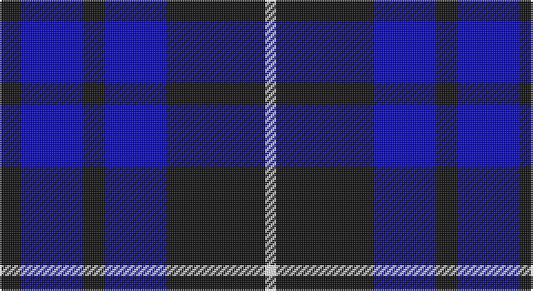

This page is one **sett** — a single exact thread-count. It belongs to the [tartan](/setts/k6db17k6db17k27w3/)
(the same proportion at any scale), whose colour order is pattern [KBKBKW](/stripes/kbkbkw/).

Part of the [Swan](/tartans/swan/) tartan — the named design grouping this sett with its other cloths.

Sourced from register-of-tartans.  It is a [6 stripe tartan](/stripes/stripes6/).

Original link https://www.tartanregister.gov.uk/tartanDetails.aspx?ref=10432

## Also known as

This cloth is also recorded under:

- Swan, Brian E

2 attestations — the source records this cloth was collapsed from (oldest owns this page)

<ul>
<li>25/05/2011 — Swan, Brian E (register-of-tartans, <a href="https://www.tartanregister.gov.uk/tartanDetails.aspx?ref=10432">record</a>)</li>
<li>25th May 2011 — Swan (Name) (tartans-authority, <a href="http://www.tartansauthority.com/tartan-ferret/display/10432/">record</a>)</li>
</ul>

## Register references

External register numbers recorded for this tartan.

- Scottish Register of Tartans: [10432](https://www.tartanregister.gov.uk/tartanDetails?ref=10432)
- Scottish Tartans Authority (ITI): 10432

## Thread count
K/12 B34 K12 B34 K54 W/6

One full sett is **286 threads**.

## Palette

Palette: <strong>Tartan Register</strong>
<table><thead><tr><th>Colour</th><th>Threads</th><th>Shade</th><th>Base</th><th>OKLCh</th></tr></thead><tbody><tr><td>K/</td><td style="text-align:right;font-variant-numeric:tabular-nums">12</td><td><code style="background-color:#101010;">#101010</code> <small style="color:#888">#101010</small></td><td>K <code style="background-color:#000000;">#000000</code></td><td><small style="color:#888">oklch(17.3% 0.000 89.9)</small></td></tr><tr><td>B</td><td style="text-align:right;font-variant-numeric:tabular-nums">34</td><td><code style="background-color:#0000CD;">#0000CD</code> <small style="color:#888">#0000CD</small></td><td>B <code style="background-color:#2A418A;">#2A418A</code></td><td><small style="color:#888">oklch(38.3% 0.266 264.1)</small></td></tr><tr><td>K</td><td style="text-align:right;font-variant-numeric:tabular-nums">12</td><td><code style="background-color:#101010;">#101010</code> <small style="color:#888">#101010</small></td><td>K <code style="background-color:#000000;">#000000</code></td><td><small style="color:#888">oklch(17.3% 0.000 89.9)</small></td></tr><tr><td>B</td><td style="text-align:right;font-variant-numeric:tabular-nums">34</td><td><code style="background-color:#0000CD;">#0000CD</code> <small style="color:#888">#0000CD</small></td><td>B <code style="background-color:#2A418A;">#2A418A</code></td><td><small style="color:#888">oklch(38.3% 0.266 264.1)</small></td></tr><tr><td>K</td><td style="text-align:right;font-variant-numeric:tabular-nums">54</td><td><code style="background-color:#101010;">#101010</code> <small style="color:#888">#101010</small></td><td>K <code style="background-color:#000000;">#000000</code></td><td><small style="color:#888">oklch(17.3% 0.000 89.9)</small></td></tr><tr><td>W/</td><td style="text-align:right;font-variant-numeric:tabular-nums">6</td><td><code style="background-color:#FFFFFF;">#FFFFFF</code> <small style="color:#888">#FFFFFF</small></td><td>W <code style="background-color:#F7F7F7;">#F7F7F7</code></td><td><small style="color:#888">oklch(100.0% 0.000 89.9)</small></td></tr></tbody></table>

# Sample pattern

## Compared to the master

This cloth is one sett of its design; the master sett (the exemplar the design is anchored on) is below for comparison.

<figure style="margin:0"><figcaption style="color:#888;font-size:smaller">this sett</figcaption></figure>
<figure style="margin:0"><figcaption style="color:#888;font-size:smaller"><a href="/setts/k3lb2k18db18k2db3/">master sett →</a></figcaption></figure>

## Nearest tartans

The nearest existing variants by ΔTartan distance, with this tartan at the top so the swatches line up against it.

ΔTartan

Tartan

Sett

—

<a href="/ttd/edit/#slug=k6db17k6db17k27w3~x2">Swan, Brian E</a> <a class="nn-out" href="/variants/s6/k6db17k6db17k27w3~x2/" title="open its dictionary page">↗</a>

0.91

<a href="/ttd/edit/#slug=k2db9k2db9k13w1k2~x4&amp;base=k6db17k6db17k27w3~x2">Swan 2015, Brian E (Personal)</a> <a class="nn-out" href="/variants/s7/k2db9k2db9k13w1k2~x4/" title="open its dictionary page">↗</a>

1.30

<a href="/ttd/edit/#slug=k33db8k4db35p3~x2&amp;base=k6db17k6db17k27w3~x2">Fenston/Morris (Personal)</a> <a class="nn-out" href="/variants/s5/k33db8k4db35p3~x2/" title="open its dictionary page">↗</a>

1.38

<a href="/ttd/edit/#slug=k3lb2k18db18k2db3~x4&amp;base=k6db17k6db17k27w3~x2">Swan</a> <a class="nn-out" href="/variants/s6/k3lb2k18db18k2db3~x4/" title="open its dictionary page">↗</a>

1.50

<a href="/ttd/edit/#slug=k15lo2k10db18lb3~x2&amp;base=k6db17k6db17k27w3~x2">College of Radiographers</a> <a class="nn-out" href="/variants/s5/k15lo2k10db18lb3~x2/" title="open its dictionary page">↗</a>

1.62

<a href="/ttd/edit/#slug=k1db7k7ly1~x10&amp;base=k6db17k6db17k27w3~x2">Wallace (Personal)</a> <a class="nn-out" href="/variants/s4/k1db7k7ly1~x10/" title="open its dictionary page">↗</a>

1.63

<a href="/ttd/edit/#slug=db24t13db4t4w2~x2&amp;base=k6db17k6db17k27w3~x2">Gallaecia (Unofficial) (District)</a> <a class="nn-out" href="/variants/s5/db24t13db4t4w2~x2/" title="open its dictionary page">↗</a>

1.67

<a href="/ttd/edit/#slug=db3t3db16t16db16w3~x2&amp;base=k6db17k6db17k27w3~x2">Murray Taylor</a> <a class="nn-out" href="/variants/s6/db3t3db16t16db16w3~x2/" title="open its dictionary page">↗</a>

1.69

<a href="/ttd/edit/#slug=db7ly1db7b11r2~x6&amp;base=k6db17k6db17k27w3~x2">Brazell (Personal)</a> <a class="nn-out" href="/variants/s5/db7ly1db7b11r2~x6/" title="open its dictionary page">↗</a>

1.76

<a href="/ttd/edit/#slug=lo1db6k5db6lb1~x6&amp;base=k6db17k6db17k27w3~x2">Bank of Scotland (1995)</a> <a class="nn-out" href="/variants/s5/lo1db6k5db6lb1~x6/" title="open its dictionary page">↗</a>

1.76

<a href="/ttd/edit/#slug=r4k21w2k20db21k2db2~x2&amp;base=k6db17k6db17k27w3~x2">St. Georges, Edgbaston</a> <a class="nn-out" href="/variants/s7/r4k21w2k20db21k2db2~x2/" title="open its dictionary page">↗</a>

## Neighbour map

Every grey dot is one of 14360 variants placed by the first two principal components of the ΔTartan feature space (44% of its variance). Red is this tartan; blue dots are its nearest — click one to open its page.

<svg viewBox="0 0 640 380" role="img" style="max-width:100%;height:auto;border:1px solid #e0e0e0;border-radius:4px;display:block" xmlns="http://www.w3.org/2000/svg"><image href="/nn/cloud.v1.png" width="640" height="380"/><a href="/variants/s7/k2db9k2db9k13w1k2~x4/"><circle cx="322.4" cy="230.3" r="4" fill="#3465a4"><title>Swan 2015, Brian E (Personal)</title></circle></a><a href="/variants/s5/k33db8k4db35p3~x2/"><circle cx="346.7" cy="251.0" r="4" fill="#3465a4"><title>Fenston/Morris (Personal)</title></circle></a><a href="/variants/s6/k3lb2k18db18k2db3~x4/"><circle cx="298.4" cy="230.8" r="4" fill="#3465a4"><title>Swan</title></circle></a><a href="/variants/s5/k15lo2k10db18lb3~x2/"><circle cx="273.6" cy="254.0" r="4" fill="#3465a4"><title>College of Radiographers</title></circle></a><a href="/variants/s4/k1db7k7ly1~x10/"><circle cx="308.5" cy="283.0" r="4" fill="#3465a4"><title>Wallace (Personal)</title></circle></a><a href="/variants/s5/db24t13db4t4w2~x2/"><circle cx="365.3" cy="235.6" r="4" fill="#3465a4"><title>Gallaecia (Unofficial) (District)</title></circle></a><a href="/variants/s6/db3t3db16t16db16w3~x2/"><circle cx="323.2" cy="273.0" r="4" fill="#3465a4"><title>Murray Taylor</title></circle></a><a href="/variants/s5/db7ly1db7b11r2~x6/"><circle cx="241.6" cy="230.6" r="4" fill="#3465a4"><title>Brazell (Personal)</title></circle></a><a href="/variants/s5/lo1db6k5db6lb1~x6/"><circle cx="295.8" cy="264.2" r="4" fill="#3465a4"><title>Bank of Scotland (1995)</title></circle></a><a href="/variants/s7/r4k21w2k20db21k2db2~x2/"><circle cx="347.6" cy="223.2" r="4" fill="#3465a4"><title>St. Georges, Edgbaston</title></circle></a><circle cx="291.5" cy="259.5" r="5" fill="#c00000"/></svg>

ID: /variants/s6/k6db17k6db17k27w3~x2/
