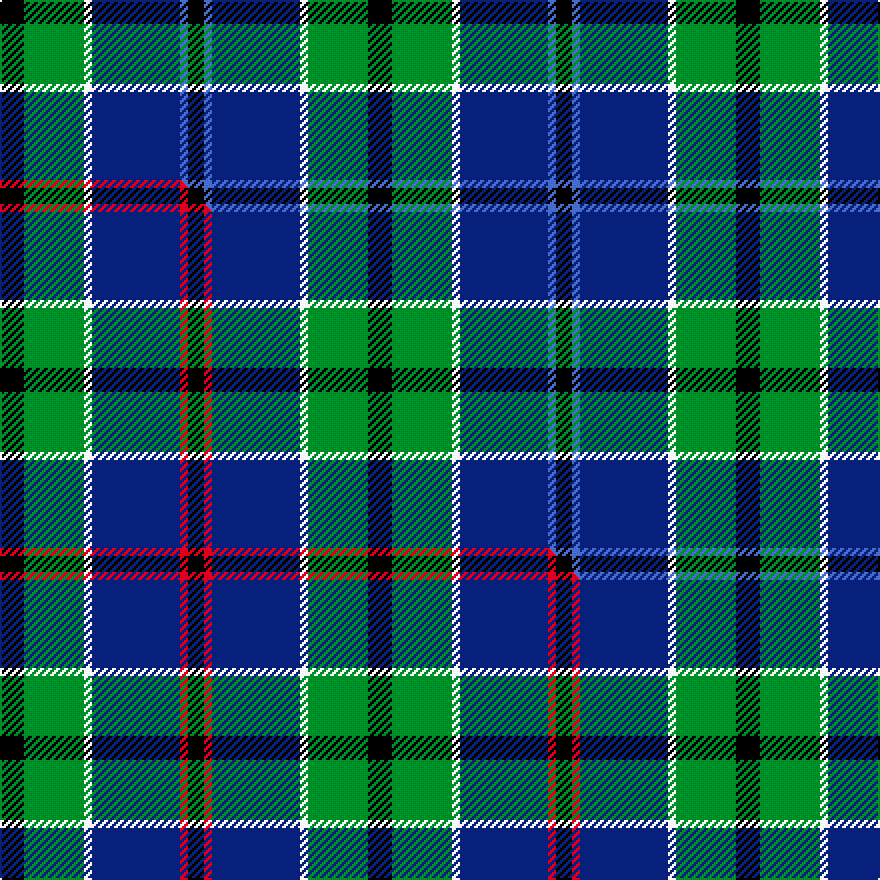

This page is one **sett** — a single exact thread-count. It belongs to the [tartan](/setts/k6g15w2db22b2k4/)
(the same proportion at any scale), whose colour order is pattern [KBBWGK](/stripes/kbbwgk/).

Part of the [Leslie, Hebridean](/tartans/leslie-hebridean/) tartan — the named design grouping this sett with its other cloths.

Sourced from weddslist.  It is a [6 stripe tartan](/stripes/stripes6/).

Original link http://www.weddslist.com/cgi-bin/tartans/pg.pl?source=sts

## Thread count
K/12 G30 W4 DB44 B4 K/8

One full sett is **184 threads**.

## Palette
<table><thead><tr><th>Colour</th><th>Shade</th><th>OKLCh</th></tr></thead><tbody><tr><td>DB</td><td><code style="background-color:#082077;">#082077</code> <small style="color:#888">#082077</small></td><td><small style="color:#888">oklch(30.0% 0.149 265.1)</small></td></tr><tr><td>G</td><td><code style="background-color:#008B2A;">#008B2A</code> <small style="color:#888">#008B2A</small></td><td><small style="color:#888">oklch(55.4% 0.170 145.9)</small></td></tr><tr><td>K</td><td><code style="background-color:#000000;">#000000</code> <small style="color:#888">#000000</small></td><td><small style="color:#888">oklch(0.0% 0.000 0.0)</small></td></tr><tr><td>W</td><td><code style="background-color:#F7F7F7;">#F7F7F7</code> <small style="color:#888">#F7F7F7</small></td><td><small style="color:#888">oklch(97.6% 0.000 89.9)</small></td></tr><tr><td>B</td><td><code style="background-color:#466CC8;">#466CC8</code> <small style="color:#888">#466CC8</small></td><td><small style="color:#888">oklch(55.1% 0.149 265.0)</small></td></tr></tbody></table>

# Sample pattern

## Compared to the master

This cloth is one sett of its design; the master sett (the exemplar the design is anchored on) is below for comparison.

Its **ΔTartan distance** from the master is **0.30** — the same measure the nearest-tartans table ranks by (0 is identical; a re-scale of the same cloth is near 0, a recolour or a different proportion further).

<figure class="master-compare" style="margin:0">

this sett
master sett ★

<figcaption style="color:#888;font-size:smaller">One weave of this sett against the <a href="/setts/k6g15w2db22r2k4/">master sett ★</a>, split on the diagonal: a shared proportion runs seamlessly across it with only the shades shifting; a different proportion breaks on it.</figcaption>
</figure>

## Nearest tartan variants

The nearest existing variants by ΔTartan distance, with this cloth at the top so the swatches line up against it.

ΔTartan

Threads

Variant

Sett

—

184

<a href="/variants/s6/k6g15w2db22b2k4~x2/">Leslie, Hebridean</a>

<a href="/ttd/edit/#slug=k6g15w2db22r2k4~x2&amp;base=k6g15w2db22b2k4~x2" title="compare in the TTD">0.30</a>

184

<a href="/variants/s6/k6g15w2db22r2k4~x2/">Leslie, Hebridean</a>

<a href="/ttd/edit/#slug=k6g11w2db22r2k4~x2&amp;base=k6g15w2db22b2k4~x2" title="compare in the TTD">0.57</a>

168

<a href="/variants/s6/k6g11w2db22r2k4~x2/">Leslie Hebridean Artifact Tartan</a>

<a href="/ttd/edit/#slug=k2w1k12g5db11r1~x2&amp;base=k6g15w2db22b2k4~x2" title="compare in the TTD">1.60</a>

122

<a href="/variants/s6/k2w1k12g5db11r1~x2/">New England (Fashion)</a>

<a href="/ttd/edit/#slug=r4db24w2g13db2k3~x4&amp;base=k6g15w2db22b2k4~x2" title="compare in the TTD">1.61</a>

356

<a href="/variants/s6/r4db24w2g13db2k3~x4/">Vance (Family Association)</a>

<a href="/ttd/edit/#slug=db40k4db12k21g27w4~x2&amp;base=k6g15w2db22b2k4~x2" title="compare in the TTD">1.68</a>

344

<a href="/variants/s6/db40k4db12k21g27w4~x2/">Granger (Personal)</a>

<a href="/ttd/edit/#slug=db31t4db5k19g20lo4~x2&amp;base=k6g15w2db22b2k4~x2" title="compare in the TTD">1.77</a>

262

<a href="/variants/s6/db31t4db5k19g20lo4~x2/">Midlothian</a>

<a href="/ttd/edit/#slug=db31b4db5k19g20y4~x2&amp;base=k6g15w2db22b2k4~x2" title="compare in the TTD">1.77</a>

262

<a href="/variants/s6/db31b4db5k19g20y4~x2/">Midlothian</a>

<a href="/ttd/edit/#slug=k7dr3g30db28lb3~x2&amp;base=k6g15w2db22b2k4~x2" title="compare in the TTD">1.77</a>

264

<a href="/variants/s5/k7dr3g30db28lb3~x2/">Highlander Highland Laddie</a>

<a href="/ttd/edit/#slug=y4g22r3k17r3db37w3~x2&amp;base=k6g15w2db22b2k4~x2" title="compare in the TTD">1.92</a>

342

<a href="/variants/s7/y4g22r3k17r3db37w3~x2/">Souza Nery</a>

<a href="/ttd/edit/#slug=ly4g22r3k17r3db37w3~x2&amp;base=k6g15w2db22b2k4~x2" title="compare in the TTD">1.92</a>

342

<a href="/variants/s7/ly4g22r3k17r3db37w3~x2/">Souza Nery (Personal)</a>

## Neighbour map

Every grey dot is one of 13620 variants placed by the first two principal components of the ΔTartan feature space (42% of its variance). Red is this tartan; blue dots are its nearest — click one to open its page.

<svg viewBox="0 0 640 380" role="img" style="max-width:100%;height:auto;border:1px solid #e0e0e0;border-radius:4px;display:block" xmlns="http://www.w3.org/2000/svg"><image href="/nn/cloud.v1.png" width="640" height="380"/><a href="/variants/s6/k6g15w2db22r2k4~x2/"><circle cx="166.0" cy="170.8" r="4" fill="#3465a4"><title>Leslie, Hebridean</title></circle></a><a href="/variants/s6/k6g11w2db22r2k4~x2/"><circle cx="181.9" cy="167.5" r="4" fill="#3465a4"><title>Leslie Hebridean Artifact Tartan</title></circle></a><a href="/variants/s6/k2w1k12g5db11r1~x2/"><circle cx="181.6" cy="169.0" r="4" fill="#3465a4"><title>New England (Fashion)</title></circle></a><a href="/variants/s6/r4db24w2g13db2k3~x4/"><circle cx="247.2" cy="160.4" r="4" fill="#3465a4"><title>Vance (Family Association)</title></circle></a><a href="/variants/s6/db40k4db12k21g27w4~x2/"><circle cx="206.8" cy="207.8" r="4" fill="#3465a4"><title>Granger (Personal)</title></circle></a><a href="/variants/s6/db31t4db5k19g20lo4~x2/"><circle cx="156.2" cy="203.0" r="4" fill="#3465a4"><title>Midlothian</title></circle></a><a href="/variants/s6/db31b4db5k19g20y4~x2/"><circle cx="163.5" cy="204.9" r="4" fill="#3465a4"><title>Midlothian</title></circle></a><a href="/variants/s5/k7dr3g30db28lb3~x2/"><circle cx="198.7" cy="197.7" r="4" fill="#3465a4"><title>Highlander Highland Laddie</title></circle></a><a href="/variants/s7/y4g22r3k17r3db37w3~x2/"><circle cx="143.5" cy="142.6" r="4" fill="#3465a4"><title>Souza Nery</title></circle></a><a href="/variants/s7/ly4g22r3k17r3db37w3~x2/"><circle cx="138.5" cy="141.2" r="4" fill="#3465a4"><title>Souza Nery (Personal)</title></circle></a><circle cx="168.1" cy="172.8" r="5" fill="#c00000"/><text x="320" y="376" text-anchor="middle" font-size="11" fill="#999">ground</text><text x="11" y="190" text-anchor="middle" font-size="11" fill="#999" transform="rotate(-90 11 190)">complexity</text></svg>

ID: /variants/s6/k6g15w2db22b2k4~x2/
