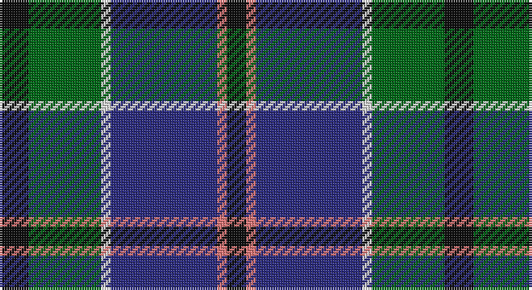

This page is one **sett** — a single exact thread-count. It belongs to the [tartan](/setts/k6g15w2db22r2k4/)
(the same proportion at any scale), whose colour order is pattern [KGWBRK](/stripes/kgwbrk/).

Part of the [Leslie, Hebridean](/tartans/leslie-hebridean/) tartan — the named design grouping this sett with its other cloths.

Sourced from register-of-tartans.  It is a [6 stripe tartan](/stripes/stripes6/).

Original link https://www.tartanregister.gov.uk/tartanDetails.aspx?ref=2105

## Also known as

This cloth is also recorded under:

- Leslie Hebridean Artifact

3 attestations — the source records this cloth was collapsed from (oldest owns this page)

<ul>
<li>01/01/1740 — Leslie, Hebridean (register-of-tartans, <a href="https://www.tartanregister.gov.uk/tartanDetails.aspx?ref=2105">record</a>)</li>
<li>1740 C — Leslie, Hebridean (Clan?) (tartans-authority, <a href="http://www.tartansauthority.com/tartan-ferret/display/1111/">record</a>)</li>
<li>undated — Leslie, Hebridean (weddslist, <a href="http://www.weddslist.com/cgi-bin/tartans/pg.pl?source=sts">record</a>)</li>
</ul>

## Register references

External register numbers recorded for this tartan.

- Scottish Register of Tartans: [2105](https://www.tartanregister.gov.uk/tartanDetails.aspx?ref=2105)
- Scottish Tartans Authority (ITI): 1111
- Scottish Tartans World Register: 1111

## Thread count
K/12 G30 LN4 DB44 LR4 K/8

One full sett is **184 threads**.

## Palette

Palette: <strong>Tartan Register</strong>
<table><thead><tr><th>Colour</th><th>Threads</th><th>Shade</th><th>Base</th><th>OKLCh</th></tr></thead><tbody><tr><td>K/</td><td style="text-align:right;font-variant-numeric:tabular-nums">12</td><td><code style="background-color:#101010;">#101010</code> <small style="color:#888">#101010</small></td><td>K <code style="background-color:#000000;">#000000</code></td><td><small style="color:#888">oklch(17.3% 0.000 89.9)</small></td></tr><tr><td>G</td><td style="text-align:right;font-variant-numeric:tabular-nums">30</td><td><code style="background-color:#006818;">#006818</code> <small style="color:#888">#006818</small></td><td>G <code style="background-color:#006100;">#006100</code></td><td><small style="color:#888">oklch(45.0% 0.142 145.0)</small></td></tr><tr><td>LN</td><td style="text-align:right;font-variant-numeric:tabular-nums">4</td><td><code style="background-color:#E0E0E0;">#E0E0E0</code> <small style="color:#888">#E0E0E0</small></td><td>W <code style="background-color:#F7F7F7;">#F7F7F7</code></td><td><small style="color:#888">oklch(90.7% 0.000 89.9)</small></td></tr><tr><td>DB</td><td style="text-align:right;font-variant-numeric:tabular-nums">44</td><td><code style="background-color:#2C2C80;">#2C2C80</code> <small style="color:#888">#2C2C80</small></td><td>B <code style="background-color:#2A418A;">#2A418A</code></td><td><small style="color:#888">oklch(35.0% 0.138 276.6)</small></td></tr><tr><td>LR</td><td style="text-align:right;font-variant-numeric:tabular-nums">4</td><td><code style="background-color:#E87878;">#E87878</code> <small style="color:#888">#E87878</small></td><td>R <code style="background-color:#CC0000;">#CC0000</code></td><td><small style="color:#888">oklch(70.0% 0.139 21.2)</small></td></tr><tr><td>K/</td><td style="text-align:right;font-variant-numeric:tabular-nums">8</td><td><code style="background-color:#101010;">#101010</code> <small style="color:#888">#101010</small></td><td>K <code style="background-color:#000000;">#000000</code></td><td><small style="color:#888">oklch(17.3% 0.000 89.9)</small></td></tr></tbody></table>

# Sample pattern

## Nearest tartans

The nearest existing variants by ΔTartan distance, with this tartan at the top so the swatches line up against it.

ΔTartan

Tartan

Sett

—

<a href="/ttd/edit/#slug=k6g15w2db22r2k4~x2">Leslie, Hebridean</a> <a class="nn-out" href="/variants/s6/k6g15w2db22r2k4~x2/" title="open its dictionary page">↗</a>

0.37

<a href="/ttd/edit/#slug=db22w2k10g11r3g4~x2&amp;base=k6g15w2db22r2k4~x2">Paterson Blue (Personal)</a> <a class="nn-out" href="/variants/s6/db22w2k10g11r3g4~x2/" title="open its dictionary page">↗</a>

0.63

<a href="/ttd/edit/#slug=k7r3g30db28lb3~x2&amp;base=k6g15w2db22r2k4~x2">Highlander Highland Laddie</a> <a class="nn-out" href="/variants/s5/k7r3g30db28lb3~x2/" title="open its dictionary page">↗</a>

0.65

<a href="/ttd/edit/#slug=db12k4g4r1g4k1lo1~x4&amp;base=k6g15w2db22r2k4~x2">MacLaren</a> <a class="nn-out" href="/variants/s7/db12k4g4r1g4k1lo1~x4/" title="open its dictionary page">↗</a>

0.65

<a href="/ttd/edit/#slug=g3db12w1k12g13r2g2~x4&amp;base=k6g15w2db22r2k4~x2">MacFadzean/MacPhedran</a> <a class="nn-out" href="/variants/s7/g3db12w1k12g13r2g2~x4/" title="open its dictionary page">↗</a>

0.66

<a href="/ttd/edit/#slug=db20k6lo4db3g20w2~x2&amp;base=k6g15w2db22r2k4~x2">DeLoughery (Personal)</a> <a class="nn-out" href="/variants/s6/db20k6lo4db3g20w2~x2/" title="open its dictionary page">↗</a>

0.68

<a href="/ttd/edit/#slug=n6db8n8g12dt29w3dt4~x2&amp;base=k6g15w2db22r2k4~x2">Dickson (Kirkcudbrightshire) (Name)</a> <a class="nn-out" href="/variants/s7/n6db8n8g12dt29w3dt4~x2/" title="open its dictionary page">↗</a>

0.68

<a href="/ttd/edit/#slug=r1k1g7k5db10k1ly1~x2&amp;base=k6g15w2db22r2k4~x2">MacLeod Small Clan Tartan</a> <a class="nn-out" href="/variants/s7/r1k1g7k5db10k1ly1~x2/" title="open its dictionary page">↗</a>

0.71

<a href="/ttd/edit/#slug=db12k4g4dp1g4k1w1~x4&amp;base=k6g15w2db22r2k4~x2">Alexander - 2000 (Name)</a> <a class="nn-out" href="/variants/s7/db12k4g4dp1g4k1w1~x4/" title="open its dictionary page">↗</a>

0.76

<a href="/ttd/edit/#slug=k2w1k12g5db11r1~x2&amp;base=k6g15w2db22r2k4~x2">New England (Fashion)</a> <a class="nn-out" href="/variants/s6/k2w1k12g5db11r1~x2/" title="open its dictionary page">↗</a>

0.80

<a href="/ttd/edit/#slug=dg5lp3dg32k16b32m3b5~x2&amp;base=k6g15w2db22r2k4~x2">MacThomas (Clan)</a> <a class="nn-out" href="/variants/s7/dg5lp3dg32k16b32m3b5~x2/" title="open its dictionary page">↗</a>

## Neighbour map

Every grey dot is one of 14360 variants placed by the first two principal components of the ΔTartan feature space (44% of its variance). Red is this tartan; blue dots are its nearest — click one to open its page.

<svg viewBox="0 0 640 380" role="img" style="max-width:100%;height:auto;border:1px solid #e0e0e0;border-radius:4px;display:block" xmlns="http://www.w3.org/2000/svg"><image href="/nn/cloud.v1.png" width="640" height="380"/><a href="/variants/s6/db22w2k10g11r3g4~x2/"><circle cx="203.8" cy="205.8" r="4" fill="#3465a4"><title>Paterson Blue (Personal)</title></circle></a><a href="/variants/s5/k7r3g30db28lb3~x2/"><circle cx="222.2" cy="214.8" r="4" fill="#3465a4"><title>Highlander Highland Laddie</title></circle></a><a href="/variants/s7/db12k4g4r1g4k1lo1~x4/"><circle cx="236.6" cy="187.8" r="4" fill="#3465a4"><title>MacLaren</title></circle></a><a href="/variants/s7/g3db12w1k12g13r2g2~x4/"><circle cx="193.7" cy="188.3" r="4" fill="#3465a4"><title>MacFadzean/MacPhedran</title></circle></a><a href="/variants/s6/db20k6lo4db3g20w2~x2/"><circle cx="206.5" cy="204.1" r="4" fill="#3465a4"><title>DeLoughery (Personal)</title></circle></a><a href="/variants/s7/n6db8n8g12dt29w3dt4~x2/"><circle cx="212.6" cy="203.7" r="4" fill="#3465a4"><title>Dickson (Kirkcudbrightshire) (Name)</title></circle></a><a href="/variants/s7/r1k1g7k5db10k1ly1~x2/"><circle cx="196.2" cy="195.4" r="4" fill="#3465a4"><title>MacLeod Small Clan Tartan</title></circle></a><a href="/variants/s7/db12k4g4dp1g4k1w1~x4/"><circle cx="223.0" cy="186.9" r="4" fill="#3465a4"><title>Alexander - 2000 (Name)</title></circle></a><a href="/variants/s6/k2w1k12g5db11r1~x2/"><circle cx="238.3" cy="204.6" r="4" fill="#3465a4"><title>New England (Fashion)</title></circle></a><a href="/variants/s7/dg5lp3dg32k16b32m3b5~x2/"><circle cx="213.8" cy="201.7" r="4" fill="#3465a4"><title>MacThomas (Clan)</title></circle></a><circle cx="214.4" cy="198.6" r="5" fill="#c00000"/></svg>

ID: /variants/s6/k6g15w2db22r2k4~x2/
