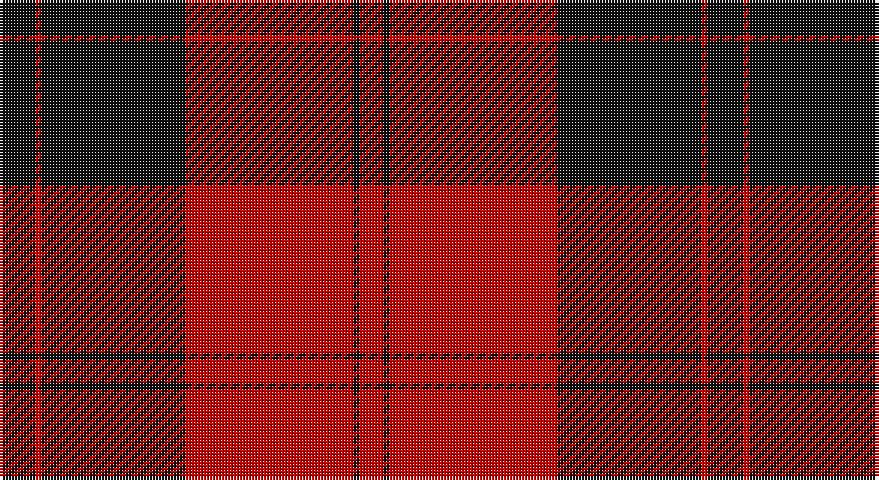

This page is one **sett** — a single exact thread-count. It belongs to the [tartan](/setts/k6r1k24r28k1r4/)
(the same proportion at any scale), whose colour order is pattern [KRKRKR](/stripes/krkrkr/).

Sourced from register-of-tartans.  It is a [6 stripe tartan](/stripes/stripes6/).

Original link https://www.tartanregister.gov.uk/tartanDetails.aspx?ref=5281

## Register references

External register numbers recorded for this tartan.

- Scottish Register of Tartans: [5281](https://www.tartanregister.gov.uk/tartanDetails.aspx?ref=5281)
- Scottish Tartans Authority (ITI): 3034

## Thread count
K/12 R2 K48 R56 K2 R/8

One full sett is **236 threads**.

## Palette

Palette: <strong>Tartan Register</strong>
<table><thead><tr><th>Colour</th><th>Threads</th><th>Shade</th><th>Base</th><th>OKLCh</th></tr></thead><tbody><tr><td>K/</td><td style="text-align:right;font-variant-numeric:tabular-nums">12</td><td><code style="background-color:#101010;">#101010</code> <small style="color:#888">#101010</small></td><td>K <code style="background-color:#000000;">#000000</code></td><td><small style="color:#888">oklch(17.3% 0.000 89.9)</small></td></tr><tr><td>R</td><td style="text-align:right;font-variant-numeric:tabular-nums">2</td><td><code style="background-color:#C80000;">#C80000</code> <small style="color:#888">#C80000</small></td><td>R <code style="background-color:#CC0000;">#CC0000</code></td><td><small style="color:#888">oklch(52.3% 0.215 29.2)</small></td></tr><tr><td>K</td><td style="text-align:right;font-variant-numeric:tabular-nums">48</td><td><code style="background-color:#101010;">#101010</code> <small style="color:#888">#101010</small></td><td>K <code style="background-color:#000000;">#000000</code></td><td><small style="color:#888">oklch(17.3% 0.000 89.9)</small></td></tr><tr><td>R</td><td style="text-align:right;font-variant-numeric:tabular-nums">56</td><td><code style="background-color:#C80000;">#C80000</code> <small style="color:#888">#C80000</small></td><td>R <code style="background-color:#CC0000;">#CC0000</code></td><td><small style="color:#888">oklch(52.3% 0.215 29.2)</small></td></tr><tr><td>K</td><td style="text-align:right;font-variant-numeric:tabular-nums">2</td><td><code style="background-color:#101010;">#101010</code> <small style="color:#888">#101010</small></td><td>K <code style="background-color:#000000;">#000000</code></td><td><small style="color:#888">oklch(17.3% 0.000 89.9)</small></td></tr><tr><td>R/</td><td style="text-align:right;font-variant-numeric:tabular-nums">8</td><td><code style="background-color:#C80000;">#C80000</code> <small style="color:#888">#C80000</small></td><td>R <code style="background-color:#CC0000;">#CC0000</code></td><td><small style="color:#888">oklch(52.3% 0.215 29.2)</small></td></tr></tbody></table>

# Sample pattern

## Nearest tartans

The nearest existing variants by ΔTartan distance, with this tartan at the top so the swatches line up against it.

ΔTartan

Tartan

Sett

—

<a href="/ttd/edit/#slug=k6r1k24r28k1r4~x2">Aragon (Erskine)</a> <a class="nn-out" href="/variants/s6/k6r1k24r28k1r4~x2/" title="open its dictionary page">↗</a>

0.78

<a href="/variants/s6/k23r3k1r12~x4/">Ewing</a>

0.88

<a href="/ttd/edit/#slug=r4k1r24k22r2~x2&amp;base=k6r1k24r28k1r4~x2">Campbell Red (artefact)</a> <a class="nn-out" href="/variants/s5/r4k1r24k22r2~x2/" title="open its dictionary page">↗</a>

1.10

<a href="/ttd/edit/#slug=k4w2k28r30k1r3~x2&amp;base=k6r1k24r28k1r4~x2">Ramsay of Dalhousie</a> <a class="nn-out" href="/variants/s6/k4w2k28r30k1r3~x2/" title="open its dictionary page">↗</a>

1.16

<a href="/ttd/edit/#slug=r20k2r2k15w1~x2&amp;base=k6r1k24r28k1r4~x2">Masai Shuka 15 (Artefact)</a> <a class="nn-out" href="/variants/s5/r20k2r2k15w1~x2/" title="open its dictionary page">↗</a>

1.23

<a href="/ttd/edit/#slug=k22w1k12r43w1~x2&amp;base=k6r1k24r28k1r4~x2">Knights Templar Htg (Corporate)</a> <a class="nn-out" href="/variants/s5/k22w1k12r43w1~x2/" title="open its dictionary page">↗</a>

1.33

<a href="/ttd/edit/#slug=k3r1k30r28k1r1w3~x2&amp;base=k6r1k24r28k1r4~x2">Cunningham</a> <a class="nn-out" href="/variants/s7/k3r1k30r28k1r1w3~x2/" title="open its dictionary page">↗</a>

1.36

<a href="/ttd/edit/#slug=r16k57r36k2r4r2&amp;base=k6r1k24r28k1r4~x2">Rosser (Welsh Name)</a> <a class="nn-out" href="/variants/s6/r16k57r36k2r4r2/" title="open its dictionary page">↗</a>

1.37

<a href="/ttd/edit/#slug=k2r16k8ly1k8r2~x4&amp;base=k6r1k24r28k1r4~x2">Brodie (Clan)</a> <a class="nn-out" href="/variants/s6/k2r16k8ly1k8r2~x4/" title="open its dictionary page">↗</a>

1.44

<a href="/ttd/edit/#slug=k16r2k2r12w1~x2&amp;base=k6r1k24r28k1r4~x2">MacIver</a> <a class="nn-out" href="/variants/s5/k16r2k2r12w1~x2/" title="open its dictionary page">↗</a>

1.45

<a href="/ttd/edit/#slug=r1k3lb2k28r30k1r2lb1~x2&amp;base=k6r1k24r28k1r4~x2">Las Vegas Fire Fighters</a> <a class="nn-out" href="/variants/s8/r1k3lb2k28r30k1r2lb1~x2/" title="open its dictionary page">↗</a>

## Neighbour map

Every grey dot is one of 14360 variants placed by the first two principal components of the ΔTartan feature space (44% of its variance). Red is this tartan; blue dots are its nearest — click one to open its page.

<svg viewBox="0 0 640 380" role="img" style="max-width:100%;height:auto;border:1px solid #e0e0e0;border-radius:4px;display:block" xmlns="http://www.w3.org/2000/svg"><image href="/nn/cloud.v1.png" width="640" height="380"/><a href="/variants/s6/k23r3k1r12~x4/"><circle cx="429.9" cy="184.4" r="4" fill="#3465a4"><title>Ewing</title></circle></a><a href="/variants/s5/r4k1r24k22r2~x2/"><circle cx="419.6" cy="192.9" r="4" fill="#3465a4"><title>Campbell Red (artefact)</title></circle></a><a href="/variants/s6/k4w2k28r30k1r3~x2/"><circle cx="369.6" cy="151.3" r="4" fill="#3465a4"><title>Ramsay of Dalhousie</title></circle></a><a href="/variants/s5/r20k2r2k15w1~x2/"><circle cx="385.2" cy="184.7" r="4" fill="#3465a4"><title>Masai Shuka 15 (Artefact)</title></circle></a><a href="/variants/s5/k22w1k12r43w1~x2/"><circle cx="408.8" cy="156.8" r="4" fill="#3465a4"><title>Knights Templar Htg (Corporate)</title></circle></a><a href="/variants/s7/k3r1k30r28k1r1w3~x2/"><circle cx="375.9" cy="133.9" r="4" fill="#3465a4"><title>Cunningham</title></circle></a><a href="/variants/s6/r16k57r36k2r4r2/"><circle cx="361.6" cy="167.0" r="4" fill="#3465a4"><title>Rosser (Welsh Name)</title></circle></a><a href="/variants/s6/k2r16k8ly1k8r2~x4/"><circle cx="340.2" cy="199.5" r="4" fill="#3465a4"><title>Brodie (Clan)</title></circle></a><a href="/variants/s5/k16r2k2r12w1~x2/"><circle cx="359.3" cy="196.1" r="4" fill="#3465a4"><title>MacIver</title></circle></a><a href="/variants/s8/r1k3lb2k28r30k1r2lb1~x2/"><circle cx="381.5" cy="127.9" r="4" fill="#3465a4"><title>Las Vegas Fire Fighters</title></circle></a><circle cx="415.7" cy="183.7" r="5" fill="#c00000"/></svg>

ID: /variants/s6/k6r1k24r28k1r4~x2/
