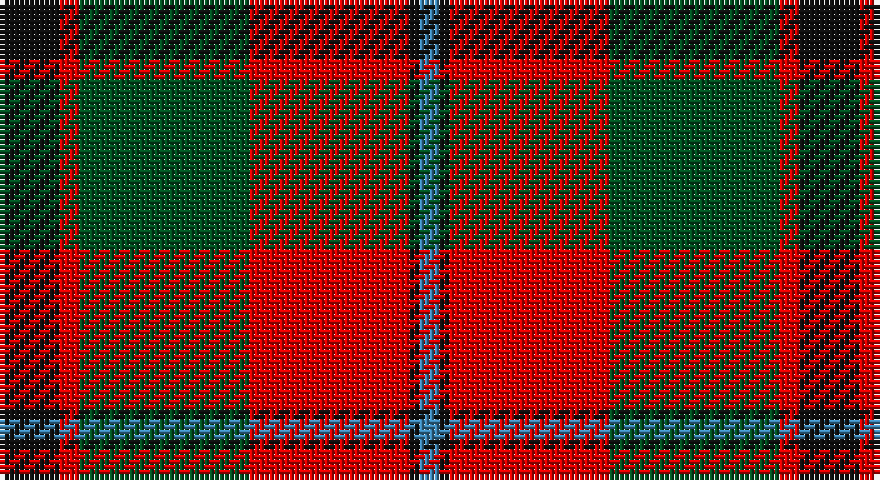

This page is one **sett** — a single exact thread-count. It belongs to the [tartan](/setts/k6r2dg17r16k1t2/)
(the same proportion at any scale), whose colour order is pattern [BKRGRK](/stripes/bkrgrk/).

Part of the [Unidentified](/tartans/unidentified/) tartan — the named design grouping this sett with its other cloths.

Sourced from register-of-tartans.  It is a [6 stripe tartan](/stripes/stripes6/).

Original link https://www.tartanregister.gov.uk/tartanDetails.aspx?ref=4216

## Also known as

This cloth is also recorded under:

- Unidentified #10
- Unidentified #12
- Unidentified #14
- Unidentified #15
- Unidentified #16
- Unidentified #18
- Unidentified #2
- Unidentified #21
- Unidentified #22
- Unidentified #24
- Unidentified #25
- Unidentified #28
- Unidentified #29
- Unidentified #30
- Unidentified #31
- Unidentified #32
- Unidentified #36
- Unidentified #37
- Unidentified #38
- Unidentified #40
- Unidentified #43
- Unidentified #44
- Unidentified #45
- Unidentified #46
- Unidentified #47
- Unidentified #48
- Unidentified #49
- Unidentified #5
- Unidentified #50
- Unidentified #51
- Unidentified #52
- Unidentified #53
- Unidentified #54
- Unidentified #55
- Unidentified #56
- Unidentified #57
- Unidentified #58
- Unidentified #59
- Unidentified #60
- Unidentified #61
- Unidentified #62
- Unidentified #63
- Unidentified #64
- Unidentified #65
- Unidentified #66
- Unidentified #7
- Unidentified #8
- Unidentified #9
- Unidentified 16
- Unidentified Artifact
- Unidentified Plaid
- Unidentified Plaid #11
- Unidentified Plaid #13
- Unidentified Plaid #2
- Unidentified Plaid #3
- Unidentified Plaid #7
- Unidentified Plaid #8
- Unidentified Plaid #9
- Unidentified Portrait

## Register references

External register numbers recorded for this tartan.

- Scottish Register of Tartans: [4216](https://www.tartanregister.gov.uk/tartanDetails.aspx?ref=4216)
- Scottish Tartans World Register: 356

## Thread count
K/12 R4 G34 R32 K2 B/4

One full sett is **160 threads**.

## Palette

Palette: <strong>Tartan Register</strong>
<table><thead><tr><th>Colour</th><th>Threads</th><th>Shade</th><th>Base</th><th>OKLCh</th></tr></thead><tbody><tr><td>K/</td><td style="text-align:right;font-variant-numeric:tabular-nums">12</td><td><code style="background-color:#101010;">#101010</code> <small style="color:#888">#101010</small></td><td>K <code style="background-color:#000000;">#000000</code></td><td><small style="color:#888">oklch(17.3% 0.000 89.9)</small></td></tr><tr><td>R</td><td style="text-align:right;font-variant-numeric:tabular-nums">4</td><td><code style="background-color:#DC0000;">#DC0000</code> <small style="color:#888">#DC0000</small></td><td>R <code style="background-color:#CC0000;">#CC0000</code></td><td><small style="color:#888">oklch(56.2% 0.230 29.2)</small></td></tr><tr><td>G</td><td style="text-align:right;font-variant-numeric:tabular-nums">34</td><td><code style="background-color:#005020;">#005020</code> <small style="color:#888">#005020</small></td><td>G <code style="background-color:#006100;">#006100</code></td><td><small style="color:#888">oklch(37.7% 0.105 149.6)</small></td></tr><tr><td>R</td><td style="text-align:right;font-variant-numeric:tabular-nums">32</td><td><code style="background-color:#DC0000;">#DC0000</code> <small style="color:#888">#DC0000</small></td><td>R <code style="background-color:#CC0000;">#CC0000</code></td><td><small style="color:#888">oklch(56.2% 0.230 29.2)</small></td></tr><tr><td>K</td><td style="text-align:right;font-variant-numeric:tabular-nums">2</td><td><code style="background-color:#101010;">#101010</code> <small style="color:#888">#101010</small></td><td>K <code style="background-color:#000000;">#000000</code></td><td><small style="color:#888">oklch(17.3% 0.000 89.9)</small></td></tr><tr><td>B/</td><td style="text-align:right;font-variant-numeric:tabular-nums">4</td><td><code style="background-color:#3C82AF;">#3C82AF</code> <small style="color:#888">#3C82AF</small></td><td>B <code style="background-color:#2A418A;">#2A418A</code></td><td><small style="color:#888">oklch(58.1% 0.099 239.8)</small></td></tr></tbody></table>

# Sample pattern

## Compared to the master

This cloth is one sett of its design; the master sett (the exemplar the design is anchored on) is below for comparison.

<figure style="margin:0"><figcaption style="color:#888;font-size:smaller">this sett</figcaption></figure>
<figure style="margin:0"><figcaption style="color:#888;font-size:smaller"><a href="/setts/dp4r3dp26r26dg26r4/">master sett →</a></figcaption></figure>

## Nearest tartans

The nearest existing variants by ΔTartan distance, with this tartan at the top so the swatches line up against it.

ΔTartan

Tartan

Sett

—

<a href="/ttd/edit/#slug=k6r2dg17r16k1t2~x2">Unidentified #15</a> <a class="nn-out" href="/variants/s6/k6r2dg17r16k1t2~x2/" title="open its dictionary page">↗</a>

0.58

<a href="/ttd/edit/#slug=dp8r3ly1r3dg14r3ly1~x4&amp;base=k6r2dg17r16k1t2~x2">Logan - 1819 (with yellow)</a> <a class="nn-out" href="/variants/s7/dp8r3ly1r3dg14r3ly1~x4/" title="open its dictionary page">↗</a>

0.61

<a href="/ttd/edit/#slug=r30k8dg30b4r3b2~x2&amp;base=k6r2dg17r16k1t2~x2">Plummer Family Personal Tartan</a> <a class="nn-out" href="/variants/s6/r30k8dg30b4r3b2~x2/" title="open its dictionary page">↗</a>

0.75

<a href="/ttd/edit/#slug=dp1r5g15r3dp9r10w1~x4&amp;base=k6r2dg17r16k1t2~x2">Geddes</a> <a class="nn-out" href="/variants/s7/dp1r5g15r3dp9r10w1~x4/" title="open its dictionary page">↗</a>

0.75

<a href="/ttd/edit/#slug=dg12g6dg6r15k1r1k2~x2&amp;base=k6r2dg17r16k1t2~x2">Cook (Name)</a> <a class="nn-out" href="/variants/s7/dg12g6dg6r15k1r1k2~x2/" title="open its dictionary page">↗</a>

0.76

<a href="/ttd/edit/#slug=db1r5dg18r4db9r10w1~x4&amp;base=k6r2dg17r16k1t2~x2">MacKintosh Geddes</a> <a class="nn-out" href="/variants/s7/db1r5dg18r4db9r10w1~x4/" title="open its dictionary page">↗</a>

0.77

<a href="/ttd/edit/#slug=dp8r3ly1r3g14r3ly1~x4&amp;base=k6r2dg17r16k1t2~x2">Logan with Yellow</a> <a class="nn-out" href="/variants/s7/dp8r3ly1r3g14r3ly1~x4/" title="open its dictionary page">↗</a>

0.86

<a href="/ttd/edit/#slug=r3dr14g8r2g2w2g2r1~x2&amp;base=k6r2dg17r16k1t2~x2">Scott Hunting Clan Tartan</a> <a class="nn-out" href="/variants/s8/r3dr14g8r2g2w2g2r1~x2/" title="open its dictionary page">↗</a>

0.88

<a href="/ttd/edit/#slug=ly2dg17g4r15dg1~x2&amp;base=k6r2dg17r16k1t2~x2">Christmas</a> <a class="nn-out" href="/variants/s5/ly2dg17g4r15dg1~x2/" title="open its dictionary page">↗</a>

0.93

<a href="/ttd/edit/#slug=p8r3ly1r3g14r3ly1~x4&amp;base=k6r2dg17r16k1t2~x2">Logan, with Yellow</a> <a class="nn-out" href="/variants/s7/p8r3ly1r3g14r3ly1~x4/" title="open its dictionary page">↗</a>

0.94

<a href="/ttd/edit/#slug=k15dg1k3r9dg1r3lo11k1~x4&amp;base=k6r2dg17r16k1t2~x2">Island of Innis, The</a> <a class="nn-out" href="/variants/s8/k15dg1k3r9dg1r3lo11k1~x4/" title="open its dictionary page">↗</a>

## Neighbour map

Every grey dot is one of 14360 variants placed by the first two principal components of the ΔTartan feature space (44% of its variance). Red is this tartan; blue dots are its nearest — click one to open its page.

<svg viewBox="0 0 640 380" role="img" style="max-width:100%;height:auto;border:1px solid #e0e0e0;border-radius:4px;display:block" xmlns="http://www.w3.org/2000/svg"><image href="/nn/cloud.v1.png" width="640" height="380"/><a href="/variants/s7/dp8r3ly1r3dg14r3ly1~x4/"><circle cx="248.0" cy="181.0" r="4" fill="#3465a4"><title>Logan - 1819 (with yellow)</title></circle></a><a href="/variants/s6/r30k8dg30b4r3b2~x2/"><circle cx="280.0" cy="188.3" r="4" fill="#3465a4"><title>Plummer Family Personal Tartan</title></circle></a><a href="/variants/s7/dp1r5g15r3dp9r10w1~x4/"><circle cx="242.8" cy="188.1" r="4" fill="#3465a4"><title>Geddes</title></circle></a><a href="/variants/s7/dg12g6dg6r15k1r1k2~x2/"><circle cx="252.7" cy="191.8" r="4" fill="#3465a4"><title>Cook (Name)</title></circle></a><a href="/variants/s7/db1r5dg18r4db9r10w1~x4/"><circle cx="249.2" cy="180.7" r="4" fill="#3465a4"><title>MacKintosh Geddes</title></circle></a><a href="/variants/s7/dp8r3ly1r3g14r3ly1~x4/"><circle cx="246.7" cy="178.7" r="4" fill="#3465a4"><title>Logan with Yellow</title></circle></a><a href="/variants/s8/r3dr14g8r2g2w2g2r1~x2/"><circle cx="245.5" cy="171.8" r="4" fill="#3465a4"><title>Scott Hunting Clan Tartan</title></circle></a><a href="/variants/s5/ly2dg17g4r15dg1~x2/"><circle cx="301.4" cy="200.9" r="4" fill="#3465a4"><title>Christmas</title></circle></a><a href="/variants/s7/p8r3ly1r3g14r3ly1~x4/"><circle cx="239.1" cy="174.8" r="4" fill="#3465a4"><title>Logan, with Yellow</title></circle></a><a href="/variants/s8/k15dg1k3r9dg1r3lo11k1~x4/"><circle cx="232.9" cy="163.7" r="4" fill="#3465a4"><title>Island of Innis, The</title></circle></a><circle cx="258.0" cy="179.2" r="5" fill="#c00000"/></svg>

ID: /variants/s6/k6r2dg17r16k1t2~x2/
