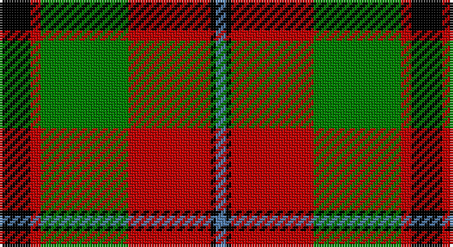

This page is one **sett** — a single exact thread-count. It belongs to the [tartan](/setts/k6r2g17r16k1t2/)
(the same proportion at any scale), whose colour order is pattern [BKRGRK](/stripes/bkrgrk/).

Sourced from weddslist.  It is a [6 stripe tartan](/stripes/stripes6/).

Original link http://www.weddslist.com/cgi-bin/tartans/pg.pl?source=sts

## Thread count
K/12 R4 G34 R32 K2 B/4

One full sett is **160 threads**.

## Palette

Palette: <strong>Ingles Buchan</strong> <small style="color:#888">(1 of 4 colours)</small>
<table><thead><tr><th>Colour</th><th>Threads</th><th>Shade</th><th>Base</th><th>OKLCh</th></tr></thead><tbody><tr><td>K/</td><td style="text-align:right;font-variant-numeric:tabular-nums">12</td><td><code style="background-color:#000000;">#000000</code> <small style="color:#888">#000000</small></td><td>K <code style="background-color:#000000;">#000000</code></td><td><small style="color:#888">oklch(0.0% 0.000 0.0)</small></td></tr><tr><td>R</td><td style="text-align:right;font-variant-numeric:tabular-nums">4</td><td><code style="background-color:#C00000;">#C00000</code> <small style="color:#888">#C00000</small></td><td>R <code style="background-color:#CC0000;">#CC0000</code></td><td><small style="color:#888">oklch(50.7% 0.208 29.2)</small></td></tr><tr><td>G</td><td style="text-align:right;font-variant-numeric:tabular-nums">34</td><td><code style="background-color:#008000;">#008000</code> <small style="color:#888">#008000</small></td><td>G <code style="background-color:#006100;">#006100</code></td><td><small style="color:#888">oklch(52.0% 0.177 142.5)</small></td></tr><tr><td>R</td><td style="text-align:right;font-variant-numeric:tabular-nums">32</td><td><code style="background-color:#C00000;">#C00000</code> <small style="color:#888">#C00000</small></td><td>R <code style="background-color:#CC0000;">#CC0000</code></td><td><small style="color:#888">oklch(50.7% 0.208 29.2)</small></td></tr><tr><td>K</td><td style="text-align:right;font-variant-numeric:tabular-nums">2</td><td><code style="background-color:#000000;">#000000</code> <small style="color:#888">#000000</small></td><td>K <code style="background-color:#000000;">#000000</code></td><td><small style="color:#888">oklch(0.0% 0.000 0.0)</small></td></tr><tr><td>B/</td><td style="text-align:right;font-variant-numeric:tabular-nums">4</td><td><code style="background-color:#5480B0;">#5480B0</code> <small style="color:#888">#5480B0</small></td><td>B <code style="background-color:#2A418A;">#2A418A</code></td><td><small style="color:#888">oklch(58.8% 0.089 251.5)</small></td></tr></tbody></table>

# Sample pattern

## Nearest tartans

The nearest existing variants by ΔTartan distance, with this tartan at the top so the swatches line up against it.

ΔTartan

Tartan

Sett

—

<a href="/ttd/edit/#slug=k6r2g17r16k1t2~x2">Unidentified 12</a> <a class="nn-out" href="/variants/s6/k6r2g17r16k1t2~x2/" title="open its dictionary page">↗</a>

0.77

<a href="/ttd/edit/#slug=k44lo9k3lo8lo16lo15lo6k7~x2&amp;base=k6r2g17r16k1t2~x2">Longford County Crest (Fashion)</a> <a class="nn-out" href="/variants/s8/k44lo9k3lo8lo16lo15lo6k7~x2/" title="open its dictionary page">↗</a>

0.96

<a href="/ttd/edit/#slug=k6r2dg17r16k1t2~x2&amp;base=k6r2g17r16k1t2~x2">Unidentified #15</a> <a class="nn-out" href="/variants/s6/k6r2dg17r16k1t2~x2/" title="open its dictionary page">↗</a>

0.96

<a href="/ttd/edit/#slug=k9r4k1r4g15ri4k1~x2&amp;base=k6r2g17r16k1t2~x2">Logan, Dark</a> <a class="nn-out" href="/variants/s7/k9r4k1r4g15ri4k1~x2/" title="open its dictionary page">↗</a>

0.99

<a href="/ttd/edit/#slug=r10w2k10w10dy35k5~x2&amp;base=k6r2g17r16k1t2~x2">Loch Ness</a> <a class="nn-out" href="/variants/s6/r10w2k10w10dy35k5~x2/" title="open its dictionary page">↗</a>

0.99

<a href="/ttd/edit/#slug=k15dg1k3r9dg1r3lo11k1~x4&amp;base=k6r2g17r16k1t2~x2">Island of Innis, The</a> <a class="nn-out" href="/variants/s8/k15dg1k3r9dg1r3lo11k1~x4/" title="open its dictionary page">↗</a>

1.04

<a href="/ttd/edit/#slug=w2k1dg16k12r12k1w2~x2&amp;base=k6r2g17r16k1t2~x2">Prince Edward Island #2</a> <a class="nn-out" href="/variants/s7/w2k1dg16k12r12k1w2~x2/" title="open its dictionary page">↗</a>

1.05

<a href="/ttd/edit/#slug=g8r2g12k6g3db6r24k4~x2&amp;base=k6r2g17r16k1t2~x2">Dickie</a> <a class="nn-out" href="/variants/s8/g8r2g12k6g3db6r24k4~x2/" title="open its dictionary page">↗</a>

1.07

<a href="/ttd/edit/#slug=ly2g7k6r12k1r1ly2~x4&amp;base=k6r2g17r16k1t2~x2">Blackstock, dress</a> <a class="nn-out" href="/variants/s7/ly2g7k6r12k1r1ly2~x4/" title="open its dictionary page">↗</a>

1.08

<a href="/ttd/edit/#slug=r3dr14g8r2g2w2g2r1~x2&amp;base=k6r2g17r16k1t2~x2">Scott Hunting Clan Tartan</a> <a class="nn-out" href="/variants/s8/r3dr14g8r2g2w2g2r1~x2/" title="open its dictionary page">↗</a>

1.10

<a href="/ttd/edit/#slug=k3ly18dg6r17k31dg3~x2&amp;base=k6r2g17r16k1t2~x2">MacMillan Varient (Unidentified)</a> <a class="nn-out" href="/variants/s6/k3ly18dg6r17k31dg3~x2/" title="open its dictionary page">↗</a>

## Neighbour map

Every grey dot is one of 14360 variants placed by the first two principal components of the ΔTartan feature space (44% of its variance). Red is this tartan; blue dots are its nearest — click one to open its page.

<svg viewBox="0 0 640 380" role="img" style="max-width:100%;height:auto;border:1px solid #e0e0e0;border-radius:4px;display:block" xmlns="http://www.w3.org/2000/svg"><image href="/nn/cloud.v1.png" width="640" height="380"/><a href="/variants/s8/k44lo9k3lo8lo16lo15lo6k7~x2/"><circle cx="212.1" cy="166.7" r="4" fill="#3465a4"><title>Longford County Crest (Fashion)</title></circle></a><a href="/variants/s6/k6r2dg17r16k1t2~x2/"><circle cx="258.0" cy="179.2" r="4" fill="#3465a4"><title>Unidentified #15</title></circle></a><a href="/variants/s7/k9r4k1r4g15ri4k1~x2/"><circle cx="189.1" cy="173.6" r="4" fill="#3465a4"><title>Logan, Dark</title></circle></a><a href="/variants/s6/r10w2k10w10dy35k5~x2/"><circle cx="252.3" cy="170.0" r="4" fill="#3465a4"><title>Loch Ness</title></circle></a><a href="/variants/s8/k15dg1k3r9dg1r3lo11k1~x4/"><circle cx="232.9" cy="163.7" r="4" fill="#3465a4"><title>Island of Innis, The</title></circle></a><a href="/variants/s7/w2k1dg16k12r12k1w2~x2/"><circle cx="191.0" cy="168.3" r="4" fill="#3465a4"><title>Prince Edward Island #2</title></circle></a><a href="/variants/s8/g8r2g12k6g3db6r24k4~x2/"><circle cx="200.1" cy="181.3" r="4" fill="#3465a4"><title>Dickie</title></circle></a><a href="/variants/s7/ly2g7k6r12k1r1ly2~x4/"><circle cx="189.7" cy="169.2" r="4" fill="#3465a4"><title>Blackstock, dress</title></circle></a><a href="/variants/s8/r3dr14g8r2g2w2g2r1~x2/"><circle cx="245.5" cy="171.8" r="4" fill="#3465a4"><title>Scott Hunting Clan Tartan</title></circle></a><a href="/variants/s6/k3ly18dg6r17k31dg3~x2/"><circle cx="188.9" cy="191.9" r="4" fill="#3465a4"><title>MacMillan Varient (Unidentified)</title></circle></a><circle cx="234.6" cy="171.3" r="5" fill="#c00000"/></svg>

ID: /variants/s6/k6r2g17r16k1t2~x2/
