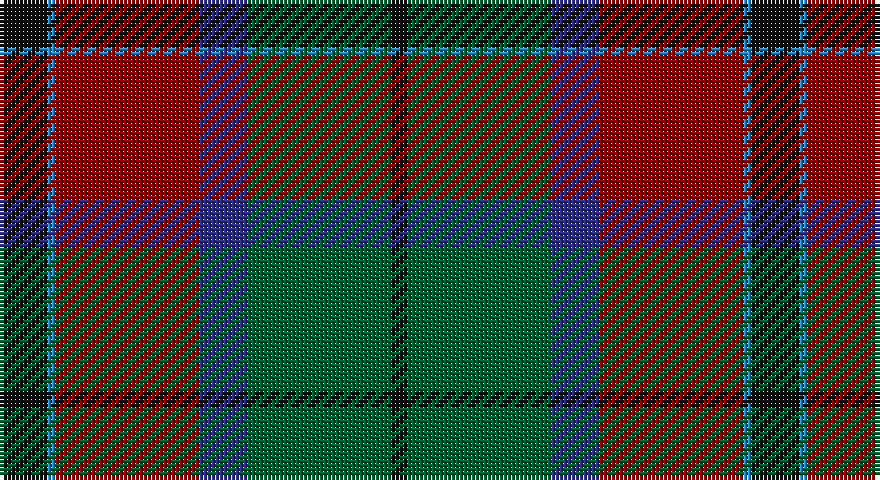

This page is one **sett** — a single exact thread-count. It belongs to the [tartan](/setts/k6t1r18db6dg18k2/)
(the same proportion at any scale), whose colour order is pattern [KBRBGK](/stripes/kbrbgk/).

Part of the [Eachaidh](/tartans/eachaidh/) tartan — the named design grouping this sett with its other cloths.

Sourced from tartans-authority.  It is a [6 stripe tartan](/stripes/stripes6/).

Original link http://www.tartansauthority.com/tartan-ferret/display/10246/

## Register references

External register numbers recorded for this tartan.

- Scottish Tartans Authority (ITI): 10246

## Thread count
K/12 B2 DR36 DB12 G36 K/4

One full sett is **188 threads**.

## Palette

Palette: <strong>Tartan Register</strong> <small style="color:#888">(4 of 5 colours)</small>
<table><thead><tr><th>Colour</th><th>Threads</th><th>Shade</th><th>Base</th><th>OKLCh</th></tr></thead><tbody><tr><td>K/</td><td style="text-align:right;font-variant-numeric:tabular-nums">12</td><td><code style="background-color:#101010;">#101010</code> <small style="color:#888">#101010</small></td><td>K <code style="background-color:#000000;">#000000</code></td><td><small style="color:#888">oklch(17.3% 0.000 89.9)</small></td></tr><tr><td>B</td><td style="text-align:right;font-variant-numeric:tabular-nums">2</td><td><code style="background-color:#2888C4;">#2888C4</code> <small style="color:#888">#2888C4</small></td><td>B <code style="background-color:#2A418A;">#2A418A</code></td><td><small style="color:#888">oklch(60.1% 0.125 241.5)</small></td></tr><tr><td>DR</td><td style="text-align:right;font-variant-numeric:tabular-nums">36</td><td><code style="background-color:#880000;">#880000</code> <small style="color:#888">#880000</small></td><td>R <code style="background-color:#CC0000;">#CC0000</code></td><td><small style="color:#888">oklch(39.4% 0.162 29.2)</small></td></tr><tr><td>DB</td><td style="text-align:right;font-variant-numeric:tabular-nums">12</td><td><code style="background-color:#2C2C80;">#2C2C80</code> <small style="color:#888">#2C2C80</small></td><td>B <code style="background-color:#2A418A;">#2A418A</code></td><td><small style="color:#888">oklch(35.0% 0.138 276.6)</small></td></tr><tr><td>G</td><td style="text-align:right;font-variant-numeric:tabular-nums">36</td><td><code style="background-color:#005C30;">#005C30</code> <small style="color:#888">#005C30</small></td><td>G <code style="background-color:#006100;">#006100</code></td><td><small style="color:#888">oklch(41.7% 0.105 153.9)</small></td></tr><tr><td>K/</td><td style="text-align:right;font-variant-numeric:tabular-nums">4</td><td><code style="background-color:#101010;">#101010</code> <small style="color:#888">#101010</small></td><td>K <code style="background-color:#000000;">#000000</code></td><td><small style="color:#888">oklch(17.3% 0.000 89.9)</small></td></tr></tbody></table>

# Sample pattern

## Compared to the master

This cloth is one sett of its design; the master sett (the exemplar the design is anchored on) is below for comparison.

<figure style="margin:0"><figcaption style="color:#888;font-size:smaller">this sett</figcaption></figure>
<figure style="margin:0"><figcaption style="color:#888;font-size:smaller"><a href="/setts/k6y1r18b6dg18k2/">master sett →</a></figcaption></figure>

## Nearest tartans

The nearest existing variants by ΔTartan distance, with this tartan at the top so the swatches line up against it.

ΔTartan

Tartan

Sett

—

<a href="/ttd/edit/#slug=k6t1r18db6dg18k2~x2">Eachaidh (Personal)</a> <a class="nn-out" href="/variants/s6/k6t1r18db6dg18k2~x2/" title="open its dictionary page">↗</a>

0.57

<a href="/ttd/edit/#slug=k6y1r18b6dg18k2~x2&amp;base=k6t1r18db6dg18k2~x2">Eachaidh</a> <a class="nn-out" href="/variants/s6/k6y1r18b6dg18k2~x2/" title="open its dictionary page">↗</a>

0.83

<a href="/ttd/edit/#slug=r1n12k6ly1do10r1~x4&amp;base=k6t1r18db6dg18k2~x2">Andover (Fashion)</a> <a class="nn-out" href="/variants/s6/r1n12k6ly1do10r1~x4/" title="open its dictionary page">↗</a>

0.99

<a href="/variants/s6/r1n12ki6k1do10r1~x4/">Andover</a>

0.99

<a href="/ttd/edit/#slug=lo4k28r2do22t8do3~x2&amp;base=k6t1r18db6dg18k2~x2">Loch Long One Design</a> <a class="nn-out" href="/variants/s6/lo4k28r2do22t8do3~x2/" title="open its dictionary page">↗</a>

1.01

<a href="/ttd/edit/#slug=y27dr2y4o15db26k2db6~x2&amp;base=k6t1r18db6dg18k2~x2">Bailies of Bennachie Corporate Tartan</a> <a class="nn-out" href="/variants/s7/y27dr2y4o15db26k2db6~x2/" title="open its dictionary page">↗</a>

1.03

<a href="/ttd/edit/#slug=db24g4k2ly1k2g4r25g15~x2&amp;base=k6t1r18db6dg18k2~x2">Livingstone Aus. Dress (Personal)</a> <a class="nn-out" href="/variants/s8/db24g4k2ly1k2g4r25g15~x2/" title="open its dictionary page">↗</a>

1.07

<a href="/ttd/edit/#slug=r2do22g22do3db12y2~x2&amp;base=k6t1r18db6dg18k2~x2">Lisbon</a> <a class="nn-out" href="/variants/s6/r2do22g22do3db12y2~x2/" title="open its dictionary page">↗</a>

1.13

<a href="/ttd/edit/#slug=lb3r30k18db6g30k2~x2&amp;base=k6t1r18db6dg18k2~x2">Bryant (Dalgleish) (Personal)</a> <a class="nn-out" href="/variants/s6/lb3r30k18db6g30k2~x2/" title="open its dictionary page">↗</a>

1.17

<a href="/ttd/edit/#slug=r2y18k2y3k20dy30w2~x2&amp;base=k6t1r18db6dg18k2~x2">Bennett, J P. (Personal)</a> <a class="nn-out" href="/variants/s7/r2y18k2y3k20dy30w2~x2/" title="open its dictionary page">↗</a>

1.17

<a href="/ttd/edit/#slug=dg30dt2n7r14n7r7w1dt14~x2&amp;base=k6t1r18db6dg18k2~x2">Harding (Name)</a> <a class="nn-out" href="/variants/s8/dg30dt2n7r14n7r7w1dt14~x2/" title="open its dictionary page">↗</a>

## Neighbour map

Every grey dot is one of 14360 variants placed by the first two principal components of the ΔTartan feature space (44% of its variance). Red is this tartan; blue dots are its nearest — click one to open its page.

<svg viewBox="0 0 640 380" role="img" style="max-width:100%;height:auto;border:1px solid #e0e0e0;border-radius:4px;display:block" xmlns="http://www.w3.org/2000/svg"><image href="/nn/cloud.v1.png" width="640" height="380"/><a href="/variants/s6/k6y1r18b6dg18k2~x2/"><circle cx="251.2" cy="204.8" r="4" fill="#3465a4"><title>Eachaidh</title></circle></a><a href="/variants/s6/r1n12k6ly1do10r1~x4/"><circle cx="241.5" cy="208.7" r="4" fill="#3465a4"><title>Andover (Fashion)</title></circle></a><a href="/variants/s6/r1n12ki6k1do10r1~x4/"><circle cx="255.4" cy="217.3" r="4" fill="#3465a4"><title>Andover</title></circle></a><a href="/variants/s6/lo4k28r2do22t8do3~x2/"><circle cx="265.3" cy="202.2" r="4" fill="#3465a4"><title>Loch Long One Design</title></circle></a><a href="/variants/s7/y27dr2y4o15db26k2db6~x2/"><circle cx="261.2" cy="207.7" r="4" fill="#3465a4"><title>Bailies of Bennachie Corporate Tartan</title></circle></a><a href="/variants/s8/db24g4k2ly1k2g4r25g15~x2/"><circle cx="242.9" cy="158.7" r="4" fill="#3465a4"><title>Livingstone Aus. Dress (Personal)</title></circle></a><a href="/variants/s6/r2do22g22do3db12y2~x2/"><circle cx="240.9" cy="218.7" r="4" fill="#3465a4"><title>Lisbon</title></circle></a><a href="/variants/s6/lb3r30k18db6g30k2~x2/"><circle cx="193.1" cy="191.3" r="4" fill="#3465a4"><title>Bryant (Dalgleish) (Personal)</title></circle></a><a href="/variants/s7/r2y18k2y3k20dy30w2~x2/"><circle cx="231.9" cy="173.1" r="4" fill="#3465a4"><title>Bennett, J P. (Personal)</title></circle></a><a href="/variants/s8/dg30dt2n7r14n7r7w1dt14~x2/"><circle cx="244.6" cy="162.5" r="4" fill="#3465a4"><title>Harding (Name)</title></circle></a><circle cx="237.2" cy="198.6" r="5" fill="#c00000"/></svg>

ID: /variants/s6/k6t1r18db6dg18k2~x2/
