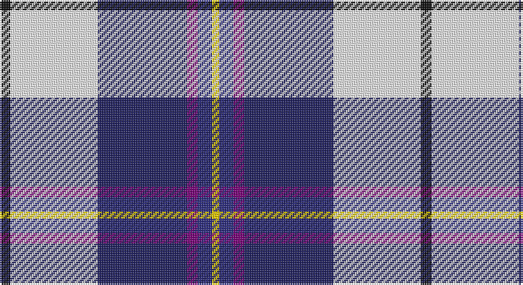

This page is one **sett** — a single exact thread-count. It belongs to the [tartan](/setts/k6w49db50dp6dbi8ly4/)
(the same proportion at any scale), whose colour order is pattern [KWBBBY](/stripes/kwbbby/).

Part of the [Pipers' Trail Dance, The](/tartans/pipers-trail-dance-the/) tartan — the named design grouping this sett with its other cloths.

Sourced from tartans-authority.  It is a [6 stripe tartan](/stripes/stripes6/).

Original link http://www.tartansauthority.com/tartan-ferret/display/11200/

## Register references

External register numbers recorded for this tartan.

- Scottish Register of Tartans: [11200](https://www.tartanregister.gov.uk/tartanDetails?ref=11200)
- Scottish Tartans Authority (ITI): 11200

## Thread count
K/6 W49 DBa50 P6 DB8 Y/4

One full sett is **236 threads**.

## Palette

Palette: <strong>Tartan Register</strong>
<table><thead><tr><th>Colour</th><th>Threads</th><th>Shade</th><th>Base</th><th>OKLCh</th></tr></thead><tbody><tr><td>K/</td><td style="text-align:right;font-variant-numeric:tabular-nums">6</td><td><code style="background-color:#101010;">#101010</code> <small style="color:#888">#101010</small></td><td>K <code style="background-color:#000000;">#000000</code></td><td><small style="color:#888">oklch(17.3% 0.000 89.9)</small></td></tr><tr><td>W</td><td style="text-align:right;font-variant-numeric:tabular-nums">49</td><td><code style="background-color:#FCFCFC;">#FCFCFC</code> <small style="color:#888">#FCFCFC</small></td><td>W <code style="background-color:#F7F7F7;">#F7F7F7</code></td><td><small style="color:#888">oklch(99.1% 0.000 89.9)</small></td></tr><tr><td>DBa</td><td style="text-align:right;font-variant-numeric:tabular-nums">50</td><td><code style="background-color:#202060;">#202060</code> <small style="color:#888">#202060</small></td><td>B <code style="background-color:#2A418A;">#2A418A</code></td><td><small style="color:#888">oklch(28.9% 0.111 276.9)</small></td></tr><tr><td>P</td><td style="text-align:right;font-variant-numeric:tabular-nums">6</td><td><code style="background-color:#780078;">#780078</code> <small style="color:#888">#780078</small></td><td>B <code style="background-color:#2A418A;">#2A418A</code></td><td><small style="color:#888">oklch(40.2% 0.185 328.4)</small></td></tr><tr><td>DB</td><td style="text-align:right;font-variant-numeric:tabular-nums">8</td><td><code style="background-color:#2C2C80;">#2C2C80</code> <small style="color:#888">#2C2C80</small></td><td>B <code style="background-color:#2A418A;">#2A418A</code></td><td><small style="color:#888">oklch(35.0% 0.138 276.6)</small></td></tr><tr><td>Y/</td><td style="text-align:right;font-variant-numeric:tabular-nums">4</td><td><code style="background-color:#FCCC00;">#FCCC00</code> <small style="color:#888">#FCCC00</small></td><td>Y <code style="background-color:#F2BF00;">#F2BF00</code></td><td><small style="color:#888">oklch(86.2% 0.176 91.5)</small></td></tr></tbody></table>

# Sample pattern

## Compared to the master

This cloth is one sett of its design; the master sett (the exemplar the design is anchored on) is below for comparison.

<figure style="margin:0"><figcaption style="color:#888;font-size:smaller">this sett</figcaption></figure>
<figure style="margin:0"><figcaption style="color:#888;font-size:smaller"><a href="/setts/k6w49dt50dp6t8lo4/">master sett →</a></figcaption></figure>

## Nearest tartans

The nearest existing variants by ΔTartan distance, with this tartan at the top so the swatches line up against it.

ΔTartan

Tartan

Sett

—

<a href="/ttd/edit/#slug=k6w49db50dp6dbi8ly4">Pipers' Trail Dance, The</a> <a class="nn-out" href="/variants/s6/k6w49db50dp6dbi8ly4/" title="open its dictionary page">↗</a>

0.68

<a href="/ttd/edit/#slug=k6w49dt50dp6t8lo4&amp;base=k6w49db50dp6dbi8ly4">Pipers' Trail Dance, The</a> <a class="nn-out" href="/variants/s6/k6w49dt50dp6t8lo4/" title="open its dictionary page">↗</a>

0.86

<a href="/ttd/edit/#slug=ly2r1t16k5p2w11p1~x4&amp;base=k6w49db50dp6dbi8ly4">Dignan</a> <a class="nn-out" href="/variants/s7/ly2r1t16k5p2w11p1~x4/" title="open its dictionary page">↗</a>

0.88

<a href="/ttd/edit/#slug=r3w2db27k19w27dp2ly3~x2&amp;base=k6w49db50dp6dbi8ly4">Christian Dress (Personal)</a> <a class="nn-out" href="/variants/s7/r3w2db27k19w27dp2ly3~x2/" title="open its dictionary page">↗</a>

1.07

<a href="/ttd/edit/#slug=r2db14k6g1w12g1w2~x4&amp;base=k6w49db50dp6dbi8ly4">Davidson (Wedding) (Personal)</a> <a class="nn-out" href="/variants/s7/r2db14k6g1w12g1w2~x4/" title="open its dictionary page">↗</a>

1.22

<a href="/ttd/edit/#slug=g4w28dp8ly2db17g4~x2&amp;base=k6w49db50dp6dbi8ly4">Manx Dress</a> <a class="nn-out" href="/variants/s6/g4w28dp8ly2db17g4~x2/" title="open its dictionary page">↗</a>

1.25

<a href="/ttd/edit/#slug=w18k1db4g4dp10lo2~x4&amp;base=k6w49db50dp6dbi8ly4">Edgar-Feyen (Personal)</a> <a class="nn-out" href="/variants/s6/w18k1db4g4dp10lo2~x4/" title="open its dictionary page">↗</a>

1.28

<a href="/ttd/edit/#slug=lo4r2b32k10dp4lb21dp2~x2&amp;base=k6w49db50dp6dbi8ly4">Dignan School of Dancing</a> <a class="nn-out" href="/variants/s7/lo4r2b32k10dp4lb21dp2~x2/" title="open its dictionary page">↗</a>

1.29

<a href="/ttd/edit/#slug=dp4k2w3k2db30g9k4w20ly3~x2&amp;base=k6w49db50dp6dbi8ly4">Minnesota Dress</a> <a class="nn-out" href="/variants/s9/dp4k2w3k2db30g9k4w20ly3~x2/" title="open its dictionary page">↗</a>

1.31

<a href="/ttd/edit/#slug=r3dt25k6lb20ly2lb2w3~x2&amp;base=k6w49db50dp6dbi8ly4">Madras College (Corporate)</a> <a class="nn-out" href="/variants/s7/r3dt25k6lb20ly2lb2w3~x2/" title="open its dictionary page">↗</a>

1.34

<a href="/ttd/edit/#slug=db4r2db31k10g4w21g2~x2&amp;base=k6w49db50dp6dbi8ly4">Sinclair Dress (Dance)</a> <a class="nn-out" href="/variants/s7/db4r2db31k10g4w21g2~x2/" title="open its dictionary page">↗</a>

## Neighbour map

Every grey dot is one of 14360 variants placed by the first two principal components of the ΔTartan feature space (44% of its variance). Red is this tartan; blue dots are its nearest — click one to open its page.

<svg viewBox="0 0 640 380" role="img" style="max-width:100%;height:auto;border:1px solid #e0e0e0;border-radius:4px;display:block" xmlns="http://www.w3.org/2000/svg"><image href="/nn/cloud.v1.png" width="640" height="380"/><a href="/variants/s6/k6w49dt50dp6t8lo4/"><circle cx="157.7" cy="131.3" r="4" fill="#3465a4"><title>Pipers' Trail Dance, The</title></circle></a><a href="/variants/s7/ly2r1t16k5p2w11p1~x4/"><circle cx="159.1" cy="116.6" r="4" fill="#3465a4"><title>Dignan</title></circle></a><a href="/variants/s7/r3w2db27k19w27dp2ly3~x2/"><circle cx="118.8" cy="125.1" r="4" fill="#3465a4"><title>Christian Dress (Personal)</title></circle></a><a href="/variants/s7/r2db14k6g1w12g1w2~x4/"><circle cx="148.7" cy="139.6" r="4" fill="#3465a4"><title>Davidson (Wedding) (Personal)</title></circle></a><a href="/variants/s6/g4w28dp8ly2db17g4~x2/"><circle cx="180.7" cy="151.3" r="4" fill="#3465a4"><title>Manx Dress</title></circle></a><a href="/variants/s6/w18k1db4g4dp10lo2~x4/"><circle cx="183.6" cy="121.3" r="4" fill="#3465a4"><title>Edgar-Feyen (Personal)</title></circle></a><a href="/variants/s7/lo4r2b32k10dp4lb21dp2~x2/"><circle cx="177.7" cy="129.2" r="4" fill="#3465a4"><title>Dignan School of Dancing</title></circle></a><a href="/variants/s9/dp4k2w3k2db30g9k4w20ly3~x2/"><circle cx="142.1" cy="106.5" r="4" fill="#3465a4"><title>Minnesota Dress</title></circle></a><a href="/variants/s7/r3dt25k6lb20ly2lb2w3~x2/"><circle cx="171.5" cy="140.8" r="4" fill="#3465a4"><title>Madras College (Corporate)</title></circle></a><a href="/variants/s7/db4r2db31k10g4w21g2~x2/"><circle cx="213.2" cy="144.0" r="4" fill="#3465a4"><title>Sinclair Dress (Dance)</title></circle></a><circle cx="158.4" cy="129.3" r="5" fill="#c00000"/></svg>

ID: /variants/s6/k6w49db50dp6dbi8ly4/
