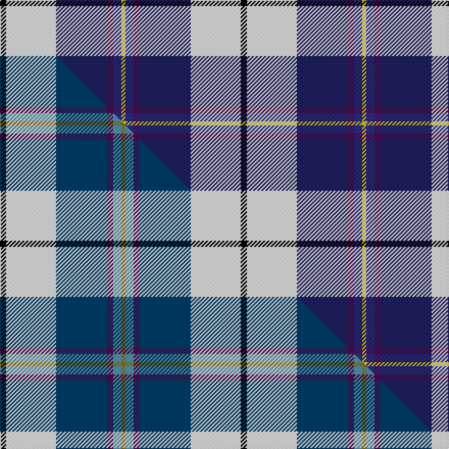

This page is one **sett** — a single exact thread-count. It belongs to the [tartan](/setts/k6w49db50dp6dbi8ly4/)
(the same proportion at any scale), whose colour order is pattern [KWBBBY](/stripes/kwbbby/).

Part of the [Pipers' Trail Dance, The](/tartans/pipers-trail-dance-the/) tartan — the named design grouping this sett with its other cloths.

Sourced from tartans-authority.  It is a [6 stripe tartan](/stripes/stripes6/).

Original link https://www.tartanregister.gov.uk/tartanDetails.aspx?ref=11200

Dataset <small>— provenance for this record, inherited from the source manifest</small>

<dl class="dataset-prov">
<dt>source</dt><dd><a href="/sources/tartans-authority/">Scottish Tartans Authority</a></dd>
<dt>data captured from</dt><dd><a href="https://github.com/thetartan/tartan-database/blob/master/data/tartans-authority/data.csv">https://github.com/thetartan/tartan-database/blob/master/data/tartans-authority/data.csv</a></dd>
<dt>data date</dt><dd>2014 <small>(this record)</small></dd>
<dt>licence</dt><dd><a href="https://creativecommons.org/licenses/by-nc-nd/4.0/">CC BY-NC-ND 4.0</a></dd>
</dl>

Capture chain <small>— the hands this data passed through, oldest first; each capture carries its own licence</small>

<ol class="capture-chain">
<li><a href="https://www.tartansauthority.com/">Scottish Tartans Authority</a> <small>the heritage body's archive — its tartan-ferret record browser is retired (links repaired to the SRT, above)</small></li>
<li><a href="https://github.com/thetartan/tartan-database">thetartan/tartan-database</a> <small>2016-2017</small> · <a href="https://creativecommons.org/licenses/by-nc-nd/4.0/">CC BY-NC-ND 4.0</a> <small>Levko Kravets's frozen compilation — the capture we vendored, and where its CC licence text came from</small></li>
<li>this dictionary <small>captured 2026-06-10 · commit 5bf86c7566</small> <small>each re-capture is a git commit to data/sources</small></li>
</ol>

## Register references

External register numbers recorded for this tartan.

- Scottish Register of Tartans: [11200](https://www.tartanregister.gov.uk/tartanDetails?ref=11200)
- Scottish Tartans Authority (ITI): 11200

## Thread count
K/6 W49 DB50 DP6 DBi8 LY/4

One full sett is **236 threads**.

## Palette
<table><thead><tr><th>Colour</th><th>Shade</th><th>OKLCh</th></tr></thead><tbody><tr><td>DB</td><td><code style="background-color:#2C2C80;">#2C2C80</code> <small style="color:#888">#2C2C80</small></td><td><small style="color:#888">oklch(35.0% 0.138 276.6)</small></td></tr><tr><td>DB</td><td><code style="background-color:#202060;">#202060</code> <small style="color:#888">#202060</small></td><td><small style="color:#888">oklch(28.9% 0.111 276.9)</small></td></tr><tr><td>K</td><td><code style="background-color:#000000;">#000000</code> <small style="color:#888">#000000</small></td><td><small style="color:#888">oklch(0.0% 0.000 0.0)</small></td></tr><tr><td>DP</td><td><code style="background-color:#4B0B4F;">#4B0B4F</code> <small style="color:#888">#4B0B4F</small></td><td><small style="color:#888">oklch(30.1% 0.125 325.4)</small></td></tr><tr><td>W</td><td><code style="background-color:#F7F7F7;">#F7F7F7</code> <small style="color:#888">#F7F7F7</small></td><td><small style="color:#888">oklch(97.6% 0.000 89.9)</small></td></tr><tr><td>LY</td><td><code style="background-color:#DCBC32;">#DCBC32</code> <small style="color:#888">#DCBC32</small></td><td><small style="color:#888">oklch(80.0% 0.150 95.2)</small></td></tr></tbody></table>

# Sample pattern

## Compared to the master

This cloth is one sett of its design; the master sett (the exemplar the design is anchored on) is below for comparison.

Its **ΔTartan distance** from the master is **0.11** — the same measure the nearest-tartans table ranks by (0 is identical; a re-scale of the same cloth is near 0, a recolour or a different proportion further).

<figure class="master-compare" style="margin:0">

this sett
master sett ★

<figcaption style="color:#888;font-size:smaller">One weave of this sett against the <a href="/setts/k6w49db50dp6t8y4/">master sett ★</a>, split on the diagonal: a shared proportion runs seamlessly across it with only the shades shifting; a different proportion breaks on it.</figcaption>
</figure>

## Nearest tartan variants

The nearest existing variants by ΔTartan distance, with this cloth at the top so the swatches line up against it.

ΔTartan

Threads

Variant

Sett

—

236

<a href="/variants/s6/k6w49db50dp6dbi8ly4~db1204274-dbi1406275/">Pipers' Trail Dance, The</a>

<a href="/ttd/edit/#slug=k6w49db50dp6t8y4~db1404245-t2503227&amp;base=k6w49db50dp6dbi8ly4~db1204274-dbi1406275" title="compare in the TTD">0.11</a>

236

<a href="/variants/s6/k6w49db50dp6t8y4~db1404245-t2503227/">Pipers' Trail Dance, The</a>

<a href="/ttd/edit/#slug=ly8k2db20lb4w1k2~x4&amp;base=k6w49db50dp6dbi8ly4~db1204274-dbi1406275" title="compare in the TTD">1.86</a>

256

<a href="/variants/s6/ly8k2db20lb4w1k2~x4/">Solberg-Bell</a>

<a href="/ttd/edit/#slug=y2r1lb16k5dp2w11dp1~x4&amp;base=k6w49db50dp6dbi8ly4~db1204274-dbi1406275" title="compare in the TTD">1.92</a>

292

<a href="/variants/s7/y2r1lb16k5dp2w11dp1~x4/">Dignan</a>

<a href="/ttd/edit/#slug=r2db12k5lb16w2~x4&amp;base=k6w49db50dp6dbi8ly4~db1204274-dbi1406275" title="compare in the TTD">2.20</a>

280

<a href="/variants/s5/r2db12k5lb16w2~x4/">RSCDS Australia? (Corporate)</a>

<a href="/ttd/edit/#slug=k7lb3o30b30w3~x2&amp;base=k6w49db50dp6dbi8ly4~db1204274-dbi1406275" title="compare in the TTD">2.23</a>

272

<a href="/variants/s5/k7lb3o30b30w3~x2/">Douglas, brown</a>

<a href="/ttd/edit/#slug=k3y1w9y1db9k3lb1~x4&amp;base=k6w49db50dp6dbi8ly4~db1204274-dbi1406275" title="compare in the TTD">2.33</a>

200

<a href="/variants/s7/k3y1w9y1db9k3lb1~x4/">St. Francis Xavier University</a>

<a href="/ttd/edit/#slug=r3db25k6lb20y2lb2w3~x2&amp;base=k6w49db50dp6dbi8ly4~db1204274-dbi1406275" title="compare in the TTD">2.39</a>

232

<a href="/variants/s7/r3db25k6lb20y2lb2w3~x2/">Madras College (Corporate)</a>

<a href="/ttd/edit/#slug=k1w7lo7db16dy1~x4&amp;base=k6w49db50dp6dbi8ly4~db1204274-dbi1406275" title="compare in the TTD">2.41</a>

248

<a href="/variants/s5/k1w7lo7db16dy1~x4/">Prehospital EMS Tartan (USA)</a>

<a href="/ttd/edit/#slug=k1w7lo7db16y1~x4&amp;base=k6w49db50dp6dbi8ly4~db1204274-dbi1406275" title="compare in the TTD">2.41</a>

248

<a href="/variants/s5/k1w7lo7db16y1~x4/">Prehospital EMS (Corporate)</a>

<a href="/ttd/edit/#slug=w18k1db4g4dp10lo2~x4&amp;base=k6w49db50dp6dbi8ly4~db1204274-dbi1406275" title="compare in the TTD">2.47</a>

232

<a href="/variants/s6/w18k1db4g4dp10lo2~x4/">Edgar-Feyen</a>

## Neighbour map

Every grey dot is one of 13620 variants placed by the first two principal components of the ΔTartan feature space (42% of its variance). Red is this tartan; blue dots are its nearest — click one to open its page.

<svg viewBox="0 0 640 380" role="img" style="max-width:100%;height:auto;border:1px solid #e0e0e0;border-radius:4px;display:block" xmlns="http://www.w3.org/2000/svg"><image href="/nn/cloud.v1.png" width="640" height="380"/><a href="/variants/s6/k6w49db50dp6t8y4~db1404245-t2503227/"><circle cx="153.8" cy="144.0" r="4" fill="#3465a4"><title>Pipers' Trail Dance, The</title></circle></a><a href="/variants/s6/ly8k2db20lb4w1k2~x4/"><circle cx="247.0" cy="134.6" r="4" fill="#3465a4"><title>Solberg-Bell</title></circle></a><a href="/variants/s7/y2r1lb16k5dp2w11dp1~x4/"><circle cx="153.9" cy="130.4" r="4" fill="#3465a4"><title>Dignan</title></circle></a><a href="/variants/s5/r2db12k5lb16w2~x4/"><circle cx="152.7" cy="199.1" r="4" fill="#3465a4"><title>RSCDS Australia? (Corporate)</title></circle></a><a href="/variants/s5/k7lb3o30b30w3~x2/"><circle cx="213.6" cy="196.5" r="4" fill="#3465a4"><title>Douglas, brown</title></circle></a><a href="/variants/s7/k3y1w9y1db9k3lb1~x4/"><circle cx="100.7" cy="171.5" r="4" fill="#3465a4"><title>St. Francis Xavier University</title></circle></a><a href="/variants/s7/r3db25k6lb20y2lb2w3~x2/"><circle cx="155.2" cy="137.3" r="4" fill="#3465a4"><title>Madras College (Corporate)</title></circle></a><a href="/variants/s5/k1w7lo7db16dy1~x4/"><circle cx="207.3" cy="161.4" r="4" fill="#3465a4"><title>Prehospital EMS Tartan (USA)</title></circle></a><a href="/variants/s5/k1w7lo7db16y1~x4/"><circle cx="207.6" cy="161.6" r="4" fill="#3465a4"><title>Prehospital EMS (Corporate)</title></circle></a><a href="/variants/s6/w18k1db4g4dp10lo2~x4/"><circle cx="167.3" cy="135.6" r="4" fill="#3465a4"><title>Edgar-Feyen</title></circle></a><circle cx="158.5" cy="144.8" r="5" fill="#c00000"/><text x="320" y="376" text-anchor="middle" font-size="11" fill="#999">ground</text><text x="11" y="190" text-anchor="middle" font-size="11" fill="#999" transform="rotate(-90 11 190)">complexity</text></svg>

ID: /variants/s6/k6w49db50dp6dbi8ly4~db1204274-dbi1406275/
