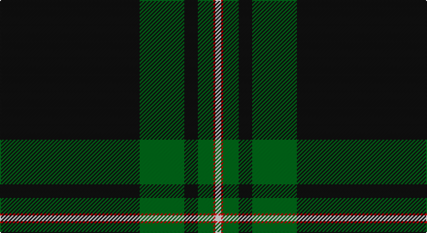

This page is one **sett** — a single exact thread-count. It belongs to the [tartan](/setts/k72g23k7g8r1w3/)
(the same proportion at any scale), whose colour order is pattern [KGKGRW](/stripes/kgkgrw/).

Part of the [MacGregor](/tartans/macgregor/) tartan — the named design grouping this sett with its other cloths.

Sourced from register-of-tartans.  It is a [6 stripe tartan](/stripes/stripes6/).

Original link https://www.tartanregister.gov.uk/tartanDetails.aspx?ref=2462

## Also known as

This cloth is also recorded under:

- MacGregor #2
- MacGregor #3
- MacGregor #4
- MacGregor of Glengyle
- MacGregor, Black
- MacGregor, Modern

2 attestations — the source records this cloth was collapsed from (oldest owns this page)

<ul>
<li>01/03/2005 — MacGregor, Black (Personal) (register-of-tartans, <a href="https://www.tartanregister.gov.uk/tartanDetails.aspx?ref=2462">record</a>)</li>
<li>2005 March — MacGregor - 2005 (Ronan - Personal) (tartans-authority, <a href="http://www.tartansauthority.com/tartan-ferret/display/6588/">record</a>)</li>
</ul>

## Register references

External register numbers recorded for this tartan.

- Scottish Register of Tartans: [2462](https://www.tartanregister.gov.uk/tartanDetails.aspx?ref=2462)
- Scottish Tartans Authority (ITI): 6588

## Thread count
K/144 G46 K14 G16 R2 LN/6

One full sett is **306 threads**.

## Palette

Palette: <strong>Tartan Register</strong>
<table><thead><tr><th>Colour</th><th>Threads</th><th>Shade</th><th>Base</th><th>OKLCh</th></tr></thead><tbody><tr><td>K/</td><td style="text-align:right;font-variant-numeric:tabular-nums">144</td><td><code style="background-color:#101010;">#101010</code> <small style="color:#888">#101010</small></td><td>K <code style="background-color:#000000;">#000000</code></td><td><small style="color:#888">oklch(17.3% 0.000 89.9)</small></td></tr><tr><td>G</td><td style="text-align:right;font-variant-numeric:tabular-nums">46</td><td><code style="background-color:#006818;">#006818</code> <small style="color:#888">#006818</small></td><td>G <code style="background-color:#006100;">#006100</code></td><td><small style="color:#888">oklch(45.0% 0.142 145.0)</small></td></tr><tr><td>K</td><td style="text-align:right;font-variant-numeric:tabular-nums">14</td><td><code style="background-color:#101010;">#101010</code> <small style="color:#888">#101010</small></td><td>K <code style="background-color:#000000;">#000000</code></td><td><small style="color:#888">oklch(17.3% 0.000 89.9)</small></td></tr><tr><td>G</td><td style="text-align:right;font-variant-numeric:tabular-nums">16</td><td><code style="background-color:#006818;">#006818</code> <small style="color:#888">#006818</small></td><td>G <code style="background-color:#006100;">#006100</code></td><td><small style="color:#888">oklch(45.0% 0.142 145.0)</small></td></tr><tr><td>R</td><td style="text-align:right;font-variant-numeric:tabular-nums">2</td><td><code style="background-color:#C80000;">#C80000</code> <small style="color:#888">#C80000</small></td><td>R <code style="background-color:#CC0000;">#CC0000</code></td><td><small style="color:#888">oklch(52.3% 0.215 29.2)</small></td></tr><tr><td>LN/</td><td style="text-align:right;font-variant-numeric:tabular-nums">6</td><td><code style="background-color:#E0E0E0;">#E0E0E0</code> <small style="color:#888">#E0E0E0</small></td><td>W <code style="background-color:#F7F7F7;">#F7F7F7</code></td><td><small style="color:#888">oklch(90.7% 0.000 89.9)</small></td></tr></tbody></table>

# Sample pattern

## Compared to the master

This cloth is one sett of its design; the master sett (the exemplar the design is anchored on) is below for comparison.

<figure style="margin:0"><figcaption style="color:#888;font-size:smaller">this sett</figcaption></figure>
<figure style="margin:0"><figcaption style="color:#888;font-size:smaller"><a href="/setts/r39dg6r2dg3w1/">master sett →</a></figcaption></figure>

## Nearest tartans

The nearest existing variants by ΔTartan distance, with this tartan at the top so the swatches line up against it.

ΔTartan

Tartan

Sett

—

<a href="/ttd/edit/#slug=k72g23k7g8r1w3~x2">MacGregor, Black (Personal)</a> <a class="nn-out" href="/variants/s6/k72g23k7g8r1w3~x2/" title="open its dictionary page">↗</a>

0.71

<a href="/ttd/edit/#slug=k75g26lr2g4lo5~x2&amp;base=k72g23k7g8r1w3~x2">Perry Hunting (Green) (Personal)</a> <a class="nn-out" href="/variants/s5/k75g26lr2g4lo5~x2/" title="open its dictionary page">↗</a>

1.09

<a href="/ttd/edit/#slug=y5ly1k5dg46k5r3~x2&amp;base=k72g23k7g8r1w3~x2">Touch</a> <a class="nn-out" href="/variants/s6/y5ly1k5dg46k5r3~x2/" title="open its dictionary page">↗</a>

1.32

<a href="/ttd/edit/#slug=k50b2k13w1k13b5g15r2~x2&amp;base=k72g23k7g8r1w3~x2">Center (Name)</a> <a class="nn-out" href="/variants/s8/k50b2k13w1k13b5g15r2~x2/" title="open its dictionary page">↗</a>

1.34

<a href="/ttd/edit/#slug=db8r1k6r1lo8r1k45lo1~x2&amp;base=k72g23k7g8r1w3~x2">degli Uberti, Baron of Cartsburn (Personal)</a> <a class="nn-out" href="/variants/s8/db8r1k6r1lo8r1k45lo1~x2/" title="open its dictionary page">↗</a>

1.36

<a href="/ttd/edit/#slug=g12k1r1k12m9k45g9~x2&amp;base=k72g23k7g8r1w3~x2">O'Boyle (Name)</a> <a class="nn-out" href="/variants/s7/g12k1r1k12m9k45g9~x2/" title="open its dictionary page">↗</a>

1.45

<a href="/ttd/edit/#slug=oi4n6k4o8k49oi2&amp;base=k72g23k7g8r1w3~x2">Harley Davidson (Corporate)</a> <a class="nn-out" href="/variants/s6/oi4n6k4o8k49oi2/" title="open its dictionary page">↗</a>

1.59

<a href="/ttd/edit/#slug=k83g4r4g10k1w3~x2&amp;base=k72g23k7g8r1w3~x2">Perratt (Personal)</a> <a class="nn-out" href="/variants/s6/k83g4r4g10k1w3~x2/" title="open its dictionary page">↗</a>

1.62

<a href="/ttd/edit/#slug=n4ly1k4dg32k4r2~x2&amp;base=k72g23k7g8r1w3~x2">Tough (Personal)</a> <a class="nn-out" href="/variants/s6/n4ly1k4dg32k4r2~x2/" title="open its dictionary page">↗</a>

1.62

<a href="/ttd/edit/#slug=dr5k3dr9dg56t4dg2w3&amp;base=k72g23k7g8r1w3~x2">MTV</a> <a class="nn-out" href="/variants/s7/dr5k3dr9dg56t4dg2w3/" title="open its dictionary page">↗</a>

1.62

<a href="/ttd/edit/#slug=b10lb2k2b1k6lb1k45lo2~x2&amp;base=k72g23k7g8r1w3~x2">Marine Harvest Scotland (Corporate)</a> <a class="nn-out" href="/variants/s8/b10lb2k2b1k6lb1k45lo2~x2/" title="open its dictionary page">↗</a>

## Neighbour map

Every grey dot is one of 14360 variants placed by the first two principal components of the ΔTartan feature space (44% of its variance). Red is this tartan; blue dots are its nearest — click one to open its page.

<svg viewBox="0 0 640 380" role="img" style="max-width:100%;height:auto;border:1px solid #e0e0e0;border-radius:4px;display:block" xmlns="http://www.w3.org/2000/svg"><image href="/nn/cloud.v1.png" width="640" height="380"/><a href="/variants/s5/k75g26lr2g4lo5~x2/"><circle cx="465.7" cy="167.0" r="4" fill="#3465a4"><title>Perry Hunting (Green) (Personal)</title></circle></a><a href="/variants/s6/y5ly1k5dg46k5r3~x2/"><circle cx="482.0" cy="129.0" r="4" fill="#3465a4"><title>Touch</title></circle></a><a href="/variants/s8/k50b2k13w1k13b5g15r2~x2/"><circle cx="514.3" cy="133.2" r="4" fill="#3465a4"><title>Center (Name)</title></circle></a><a href="/variants/s8/db8r1k6r1lo8r1k45lo1~x2/"><circle cx="498.9" cy="118.5" r="4" fill="#3465a4"><title>degli Uberti, Baron of Cartsburn (Personal)</title></circle></a><a href="/variants/s7/g12k1r1k12m9k45g9~x2/"><circle cx="414.7" cy="139.8" r="4" fill="#3465a4"><title>O'Boyle (Name)</title></circle></a><a href="/variants/s6/oi4n6k4o8k49oi2/"><circle cx="488.8" cy="164.8" r="4" fill="#3465a4"><title>Harley Davidson (Corporate)</title></circle></a><a href="/variants/s6/k83g4r4g10k1w3~x2/"><circle cx="588.2" cy="131.7" r="4" fill="#3465a4"><title>Perratt (Personal)</title></circle></a><a href="/variants/s6/n4ly1k4dg32k4r2~x2/"><circle cx="441.6" cy="143.1" r="4" fill="#3465a4"><title>Tough (Personal)</title></circle></a><a href="/variants/s7/dr5k3dr9dg56t4dg2w3/"><circle cx="478.3" cy="138.5" r="4" fill="#3465a4"><title>MTV</title></circle></a><a href="/variants/s8/b10lb2k2b1k6lb1k45lo2~x2/"><circle cx="538.7" cy="118.2" r="4" fill="#3465a4"><title>Marine Harvest Scotland (Corporate)</title></circle></a><circle cx="499.6" cy="149.5" r="5" fill="#c00000"/></svg>

ID: /variants/s6/k72g23k7g8r1w3~x2/
