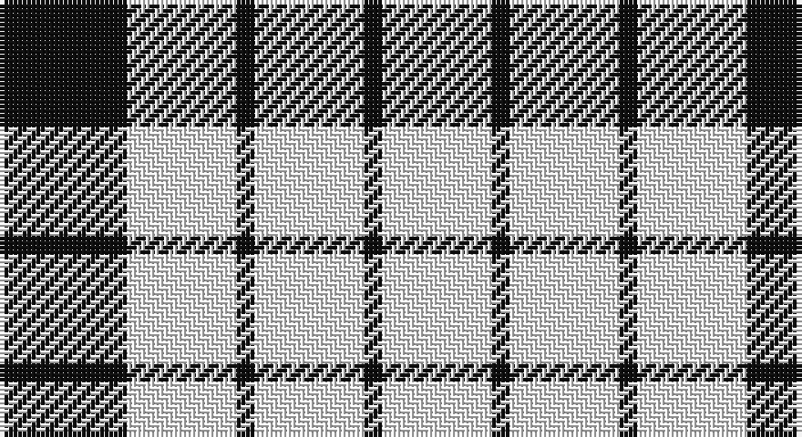

This page is one **sett** — a single exact thread-count. It belongs to the [tartan](/setts/k7w6k1w6/)
(the same proportion at any scale), whose colour order is pattern [KWKWKW](/stripes/kwkwkw/).

Part of the [Wallace Dress](/tartans/wallace-dress/) tartan — the named design grouping this sett with its other cloths.

Sourced from register-of-tartans.  It is a [6 stripe tartan](/stripes/stripes6/).

Original link https://www.tartanregister.gov.uk/tartanDetails.aspx?ref=4485

## Also known as

This cloth is also recorded under:

- Wallace Dress, Red

## Register references

External register numbers recorded for this tartan.

- Scottish Register of Tartans: [4485](https://www.tartanregister.gov.uk/tartanDetails.aspx?ref=4485)
- Scottish Tartans Authority (ITI): 1251
- Scottish Tartans World Register: 1251

## Thread count
K/28 W24 K4 W24 K4 W/24

One full sett is **164 threads**.

## Palette

Palette: <strong>Logan (The Scottish Gael, 1831)</strong>
<table><thead><tr><th>Colour</th><th>Threads</th><th>Shade</th><th>Base</th><th>OKLCh</th></tr></thead><tbody><tr><td>K/</td><td style="text-align:right;font-variant-numeric:tabular-nums">28</td><td><code style="background-color:#101010;">#101010</code> <small style="color:#888">#101010</small></td><td>K <code style="background-color:#000000;">#000000</code></td><td><small style="color:#888">oklch(17.3% 0.000 89.9)</small></td></tr><tr><td>W</td><td style="text-align:right;font-variant-numeric:tabular-nums">24</td><td><code style="background-color:#FCFCFC;">#FCFCFC</code> <small style="color:#888">#FCFCFC</small></td><td>W <code style="background-color:#F7F7F7;">#F7F7F7</code></td><td><small style="color:#888">oklch(99.1% 0.000 89.9)</small></td></tr><tr><td>K</td><td style="text-align:right;font-variant-numeric:tabular-nums">4</td><td><code style="background-color:#101010;">#101010</code> <small style="color:#888">#101010</small></td><td>K <code style="background-color:#000000;">#000000</code></td><td><small style="color:#888">oklch(17.3% 0.000 89.9)</small></td></tr><tr><td>W</td><td style="text-align:right;font-variant-numeric:tabular-nums">24</td><td><code style="background-color:#FCFCFC;">#FCFCFC</code> <small style="color:#888">#FCFCFC</small></td><td>W <code style="background-color:#F7F7F7;">#F7F7F7</code></td><td><small style="color:#888">oklch(99.1% 0.000 89.9)</small></td></tr><tr><td>K</td><td style="text-align:right;font-variant-numeric:tabular-nums">4</td><td><code style="background-color:#101010;">#101010</code> <small style="color:#888">#101010</small></td><td>K <code style="background-color:#000000;">#000000</code></td><td><small style="color:#888">oklch(17.3% 0.000 89.9)</small></td></tr><tr><td>W/</td><td style="text-align:right;font-variant-numeric:tabular-nums">24</td><td><code style="background-color:#FCFCFC;">#FCFCFC</code> <small style="color:#888">#FCFCFC</small></td><td>W <code style="background-color:#F7F7F7;">#F7F7F7</code></td><td><small style="color:#888">oklch(99.1% 0.000 89.9)</small></td></tr></tbody></table>

# Sample pattern

## Nearest tartans

The nearest existing variants by ΔTartan distance, with this tartan at the top so the swatches line up against it.

ΔTartan

Tartan

Sett

—

<a href="/ttd/edit/#slug=k7w6k1w6~x4">Wallace Dress</a> <a class="nn-out" href="/variants/s6/k7w6k1w6~x4/" title="open its dictionary page">↗</a>

1.21

<a href="/ttd/edit/#slug=w14k2w14k19w2~x2&amp;base=k7w6k1w6~x4">MacLeod Black &amp; White</a> <a class="nn-out" href="/variants/s5/w14k2w14k19w2~x2/" title="open its dictionary page">↗</a>

1.21

<a href="/variants/s4/k7w6k1~x4/">Lendrum (B&amp;W)</a>

1.43

<a href="/variants/s4/k7w6k1~x2/">MacFarlane B/W or Lendrum Clan Tartan</a>

1.64

<a href="/ttd/edit/#slug=w2k1w6k6w2k1w1~x2&amp;base=k7w6k1w6~x4">Scott (Abbreviated)</a> <a class="nn-out" href="/variants/s7/w2k1w6k6w2k1w1~x2/" title="open its dictionary page">↗</a>

1.74

<a href="/ttd/edit/#slug=r14w35k4w35r14w8r14w8~x2&amp;base=k7w6k1w6~x4">Clayton Dress (Dance)</a> <a class="nn-out" href="/variants/s8/r14w35k4w35r14w8r14w8~x2/" title="open its dictionary page">↗</a>

1.74

<a href="/ttd/edit/#slug=dt3w16dt4w3dt12w2~x3&amp;base=k7w6k1w6~x4">MacMugen</a> <a class="nn-out" href="/variants/s6/dt3w16dt4w3dt12w2~x3/" title="open its dictionary page">↗</a>

1.82

<a href="/ttd/edit/#slug=w8r14w8r14w35k4~x2&amp;base=k7w6k1w6~x4">Clayton Dress (Dance)</a> <a class="nn-out" href="/variants/s6/w8r14w8r14w35k4~x2/" title="open its dictionary page">↗</a>

1.84

<a href="/variants/s6/w20dt20w3dt3~x2/">Barbie's Moss Plaid (Blue &amp; White)</a>

1.91

<a href="/ttd/edit/#slug=w6k6w2k1w1k1w2k6w6k1w2~x4&amp;base=k7w6k1w6~x4">Scott - 1850 B &amp; W (Clan)</a> <a class="nn-out" href="/variants/s11/w6k6w2k1w1k1w2k6w6k1w2~x4/" title="open its dictionary page">↗</a>

1.94

<a href="/ttd/edit/#slug=w7db16w20db3w3ly3~x2&amp;base=k7w6k1w6~x4">Unidentified (Shirt)</a> <a class="nn-out" href="/variants/s6/w7db16w20db3w3ly3~x2/" title="open its dictionary page">↗</a>

## Neighbour map

Every grey dot is one of 14360 variants placed by the first two principal components of the ΔTartan feature space (44% of its variance). Red is this tartan; blue dots are its nearest — click one to open its page.

<svg viewBox="0 0 640 380" role="img" style="max-width:100%;height:auto;border:1px solid #e0e0e0;border-radius:4px;display:block" xmlns="http://www.w3.org/2000/svg"><image href="/nn/cloud.v1.png" width="640" height="380"/><a href="/variants/s5/w14k2w14k19w2~x2/"><circle cx="311.9" cy="234.8" r="4" fill="#3465a4"><title>MacLeod Black &amp; White</title></circle></a><a href="/variants/s4/k7w6k1~x4/"><circle cx="286.7" cy="278.7" r="4" fill="#3465a4"><title>Lendrum (B&amp;W)</title></circle></a><a href="/variants/s4/k7w6k1~x2/"><circle cx="292.0" cy="283.3" r="4" fill="#3465a4"><title>MacFarlane B/W or Lendrum Clan Tartan</title></circle></a><a href="/variants/s7/w2k1w6k6w2k1w1~x2/"><circle cx="298.8" cy="232.3" r="4" fill="#3465a4"><title>Scott (Abbreviated)</title></circle></a><a href="/variants/s8/r14w35k4w35r14w8r14w8~x2/"><circle cx="315.9" cy="192.8" r="4" fill="#3465a4"><title>Clayton Dress (Dance)</title></circle></a><a href="/variants/s6/dt3w16dt4w3dt12w2~x3/"><circle cx="293.2" cy="227.3" r="4" fill="#3465a4"><title>MacMugen</title></circle></a><a href="/variants/s6/w8r14w8r14w35k4~x2/"><circle cx="301.9" cy="199.1" r="4" fill="#3465a4"><title>Clayton Dress (Dance)</title></circle></a><a href="/variants/s6/w20dt20w3dt3~x2/"><circle cx="324.3" cy="247.0" r="4" fill="#3465a4"><title>Barbie's Moss Plaid (Blue &amp; White)</title></circle></a><a href="/variants/s11/w6k6w2k1w1k1w2k6w6k1w2~x4/"><circle cx="272.1" cy="215.7" r="4" fill="#3465a4"><title>Scott - 1850 B &amp; W (Clan)</title></circle></a><a href="/variants/s6/w7db16w20db3w3ly3~x2/"><circle cx="285.1" cy="219.6" r="4" fill="#3465a4"><title>Unidentified (Shirt)</title></circle></a><circle cx="322.1" cy="249.2" r="5" fill="#c00000"/></svg>

ID: /variants/s6/k7w6k1w6~x4/
