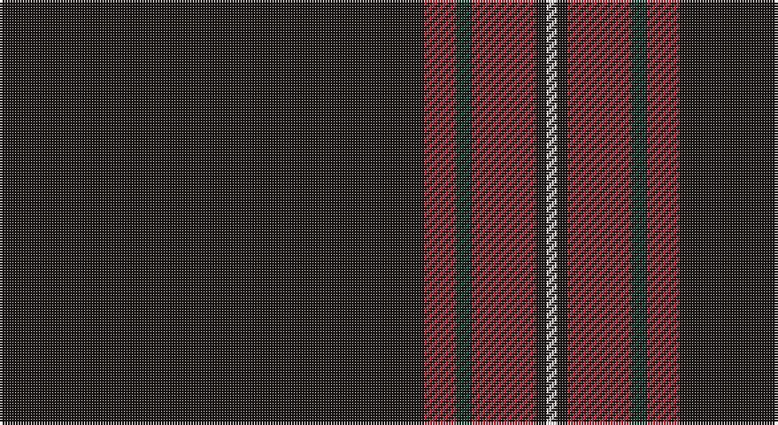

This page is one **sett** — a single exact thread-count. It belongs to the [tartan](/setts/k80r6dg3r12k2w2/)
(the same proportion at any scale), whose colour order is pattern [KRGRKW](/stripes/krgrkw/).

Sourced from register-of-tartans.  It is a [6 stripe tartan](/stripes/stripes6/).

Original link https://www.tartanregister.gov.uk/tartanDetails.aspx?ref=11271

## Register references

External register numbers recorded for this tartan.

- Scottish Register of Tartans: [11271](https://www.tartanregister.gov.uk/tartanDetails.aspx?ref=11271)

## Thread count
K/160 R12 DG6 R24 K4 W/4

One full sett is **256 threads**.

## Palette

Palette: <strong>Tartan Dictionary</strong> <small style="color:#888">(1 of 4 colours)</small>
<table><thead><tr><th>Colour</th><th>Threads</th><th>Shade</th><th>Base</th><th>OKLCh</th></tr></thead><tbody><tr><td>K/</td><td style="text-align:right;font-variant-numeric:tabular-nums">160</td><td><code style="background-color:#1C1714;">#1C1714</code> <small style="color:#888">#1C1714</small></td><td>K <code style="background-color:#000000;">#000000</code></td><td><small style="color:#888">oklch(20.9% 0.010 52.9)</small></td></tr><tr><td>R</td><td style="text-align:right;font-variant-numeric:tabular-nums">12</td><td><code style="background-color:#B62531;">#B62531</code> <small style="color:#888">#B62531</small></td><td>R <code style="background-color:#CC0000;">#CC0000</code></td><td><small style="color:#888">oklch(50.8% 0.180 22.7)</small></td></tr><tr><td>DG</td><td style="text-align:right;font-variant-numeric:tabular-nums">6</td><td><code style="background-color:#06392B;">#06392B</code> <small style="color:#888">#06392B</small></td><td>G <code style="background-color:#006100;">#006100</code></td><td><small style="color:#888">oklch(30.8% 0.057 169.4)</small></td></tr><tr><td>R</td><td style="text-align:right;font-variant-numeric:tabular-nums">24</td><td><code style="background-color:#B62531;">#B62531</code> <small style="color:#888">#B62531</small></td><td>R <code style="background-color:#CC0000;">#CC0000</code></td><td><small style="color:#888">oklch(50.8% 0.180 22.7)</small></td></tr><tr><td>K</td><td style="text-align:right;font-variant-numeric:tabular-nums">4</td><td><code style="background-color:#1C1714;">#1C1714</code> <small style="color:#888">#1C1714</small></td><td>K <code style="background-color:#000000;">#000000</code></td><td><small style="color:#888">oklch(20.9% 0.010 52.9)</small></td></tr><tr><td>W/</td><td style="text-align:right;font-variant-numeric:tabular-nums">4</td><td><code style="background-color:#F9F5EF;">#F9F5EF</code> <small style="color:#888">#F9F5EF</small></td><td>W <code style="background-color:#F7F7F7;">#F7F7F7</code></td><td><small style="color:#888">oklch(97.2% 0.009 78.3)</small></td></tr></tbody></table>

# Sample pattern

## Nearest tartans

The nearest existing variants by ΔTartan distance, with this tartan at the top so the swatches line up against it.

ΔTartan

Tartan

Sett

—

<a href="/ttd/edit/#slug=k80r6dg3r12k2w2~x2">Dellen</a> <a class="nn-out" href="/variants/s6/k80r6dg3r12k2w2~x2/" title="open its dictionary page">↗</a>

0.87

<a href="/ttd/edit/#slug=k80r6g3r12k2w2~x2&amp;base=k80r6dg3r12k2w2~x2">Dellen</a> <a class="nn-out" href="/variants/s6/k80r6g3r12k2w2~x2/" title="open its dictionary page">↗</a>

0.93

<a href="/ttd/edit/#slug=k60r3k15r3lb2r5db3r2~x2&amp;base=k80r6dg3r12k2w2~x2">Whitaker (2014)</a> <a class="nn-out" href="/variants/s8/k60r3k15r3lb2r5db3r2~x2/" title="open its dictionary page">↗</a>

1.08

<a href="/ttd/edit/#slug=k60r3k15r3lb2r5b3r2~x2&amp;base=k80r6dg3r12k2w2~x2">Whitaker (2014)</a> <a class="nn-out" href="/variants/s8/k60r3k15r3lb2r5b3r2~x2/" title="open its dictionary page">↗</a>

1.11

<a href="/ttd/edit/#slug=k83g4r4g10k1w3~x2&amp;base=k80r6dg3r12k2w2~x2">Perratt (Personal)</a> <a class="nn-out" href="/variants/s6/k83g4r4g10k1w3~x2/" title="open its dictionary page">↗</a>

1.35

<a href="/ttd/edit/#slug=k64r1k4r1k6r7w2r7k6t2~x2&amp;base=k80r6dg3r12k2w2~x2">Noordermeer (Personal)</a> <a class="nn-out" href="/variants/s10/k64r1k4r1k6r7w2r7k6t2~x2/" title="open its dictionary page">↗</a>

1.39

<a href="/ttd/edit/#slug=oi4n6k4o8k49oi2&amp;base=k80r6dg3r12k2w2~x2">Harley Davidson (Corporate)</a> <a class="nn-out" href="/variants/s6/oi4n6k4o8k49oi2/" title="open its dictionary page">↗</a>

1.42

<a href="/ttd/edit/#slug=k100r1o10db10ly2~x2&amp;base=k80r6dg3r12k2w2~x2">Forand (Personal)</a> <a class="nn-out" href="/variants/s5/k100r1o10db10ly2~x2/" title="open its dictionary page">↗</a>

1.43

<a href="/ttd/edit/#slug=k10n2k2n8k40r4k5ri2~x2&amp;base=k80r6dg3r12k2w2~x2">Laird Abdullah (Personal)</a> <a class="nn-out" href="/variants/s8/k10n2k2n8k40r4k5ri2~x2/" title="open its dictionary page">↗</a>

1.44

<a href="/ttd/edit/#slug=k59r3k6r3k8r15k2ly3~x2&amp;base=k80r6dg3r12k2w2~x2">Royal Army PTC Assoc. (Military)</a> <a class="nn-out" href="/variants/s8/k59r3k6r3k8r15k2ly3~x2/" title="open its dictionary page">↗</a>

1.50

<a href="/ttd/edit/#slug=dp3n2o2k60n2k3n12k1o3~x2&amp;base=k80r6dg3r12k2w2~x2">Grassi (Personal)</a> <a class="nn-out" href="/variants/s9/dp3n2o2k60n2k3n12k1o3~x2/" title="open its dictionary page">↗</a>

## Neighbour map

Every grey dot is one of 14360 variants placed by the first two principal components of the ΔTartan feature space (44% of its variance). Red is this tartan; blue dots are its nearest — click one to open its page.

<svg viewBox="0 0 640 380" role="img" style="max-width:100%;height:auto;border:1px solid #e0e0e0;border-radius:4px;display:block" xmlns="http://www.w3.org/2000/svg"><image href="/nn/cloud.v1.png" width="640" height="380"/><a href="/variants/s6/k80r6g3r12k2w2~x2/"><circle cx="556.5" cy="131.4" r="4" fill="#3465a4"><title>Dellen</title></circle></a><a href="/variants/s8/k60r3k15r3lb2r5db3r2~x2/"><circle cx="578.9" cy="140.1" r="4" fill="#3465a4"><title>Whitaker (2014)</title></circle></a><a href="/variants/s8/k60r3k15r3lb2r5b3r2~x2/"><circle cx="567.0" cy="133.7" r="4" fill="#3465a4"><title>Whitaker (2014)</title></circle></a><a href="/variants/s6/k83g4r4g10k1w3~x2/"><circle cx="588.2" cy="131.7" r="4" fill="#3465a4"><title>Perratt (Personal)</title></circle></a><a href="/variants/s10/k64r1k4r1k6r7w2r7k6t2~x2/"><circle cx="585.7" cy="98.4" r="4" fill="#3465a4"><title>Noordermeer (Personal)</title></circle></a><a href="/variants/s6/oi4n6k4o8k49oi2/"><circle cx="488.8" cy="164.8" r="4" fill="#3465a4"><title>Harley Davidson (Corporate)</title></circle></a><a href="/variants/s5/k100r1o10db10ly2~x2/"><circle cx="597.7" cy="139.3" r="4" fill="#3465a4"><title>Forand (Personal)</title></circle></a><a href="/variants/s8/k10n2k2n8k40r4k5ri2~x2/"><circle cx="537.7" cy="174.3" r="4" fill="#3465a4"><title>Laird Abdullah (Personal)</title></circle></a><a href="/variants/s8/k59r3k6r3k8r15k2ly3~x2/"><circle cx="538.9" cy="149.5" r="4" fill="#3465a4"><title>Royal Army PTC Assoc. (Military)</title></circle></a><a href="/variants/s9/dp3n2o2k60n2k3n12k1o3~x2/"><circle cx="551.7" cy="115.5" r="4" fill="#3465a4"><title>Grassi (Personal)</title></circle></a><circle cx="581.8" cy="141.7" r="5" fill="#c00000"/></svg>

ID: /variants/s6/k80r6dg3r12k2w2~x2/
