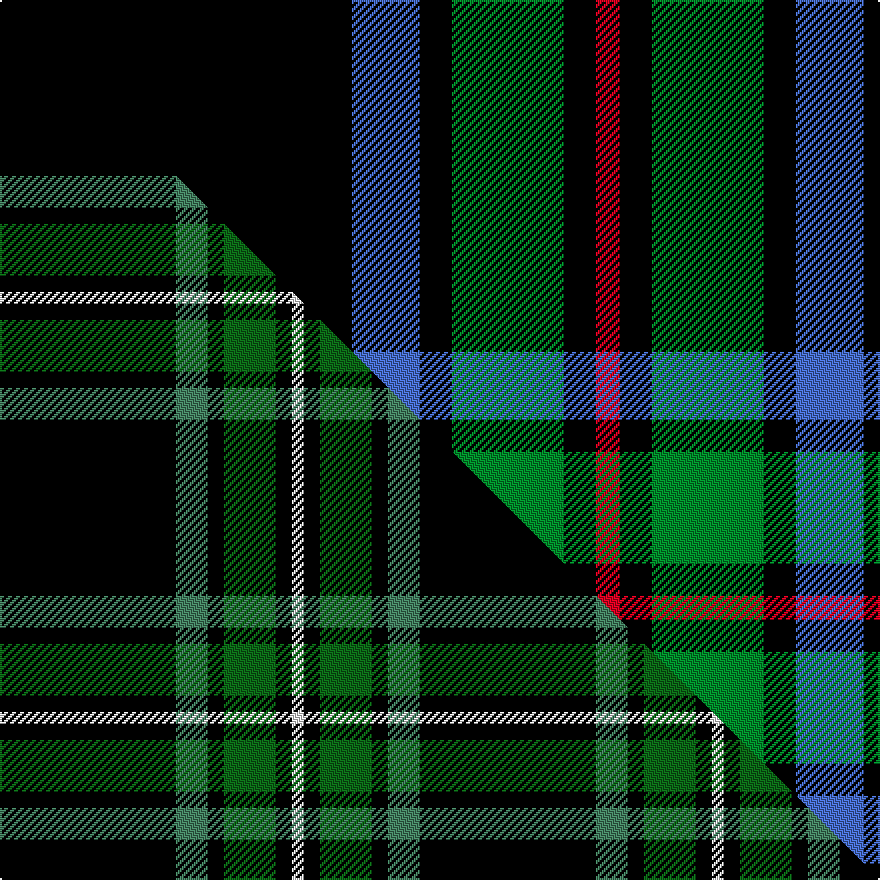

This is one **variant** — a specific cloth: this exact thread count and colourway, with its own
provenance below. It is one weaving of the [sett](/tartans/c/ch/childers-3/) (the scale-free proportion — the
same cloth at any scale or shade), whose colour order is pattern [KBKGKR](/stripes/kbkgkr/).

Part of the [Childers](/tartans/c/ch/childers-3/) tartan — the named design grouping this sett with its other cloths.

Sourced from weddslist.  It is a [6 stripe tartan](/stripes/stripes6/).

Original link [http://www.weddslist.com/cgi-bin/tartans/pg.pl?source=sts](http://www.weddslist.com/cgi-bin/tartans/pg.pl?source=sts)

Dataset <small>— provenance for this record, inherited from the source manifest</small>

<dl class="dataset-prov">
<dt>source</dt><dd><a href="/sources/weddslist/">Weddslist</a></dd>
<dt>data captured from</dt><dd><a href="https://github.com/thetartan/tartan-database/blob/master/data/weddslist/data.csv">https://github.com/thetartan/tartan-database/blob/master/data/weddslist/data.csv</a></dd>
<dt>data date</dt><dd>2016-11-17 <small>(dataset default)</small></dd>
<dt>licence</dt><dd><a href="https://creativecommons.org/licenses/by-nc-nd/4.0/">CC BY-NC-ND 4.0</a></dd>
</dl>

Capture chain <small>— the hands this data passed through, oldest first; each capture carries its own licence</small>

<ol class="capture-chain">
<li><a href="https://www.weddslist.com/tartans/">Weddslist</a> <small>the living privately compiled reference</small></li>
<li><a href="https://github.com/thetartan/tartan-database">thetartan/tartan-database</a> <small>2016-2017</small> · <a href="https://creativecommons.org/licenses/by-nc-nd/4.0/">CC BY-NC-ND 4.0</a> <small>Levko Kravets's frozen compilation — the capture we vendored, and where its CC licence text came from</small></li>
<li>this dictionary <small>captured 2026-06-10 · commit 5bf86c7566</small> <small>each re-capture is a git commit to data/sources</small></li>
</ol>

## Thread count
K/176 B34 K16 G56 K16 R/12

One full sett is **432 threads**.

## Palette
<table><thead><tr><th>Colour</th><th>Shade</th><th>OKLCh</th></tr></thead><tbody><tr><td>B</td><td><code style="background-color:#466CC8;">#466CC8</code> <small style="color:#888">#466CC8</small></td><td><small style="color:#888">oklch(55.1% 0.149 265.0)</small></td></tr><tr><td>G</td><td><code style="background-color:#008B2A;">#008B2A</code> <small style="color:#888">#008B2A</small></td><td><small style="color:#888">oklch(55.4% 0.170 145.9)</small></td></tr><tr><td>K</td><td><code style="background-color:#000000;">#000000</code> <small style="color:#888">#000000</small></td><td><small style="color:#888">oklch(0.0% 0.000 0.0)</small></td></tr><tr><td>R</td><td><code style="background-color:#D60020;">#D60020</code> <small style="color:#888">#D60020</small></td><td><small style="color:#888">oklch(55.2% 0.224 25.5)</small></td></tr></tbody></table>

# Sample pattern

## Compared to the master

This cloth is one sett of its design; the master sett (the exemplar the design is anchored on) is below for comparison.

Its **ΔTartan distance** from the master is **0.68** — the same measure the nearest-tartans table ranks by (0 is identical; a re-scale of the same cloth is near 0, a recolour or a different proportion further).

<figure class="master-compare" style="margin:0">

this sett
master sett ★

<figcaption style="color:#888;font-size:smaller">One weave of this sett against the <a href="/setts/k44g8k4dg13k4w3/">master sett ★</a>, split on the diagonal: a shared proportion runs seamlessly across it with only the shades shifting; a different proportion breaks on it.</figcaption>
</figure>

## Nearest tartan variants

The nearest existing variants by ΔTartan distance, with this cloth at the top so the swatches line up against it.

ΔTartan

Threads

Variant

Sett

—

432

<a href="/variants/s6/k88b17k8g28k8r6~x2/">Childers</a>

<a href="/ttd/edit/#slug=k88g17k8dg28k8r6~x2~g2408144-dg1806142&amp;base=k88b17k8g28k8r6~x2" title="compare in the TTD">0.33</a>

432

<a href="/variants/s6/k88g17k8dg28k8r6~x2~g2408144-dg1806142/">Childers Regimental Tartan</a>

<a href="/ttd/edit/#slug=k44g8k4dg13k4w3~x2~g2203152-dg1806142&amp;base=k88b17k8g28k8r6~x2" title="compare in the TTD">0.68</a>

210

<a href="/variants/s6/k44g8k4dg13k4w3~x2~g2203152-dg1806142/">Childers (Personal)</a>

<a href="/ttd/edit/#slug=k2db11k26g11k2~x2&amp;base=k88b17k8g28k8r6~x2" title="compare in the TTD">1.04</a>

200

<a href="/variants/s5/k2db11k26g11k2~x2/">Campbell of Loch Awe</a>

<a href="/ttd/edit/#slug=k2g11k26t11k2~x2&amp;base=k88b17k8g28k8r6~x2" title="compare in the TTD">1.04</a>

200

<a href="/variants/s5/k2g11k26t11k2~x2/">Campbell of Loch Awe (Clan)</a>

<a href="/ttd/edit/#slug=k20lb2k6g16dp4k9~x2&amp;base=k88b17k8g28k8r6~x2" title="compare in the TTD">1.33</a>

170

<a href="/variants/s6/k20lb2k6g16dp4k9~x2/">Wilson's, No 167</a>

<a href="/ttd/edit/#slug=k10g4k1lb2r1~x10&amp;base=k88b17k8g28k8r6~x2" title="compare in the TTD">1.63</a>

250

<a href="/variants/s5/k10g4k1lb2r1~x10/">Brotherhood of the Kilt</a>

<a href="/ttd/edit/#slug=k17dr6k2lb6k17ly2~x2&amp;base=k88b17k8g28k8r6~x2" title="compare in the TTD">1.79</a>

162

<a href="/variants/s6/k17dr6k2lb6k17ly2~x2/">Black (symmetrical)</a>

<a href="/ttd/edit/#slug=k17dr6k2lb6k17lo2~x2&amp;base=k88b17k8g28k8r6~x2" title="compare in the TTD">1.79</a>

162

<a href="/variants/s6/k17dr6k2lb6k17lo2~x2/">Black Clan/Family Tartan</a>

<a href="/ttd/edit/#slug=k36w3k10w3dg28dr6k18~x2&amp;base=k88b17k8g28k8r6~x2" title="compare in the TTD">1.89</a>

308

<a href="/variants/s7/k36w3k10w3dg28dr6k18~x2/">Wild Highlanders (Corporate)</a>

<a href="/ttd/edit/#slug=k88dg17k8g28k8r6~dg1405139-g1903114&amp;base=k88b17k8g28k8r6~x2" title="compare in the TTD">1.92</a>

216

<a href="/variants/s6/k88dg17k8g28k8r6~dg1405139-g1903114/">Childers (Gurkha Rifles) (Military)</a>

## Neighbour map

Every grey dot is one of 13657 variants placed by the first two principal components of the ΔTartan feature space (42% of its variance). Red is this tartan; blue dots are its nearest — click one to open its page. The map is a flat projection of a many-dimensional space — [how to read it](/posts/neighbourhood-maps/).

<svg viewBox="0 0 640 380" role="img" style="max-width:100%;height:auto;border:1px solid #e0e0e0;border-radius:4px;display:block" xmlns="http://www.w3.org/2000/svg"><image href="/nn/cloud.v1.png" width="640" height="380"/><a href="/variants/s6/k88g17k8dg28k8r6~x2~g2408144-dg1806142/"><circle cx="342.4" cy="148.8" r="4" fill="#3465a4"><title>Childers Regimental Tartan</title></circle></a><a href="/variants/s6/k44g8k4dg13k4w3~x2~g2203152-dg1806142/"><circle cx="350.5" cy="147.6" r="4" fill="#3465a4"><title>Childers (Personal)</title></circle></a><a href="/variants/s5/k2db11k26g11k2~x2/"><circle cx="293.9" cy="197.3" r="4" fill="#3465a4"><title>Campbell of Loch Awe</title></circle></a><a href="/variants/s5/k2g11k26t11k2~x2/"><circle cx="277.3" cy="194.3" r="4" fill="#3465a4"><title>Campbell of Loch Awe (Clan)</title></circle></a><a href="/variants/s6/k20lb2k6g16dp4k9~x2/"><circle cx="264.4" cy="196.7" r="4" fill="#3465a4"><title>Wilson's, No 167</title></circle></a><a href="/variants/s5/k10g4k1lb2r1~x10/"><circle cx="273.9" cy="180.0" r="4" fill="#3465a4"><title>Brotherhood of the Kilt</title></circle></a><a href="/variants/s6/k17dr6k2lb6k17ly2~x2/"><circle cx="336.6" cy="192.9" r="4" fill="#3465a4"><title>Black (symmetrical)</title></circle></a><a href="/variants/s6/k17dr6k2lb6k17lo2~x2/"><circle cx="337.4" cy="192.7" r="4" fill="#3465a4"><title>Black Clan/Family Tartan</title></circle></a><a href="/variants/s7/k36w3k10w3dg28dr6k18~x2/"><circle cx="292.4" cy="175.0" r="4" fill="#3465a4"><title>Wild Highlanders (Corporate)</title></circle></a><a href="/variants/s6/k88dg17k8g28k8r6~dg1405139-g1903114/"><circle cx="360.8" cy="152.0" r="4" fill="#3465a4"><title>Childers (Gurkha Rifles) (Military)</title></circle></a><circle cx="337.8" cy="146.3" r="5" fill="#c00000"/><text x="320" y="376" text-anchor="middle" font-size="11" fill="#999">ground</text><text x="11" y="190" text-anchor="middle" font-size="11" fill="#999" transform="rotate(-90 11 190)">complexity</text></svg>

ID: /variants/s6/k88b17k8g28k8r6~x2/
