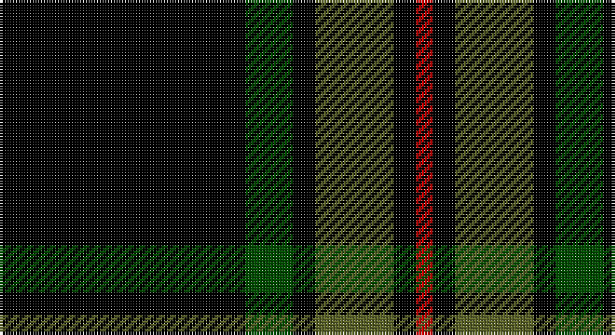

This page is one **sett** — a single exact thread-count. It belongs to the [tartan](/setts/k88dg17k8y28k8r6/)
(the same proportion at any scale), whose colour order is pattern [KGKGKR](/stripes/kgkgkr/).

Part of the [Childers](/tartans/childers/) tartan — the named design grouping this sett with its other cloths.

Sourced from tartans-authority.  It is a [6 stripe tartan](/stripes/stripes6/).

Original link http://www.tartansauthority.com/tartan-ferret/display/1090/

## Register references

External register numbers recorded for this tartan.

- Scottish Tartans Authority (ITI): 1090

## Thread count
K/88 Ga17 K8 G28 K8 R/6

One full sett is **216 threads**.

## Palette

Palette: <strong>Tartan Register</strong>
<table><thead><tr><th>Colour</th><th>Threads</th><th>Shade</th><th>Base</th><th>OKLCh</th></tr></thead><tbody><tr><td>K/</td><td style="text-align:right;font-variant-numeric:tabular-nums">88</td><td><code style="background-color:#000000;">#000000</code> <small style="color:#888">#000000</small></td><td>K <code style="background-color:#000000;">#000000</code></td><td><small style="color:#888">oklch(0.0% 0.000 0.0)</small></td></tr><tr><td>Ga</td><td style="text-align:right;font-variant-numeric:tabular-nums">17</td><td><code style="background-color:#004C00;">#004C00</code> <small style="color:#888">#004C00</small></td><td>G <code style="background-color:#006100;">#006100</code></td><td><small style="color:#888">oklch(36.1% 0.123 142.5)</small></td></tr><tr><td>K</td><td style="text-align:right;font-variant-numeric:tabular-nums">8</td><td><code style="background-color:#000000;">#000000</code> <small style="color:#888">#000000</small></td><td>K <code style="background-color:#000000;">#000000</code></td><td><small style="color:#888">oklch(0.0% 0.000 0.0)</small></td></tr><tr><td>G</td><td style="text-align:right;font-variant-numeric:tabular-nums">28</td><td><code style="background-color:#5C6428;">#5C6428</code> <small style="color:#888">#5C6428</small></td><td>G <code style="background-color:#006100;">#006100</code></td><td><small style="color:#888">oklch(48.3% 0.084 116.0)</small></td></tr><tr><td>K</td><td style="text-align:right;font-variant-numeric:tabular-nums">8</td><td><code style="background-color:#000000;">#000000</code> <small style="color:#888">#000000</small></td><td>K <code style="background-color:#000000;">#000000</code></td><td><small style="color:#888">oklch(0.0% 0.000 0.0)</small></td></tr><tr><td>R/</td><td style="text-align:right;font-variant-numeric:tabular-nums">6</td><td><code style="background-color:#C80000;">#C80000</code> <small style="color:#888">#C80000</small></td><td>R <code style="background-color:#CC0000;">#CC0000</code></td><td><small style="color:#888">oklch(52.3% 0.215 29.2)</small></td></tr></tbody></table>

# Sample pattern

## Compared to the master

This cloth is one sett of its design; the master sett (the exemplar the design is anchored on) is below for comparison.

<figure style="margin:0"><figcaption style="color:#888;font-size:smaller">this sett</figcaption></figure>
<figure style="margin:0"><figcaption style="color:#888;font-size:smaller"><a href="/setts/k4gi13k4g8k44g8k4gi13k4w3/">master sett →</a></figcaption></figure>

## Nearest tartans

The nearest existing variants by ΔTartan distance, with this tartan at the top so the swatches line up against it.

ΔTartan

Tartan

Sett

—

<a href="/ttd/edit/#slug=k88dg17k8y28k8r6">Childers (Gurkha Rifles) (Military)</a> <a class="nn-out" href="/variants/s6/k88dg17k8y28k8r6/" title="open its dictionary page">↗</a>

0.89

<a href="/ttd/edit/#slug=k88gi17k8g28k8r6~x2&amp;base=k88dg17k8y28k8r6">Childers</a> <a class="nn-out" href="/variants/s6/k88gi17k8g28k8r6~x2/" title="open its dictionary page">↗</a>

1.36

<a href="/ttd/edit/#slug=k44g8k4gi13k4w3~x2&amp;base=k88dg17k8y28k8r6">Childers (Personal)</a> <a class="nn-out" href="/variants/s6/k44g8k4gi13k4w3~x2/" title="open its dictionary page">↗</a>

1.41

<a href="/ttd/edit/#slug=k88g17k8gi28k8r6~x2&amp;base=k88dg17k8y28k8r6">Childers Regimental Tartan</a> <a class="nn-out" href="/variants/s6/k88g17k8gi28k8r6~x2/" title="open its dictionary page">↗</a>

1.47

<a href="/ttd/edit/#slug=r1dg16k8dg3k4ly1~x2&amp;base=k88dg17k8y28k8r6">Forbes VS</a> <a class="nn-out" href="/variants/s6/r1dg16k8dg3k4ly1~x2/" title="open its dictionary page">↗</a>

1.56

<a href="/ttd/edit/#slug=k62dt24lo5w3~x2&amp;base=k88dg17k8y28k8r6">Perry (Calgary), Alex (Personal)</a> <a class="nn-out" href="/variants/s4/k62dt24lo5w3~x2/" title="open its dictionary page">↗</a>

1.61

<a href="/ttd/edit/#slug=k39y3k3y3k14y28r3~x2&amp;base=k88dg17k8y28k8r6">Moffat</a> <a class="nn-out" href="/variants/s7/k39y3k3y3k14y28r3~x2/" title="open its dictionary page">↗</a>

1.62

<a href="/ttd/edit/#slug=r1dg16k8dg3k4ly1&amp;base=k88dg17k8y28k8r6">Forbes VS</a> <a class="nn-out" href="/variants/s6/r1dg16k8dg3k4ly1/" title="open its dictionary page">↗</a>

1.66

<a href="/ttd/edit/#slug=k65g27w2k4ly5~x2&amp;base=k88dg17k8y28k8r6">Perry, hunting (Green)</a> <a class="nn-out" href="/variants/s5/k65g27w2k4ly5~x2/" title="open its dictionary page">↗</a>

1.68

<a href="/variants/s10/k22g11ki2g4ki2g6ki16k40k2lb6~x2/">Stewart of Bute Hunting Clan/Family Tartan</a>

1.71

<a href="/ttd/edit/#slug=k8y28k8dg17k88dg17k8y28k8r6&amp;base=k88dg17k8y28k8r6">Childers (Gurkha Rifles)</a> <a class="nn-out" href="/variants/s10/k8y28k8dg17k88dg17k8y28k8r6/" title="open its dictionary page">↗</a>

## Neighbour map

Every grey dot is one of 14360 variants placed by the first two principal components of the ΔTartan feature space (44% of its variance). Red is this tartan; blue dots are its nearest — click one to open its page.

<svg viewBox="0 0 640 380" role="img" style="max-width:100%;height:auto;border:1px solid #e0e0e0;border-radius:4px;display:block" xmlns="http://www.w3.org/2000/svg"><image href="/nn/cloud.v1.png" width="640" height="380"/><a href="/variants/s6/k88gi17k8g28k8r6~x2/"><circle cx="375.8" cy="186.7" r="4" fill="#3465a4"><title>Childers</title></circle></a><a href="/variants/s6/k44g8k4gi13k4w3~x2/"><circle cx="412.8" cy="193.5" r="4" fill="#3465a4"><title>Childers (Personal)</title></circle></a><a href="/variants/s6/k88g17k8gi28k8r6~x2/"><circle cx="408.9" cy="197.5" r="4" fill="#3465a4"><title>Childers Regimental Tartan</title></circle></a><a href="/variants/s6/r1dg16k8dg3k4ly1~x2/"><circle cx="352.9" cy="205.1" r="4" fill="#3465a4"><title>Forbes VS</title></circle></a><a href="/variants/s4/k62dt24lo5w3~x2/"><circle cx="420.9" cy="204.1" r="4" fill="#3465a4"><title>Perry (Calgary), Alex (Personal)</title></circle></a><a href="/variants/s7/k39y3k3y3k14y28r3~x2/"><circle cx="356.9" cy="196.9" r="4" fill="#3465a4"><title>Moffat</title></circle></a><a href="/variants/s6/r1dg16k8dg3k4ly1/"><circle cx="340.1" cy="199.1" r="4" fill="#3465a4"><title>Forbes VS</title></circle></a><a href="/variants/s5/k65g27w2k4ly5~x2/"><circle cx="415.1" cy="161.6" r="4" fill="#3465a4"><title>Perry, hunting (Green)</title></circle></a><a href="/variants/s10/k22g11ki2g4ki2g6ki16k40k2lb6~x2/"><circle cx="323.4" cy="164.3" r="4" fill="#3465a4"><title>Stewart of Bute Hunting Clan/Family Tartan</title></circle></a><a href="/variants/s10/k8y28k8dg17k88dg17k8y28k8r6/"><circle cx="307.5" cy="168.4" r="4" fill="#3465a4"><title>Childers (Gurkha Rifles)</title></circle></a><circle cx="397.8" cy="194.5" r="5" fill="#c00000"/></svg>

ID: /variants/s6/k88dg17k8y28k8r6/
