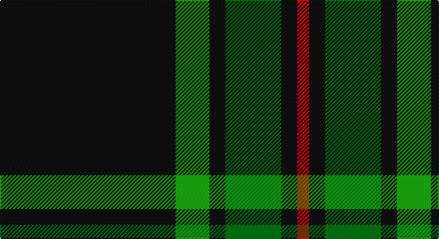

This page is one **sett** — a single exact thread-count. It belongs to the [tartan](/setts/k88g17k8gi28k8r6/)
(the same proportion at any scale), whose colour order is pattern [KGKGKR](/stripes/kgkgkr/).

Sourced from house-of-tartan.  It is a [6 stripe tartan](/stripes/stripes6/).

Original link http://www.house-of-tartan.scotland.net/house/TartanViewjs.asp?colr=Def&tnam=1090

## Provenance

Earliest known date: 1907 1s Battalion, 1st Gurkha Rifles is recorded as using this tartan for plaids, ribbons and bag-covers.

## Thread count
K/176 Ga34 K16 G56 K16 R/12

One full sett is **432 threads**.

## Palette

Palette: <strong>Tartan Register</strong>
<table><thead><tr><th>Colour</th><th>Threads</th><th>Shade</th><th>Base</th><th>OKLCh</th></tr></thead><tbody><tr><td>K/</td><td style="text-align:right;font-variant-numeric:tabular-nums">176</td><td><code style="background-color:#101010;">#101010</code> <small style="color:#888">#101010</small></td><td>K <code style="background-color:#000000;">#000000</code></td><td><small style="color:#888">oklch(17.3% 0.000 89.9)</small></td></tr><tr><td>Ga</td><td style="text-align:right;font-variant-numeric:tabular-nums">34</td><td><code style="background-color:#289C18;">#289C18</code> <small style="color:#888">#289C18</small></td><td>G <code style="background-color:#006100;">#006100</code></td><td><small style="color:#888">oklch(60.6% 0.191 141.6)</small></td></tr><tr><td>K</td><td style="text-align:right;font-variant-numeric:tabular-nums">16</td><td><code style="background-color:#101010;">#101010</code> <small style="color:#888">#101010</small></td><td>K <code style="background-color:#000000;">#000000</code></td><td><small style="color:#888">oklch(17.3% 0.000 89.9)</small></td></tr><tr><td>G</td><td style="text-align:right;font-variant-numeric:tabular-nums">56</td><td><code style="background-color:#006818;">#006818</code> <small style="color:#888">#006818</small></td><td>G <code style="background-color:#006100;">#006100</code></td><td><small style="color:#888">oklch(45.0% 0.142 145.0)</small></td></tr><tr><td>K</td><td style="text-align:right;font-variant-numeric:tabular-nums">16</td><td><code style="background-color:#101010;">#101010</code> <small style="color:#888">#101010</small></td><td>K <code style="background-color:#000000;">#000000</code></td><td><small style="color:#888">oklch(17.3% 0.000 89.9)</small></td></tr><tr><td>R/</td><td style="text-align:right;font-variant-numeric:tabular-nums">12</td><td><code style="background-color:#C80000;">#C80000</code> <small style="color:#888">#C80000</small></td><td>R <code style="background-color:#CC0000;">#CC0000</code></td><td><small style="color:#888">oklch(52.3% 0.215 29.2)</small></td></tr></tbody></table>

# Sample pattern

## Nearest tartans

The nearest existing variants by ΔTartan distance, with this tartan at the top so the swatches line up against it.

ΔTartan

Tartan

Sett

—

<a href="/ttd/edit/#slug=k88g17k8gi28k8r6~x2">Childers Regimental Tartan</a> <a class="nn-out" href="/variants/s6/k88g17k8gi28k8r6~x2/" title="open its dictionary page">↗</a>

0.42

<a href="/ttd/edit/#slug=k44g8k4gi13k4w3~x2&amp;base=k88g17k8gi28k8r6~x2">Childers (Personal)</a> <a class="nn-out" href="/variants/s6/k44g8k4gi13k4w3~x2/" title="open its dictionary page">↗</a>

1.10

<a href="/ttd/edit/#slug=r1dg16k8dg3k4ly1~x2&amp;base=k88g17k8gi28k8r6~x2">Forbes VS</a> <a class="nn-out" href="/variants/s6/r1dg16k8dg3k4ly1~x2/" title="open its dictionary page">↗</a>

1.31

<a href="/ttd/edit/#slug=r1dg16k8dg3k4ly1&amp;base=k88g17k8gi28k8r6~x2">Forbes VS</a> <a class="nn-out" href="/variants/s6/r1dg16k8dg3k4ly1/" title="open its dictionary page">↗</a>

1.32

<a href="/ttd/edit/#slug=k62dt24lo5w3~x2&amp;base=k88g17k8gi28k8r6~x2">Perry (Calgary), Alex (Personal)</a> <a class="nn-out" href="/variants/s4/k62dt24lo5w3~x2/" title="open its dictionary page">↗</a>

1.35

<a href="/ttd/edit/#slug=dg18r6dg75b6dg13lo35dg12b6&amp;base=k88g17k8gi28k8r6~x2">Glenlivet Check (Corporate)</a> <a class="nn-out" href="/variants/s8/dg18r6dg75b6dg13lo35dg12b6/" title="open its dictionary page">↗</a>

1.37

<a href="/ttd/edit/#slug=k61gi10g20w4~x2&amp;base=k88g17k8gi28k8r6~x2">Wesley Owen 2010 (Personal)</a> <a class="nn-out" href="/variants/s4/k61gi10g20w4~x2/" title="open its dictionary page">↗</a>

1.38

<a href="/ttd/edit/#slug=k36w3k10w3g28r6k18~x2&amp;base=k88g17k8gi28k8r6~x2">Wild Highlanders (Corporate)</a> <a class="nn-out" href="/variants/s7/k36w3k10w3g28r6k18~x2/" title="open its dictionary page">↗</a>

1.39

<a href="/ttd/edit/#slug=dg24o2dg3k6o1ly2o1k4~x4&amp;base=k88g17k8gi28k8r6~x2">Green Ridge</a> <a class="nn-out" href="/variants/s8/dg24o2dg3k6o1ly2o1k4~x4/" title="open its dictionary page">↗</a>

1.41

<a href="/ttd/edit/#slug=k10y4k1t2r1~x10&amp;base=k88g17k8gi28k8r6~x2">Brotherhood of the Kilt</a> <a class="nn-out" href="/variants/s5/k10y4k1t2r1~x10/" title="open its dictionary page">↗</a>

1.41

<a href="/ttd/edit/#slug=k88dg17k8y28k8r6&amp;base=k88g17k8gi28k8r6~x2">Childers (Gurkha Rifles) (Military)</a> <a class="nn-out" href="/variants/s6/k88dg17k8y28k8r6/" title="open its dictionary page">↗</a>

## Neighbour map

Every grey dot is one of 14360 variants placed by the first two principal components of the ΔTartan feature space (44% of its variance). Red is this tartan; blue dots are its nearest — click one to open its page.

<svg viewBox="0 0 640 380" role="img" style="max-width:100%;height:auto;border:1px solid #e0e0e0;border-radius:4px;display:block" xmlns="http://www.w3.org/2000/svg"><image href="/nn/cloud.v1.png" width="640" height="380"/><a href="/variants/s6/k44g8k4gi13k4w3~x2/"><circle cx="412.8" cy="193.5" r="4" fill="#3465a4"><title>Childers (Personal)</title></circle></a><a href="/variants/s6/r1dg16k8dg3k4ly1~x2/"><circle cx="352.9" cy="205.1" r="4" fill="#3465a4"><title>Forbes VS</title></circle></a><a href="/variants/s6/r1dg16k8dg3k4ly1/"><circle cx="340.1" cy="199.1" r="4" fill="#3465a4"><title>Forbes VS</title></circle></a><a href="/variants/s4/k62dt24lo5w3~x2/"><circle cx="420.9" cy="204.1" r="4" fill="#3465a4"><title>Perry (Calgary), Alex (Personal)</title></circle></a><a href="/variants/s8/dg18r6dg75b6dg13lo35dg12b6/"><circle cx="423.6" cy="201.9" r="4" fill="#3465a4"><title>Glenlivet Check (Corporate)</title></circle></a><a href="/variants/s4/k61gi10g20w4~x2/"><circle cx="360.4" cy="212.1" r="4" fill="#3465a4"><title>Wesley Owen 2010 (Personal)</title></circle></a><a href="/variants/s7/k36w3k10w3g28r6k18~x2/"><circle cx="328.7" cy="209.9" r="4" fill="#3465a4"><title>Wild Highlanders (Corporate)</title></circle></a><a href="/variants/s8/dg24o2dg3k6o1ly2o1k4~x4/"><circle cx="423.9" cy="165.4" r="4" fill="#3465a4"><title>Green Ridge</title></circle></a><a href="/variants/s5/k10y4k1t2r1~x10/"><circle cx="356.6" cy="228.2" r="4" fill="#3465a4"><title>Brotherhood of the Kilt</title></circle></a><a href="/variants/s6/k88dg17k8y28k8r6/"><circle cx="397.8" cy="194.5" r="4" fill="#3465a4"><title>Childers (Gurkha Rifles) (Military)</title></circle></a><circle cx="408.9" cy="197.5" r="5" fill="#c00000"/></svg>

ID: /variants/s6/k88g17k8gi28k8r6~x2/
