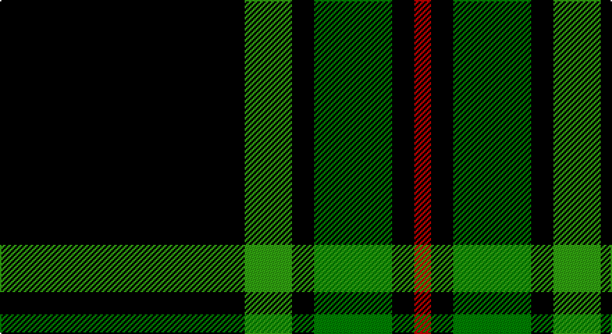

This page is one **sett** — a single exact thread-count. It belongs to the [tartan](/setts/k88gi17k8g28k8r6/)
(the same proportion at any scale), whose colour order is pattern [KGKGKR](/stripes/kgkgkr/).

Sourced from weddslist.  It is a [6 stripe tartan](/stripes/stripes6/).

Original link http://www.weddslist.com/cgi-bin/tartans/pg.pl?source=sts

## Thread count
K/176 G34 K16 Ga56 K16 R/12

One full sett is **432 threads**.

## Palette

Palette: <strong>Ingles Buchan</strong> <small style="color:#888">(1 of 4 colours)</small>
<table><thead><tr><th>Colour</th><th>Threads</th><th>Shade</th><th>Base</th><th>OKLCh</th></tr></thead><tbody><tr><td>K/</td><td style="text-align:right;font-variant-numeric:tabular-nums">176</td><td><code style="background-color:#000000;">#000000</code> <small style="color:#888">#000000</small></td><td>K <code style="background-color:#000000;">#000000</code></td><td><small style="color:#888">oklch(0.0% 0.000 0.0)</small></td></tr><tr><td>G</td><td style="text-align:right;font-variant-numeric:tabular-nums">34</td><td><code style="background-color:#30A010;">#30A010</code> <small style="color:#888">#30A010</small></td><td>G <code style="background-color:#006100;">#006100</code></td><td><small style="color:#888">oklch(61.9% 0.195 140.5)</small></td></tr><tr><td>K</td><td style="text-align:right;font-variant-numeric:tabular-nums">16</td><td><code style="background-color:#000000;">#000000</code> <small style="color:#888">#000000</small></td><td>K <code style="background-color:#000000;">#000000</code></td><td><small style="color:#888">oklch(0.0% 0.000 0.0)</small></td></tr><tr><td>Ga</td><td style="text-align:right;font-variant-numeric:tabular-nums">56</td><td><code style="background-color:#008000;">#008000</code> <small style="color:#888">#008000</small></td><td>G <code style="background-color:#006100;">#006100</code></td><td><small style="color:#888">oklch(52.0% 0.177 142.5)</small></td></tr><tr><td>K</td><td style="text-align:right;font-variant-numeric:tabular-nums">16</td><td><code style="background-color:#000000;">#000000</code> <small style="color:#888">#000000</small></td><td>K <code style="background-color:#000000;">#000000</code></td><td><small style="color:#888">oklch(0.0% 0.000 0.0)</small></td></tr><tr><td>R/</td><td style="text-align:right;font-variant-numeric:tabular-nums">12</td><td><code style="background-color:#C00000;">#C00000</code> <small style="color:#888">#C00000</small></td><td>R <code style="background-color:#CC0000;">#CC0000</code></td><td><small style="color:#888">oklch(50.7% 0.208 29.2)</small></td></tr></tbody></table>

# Sample pattern

## Nearest tartans

The nearest existing variants by ΔTartan distance, with this tartan at the top so the swatches line up against it.

ΔTartan

Tartan

Sett

—

<a href="/ttd/edit/#slug=k88gi17k8g28k8r6~x2">Childers</a> <a class="nn-out" href="/variants/s6/k88gi17k8g28k8r6~x2/" title="open its dictionary page">↗</a>

0.89

<a href="/ttd/edit/#slug=k88dg17k8y28k8r6&amp;base=k88gi17k8g28k8r6~x2">Childers (Gurkha Rifles) (Military)</a> <a class="nn-out" href="/variants/s6/k88dg17k8y28k8r6/" title="open its dictionary page">↗</a>

1.29

<a href="/ttd/edit/#slug=k65g27w2k4ly5~x2&amp;base=k88gi17k8g28k8r6~x2">Perry, hunting (Green)</a> <a class="nn-out" href="/variants/s5/k65g27w2k4ly5~x2/" title="open its dictionary page">↗</a>

1.33

<a href="/ttd/edit/#slug=r1dg16k8dg3k4ly1&amp;base=k88gi17k8g28k8r6~x2">Forbes VS</a> <a class="nn-out" href="/variants/s6/r1dg16k8dg3k4ly1/" title="open its dictionary page">↗</a>

1.45

<a href="/ttd/edit/#slug=r1dg16k8dg3k4ly1~x2&amp;base=k88gi17k8g28k8r6~x2">Forbes VS</a> <a class="nn-out" href="/variants/s6/r1dg16k8dg3k4ly1~x2/" title="open its dictionary page">↗</a>

1.46

<a href="/ttd/edit/#slug=k44g8k4gi13k4w3~x2&amp;base=k88gi17k8g28k8r6~x2">Childers (Personal)</a> <a class="nn-out" href="/variants/s6/k44g8k4gi13k4w3~x2/" title="open its dictionary page">↗</a>

1.54

<a href="/ttd/edit/#slug=k88g17k8gi28k8r6~x2&amp;base=k88gi17k8g28k8r6~x2">Childers Regimental Tartan</a> <a class="nn-out" href="/variants/s6/k88g17k8gi28k8r6~x2/" title="open its dictionary page">↗</a>

1.62

<a href="/ttd/edit/#slug=r2g12k12g1k12g2~x2&amp;base=k88gi17k8g28k8r6~x2">Gunn</a> <a class="nn-out" href="/variants/s6/r2g12k12g1k12g2~x2/" title="open its dictionary page">↗</a>

1.63

<a href="/ttd/edit/#slug=k39y3k3y3k14y28r3~x2&amp;base=k88gi17k8g28k8r6~x2">Moffat</a> <a class="nn-out" href="/variants/s7/k39y3k3y3k14y28r3~x2/" title="open its dictionary page">↗</a>

1.64

<a href="/ttd/edit/#slug=dg3k6lb1k6dg2k2dg16k1~x2&amp;base=k88gi17k8g28k8r6~x2">MacLean VS</a> <a class="nn-out" href="/variants/s8/dg3k6lb1k6dg2k2dg16k1~x2/" title="open its dictionary page">↗</a>

1.66

<a href="/ttd/edit/#slug=k20t2k6g16p4k9~x2&amp;base=k88gi17k8g28k8r6~x2">Wilson's, No 167</a> <a class="nn-out" href="/variants/s6/k20t2k6g16p4k9~x2/" title="open its dictionary page">↗</a>

## Neighbour map

Every grey dot is one of 14360 variants placed by the first two principal components of the ΔTartan feature space (44% of its variance). Red is this tartan; blue dots are its nearest — click one to open its page.

<svg viewBox="0 0 640 380" role="img" style="max-width:100%;height:auto;border:1px solid #e0e0e0;border-radius:4px;display:block" xmlns="http://www.w3.org/2000/svg"><image href="/nn/cloud.v1.png" width="640" height="380"/><a href="/variants/s6/k88dg17k8y28k8r6/"><circle cx="397.8" cy="194.5" r="4" fill="#3465a4"><title>Childers (Gurkha Rifles) (Military)</title></circle></a><a href="/variants/s5/k65g27w2k4ly5~x2/"><circle cx="415.1" cy="161.6" r="4" fill="#3465a4"><title>Perry, hunting (Green)</title></circle></a><a href="/variants/s6/r1dg16k8dg3k4ly1/"><circle cx="340.1" cy="199.1" r="4" fill="#3465a4"><title>Forbes VS</title></circle></a><a href="/variants/s6/r1dg16k8dg3k4ly1~x2/"><circle cx="352.9" cy="205.1" r="4" fill="#3465a4"><title>Forbes VS</title></circle></a><a href="/variants/s6/k44g8k4gi13k4w3~x2/"><circle cx="412.8" cy="193.5" r="4" fill="#3465a4"><title>Childers (Personal)</title></circle></a><a href="/variants/s6/k88g17k8gi28k8r6~x2/"><circle cx="408.9" cy="197.5" r="4" fill="#3465a4"><title>Childers Regimental Tartan</title></circle></a><a href="/variants/s6/r2g12k12g1k12g2~x2/"><circle cx="323.6" cy="234.4" r="4" fill="#3465a4"><title>Gunn</title></circle></a><a href="/variants/s7/k39y3k3y3k14y28r3~x2/"><circle cx="356.9" cy="196.9" r="4" fill="#3465a4"><title>Moffat</title></circle></a><a href="/variants/s8/dg3k6lb1k6dg2k2dg16k1~x2/"><circle cx="364.3" cy="202.9" r="4" fill="#3465a4"><title>MacLean VS</title></circle></a><a href="/variants/s6/k20t2k6g16p4k9~x2/"><circle cx="298.8" cy="233.3" r="4" fill="#3465a4"><title>Wilson's, No 167</title></circle></a><circle cx="375.8" cy="186.7" r="5" fill="#c00000"/></svg>

ID: /variants/s6/k88gi17k8g28k8r6~x2/
