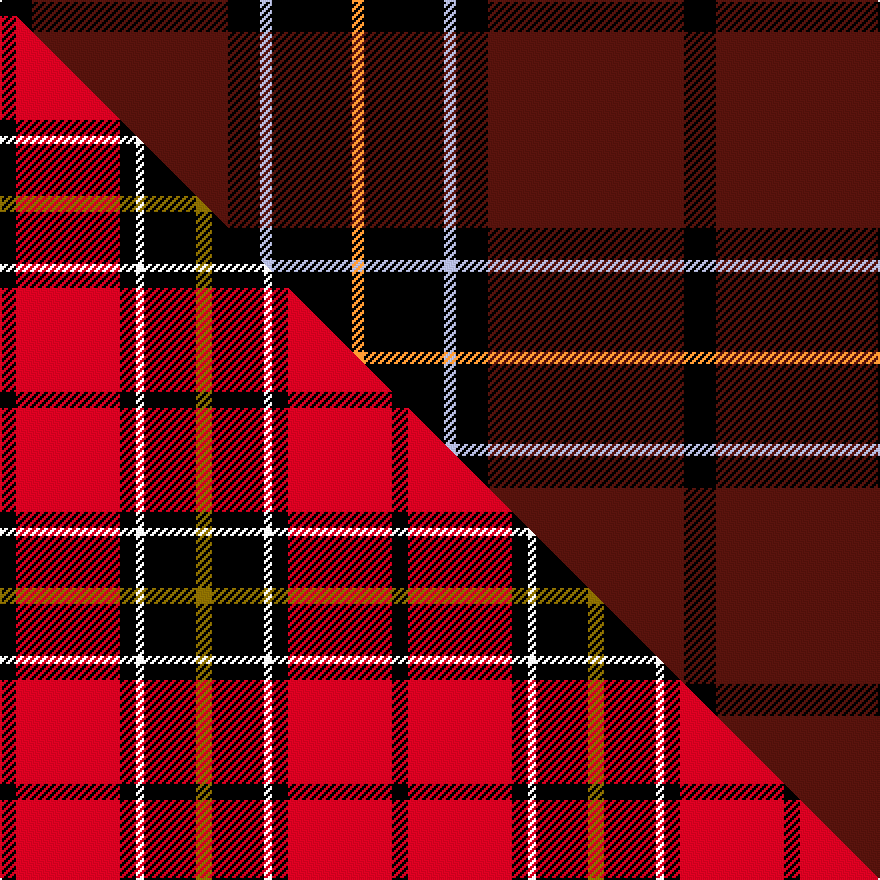

This is one **variant** — a specific cloth: this exact thread count and colourway, with its own
provenance below. It is one weaving of the [sett](/tartans/d/du/dunbar-3/) (the scale-free proportion — the
same cloth at any scale or shade), whose colour order is pattern [KBKWKY](/stripes/kbkwky/).

Part of the [Dunbar](/tartans/d/du/dunbar-3/) tartan — the named design grouping this sett with its other cloths.

Sourced from tartans-authority.  It is a [6 stripe tartan](/stripes/stripes6/).

Original link <code>http://www.tartansauthority.com/tartan-ferret/display/2011/</code> — retired · [Internet Archive copy](https://web.archive.org/web/*/http://www.tartansauthority.com/tartan-ferret/display/2011/*)

Dataset <small>— provenance for this record, inherited from the source manifest</small>

<dl class="dataset-prov">
<dt>source</dt><dd><a href="/sources/tartans-authority/">Scottish Tartans Authority</a></dd>
<dt>data captured from</dt><dd><a href="https://github.com/thetartan/tartan-database/blob/master/data/tartans-authority/data.csv">https://github.com/thetartan/tartan-database/blob/master/data/tartans-authority/data.csv</a></dd>
<dt>data date</dt><dd>1860 <small>(this record)</small></dd>
<dt>licence</dt><dd><a href="https://creativecommons.org/licenses/by-nc-nd/4.0/">CC BY-NC-ND 4.0</a></dd>
</dl>

Capture chain <small>— the hands this data passed through, oldest first; each capture carries its own licence</small>

<ol class="capture-chain">
<li><a href="https://www.tartansauthority.com/">Scottish Tartans Authority</a> <small>the heritage body’s archive — its tartan-ferret record browser is retired; dead record links are shown unlinked, with an Internet Archive copy (ITI numbers are not SRT references)</small></li>
<li><a href="https://github.com/thetartan/tartan-database">thetartan/tartan-database</a> <small>2016-2017</small> · <a href="https://creativecommons.org/licenses/by-nc-nd/4.0/">CC BY-NC-ND 4.0</a> <small>Levko Kravets's frozen compilation — the capture we vendored, and where its CC licence text came from</small></li>
<li>this dictionary <small>captured 2026-06-10 · commit 5bf86c7566</small> <small>each re-capture is a git commit to data/sources</small></li>
</ol>

## Register references

External register numbers recorded for this tartan.

- Scottish Tartans Authority (ITI): 2011

## Thread count
K/16 DR98 K16 LB6 K40 LO/6

One full sett is **342 threads**.

## Palette
<table><thead><tr><th>Colour</th><th>Shade</th><th>OKLCh</th></tr></thead><tbody><tr><td>DR</td><td><code style="background-color:#55120C;">#55120C</code> <small style="color:#888">#55120C</small></td><td><small style="color:#888">oklch(30.0% 0.099 29.3)</small></td></tr><tr><td>LO</td><td><code style="background-color:#FF9C34;">#FF9C34</code> <small style="color:#888">#FF9C34</small></td><td><small style="color:#888">oklch(77.9% 0.161 61.8)</small></td></tr><tr><td>K</td><td><code style="background-color:#000000;">#000000</code> <small style="color:#888">#000000</small></td><td><small style="color:#888">oklch(0.0% 0.000 0.0)</small></td></tr><tr><td>LB</td><td><code style="background-color:#B5BBDE;">#B5BBDE</code> <small style="color:#888">#B5BBDE</small></td><td><small style="color:#888">oklch(79.9% 0.050 277.6)</small></td></tr></tbody></table>

# Sample pattern

## Compared to the master

This cloth is one sett of its design; the master sett (the exemplar the design is anchored on) is below for comparison.

Its **ΔTartan distance** from the master is **0.90** — the same measure the nearest-tartans table ranks by (0 is identical; a re-scale of the same cloth is near 0, a recolour or a different proportion further).

<figure class="master-compare" style="margin:0">

this sett
master sett ★

<figcaption style="color:#888;font-size:smaller">One weave of this sett against the <a href="/setts/k4r26k4w2k13y4/">master sett ★</a>, split on the diagonal: a shared proportion runs seamlessly across it with only the shades shifting; a different proportion breaks on it.</figcaption>
</figure>

## Nearest tartan variants

The nearest existing variants by ΔTartan distance, with this cloth at the top so the swatches line up against it.

ΔTartan

Threads

Variant

Sett

—

342

<a href="/variants/s6/k8dr49k8lb3k20lo3~x2/">Dunbar (District)</a>

<a href="/ttd/edit/#slug=db1r12k6y1k6db1~x4&amp;base=k8dr49k8lb3k20lo3~x2" title="compare in the TTD">1.79</a>

208

<a href="/variants/s6/db1r12k6y1k6db1~x4/">Cetoloni (Personal)</a>

<a href="/ttd/edit/#slug=k53dy4k7dy2k4r30w3~x2&amp;base=k8dr49k8lb3k20lo3~x2" title="compare in the TTD">1.79</a>

300

<a href="/variants/s7/k53dy4k7dy2k4r30w3~x2/">Partick Thistle Football Club</a>

<a href="/ttd/edit/#slug=r10k15g2k2w1k1w1~x4&amp;base=k8dr49k8lb3k20lo3~x2" title="compare in the TTD">1.85</a>

212

<a href="/variants/s7/r10k15g2k2w1k1w1~x4/">Ikelman No 4</a>

<a href="/ttd/edit/#slug=r10k3w1k15ly1w3k3ly1~x4&amp;base=k8dr49k8lb3k20lo3~x2" title="compare in the TTD">2.04</a>

252

<a href="/variants/s8/r10k3w1k15ly1w3k3ly1~x4/">Cunard o' the Clyde</a>

<a href="/ttd/edit/#slug=k2r6k2r6k12y1~x4&amp;base=k8dr49k8lb3k20lo3~x2" title="compare in the TTD">2.11</a>

220

<a href="/variants/s6/k2r6k2r6k12y1~x4/">MacQueen</a>

<a href="/ttd/edit/#slug=k2r6k2r6k12y1~x2&amp;base=k8dr49k8lb3k20lo3~x2" title="compare in the TTD">2.11</a>

110

<a href="/variants/s6/k2r6k2r6k12y1~x2/">MacQueen Clan Tartan</a>

<a href="/ttd/edit/#slug=y6k5o4k48r36w6&amp;base=k8dr49k8lb3k20lo3~x2" title="compare in the TTD">2.25</a>

198

<a href="/variants/s6/y6k5o4k48r36w6/">Drambuie</a>

<a href="/ttd/edit/#slug=o6do36k48r4k5y6&amp;base=k8dr49k8lb3k20lo3~x2" title="compare in the TTD">2.34</a>

198

<a href="/variants/s6/o6do36k48r4k5y6/">Drambuie hunting</a>

<a href="/ttd/edit/#slug=o6do36k48r4k5ly6~o2503076-ly2705081&amp;base=k8dr49k8lb3k20lo3~x2" title="compare in the TTD">2.34</a>

198

<a href="/variants/s6/ly6do36k48r4k5lyi6~ly2503076-lyi2705081/">Drambuie Hunting</a>

<a href="/ttd/edit/#slug=k4r5k4dr28k4g5k4~x2&amp;base=k8dr49k8lb3k20lo3~x2" title="compare in the TTD">2.35</a>

200

<a href="/variants/s7/k4r5k4dr28k4g5k4~x2/">Montgomery</a>

## Neighbour map

Every grey dot is one of 13656 variants placed by the first two principal components of the ΔTartan feature space (42% of its variance). Red is this tartan; blue dots are its nearest — click one to open its page. The map is a flat projection of a many-dimensional space — [how to read it](/posts/neighbourhood-maps/).

<svg viewBox="0 0 640 380" role="img" style="max-width:100%;height:auto;border:1px solid #e0e0e0;border-radius:4px;display:block" xmlns="http://www.w3.org/2000/svg"><image href="/nn/cloud.v1.png" width="640" height="380"/><a href="/variants/s6/db1r12k6y1k6db1~x4/"><circle cx="227.4" cy="166.0" r="4" fill="#3465a4"><title>Cetoloni (Personal)</title></circle></a><a href="/variants/s7/k53dy4k7dy2k4r30w3~x2/"><circle cx="340.1" cy="105.8" r="4" fill="#3465a4"><title>Partick Thistle Football Club</title></circle></a><a href="/variants/s7/r10k15g2k2w1k1w1~x4/"><circle cx="273.9" cy="132.0" r="4" fill="#3465a4"><title>Ikelman No 4</title></circle></a><a href="/variants/s8/r10k3w1k15ly1w3k3ly1~x4/"><circle cx="257.1" cy="132.1" r="4" fill="#3465a4"><title>Cunard o' the Clyde</title></circle></a><a href="/variants/s6/k2r6k2r6k12y1~x4/"><circle cx="289.7" cy="185.2" r="4" fill="#3465a4"><title>MacQueen</title></circle></a><a href="/variants/s6/k2r6k2r6k12y1~x2/"><circle cx="289.7" cy="185.2" r="4" fill="#3465a4"><title>MacQueen Clan Tartan</title></circle></a><a href="/variants/s6/y6k5o4k48r36w6/"><circle cx="216.0" cy="140.0" r="4" fill="#3465a4"><title>Drambuie</title></circle></a><a href="/variants/s6/o6do36k48r4k5y6/"><circle cx="257.5" cy="158.9" r="4" fill="#3465a4"><title>Drambuie hunting</title></circle></a><a href="/variants/s6/ly6do36k48r4k5lyi6~ly2503076-lyi2705081/"><circle cx="244.4" cy="155.0" r="4" fill="#3465a4"><title>Drambuie Hunting</title></circle></a><a href="/variants/s7/k4r5k4dr28k4g5k4~x2/"><circle cx="258.9" cy="177.0" r="4" fill="#3465a4"><title>Montgomery</title></circle></a><circle cx="325.6" cy="157.2" r="5" fill="#c00000"/><text x="320" y="376" text-anchor="middle" font-size="11" fill="#999">ground</text><text x="11" y="190" text-anchor="middle" font-size="11" fill="#999" transform="rotate(-90 11 190)">complexity</text></svg>

ID: /variants/s6/k8dr49k8lb3k20lo3~x2/
