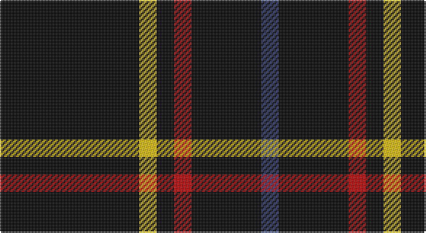

This page is one **sett** — a single exact thread-count. It belongs to the [tartan](/setts/k8ly1k1r1k4db1/)
(the same proportion at any scale), whose colour order is pattern [BKRKYK](/stripes/bkrkyk/).

Part of the [Justus](/tartans/justus/) tartan — the named design grouping this sett with its other cloths.

Sourced from weddslist.  It is a [6 stripe tartan](/stripes/stripes6/).

Original link http://www.weddslist.com/cgi-bin/tartans/pg.pl?source=sts

## Also known as

This cloth is also recorded under:

- Justus #1
- Justus #2

## Thread count
K/96 Y12 K12 R12 K48 B/12

One full sett is **276 threads**.

## Palette

Palette: <strong>Ingles Buchan</strong> <small style="color:#888">(1 of 4 colours)</small>
<table><thead><tr><th>Colour</th><th>Threads</th><th>Shade</th><th>Base</th><th>OKLCh</th></tr></thead><tbody><tr><td>K/</td><td style="text-align:right;font-variant-numeric:tabular-nums">96</td><td><code style="background-color:#000000;">#000000</code> <small style="color:#888">#000000</small></td><td>K <code style="background-color:#000000;">#000000</code></td><td><small style="color:#888">oklch(0.0% 0.000 0.0)</small></td></tr><tr><td>Y</td><td style="text-align:right;font-variant-numeric:tabular-nums">12</td><td><code style="background-color:#F0C000;">#F0C000</code> <small style="color:#888">#F0C000</small></td><td>Y <code style="background-color:#F2BF00;">#F2BF00</code></td><td><small style="color:#888">oklch(82.7% 0.169 90.5)</small></td></tr><tr><td>K</td><td style="text-align:right;font-variant-numeric:tabular-nums">12</td><td><code style="background-color:#000000;">#000000</code> <small style="color:#888">#000000</small></td><td>K <code style="background-color:#000000;">#000000</code></td><td><small style="color:#888">oklch(0.0% 0.000 0.0)</small></td></tr><tr><td>R</td><td style="text-align:right;font-variant-numeric:tabular-nums">12</td><td><code style="background-color:#C00000;">#C00000</code> <small style="color:#888">#C00000</small></td><td>R <code style="background-color:#CC0000;">#CC0000</code></td><td><small style="color:#888">oklch(50.7% 0.208 29.2)</small></td></tr><tr><td>K</td><td style="text-align:right;font-variant-numeric:tabular-nums">48</td><td><code style="background-color:#000000;">#000000</code> <small style="color:#888">#000000</small></td><td>K <code style="background-color:#000000;">#000000</code></td><td><small style="color:#888">oklch(0.0% 0.000 0.0)</small></td></tr><tr><td>B/</td><td style="text-align:right;font-variant-numeric:tabular-nums">12</td><td><code style="background-color:#304080;">#304080</code> <small style="color:#888">#304080</small></td><td>B <code style="background-color:#2A418A;">#2A418A</code></td><td><small style="color:#888">oklch(39.4% 0.109 270.2)</small></td></tr></tbody></table>

# Sample pattern

## Compared to the master

This cloth is one sett of its design; the master sett (the exemplar the design is anchored on) is below for comparison.

<figure style="margin:0"><figcaption style="color:#888;font-size:smaller">this sett</figcaption></figure>
<figure style="margin:0"><figcaption style="color:#888;font-size:smaller"><a href="/setts/db1k4r1k1lo1k4db1/">master sett →</a></figcaption></figure>

## Nearest tartans

The nearest existing variants by ΔTartan distance, with this tartan at the top so the swatches line up against it.

ΔTartan

Tartan

Sett

—

<a href="/ttd/edit/#slug=k8ly1k1r1k4db1~x12">Justus</a> <a class="nn-out" href="/variants/s6/k8ly1k1r1k4db1~x12/" title="open its dictionary page">↗</a>

1.37

<a href="/ttd/edit/#slug=k24g3r3k24r2k2r2&amp;base=k8ly1k1r1k4db1~x12">Unidentified 11</a> <a class="nn-out" href="/variants/s7/k24g3r3k24r2k2r2/" title="open its dictionary page">↗</a>

1.73

<a href="/ttd/edit/#slug=k21lb2k5lb9k13g2~x4&amp;base=k8ly1k1r1k4db1~x12">New Zealand (2000)</a> <a class="nn-out" href="/variants/s6/k21lb2k5lb9k13g2~x4/" title="open its dictionary page">↗</a>

1.89

<a href="/ttd/edit/#slug=k2r1k10r1k2r1k10r2k10r2g2r2k10db2~x2&amp;base=k8ly1k1r1k4db1~x12">Hebridean 7</a> <a class="nn-out" href="/variants/s14/k2r1k10r1k2r1k10r2k10r2g2r2k10db2~x2/" title="open its dictionary page">↗</a>

1.95

<a href="/ttd/edit/#slug=k35lo3w3g3~x4&amp;base=k8ly1k1r1k4db1~x12">Dhillon (Personal)</a> <a class="nn-out" href="/variants/s4/k35lo3w3g3~x4/" title="open its dictionary page">↗</a>

1.96

<a href="/ttd/edit/#slug=k45ly4k4ly9k4ly4k45r4~x2&amp;base=k8ly1k1r1k4db1~x12">Gwynn</a> <a class="nn-out" href="/variants/s8/k45ly4k4ly9k4ly4k45r4~x2/" title="open its dictionary page">↗</a>

2.04

<a href="/ttd/edit/#slug=k16b2k8r3lr3r3k8~x2&amp;base=k8ly1k1r1k4db1~x12">Benson (New England)</a> <a class="nn-out" href="/variants/s7/k16b2k8r3lr3r3k8~x2/" title="open its dictionary page">↗</a>

2.14

<a href="/ttd/edit/#slug=k4r4k20r1k20w4~x6&amp;base=k8ly1k1r1k4db1~x12">Lanoir</a> <a class="nn-out" href="/variants/s6/k4r4k20r1k20w4~x6/" title="open its dictionary page">↗</a>

2.18

<a href="/ttd/edit/#slug=n3k31w6k8n3k12w2~x2&amp;base=k8ly1k1r1k4db1~x12">Believe - Colette</a> <a class="nn-out" href="/variants/s7/n3k31w6k8n3k12w2~x2/" title="open its dictionary page">↗</a>

2.19

<a href="/ttd/edit/#slug=k8t3k32b14w3k25t3~x2&amp;base=k8ly1k1r1k4db1~x12">Cowe (Personal)</a> <a class="nn-out" href="/variants/s7/k8t3k32b14w3k25t3~x2/" title="open its dictionary page">↗</a>

2.19

<a href="/ttd/edit/#slug=r2k25dy2k20do5k2do4k3do3k4do2k6ly2~x2&amp;base=k8ly1k1r1k4db1~x12">Gold-Smith (Personal)</a> <a class="nn-out" href="/variants/s13/r2k25dy2k20do5k2do4k3do3k4do2k6ly2~x2/" title="open its dictionary page">↗</a>

## Neighbour map

Every grey dot is one of 14360 variants placed by the first two principal components of the ΔTartan feature space (44% of its variance). Red is this tartan; blue dots are its nearest — click one to open its page.

<svg viewBox="0 0 640 380" role="img" style="max-width:100%;height:auto;border:1px solid #e0e0e0;border-radius:4px;display:block" xmlns="http://www.w3.org/2000/svg"><image href="/nn/cloud.v1.png" width="640" height="380"/><a href="/variants/s7/k24g3r3k24r2k2r2/"><circle cx="548.1" cy="219.2" r="4" fill="#3465a4"><title>Unidentified 11</title></circle></a><a href="/variants/s6/k21lb2k5lb9k13g2~x4/"><circle cx="415.2" cy="235.1" r="4" fill="#3465a4"><title>New Zealand (2000)</title></circle></a><a href="/variants/s14/k2r1k10r1k2r1k10r2k10r2g2r2k10db2~x2/"><circle cx="436.8" cy="187.2" r="4" fill="#3465a4"><title>Hebridean 7</title></circle></a><a href="/variants/s4/k35lo3w3g3~x4/"><circle cx="489.0" cy="203.1" r="4" fill="#3465a4"><title>Dhillon (Personal)</title></circle></a><a href="/variants/s8/k45ly4k4ly9k4ly4k45r4~x2/"><circle cx="515.7" cy="196.1" r="4" fill="#3465a4"><title>Gwynn</title></circle></a><a href="/variants/s7/k16b2k8r3lr3r3k8~x2/"><circle cx="402.8" cy="229.1" r="4" fill="#3465a4"><title>Benson (New England)</title></circle></a><a href="/variants/s6/k4r4k20r1k20w4~x6/"><circle cx="537.3" cy="210.0" r="4" fill="#3465a4"><title>Lanoir</title></circle></a><a href="/variants/s7/n3k31w6k8n3k12w2~x2/"><circle cx="474.5" cy="195.0" r="4" fill="#3465a4"><title>Believe - Colette</title></circle></a><a href="/variants/s7/k8t3k32b14w3k25t3~x2/"><circle cx="411.9" cy="213.6" r="4" fill="#3465a4"><title>Cowe (Personal)</title></circle></a><a href="/variants/s13/r2k25dy2k20do5k2do4k3do3k4do2k6ly2~x2/"><circle cx="429.2" cy="155.2" r="4" fill="#3465a4"><title>Gold-Smith (Personal)</title></circle></a><circle cx="471.7" cy="226.2" r="5" fill="#c00000"/></svg>

ID: /variants/s6/k8ly1k1r1k4db1~x12/
