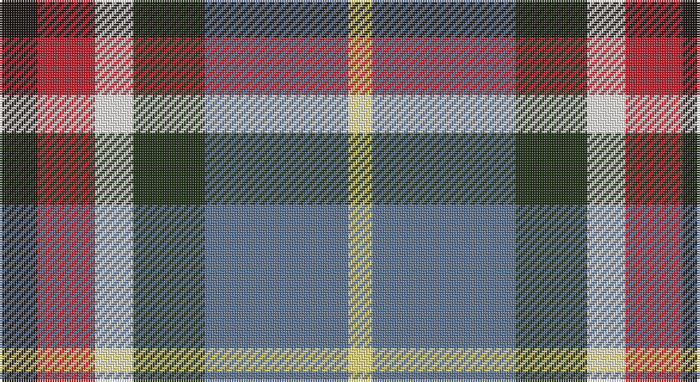

This page is one **sett** — a single exact thread-count. It belongs to the [tartan](/setts/k8r12w8dg15n30ly5/)
(the same proportion at any scale), whose colour order is pattern [KRWGBY](/stripes/krwgby/).

Sourced from register-of-tartans.  It is a [6 stripe tartan](/stripes/stripes6/).

Original link https://www.tartanregister.gov.uk/tartanDetails.aspx?ref=10279

## Register references

External register numbers recorded for this tartan.

- Scottish Register of Tartans: [10279](https://www.tartanregister.gov.uk/tartanDetails.aspx?ref=10279)

## Thread count
K/16 R24 W16 Ka30 B60 LY/10

One full sett is **286 threads**.

## Palette

Palette: <strong>Tartan Dictionary</strong> <small style="color:#888">(1 of 6 colours)</small>
<table><thead><tr><th>Colour</th><th>Threads</th><th>Shade</th><th>Base</th><th>OKLCh</th></tr></thead><tbody><tr><td>K/</td><td style="text-align:right;font-variant-numeric:tabular-nums">16</td><td><code style="background-color:#1C1714;">#1C1714</code> <small style="color:#888">#1C1714</small></td><td>K <code style="background-color:#000000;">#000000</code></td><td><small style="color:#888">oklch(20.9% 0.010 52.9)</small></td></tr><tr><td>R</td><td style="text-align:right;font-variant-numeric:tabular-nums">24</td><td><code style="background-color:#B62531;">#B62531</code> <small style="color:#888">#B62531</small></td><td>R <code style="background-color:#CC0000;">#CC0000</code></td><td><small style="color:#888">oklch(50.8% 0.180 22.7)</small></td></tr><tr><td>W</td><td style="text-align:right;font-variant-numeric:tabular-nums">16</td><td><code style="background-color:#F9F5EF;">#F9F5EF</code> <small style="color:#888">#F9F5EF</small></td><td>W <code style="background-color:#F7F7F7;">#F7F7F7</code></td><td><small style="color:#888">oklch(97.2% 0.009 78.3)</small></td></tr><tr><td>Ka</td><td style="text-align:right;font-variant-numeric:tabular-nums">30</td><td><code style="background-color:#23321B;">#23321B</code> <small style="color:#888">#23321B</small></td><td>G <code style="background-color:#006100;">#006100</code></td><td><small style="color:#888">oklch(29.7% 0.045 135.3)</small></td></tr><tr><td>B</td><td style="text-align:right;font-variant-numeric:tabular-nums">60</td><td><code style="background-color:#5F7490;">#5F7490</code> <small style="color:#888">#5F7490</small></td><td>B <code style="background-color:#2A418A;">#2A418A</code></td><td><small style="color:#888">oklch(55.3% 0.050 255.7)</small></td></tr><tr><td>LY/</td><td style="text-align:right;font-variant-numeric:tabular-nums">10</td><td><code style="background-color:#F8E380;">#F8E380</code> <small style="color:#888">#F8E380</small></td><td>Y <code style="background-color:#F2BF00;">#F2BF00</code></td><td><small style="color:#888">oklch(91.3% 0.122 97.7)</small></td></tr></tbody></table>

# Sample pattern

## Nearest tartans

The nearest existing variants by ΔTartan distance, with this tartan at the top so the swatches line up against it.

ΔTartan

Tartan

Sett

—

<a href="/ttd/edit/#slug=k8r12w8dg15n30ly5~x2">Reekie (Edmonton)</a> <a class="nn-out" href="/variants/s6/k8r12w8dg15n30ly5~x2/" title="open its dictionary page">↗</a>

0.67

<a href="/ttd/edit/#slug=k8r12w8g15db30ly5~x2&amp;base=k8r12w8dg15n30ly5~x2">Reekie (Name)</a> <a class="nn-out" href="/variants/s6/k8r12w8g15db30ly5~x2/" title="open its dictionary page">↗</a>

0.96

<a href="/ttd/edit/#slug=w4r7lo5b13o18dg3~x2&amp;base=k8r12w8dg15n30ly5~x2">Ryan/Fehder (Personal)</a> <a class="nn-out" href="/variants/s6/w4r7lo5b13o18dg3~x2/" title="open its dictionary page">↗</a>

1.02

<a href="/ttd/edit/#slug=dt36lo5ri12r9dp5w12lo7~x2&amp;base=k8r12w8dg15n30ly5~x2">Galvez-Brown (Personal)</a> <a class="nn-out" href="/variants/s7/dt36lo5ri12r9dp5w12lo7~x2/" title="open its dictionary page">↗</a>

1.13

<a href="/ttd/edit/#slug=r10k17t10dp17g40ly10~x2&amp;base=k8r12w8dg15n30ly5~x2">Gallowater, Original</a> <a class="nn-out" href="/variants/s6/r10k17t10dp17g40ly10~x2/" title="open its dictionary page">↗</a>

1.14

<a href="/ttd/edit/#slug=dti3dt5n2dg5r11w3~x4&amp;base=k8r12w8dg15n30ly5~x2">Nicolson of Lewis (Clan?)</a> <a class="nn-out" href="/variants/s6/dti3dt5n2dg5r11w3~x4/" title="open its dictionary page">↗</a>

1.17

<a href="/ttd/edit/#slug=g4t2g9k4g2r6db12w2~x2&amp;base=k8r12w8dg15n30ly5~x2">Cherokee</a> <a class="nn-out" href="/variants/s8/g4t2g9k4g2r6db12w2~x2/" title="open its dictionary page">↗</a>

1.19

<a href="/ttd/edit/#slug=r5t12ly11dt21lo5~x2&amp;base=k8r12w8dg15n30ly5~x2">Inspiration</a> <a class="nn-out" href="/variants/s5/r5t12ly11dt21lo5~x2/" title="open its dictionary page">↗</a>

1.19

<a href="/ttd/edit/#slug=r4db18ri4dg19w25r10w4~x2&amp;base=k8r12w8dg15n30ly5~x2">Fraser Red Dress</a> <a class="nn-out" href="/variants/s7/r4db18ri4dg19w25r10w4~x2/" title="open its dictionary page">↗</a>

1.21

<a href="/ttd/edit/#slug=m21lg4do5lg4m5k21g21lo5~x2&amp;base=k8r12w8dg15n30ly5~x2">Caledonian Labrador Retrievers</a> <a class="nn-out" href="/variants/s8/m21lg4do5lg4m5k21g21lo5~x2/" title="open its dictionary page">↗</a>

1.23

<a href="/ttd/edit/#slug=r1dy6db2lb4k4lb1~x6&amp;base=k8r12w8dg15n30ly5~x2">Thompson's Fancy (Fashion)</a> <a class="nn-out" href="/variants/s6/r1dy6db2lb4k4lb1~x6/" title="open its dictionary page">↗</a>

## Neighbour map

Every grey dot is one of 14360 variants placed by the first two principal components of the ΔTartan feature space (44% of its variance). Red is this tartan; blue dots are its nearest — click one to open its page.

<svg viewBox="0 0 640 380" role="img" style="max-width:100%;height:auto;border:1px solid #e0e0e0;border-radius:4px;display:block" xmlns="http://www.w3.org/2000/svg"><image href="/nn/cloud.v1.png" width="640" height="380"/><a href="/variants/s6/k8r12w8g15db30ly5~x2/"><circle cx="84.0" cy="200.9" r="4" fill="#3465a4"><title>Reekie (Name)</title></circle></a><a href="/variants/s6/w4r7lo5b13o18dg3~x2/"><circle cx="102.2" cy="201.8" r="4" fill="#3465a4"><title>Ryan/Fehder (Personal)</title></circle></a><a href="/variants/s7/dt36lo5ri12r9dp5w12lo7~x2/"><circle cx="119.6" cy="164.5" r="4" fill="#3465a4"><title>Galvez-Brown (Personal)</title></circle></a><a href="/variants/s6/r10k17t10dp17g40ly10~x2/"><circle cx="74.7" cy="224.3" r="4" fill="#3465a4"><title>Gallowater, Original</title></circle></a><a href="/variants/s6/dti3dt5n2dg5r11w3~x4/"><circle cx="99.0" cy="208.6" r="4" fill="#3465a4"><title>Nicolson of Lewis (Clan?)</title></circle></a><a href="/variants/s8/g4t2g9k4g2r6db12w2~x2/"><circle cx="90.2" cy="192.1" r="4" fill="#3465a4"><title>Cherokee</title></circle></a><a href="/variants/s5/r5t12ly11dt21lo5~x2/"><circle cx="97.7" cy="247.8" r="4" fill="#3465a4"><title>Inspiration</title></circle></a><a href="/variants/s7/r4db18ri4dg19w25r10w4~x2/"><circle cx="85.3" cy="192.2" r="4" fill="#3465a4"><title>Fraser Red Dress</title></circle></a><a href="/variants/s8/m21lg4do5lg4m5k21g21lo5~x2/"><circle cx="64.4" cy="190.0" r="4" fill="#3465a4"><title>Caledonian Labrador Retrievers</title></circle></a><a href="/variants/s6/r1dy6db2lb4k4lb1~x6/"><circle cx="87.4" cy="220.3" r="4" fill="#3465a4"><title>Thompson's Fancy (Fashion)</title></circle></a><circle cx="86.5" cy="198.4" r="5" fill="#c00000"/></svg>

ID: /variants/s6/k8r12w8dg15n30ly5~x2/
