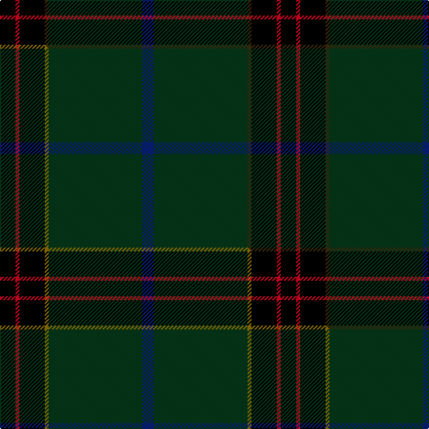

This page is one **sett** — a single exact thread-count. It belongs to the [tartan](/setts/k8r2k13dy2dg48db6/)
(the same proportion at any scale), whose colour order is pattern [BGGKRK](/stripes/bggkrk/).

Part of the [Green Swamp Youth Campers](/tartans/green-swamp-youth-campers/) tartan — the named design grouping this sett with its other cloths.

Sourced from tartans-authority.  It is a [6 stripe tartan](/stripes/stripes6/).

Original link http://www.tartansauthority.com/tartan-ferret/display/11272/

## Register references

External register numbers recorded for this tartan.

- Scottish Register of Tartans: [11272](https://www.tartanregister.gov.uk/tartanDetails?ref=11272)
- Scottish Tartans Authority (ITI): 11272

## Thread count
K/16 R4 K26 DY4 DG96 DB/12

One full sett is **288 threads**.

## Palette
<table><thead><tr><th>Colour</th><th>Shade</th><th>OKLCh</th></tr></thead><tbody><tr><td>DB</td><td><code style="background-color:#082077;">#082077</code> <small style="color:#888">#082077</small></td><td><small style="color:#888">oklch(30.0% 0.149 265.1)</small></td></tr><tr><td>DG</td><td><code style="background-color:#053819;">#053819</code> <small style="color:#888">#053819</small></td><td><small style="color:#888">oklch(30.0% 0.075 151.3)</small></td></tr><tr><td>K</td><td><code style="background-color:#000000;">#000000</code> <small style="color:#888">#000000</small></td><td><small style="color:#888">oklch(0.0% 0.000 0.0)</small></td></tr><tr><td>R</td><td><code style="background-color:#D60020;">#D60020</code> <small style="color:#888">#D60020</small></td><td><small style="color:#888">oklch(55.2% 0.224 25.5)</small></td></tr><tr><td>DY</td><td><code style="background-color:#3A2B0D;">#3A2B0D</code> <small style="color:#888">#3A2B0D</small></td><td><small style="color:#888">oklch(30.0% 0.049 82.0)</small></td></tr></tbody></table>

# Sample pattern

## Compared to the master

This cloth is one sett of its design; the master sett (the exemplar the design is anchored on) is below for comparison.

Its **ΔTartan distance** from the master is **0.34** — the same measure the nearest-tartans table ranks by (0 is identical; a re-scale of the same cloth is near 0, a recolour or a different proportion further).

<figure class="master-compare" style="margin:0">

this sett
master sett ★

<figcaption style="color:#888;font-size:smaller">One weave of this sett against the <a href="/setts/k8r2k13y2dg48db6/">master sett ★</a>, split on the diagonal: a shared proportion runs seamlessly across it with only the shades shifting; a different proportion breaks on it.</figcaption>
</figure>

## Nearest variants

The nearest existing variants by ΔTartan distance, with this cloth at the top so the swatches line up against it.

ΔTartan

Threads

Variant

Sett

—

288

<a href="/variants/s6/k8r2k13dy2dg48db6~x2/">Green Swamp Youth Campers</a>

<a href="/ttd/edit/#slug=k8r2k13y2dg48db6~x2&amp;base=k8r2k13dy2dg48db6~x2" title="compare in the TTD">0.00</a>

288

<a href="/variants/s6/k8r2k13y2dg48db6~x2/">Green Swamp Youth Campers</a>

<a href="/ttd/edit/#slug=dg42y1k23dr7w1db4y3~x2&amp;base=k8r2k13dy2dg48db6~x2" title="compare in the TTD">1.91</a>

234

<a href="/variants/s7/dg42y1k23dr7w1db4y3~x2/">Henschke, Felix (Personal)</a>

<a href="/ttd/edit/#slug=n5y1k5dg46k5r3~x2&amp;base=k8r2k13dy2dg48db6~x2" title="compare in the TTD">2.00</a>

244

<a href="/variants/s6/n5y1k5dg46k5r3~x2/">Touch</a>

2.05

—

<a href="/variants/s7/ly10k2g5k2dg46lyi2k2~x2~ly2503076-lyi2705081/">Green Rover (Personal)</a>

2.05

—

<a href="/variants/s6/db12k17y4dg51ly3g4~x2~y2203076-ly3307090/">US Army Regimental Tartan</a>

<a href="/ttd/edit/#slug=dg30g1dg3dr30k1y3~x2~dg1806142-g2408144&amp;base=k8r2k13dy2dg48db6~x2" title="compare in the TTD">2.19</a>

206

<a href="/variants/s6/dg30g1dg3dr30k1y3~x2~dg1806142-g2408144/">Abadia Da Cova (Corporate)</a>

<a href="/ttd/edit/#slug=r17db7y8dg58k6~x2&amp;base=k8r2k13dy2dg48db6~x2" title="compare in the TTD">2.25</a>

338

<a href="/variants/s5/r17db7y8dg58k6~x2/">St Johns County's Sheriff's Office</a>

<a href="/ttd/edit/#slug=dg43k14db14dr2~x2&amp;base=k8r2k13dy2dg48db6~x2" title="compare in the TTD">2.26</a>

202

<a href="/variants/s4/dg43k14db14dr2~x2/">Feddinch Club, St Andrews Limited, The</a>

<a href="/ttd/edit/#slug=k8dr26k22dt110w4k5w4&amp;base=k8r2k13dy2dg48db6~x2" title="compare in the TTD">2.34</a>

346

<a href="/variants/s7/k8dr26k22dt110w4k5w4/">Edinburgh, The University of</a>

<a href="/ttd/edit/#slug=dy2dg44k10r1db16r2~x2&amp;base=k8r2k13dy2dg48db6~x2" title="compare in the TTD">2.40</a>

292

<a href="/variants/s6/dy2dg44k10r1db16r2~x2/">MacWilliam Htg</a>

## Neighbour map

Every grey dot is one of 13620 variants placed by the first two principal components of the ΔTartan feature space (42% of its variance). Red is this tartan; blue dots are its nearest — click one to open its page.

<svg viewBox="0 0 640 380" role="img" style="max-width:100%;height:auto;border:1px solid #e0e0e0;border-radius:4px;display:block" xmlns="http://www.w3.org/2000/svg"><image href="/nn/cloud.v1.png" width="640" height="380"/><a href="/variants/s6/k8r2k13y2dg48db6~x2/"><circle cx="376.5" cy="136.5" r="4" fill="#3465a4"><title>Green Swamp Youth Campers</title></circle></a><a href="/variants/s7/dg42y1k23dr7w1db4y3~x2/"><circle cx="311.1" cy="96.3" r="4" fill="#3465a4"><title>Henschke, Felix (Personal)</title></circle></a><a href="/variants/s6/n5y1k5dg46k5r3~x2/"><circle cx="474.3" cy="101.1" r="4" fill="#3465a4"><title>Touch</title></circle></a><a href="/variants/s7/ly10k2g5k2dg46lyi2k2~x2~ly2503076-lyi2705081/"><circle cx="398.0" cy="114.0" r="4" fill="#3465a4"><title>Green Rover (Personal)</title></circle></a><a href="/variants/s6/db12k17y4dg51ly3g4~x2~y2203076-ly3307090/"><circle cx="285.8" cy="141.1" r="4" fill="#3465a4"><title>US Army Regimental Tartan</title></circle></a><a href="/variants/s6/dg30g1dg3dr30k1y3~x2~dg1806142-g2408144/"><circle cx="384.7" cy="151.0" r="4" fill="#3465a4"><title>Abadia Da Cova (Corporate)</title></circle></a><a href="/variants/s5/r17db7y8dg58k6~x2/"><circle cx="318.9" cy="183.0" r="4" fill="#3465a4"><title>St Johns County's Sheriff's Office</title></circle></a><a href="/variants/s4/dg43k14db14dr2~x2/"><circle cx="404.0" cy="214.7" r="4" fill="#3465a4"><title>Feddinch Club, St Andrews Limited, The</title></circle></a><a href="/variants/s7/k8dr26k22dt110w4k5w4/"><circle cx="384.0" cy="125.4" r="4" fill="#3465a4"><title>Edinburgh, The University of</title></circle></a><a href="/variants/s6/dy2dg44k10r1db16r2~x2/"><circle cx="404.4" cy="126.8" r="4" fill="#3465a4"><title>MacWilliam Htg</title></circle></a><circle cx="387.8" cy="140.5" r="5" fill="#c00000"/><text x="320" y="376" text-anchor="middle" font-size="11" fill="#999">ground</text><text x="11" y="190" text-anchor="middle" font-size="11" fill="#999" transform="rotate(-90 11 190)">complexity</text></svg>

ID: /variants/s6/k8r2k13dy2dg48db6~x2/
