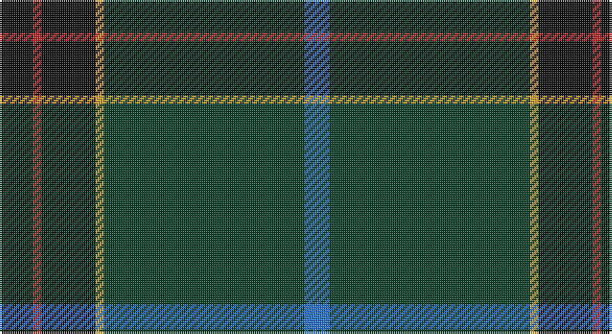

This page is one **sett** — a single exact thread-count. It belongs to the [tartan](/setts/k8r2k13lo2dg48b6/)
(the same proportion at any scale), whose colour order is pattern [BGYKRK](/stripes/bgykrk/).

Sourced from register-of-tartans.  It is a [6 stripe tartan](/stripes/stripes6/).

Original link https://www.tartanregister.gov.uk/tartanDetails.aspx?ref=11272

## Register references

External register numbers recorded for this tartan.

- Scottish Register of Tartans: [11272](https://www.tartanregister.gov.uk/tartanDetails.aspx?ref=11272)

## Thread count
K/16 R4 K26 Y4 DG96 B/12

One full sett is **288 threads**.

## Palette

Palette: <strong>Tartan Register</strong>
<table><thead><tr><th>Colour</th><th>Threads</th><th>Shade</th><th>Base</th><th>OKLCh</th></tr></thead><tbody><tr><td>K/</td><td style="text-align:right;font-variant-numeric:tabular-nums">16</td><td><code style="background-color:#101010;">#101010</code> <small style="color:#888">#101010</small></td><td>K <code style="background-color:#000000;">#000000</code></td><td><small style="color:#888">oklch(17.3% 0.000 89.9)</small></td></tr><tr><td>R</td><td style="text-align:right;font-variant-numeric:tabular-nums">4</td><td><code style="background-color:#C82828;">#C82828</code> <small style="color:#888">#C82828</small></td><td>R <code style="background-color:#CC0000;">#CC0000</code></td><td><small style="color:#888">oklch(54.2% 0.196 26.8)</small></td></tr><tr><td>K</td><td style="text-align:right;font-variant-numeric:tabular-nums">26</td><td><code style="background-color:#101010;">#101010</code> <small style="color:#888">#101010</small></td><td>K <code style="background-color:#000000;">#000000</code></td><td><small style="color:#888">oklch(17.3% 0.000 89.9)</small></td></tr><tr><td>Y</td><td style="text-align:right;font-variant-numeric:tabular-nums">4</td><td><code style="background-color:#E0A126;">#E0A126</code> <small style="color:#888">#E0A126</small></td><td>Y <code style="background-color:#F2BF00;">#F2BF00</code></td><td><small style="color:#888">oklch(75.1% 0.146 78.3)</small></td></tr><tr><td>DG</td><td style="text-align:right;font-variant-numeric:tabular-nums">96</td><td><code style="background-color:#004028;">#004028</code> <small style="color:#888">#004028</small></td><td>G <code style="background-color:#006100;">#006100</code></td><td><small style="color:#888">oklch(32.8% 0.073 160.8)</small></td></tr><tr><td>B/</td><td style="text-align:right;font-variant-numeric:tabular-nums">12</td><td><code style="background-color:#2474E8;">#2474E8</code> <small style="color:#888">#2474E8</small></td><td>B <code style="background-color:#2A418A;">#2A418A</code></td><td><small style="color:#888">oklch(57.8% 0.192 258.7)</small></td></tr></tbody></table>

# Sample pattern

## Nearest tartans

The nearest existing variants by ΔTartan distance, with this tartan at the top so the swatches line up against it.

ΔTartan

Tartan

Sett

—

<a href="/ttd/edit/#slug=k8r2k13lo2dg48b6~x2">Green Swamp Youth Campers</a> <a class="nn-out" href="/variants/s6/k8r2k13lo2dg48b6~x2/" title="open its dictionary page">↗</a>

1.10

<a href="/ttd/edit/#slug=dg47ly2dg5ly2dg4k15db19r2~x2&amp;base=k8r2k13lo2dg48b6~x2">Unidentified, Toy Bear</a> <a class="nn-out" href="/variants/s8/dg47ly2dg5ly2dg4k15db19r2~x2/" title="open its dictionary page">↗</a>

1.17

<a href="/ttd/edit/#slug=k8r2k13ly2dg48db6~x2&amp;base=k8r2k13lo2dg48b6~x2">Green Swamp Youth Campers</a> <a class="nn-out" href="/variants/s6/k8r2k13ly2dg48db6~x2/" title="open its dictionary page">↗</a>

1.19

<a href="/ttd/edit/#slug=dy2dg44k10r1db16r1~x2&amp;base=k8r2k13lo2dg48b6~x2">MacWilliam Hunting</a> <a class="nn-out" href="/variants/s6/dy2dg44k10r1db16r1~x2/" title="open its dictionary page">↗</a>

1.25

<a href="/ttd/edit/#slug=dgi36dg5db17w2dgi14o3dp2~x2&amp;base=k8r2k13lo2dg48b6~x2">Mounth,The Rejected</a> <a class="nn-out" href="/variants/s7/dgi36dg5db17w2dgi14o3dp2~x2/" title="open its dictionary page">↗</a>

1.28

<a href="/ttd/edit/#slug=r4dg10lo1lb1dt4lb1dt25r2~x2&amp;base=k8r2k13lo2dg48b6~x2">Raymond of Doune</a> <a class="nn-out" href="/variants/s8/r4dg10lo1lb1dt4lb1dt25r2~x2/" title="open its dictionary page">↗</a>

1.29

<a href="/ttd/edit/#slug=w3m11db4m6dg48o2dg3o2~x2&amp;base=k8r2k13lo2dg48b6~x2">Hall, from Springbrook and Newtown (Personal)</a> <a class="nn-out" href="/variants/s8/w3m11db4m6dg48o2dg3o2~x2/" title="open its dictionary page">↗</a>

1.35

<a href="/ttd/edit/#slug=g50db20k3db2dy2db5~x2&amp;base=k8r2k13lo2dg48b6~x2">St Andrews Old Course Hotel Corporate Tartan</a> <a class="nn-out" href="/variants/s6/g50db20k3db2dy2db5~x2/" title="open its dictionary page">↗</a>

1.36

<a href="/ttd/edit/#slug=n36k18n5dt7n5k7r1g2~x2&amp;base=k8r2k13lo2dg48b6~x2">Suttle (Personal)</a> <a class="nn-out" href="/variants/s8/n36k18n5dt7n5k7r1g2~x2/" title="open its dictionary page">↗</a>

1.47

<a href="/ttd/edit/#slug=k8m26k22dt110w4k5w4&amp;base=k8r2k13lo2dg48b6~x2">Edinburgh, The University of</a> <a class="nn-out" href="/variants/s7/k8m26k22dt110w4k5w4/" title="open its dictionary page">↗</a>

1.48

<a href="/ttd/edit/#slug=k42n2k2n17db8lo4~x2&amp;base=k8r2k13lo2dg48b6~x2">Connecticut State Police Pipe Band</a> <a class="nn-out" href="/variants/s6/k42n2k2n17db8lo4~x2/" title="open its dictionary page">↗</a>

## Neighbour map

Every grey dot is one of 14360 variants placed by the first two principal components of the ΔTartan feature space (44% of its variance). Red is this tartan; blue dots are its nearest — click one to open its page.

<svg viewBox="0 0 640 380" role="img" style="max-width:100%;height:auto;border:1px solid #e0e0e0;border-radius:4px;display:block" xmlns="http://www.w3.org/2000/svg"><image href="/nn/cloud.v1.png" width="640" height="380"/><a href="/variants/s8/dg47ly2dg5ly2dg4k15db19r2~x2/"><circle cx="391.7" cy="172.3" r="4" fill="#3465a4"><title>Unidentified, Toy Bear</title></circle></a><a href="/variants/s6/k8r2k13ly2dg48db6~x2/"><circle cx="438.1" cy="192.8" r="4" fill="#3465a4"><title>Green Swamp Youth Campers</title></circle></a><a href="/variants/s6/dy2dg44k10r1db16r1~x2/"><circle cx="427.6" cy="155.3" r="4" fill="#3465a4"><title>MacWilliam Hunting</title></circle></a><a href="/variants/s7/dgi36dg5db17w2dgi14o3dp2~x2/"><circle cx="366.7" cy="173.6" r="4" fill="#3465a4"><title>Mounth,The Rejected</title></circle></a><a href="/variants/s8/r4dg10lo1lb1dt4lb1dt25r2~x2/"><circle cx="416.0" cy="162.6" r="4" fill="#3465a4"><title>Raymond of Doune</title></circle></a><a href="/variants/s8/w3m11db4m6dg48o2dg3o2~x2/"><circle cx="426.6" cy="138.0" r="4" fill="#3465a4"><title>Hall, from Springbrook and Newtown (Personal)</title></circle></a><a href="/variants/s6/g50db20k3db2dy2db5~x2/"><circle cx="446.9" cy="189.2" r="4" fill="#3465a4"><title>St Andrews Old Course Hotel Corporate Tartan</title></circle></a><a href="/variants/s8/n36k18n5dt7n5k7r1g2~x2/"><circle cx="397.0" cy="152.9" r="4" fill="#3465a4"><title>Suttle (Personal)</title></circle></a><a href="/variants/s7/k8m26k22dt110w4k5w4/"><circle cx="427.0" cy="160.0" r="4" fill="#3465a4"><title>Edinburgh, The University of</title></circle></a><a href="/variants/s6/k42n2k2n17db8lo4~x2/"><circle cx="387.9" cy="187.7" r="4" fill="#3465a4"><title>Connecticut State Police Pipe Band</title></circle></a><circle cx="408.0" cy="175.6" r="5" fill="#c00000"/></svg>

ID: /variants/s6/k8r2k13lo2dg48b6~x2/
