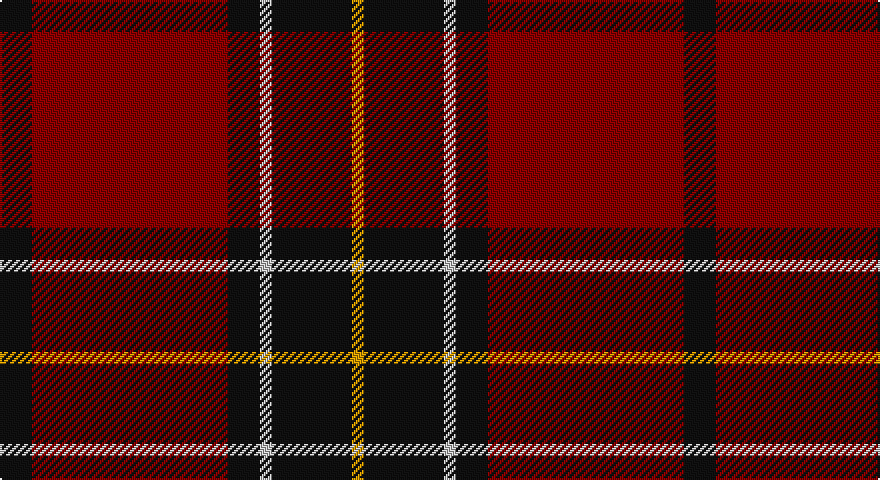

This page is one **sett** — a single exact thread-count. It belongs to the [tartan](/setts/k8r49k8lb3k20lo3/)
(the same proportion at any scale), whose colour order is pattern [KRKWKY](/stripes/krkwky/).

Part of the [Dunbar](/tartans/dunbar/) tartan — the named design grouping this sett with its other cloths.

Sourced from tartans-authority.  It is a [6 stripe tartan](/stripes/stripes6/).

Original link http://www.tartansauthority.com/tartan-ferret/display/2011/

## Also known as

This cloth is also recorded under:

- Dunbar #2
- Dunbar Ancient
- Dunbar Plaid
- Dunbar, Plaid

## Register references

External register numbers recorded for this tartan.

- Scottish Tartans Authority (ITI): 2011

## Thread count
K/16 DR98 K16 N6 K40 DY/6

One full sett is **342 threads**.

## Palette

Palette: <strong>Tartan Register</strong> <small style="color:#888">(3 of 4 colours)</small>
<table><thead><tr><th>Colour</th><th>Threads</th><th>Shade</th><th>Base</th><th>OKLCh</th></tr></thead><tbody><tr><td>K/</td><td style="text-align:right;font-variant-numeric:tabular-nums">16</td><td><code style="background-color:#101010;">#101010</code> <small style="color:#888">#101010</small></td><td>K <code style="background-color:#000000;">#000000</code></td><td><small style="color:#888">oklch(17.3% 0.000 89.9)</small></td></tr><tr><td>DR</td><td style="text-align:right;font-variant-numeric:tabular-nums">98</td><td><code style="background-color:#880000;">#880000</code> <small style="color:#888">#880000</small></td><td>R <code style="background-color:#CC0000;">#CC0000</code></td><td><small style="color:#888">oklch(39.4% 0.162 29.2)</small></td></tr><tr><td>K</td><td style="text-align:right;font-variant-numeric:tabular-nums">16</td><td><code style="background-color:#101010;">#101010</code> <small style="color:#888">#101010</small></td><td>K <code style="background-color:#000000;">#000000</code></td><td><small style="color:#888">oklch(17.3% 0.000 89.9)</small></td></tr><tr><td>N</td><td style="text-align:right;font-variant-numeric:tabular-nums">6</td><td><code style="background-color:#C0C0C0;">#C0C0C0</code> <small style="color:#888">#C0C0C0</small></td><td>W <code style="background-color:#F7F7F7;">#F7F7F7</code></td><td><small style="color:#888">oklch(80.8% 0.000 89.9)</small></td></tr><tr><td>K</td><td style="text-align:right;font-variant-numeric:tabular-nums">40</td><td><code style="background-color:#101010;">#101010</code> <small style="color:#888">#101010</small></td><td>K <code style="background-color:#000000;">#000000</code></td><td><small style="color:#888">oklch(17.3% 0.000 89.9)</small></td></tr><tr><td>DY/</td><td style="text-align:right;font-variant-numeric:tabular-nums">6</td><td><code style="background-color:#D09800;">#D09800</code> <small style="color:#888">#D09800</small></td><td>Y <code style="background-color:#F2BF00;">#F2BF00</code></td><td><small style="color:#888">oklch(71.4% 0.147 82.1)</small></td></tr></tbody></table>

# Sample pattern

## Compared to the master

This cloth is one sett of its design; the master sett (the exemplar the design is anchored on) is below for comparison.

<figure style="margin:0"><figcaption style="color:#888;font-size:smaller">this sett</figcaption></figure>
<figure style="margin:0"><figcaption style="color:#888;font-size:smaller"><a href="/setts/r28k4w2k13/">master sett →</a></figcaption></figure>

## Nearest tartans

The nearest existing variants by ΔTartan distance, with this tartan at the top so the swatches line up against it.

ΔTartan

Tartan

Sett

—

<a href="/ttd/edit/#slug=k8r49k8lb3k20lo3~x2">Dunbar (District)</a> <a class="nn-out" href="/variants/s6/k8r49k8lb3k20lo3~x2/" title="open its dictionary page">↗</a>

0.87

<a href="/ttd/edit/#slug=o3k14r3k14t3r32k2r6k2~x2&amp;base=k8r49k8lb3k20lo3~x2">Gallmore (Fashion)</a> <a class="nn-out" href="/variants/s9/o3k14r3k14t3r32k2r6k2~x2/" title="open its dictionary page">↗</a>

0.98

<a href="/variants/s6/k50dt3ly3r50~x2/">Hungerford RFC</a>

1.13

<a href="/ttd/edit/#slug=k2r16dg6r3dg8lr1~x2&amp;base=k8r49k8lb3k20lo3~x2">MacAulay</a> <a class="nn-out" href="/variants/s6/k2r16dg6r3dg8lr1~x2/" title="open its dictionary page">↗</a>

1.13

<a href="/ttd/edit/#slug=k2r16dg6r3dg8lr1&amp;base=k8r49k8lb3k20lo3~x2">MacAulay</a> <a class="nn-out" href="/variants/s6/k2r16dg6r3dg8lr1/" title="open its dictionary page">↗</a>

1.17

<a href="/ttd/edit/#slug=r5m2r30k28w2k4~x2&amp;base=k8r49k8lb3k20lo3~x2">Ramsay Red Clan Tartan</a> <a class="nn-out" href="/variants/s6/r5m2r30k28w2k4~x2/" title="open its dictionary page">↗</a>

1.21

<a href="/ttd/edit/#slug=m18g9m2g3k1w1~x4&amp;base=k8r49k8lb3k20lo3~x2">MacGregor of Cardney</a> <a class="nn-out" href="/variants/s6/m18g9m2g3k1w1~x4/" title="open its dictionary page">↗</a>

1.23

<a href="/ttd/edit/#slug=k50dt3ly3r50~x2&amp;base=k8r49k8lb3k20lo3~x2">Hungerford RFC (Corporate)</a> <a class="nn-out" href="/variants/s4/k50dt3ly3r50~x2/" title="open its dictionary page">↗</a>

1.23

<a href="/ttd/edit/#slug=r28db12r3dg20t2dg2r7~x2&amp;base=k8r49k8lb3k20lo3~x2">Carrick (Strathmore) District Tartan</a> <a class="nn-out" href="/variants/s7/r28db12r3dg20t2dg2r7~x2/" title="open its dictionary page">↗</a>

1.23

<a href="/ttd/edit/#slug=r1db6r1dg6r12lr1~x2&amp;base=k8r49k8lb3k20lo3~x2">Fraser VS</a> <a class="nn-out" href="/variants/s6/r1db6r1dg6r12lr1~x2/" title="open its dictionary page">↗</a>

1.29

<a href="/ttd/edit/#slug=k4r2k22r22k3r4lb2~x2&amp;base=k8r49k8lb3k20lo3~x2">Menzies of Culdares</a> <a class="nn-out" href="/variants/s7/k4r2k22r22k3r4lb2~x2/" title="open its dictionary page">↗</a>

## Neighbour map

Every grey dot is one of 14360 variants placed by the first two principal components of the ΔTartan feature space (44% of its variance). Red is this tartan; blue dots are its nearest — click one to open its page.

<svg viewBox="0 0 640 380" role="img" style="max-width:100%;height:auto;border:1px solid #e0e0e0;border-radius:4px;display:block" xmlns="http://www.w3.org/2000/svg"><image href="/nn/cloud.v1.png" width="640" height="380"/><a href="/variants/s9/o3k14r3k14t3r32k2r6k2~x2/"><circle cx="356.9" cy="168.8" r="4" fill="#3465a4"><title>Gallmore (Fashion)</title></circle></a><a href="/variants/s6/k50dt3ly3r50~x2/"><circle cx="328.1" cy="175.7" r="4" fill="#3465a4"><title>Hungerford RFC</title></circle></a><a href="/variants/s6/k2r16dg6r3dg8lr1~x2/"><circle cx="342.2" cy="198.2" r="4" fill="#3465a4"><title>MacAulay</title></circle></a><a href="/variants/s6/k2r16dg6r3dg8lr1/"><circle cx="342.2" cy="198.2" r="4" fill="#3465a4"><title>MacAulay</title></circle></a><a href="/variants/s6/r5m2r30k28w2k4~x2/"><circle cx="324.6" cy="169.5" r="4" fill="#3465a4"><title>Ramsay Red Clan Tartan</title></circle></a><a href="/variants/s6/m18g9m2g3k1w1~x4/"><circle cx="395.4" cy="173.6" r="4" fill="#3465a4"><title>MacGregor of Cardney</title></circle></a><a href="/variants/s4/k50dt3ly3r50~x2/"><circle cx="355.3" cy="221.8" r="4" fill="#3465a4"><title>Hungerford RFC (Corporate)</title></circle></a><a href="/variants/s7/r28db12r3dg20t2dg2r7~x2/"><circle cx="308.1" cy="185.9" r="4" fill="#3465a4"><title>Carrick (Strathmore) District Tartan</title></circle></a><a href="/variants/s6/r1db6r1dg6r12lr1~x2/"><circle cx="298.2" cy="197.8" r="4" fill="#3465a4"><title>Fraser VS</title></circle></a><a href="/variants/s7/k4r2k22r22k3r4lb2~x2/"><circle cx="370.5" cy="219.0" r="4" fill="#3465a4"><title>Menzies of Culdares</title></circle></a><circle cx="370.9" cy="183.5" r="5" fill="#c00000"/></svg>

ID: /variants/s6/k8r49k8lb3k20lo3~x2/
