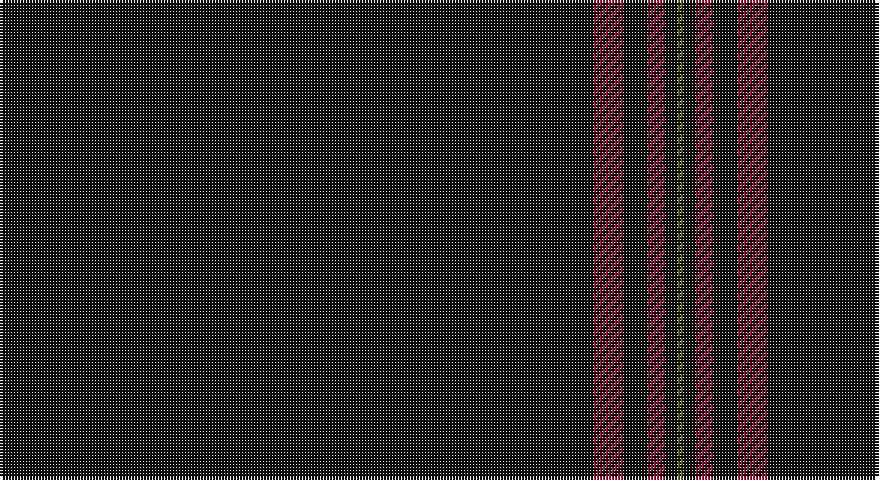

This page is one **sett** — a single exact thread-count. It belongs to the [tartan](/setts/k99r5k4r3k2y1/)
(the same proportion at any scale), whose colour order is pattern [GKRKRK](/stripes/gkrkrk/).

Sourced from register-of-tartans.  It is a [6 stripe tartan](/stripes/stripes6/).

Original link https://www.tartanregister.gov.uk/tartanDetails.aspx?ref=61

2 attestations — the source records this cloth was collapsed from (oldest owns this page)

<ul>
<li>01/09/2007 — Allt Dubh (Black Burn) (register-of-tartans, <a href="https://www.tartanregister.gov.uk/tartanDetails.aspx?ref=61">record</a>)</li>
<li>September 2007 — Allt Dubh (Fashion) (tartans-authority, <a href="http://www.tartansauthority.com/tartan-ferret/display/7296/">record</a>)</li>
</ul>

## Register references

External register numbers recorded for this tartan.

- Scottish Register of Tartans: [61](https://www.tartanregister.gov.uk/tartanDetails.aspx?ref=61)
- Scottish Tartans Authority (ITI): 7296

## Thread count
K/198 DR10 K8 DR6 K4 G/2

One full sett is **256 threads**.

## Palette

Palette: <strong>Tartan Register</strong>
<table><thead><tr><th>Colour</th><th>Threads</th><th>Shade</th><th>Base</th><th>OKLCh</th></tr></thead><tbody><tr><td>K/</td><td style="text-align:right;font-variant-numeric:tabular-nums">198</td><td><code style="background-color:#101010;">#101010</code> <small style="color:#888">#101010</small></td><td>K <code style="background-color:#000000;">#000000</code></td><td><small style="color:#888">oklch(17.3% 0.000 89.9)</small></td></tr><tr><td>DR</td><td style="text-align:right;font-variant-numeric:tabular-nums">10</td><td><code style="background-color:#901C38;">#901C38</code> <small style="color:#888">#901C38</small></td><td>R <code style="background-color:#CC0000;">#CC0000</code></td><td><small style="color:#888">oklch(43.2% 0.150 13.1)</small></td></tr><tr><td>K</td><td style="text-align:right;font-variant-numeric:tabular-nums">8</td><td><code style="background-color:#101010;">#101010</code> <small style="color:#888">#101010</small></td><td>K <code style="background-color:#000000;">#000000</code></td><td><small style="color:#888">oklch(17.3% 0.000 89.9)</small></td></tr><tr><td>DR</td><td style="text-align:right;font-variant-numeric:tabular-nums">6</td><td><code style="background-color:#901C38;">#901C38</code> <small style="color:#888">#901C38</small></td><td>R <code style="background-color:#CC0000;">#CC0000</code></td><td><small style="color:#888">oklch(43.2% 0.150 13.1)</small></td></tr><tr><td>K</td><td style="text-align:right;font-variant-numeric:tabular-nums">4</td><td><code style="background-color:#101010;">#101010</code> <small style="color:#888">#101010</small></td><td>K <code style="background-color:#000000;">#000000</code></td><td><small style="color:#888">oklch(17.3% 0.000 89.9)</small></td></tr><tr><td>G/</td><td style="text-align:right;font-variant-numeric:tabular-nums">2</td><td><code style="background-color:#5C6428;">#5C6428</code> <small style="color:#888">#5C6428</small></td><td>G <code style="background-color:#006100;">#006100</code></td><td><small style="color:#888">oklch(48.3% 0.084 116.0)</small></td></tr></tbody></table>

# Sample pattern

## Nearest tartans

The nearest existing variants by ΔTartan distance, with this tartan at the top so the swatches line up against it.

ΔTartan

Tartan

Sett

—

<a href="/ttd/edit/#slug=k99r5k4r3k2y1~x2">Allt Dubh (Black Burn)</a> <a class="nn-out" href="/variants/s6/k99r5k4r3k2y1~x2/" title="open its dictionary page">↗</a>

1.06

<a href="/ttd/edit/#slug=k200dy3lo3dy3lo3&amp;base=k99r5k4r3k2y1~x2">SmartWool</a> <a class="nn-out" href="/variants/s5/k200dy3lo3dy3lo3/" title="open its dictionary page">↗</a>

1.43

<a href="/ttd/edit/#slug=k50r1db3dp1~x4&amp;base=k99r5k4r3k2y1~x2">Alich (Personal)</a> <a class="nn-out" href="/variants/s4/k50r1db3dp1~x4/" title="open its dictionary page">↗</a>

1.48

<a href="/ttd/edit/#slug=k50r1dt3dp1~x4&amp;base=k99r5k4r3k2y1~x2">Alich (Personal)</a> <a class="nn-out" href="/variants/s4/k50r1dt3dp1~x4/" title="open its dictionary page">↗</a>

1.64

<a href="/ttd/edit/#slug=k100dp5k4dp3k2y1k2dp2k4dp5~x2&amp;base=k99r5k4r3k2y1~x2">Webster, Colin Wesley (Personal)</a> <a class="nn-out" href="/variants/s10/k100dp5k4dp3k2y1k2dp2k4dp5~x2/" title="open its dictionary page">↗</a>

1.68

<a href="/ttd/edit/#slug=r2k50n2r1~x2&amp;base=k99r5k4r3k2y1~x2">Galloway (Name)</a> <a class="nn-out" href="/variants/s4/r2k50n2r1~x2/" title="open its dictionary page">↗</a>

1.82

<a href="/ttd/edit/#slug=dg60r2dg8r1dg5k2&amp;base=k99r5k4r3k2y1~x2">St. David's (District)</a> <a class="nn-out" href="/variants/s6/dg60r2dg8r1dg5k2/" title="open its dictionary page">↗</a>

2.43

<a href="/ttd/edit/#slug=do88o3ly2k2lr1~x2&amp;base=k99r5k4r3k2y1~x2">Eternity, Dedicated 2 Weddings</a> <a class="nn-out" href="/variants/s5/do88o3ly2k2lr1~x2/" title="open its dictionary page">↗</a>

2.44

<a href="/ttd/edit/#slug=k8ly3k120ly3k40t2k4~x2&amp;base=k99r5k4r3k2y1~x2">Lochaber (Hesketh)</a> <a class="nn-out" href="/variants/s7/k8ly3k120ly3k40t2k4~x2/" title="open its dictionary page">↗</a>

2.65

<a href="/ttd/edit/#slug=k75r1k4n15k2n1k3db1k2r1~x2&amp;base=k99r5k4r3k2y1~x2">Selkirk Silver Band (Corporate)</a> <a class="nn-out" href="/variants/s10/k75r1k4n15k2n1k3db1k2r1~x2/" title="open its dictionary page">↗</a>

2.69

<a href="/ttd/edit/#slug=k184r1k2r2k2r1k2w1k6w1k4r10k20&amp;base=k99r5k4r3k2y1~x2">Edinburgh International Film Festival</a> <a class="nn-out" href="/variants/s13/k184r1k2r2k2r1k2w1k6w1k4r10k20/" title="open its dictionary page">↗</a>

## Neighbour map

Every grey dot is one of 14360 variants placed by the first two principal components of the ΔTartan feature space (44% of its variance). Red is this tartan; blue dots are its nearest — click one to open its page.

<svg viewBox="0 0 640 380" role="img" style="max-width:100%;height:auto;border:1px solid #e0e0e0;border-radius:4px;display:block" xmlns="http://www.w3.org/2000/svg"><image href="/nn/cloud.v1.png" width="640" height="380"/><a href="/variants/s5/k200dy3lo3dy3lo3/"><circle cx="626.0" cy="190.9" r="4" fill="#3465a4"><title>SmartWool</title></circle></a><a href="/variants/s4/k50r1db3dp1~x4/"><circle cx="626.0" cy="213.2" r="4" fill="#3465a4"><title>Alich (Personal)</title></circle></a><a href="/variants/s4/k50r1dt3dp1~x4/"><circle cx="626.0" cy="216.9" r="4" fill="#3465a4"><title>Alich (Personal)</title></circle></a><a href="/variants/s10/k100dp5k4dp3k2y1k2dp2k4dp5~x2/"><circle cx="626.0" cy="148.0" r="4" fill="#3465a4"><title>Webster, Colin Wesley (Personal)</title></circle></a><a href="/variants/s4/r2k50n2r1~x2/"><circle cx="626.0" cy="204.2" r="4" fill="#3465a4"><title>Galloway (Name)</title></circle></a><a href="/variants/s6/dg60r2dg8r1dg5k2/"><circle cx="626.0" cy="199.7" r="4" fill="#3465a4"><title>St. David's (District)</title></circle></a><a href="/variants/s5/do88o3ly2k2lr1~x2/"><circle cx="626.0" cy="154.9" r="4" fill="#3465a4"><title>Eternity, Dedicated 2 Weddings</title></circle></a><a href="/variants/s7/k8ly3k120ly3k40t2k4~x2/"><circle cx="626.0" cy="169.4" r="4" fill="#3465a4"><title>Lochaber (Hesketh)</title></circle></a><a href="/variants/s10/k75r1k4n15k2n1k3db1k2r1~x2/"><circle cx="626.0" cy="128.0" r="4" fill="#3465a4"><title>Selkirk Silver Band (Corporate)</title></circle></a><a href="/variants/s13/k184r1k2r2k2r1k2w1k6w1k4r10k20/"><circle cx="626.0" cy="111.8" r="4" fill="#3465a4"><title>Edinburgh International Film Festival</title></circle></a><circle cx="626.0" cy="193.3" r="5" fill="#c00000"/></svg>

ID: /variants/s6/k99r5k4r3k2y1~x2/
