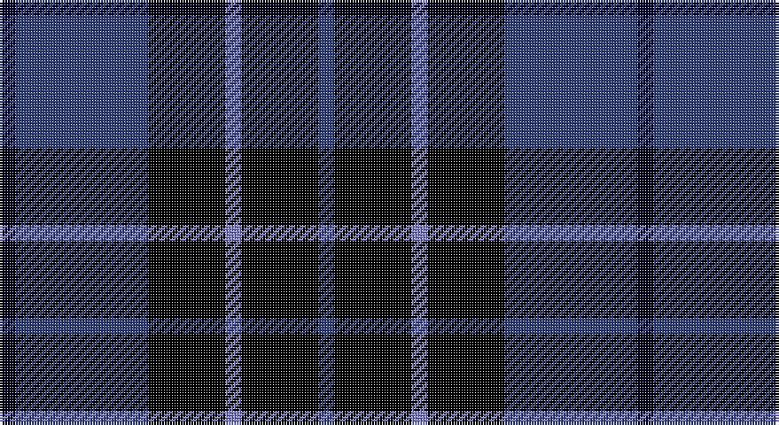

This page is one **sett** — a single exact thread-count. It belongs to the [tartan](/setts/ki6db50k29b6k29db6/)
(the same proportion at any scale), whose colour order is pattern [BKBKBK](/stripes/bkbkbk/).

Part of the [Scottish Express International](/tartans/scottish-express-international/) tartan — the named design grouping this sett with its other cloths.

Sourced from weddslist.  It is a [6 stripe tartan](/stripes/stripes6/).

Original link http://www.weddslist.com/cgi-bin/tartans/pg.pl?source=sts

## Also known as

This cloth is also recorded under:

- Scottish Express International (Corp

## Thread count
DB/6 Ba50 K29 B6 K29 Ba/6

One full sett is **240 threads**.

## Palette

Palette: <strong>Ingles Buchan</strong> <small style="color:#888">(1 of 4 colours)</small>
<table><thead><tr><th>Colour</th><th>Threads</th><th>Shade</th><th>Base</th><th>OKLCh</th></tr></thead><tbody><tr><td>DB/</td><td style="text-align:right;font-variant-numeric:tabular-nums">6</td><td><code style="background-color:#000030;">#000030</code> <small style="color:#888">#000030</small></td><td>K <code style="background-color:#000000;">#000000</code></td><td><small style="color:#888">oklch(14.0% 0.097 264.1)</small></td></tr><tr><td>Ba</td><td style="text-align:right;font-variant-numeric:tabular-nums">50</td><td><code style="background-color:#304080;">#304080</code> <small style="color:#888">#304080</small></td><td>B <code style="background-color:#2A418A;">#2A418A</code></td><td><small style="color:#888">oklch(39.4% 0.109 270.2)</small></td></tr><tr><td>K</td><td style="text-align:right;font-variant-numeric:tabular-nums">29</td><td><code style="background-color:#000000;">#000000</code> <small style="color:#888">#000000</small></td><td>K <code style="background-color:#000000;">#000000</code></td><td><small style="color:#888">oklch(0.0% 0.000 0.0)</small></td></tr><tr><td>B</td><td style="text-align:right;font-variant-numeric:tabular-nums">6</td><td><code style="background-color:#8080D0;">#8080D0</code> <small style="color:#888">#8080D0</small></td><td>B <code style="background-color:#2A418A;">#2A418A</code></td><td><small style="color:#888">oklch(63.4% 0.119 282.5)</small></td></tr><tr><td>K</td><td style="text-align:right;font-variant-numeric:tabular-nums">29</td><td><code style="background-color:#000000;">#000000</code> <small style="color:#888">#000000</small></td><td>K <code style="background-color:#000000;">#000000</code></td><td><small style="color:#888">oklch(0.0% 0.000 0.0)</small></td></tr><tr><td>Ba/</td><td style="text-align:right;font-variant-numeric:tabular-nums">6</td><td><code style="background-color:#304080;">#304080</code> <small style="color:#888">#304080</small></td><td>B <code style="background-color:#2A418A;">#2A418A</code></td><td><small style="color:#888">oklch(39.4% 0.109 270.2)</small></td></tr></tbody></table>

# Sample pattern

## Compared to the master

This cloth is one sett of its design; the master sett (the exemplar the design is anchored on) is below for comparison.

<figure style="margin:0"><figcaption style="color:#888;font-size:smaller">this sett</figcaption></figure>
<figure style="margin:0"><figcaption style="color:#888;font-size:smaller"><a href="/setts/k1db7k4lb1k4p1/">master sett →</a></figcaption></figure>

## Nearest tartans

The nearest existing variants by ΔTartan distance, with this tartan at the top so the swatches line up against it.

ΔTartan

Tartan

Sett

—

<a href="/ttd/edit/#slug=ki6db50k29b6k29db6">Scottish Express International</a> <a class="nn-out" href="/variants/s6/ki6db50k29b6k29db6/" title="open its dictionary page">↗</a>

0.79

<a href="/ttd/edit/#slug=k6lo2k16t6k3db18k2~x2&amp;base=ki6db50k29b6k29db6">Carrick High School</a> <a class="nn-out" href="/variants/s7/k6lo2k16t6k3db18k2~x2/" title="open its dictionary page">↗</a>

0.87

<a href="/ttd/edit/#slug=k1db12k12g1k12db12w1~x4&amp;base=ki6db50k29b6k29db6">Marchmont</a> <a class="nn-out" href="/variants/s7/k1db12k12g1k12db12w1~x4/" title="open its dictionary page">↗</a>

0.95

<a href="/ttd/edit/#slug=k4dg3dp18k18lb2~x2&amp;base=ki6db50k29b6k29db6">Wcwm 1106-2</a> <a class="nn-out" href="/variants/s5/k4dg3dp18k18lb2~x2/" title="open its dictionary page">↗</a>

1.03

<a href="/ttd/edit/#slug=n6db3n6db20k20db8w4~x2&amp;base=ki6db50k29b6k29db6">Allianz Deutschland 2012</a> <a class="nn-out" href="/variants/s7/n6db3n6db20k20db8w4~x2/" title="open its dictionary page">↗</a>

1.04

<a href="/ttd/edit/#slug=k15lo2k10db18lb3~x2&amp;base=ki6db50k29b6k29db6">College of Radiographers</a> <a class="nn-out" href="/variants/s5/k15lo2k10db18lb3~x2/" title="open its dictionary page">↗</a>

1.15

<a href="/ttd/edit/#slug=k15y2k10db18w3~x2&amp;base=ki6db50k29b6k29db6">College of Radiographers</a> <a class="nn-out" href="/variants/s5/k15y2k10db18w3~x2/" title="open its dictionary page">↗</a>

1.20

<a href="/variants/s8/k7r2k2ki6lo1ki1lo1ki4~x4/">Printing Industries of America</a>

1.21

<a href="/ttd/edit/#slug=k15ly2k10db18w3~x2&amp;base=ki6db50k29b6k29db6">College of Radiographers Corporate Tartan</a> <a class="nn-out" href="/variants/s5/k15ly2k10db18w3~x2/" title="open its dictionary page">↗</a>

1.30

<a href="/ttd/edit/#slug=k21db3k12r2db12k2db12w2~x2&amp;base=ki6db50k29b6k29db6">Inverness Caledonian Thistle Football Club</a> <a class="nn-out" href="/variants/s8/k21db3k12r2db12k2db12w2~x2/" title="open its dictionary page">↗</a>

1.35

<a href="/ttd/edit/#slug=g1k9t4db9t1~x6&amp;base=ki6db50k29b6k29db6">Wallace Blue Dress Tartan</a> <a class="nn-out" href="/variants/s5/g1k9t4db9t1~x6/" title="open its dictionary page">↗</a>

## Neighbour map

Every grey dot is one of 14360 variants placed by the first two principal components of the ΔTartan feature space (44% of its variance). Red is this tartan; blue dots are its nearest — click one to open its page.

<svg viewBox="0 0 640 380" role="img" style="max-width:100%;height:auto;border:1px solid #e0e0e0;border-radius:4px;display:block" xmlns="http://www.w3.org/2000/svg"><image href="/nn/cloud.v1.png" width="640" height="380"/><a href="/variants/s7/k6lo2k16t6k3db18k2~x2/"><circle cx="249.8" cy="219.1" r="4" fill="#3465a4"><title>Carrick High School</title></circle></a><a href="/variants/s7/k1db12k12g1k12db12w1~x4/"><circle cx="284.5" cy="219.2" r="4" fill="#3465a4"><title>Marchmont</title></circle></a><a href="/variants/s5/k4dg3dp18k18lb2~x2/"><circle cx="271.6" cy="232.6" r="4" fill="#3465a4"><title>Wcwm 1106-2</title></circle></a><a href="/variants/s7/n6db3n6db20k20db8w4~x2/"><circle cx="199.7" cy="237.6" r="4" fill="#3465a4"><title>Allianz Deutschland 2012</title></circle></a><a href="/variants/s5/k15lo2k10db18lb3~x2/"><circle cx="273.6" cy="254.0" r="4" fill="#3465a4"><title>College of Radiographers</title></circle></a><a href="/variants/s5/k15y2k10db18w3~x2/"><circle cx="250.4" cy="241.6" r="4" fill="#3465a4"><title>College of Radiographers</title></circle></a><a href="/variants/s8/k7r2k2ki6lo1ki1lo1ki4~x4/"><circle cx="231.3" cy="237.8" r="4" fill="#3465a4"><title>Printing Industries of America</title></circle></a><a href="/variants/s5/k15ly2k10db18w3~x2/"><circle cx="267.1" cy="245.9" r="4" fill="#3465a4"><title>College of Radiographers Corporate Tartan</title></circle></a><a href="/variants/s8/k21db3k12r2db12k2db12w2~x2/"><circle cx="310.7" cy="228.6" r="4" fill="#3465a4"><title>Inverness Caledonian Thistle Football Club</title></circle></a><a href="/variants/s5/g1k9t4db9t1~x6/"><circle cx="183.9" cy="234.3" r="4" fill="#3465a4"><title>Wallace Blue Dress Tartan</title></circle></a><circle cx="255.8" cy="236.0" r="5" fill="#c00000"/></svg>

ID: /variants/s6/ki6db50k29b6k29db6/
