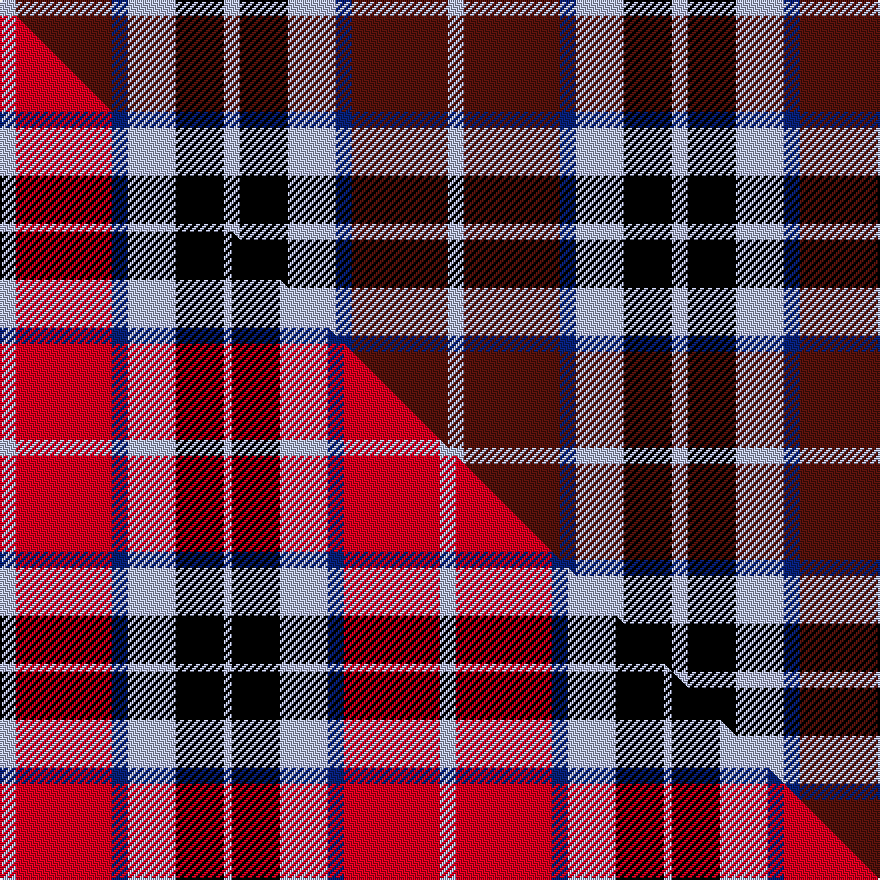

This page is one **sett** — a single exact thread-count. It belongs to the [tartan](/setts/lb1dr6db1lb3k3lb1/)
(the same proportion at any scale), whose colour order is pattern [WBBWKW](/stripes/wbbwkw/).

Part of the [MacTavish](/tartans/mactavish/) tartan — the named design grouping this sett with its other cloths.

Sourced from register-of-tartans.  It is a [6 stripe tartan](/stripes/stripes6/).

Original link https://www.tartanregister.gov.uk/tartanDetails.aspx?ref=4840

2 attestations — the source records this cloth was collapsed from (oldest owns this page)

<ul>
<li>01/01/1906 — MacTavish #2 (register-of-tartans, <a href="https://www.tartanregister.gov.uk/tartanDetails.aspx?ref=4840">record</a>)  <em>This is MacTavish as it appeared in W & A K Johnston's 1906 publication 'Tartans of the Clans & Septs of Scotland'. In October 2003 however, Lord Lyon was requested to record this as the official MacTavish tartan and not #229 (original Scottish Tartans Authority reference) which was previously regarded as the official tartan. The only difference in #229 (original Scottish Tartans Authority reference) is that the line between the azure and red is black instead of blue. This was confirmed by the Chief to the Scottish Tartans Authority at Stone Mountain Games, October 2003.</em></li>
<li>1906 — MacTavish (Clan) (tartans-authority, <a href="http://www.tartansauthority.com/tartan-ferret/display/3598/">record</a>)  <em>This is MacTavish as it appeared in W & A K Johnston's 1906 publication "Tartans of the Clans & Septs of Scotland". In October 2003 however, Lord Lyon was requested to record this as the official MacTavish tartan and not #229 which was previously regarded as the official tartan! The only difference in 229 is that the line between the azure and red is black instead of blue.This was confirmed by the Chief to Brian Wilton at Stone Mountain Games, October 2003.</em></li>
</ul>

## Register references

External register numbers recorded for this tartan.

- Scottish Register of Tartans: [4840](https://www.tartanregister.gov.uk/tartanDetails.aspx?ref=4840)
- Scottish Tartans Authority (ITI): 3598

## Thread count
LB/8 DR48 DB8 LB24 K24 LB/8

One full sett is **224 threads**.

## Palette
<table><thead><tr><th>Colour</th><th>Shade</th><th>OKLCh</th></tr></thead><tbody><tr><td>LB</td><td><code style="background-color:#B5BBDE;">#B5BBDE</code> <small style="color:#888">#B5BBDE</small></td><td><small style="color:#888">oklch(79.9% 0.050 277.6)</small></td></tr><tr><td>DB</td><td><code style="background-color:#082077;">#082077</code> <small style="color:#888">#082077</small></td><td><small style="color:#888">oklch(30.0% 0.149 265.1)</small></td></tr><tr><td>DR</td><td><code style="background-color:#55120C;">#55120C</code> <small style="color:#888">#55120C</small></td><td><small style="color:#888">oklch(30.0% 0.099 29.3)</small></td></tr><tr><td>K</td><td><code style="background-color:#000000;">#000000</code> <small style="color:#888">#000000</small></td><td><small style="color:#888">oklch(0.0% 0.000 0.0)</small></td></tr></tbody></table>

# Sample pattern

## Compared to the master

This cloth is one sett of its design; the master sett (the exemplar the design is anchored on) is below for comparison.

Its **ΔTartan distance** from the master is **1.66** — the same measure the nearest-tartans table ranks by (0 is identical; a re-scale of the same cloth is near 0, a recolour or a different proportion further).

<figure class="master-compare" style="margin:0">

this sett
master sett ★

<figcaption style="color:#888;font-size:smaller">One weave of this sett against the <a href="/setts/lb2r12db2lb6k6lb1/">master sett ★</a>, split on the diagonal: a shared proportion runs seamlessly across it with only the shades shifting; a different proportion breaks on it.</figcaption>
</figure>

## Nearest variants

The nearest existing variants by ΔTartan distance, with this cloth at the top so the swatches line up against it.

ΔTartan

Threads

Variant

Sett

—

224

<a href="/variants/s6/lb1dr6db1lb3k3lb1~x8/">MacTavish #2</a>

<a href="/ttd/edit/#slug=g6db11lb8k4lb8k27lb4r4~x2&amp;base=lb1dr6db1lb3k3lb1~x8" title="compare in the TTD">2.26</a>

268

<a href="/variants/s8/g6db11lb8k4lb8k27lb4r4~x2/">Kervegant, Suzanne (Personal)</a>

<a href="/ttd/edit/#slug=r2dy8db2lb4k4lb1~x6&amp;base=lb1dr6db1lb3k3lb1~x8" title="compare in the TTD">2.54</a>

234

<a href="/variants/s6/r2dy8db2lb4k4lb1~x6/">Thompson's Fancy Personal Tartan</a>

<a href="/ttd/edit/#slug=r2o8db2lb4k4lb1~x6&amp;base=lb1dr6db1lb3k3lb1~x8" title="compare in the TTD">2.54</a>

234

<a href="/variants/s6/r2o8db2lb4k4lb1~x6/">Thom(p)son's, Fancy</a>

<a href="/ttd/edit/#slug=dr1dy6db2lb4k4lb1~x6&amp;base=lb1dr6db1lb3k3lb1~x8" title="compare in the TTD">2.57</a>

204

<a href="/variants/s6/dr1dy6db2lb4k4lb1~x6/">Thompson's Fancy (Fashion)</a>

## Neighbour map

Every grey dot is one of 13620 variants placed by the first two principal components of the ΔTartan feature space (42% of its variance). Red is this tartan; blue dots are its nearest — click one to open its page.

<svg viewBox="0 0 640 380" role="img" style="max-width:100%;height:auto;border:1px solid #e0e0e0;border-radius:4px;display:block" xmlns="http://www.w3.org/2000/svg"><image href="/nn/cloud.v1.png" width="640" height="380"/><a href="/variants/s8/g6db11lb8k4lb8k27lb4r4~x2/"><circle cx="131.6" cy="185.0" r="4" fill="#3465a4"><title>Kervegant, Suzanne (Personal)</title></circle></a><a href="/variants/s6/r2dy8db2lb4k4lb1~x6/"><circle cx="121.0" cy="208.4" r="4" fill="#3465a4"><title>Thompson's Fancy Personal Tartan</title></circle></a><a href="/variants/s6/r2o8db2lb4k4lb1~x6/"><circle cx="122.1" cy="207.0" r="4" fill="#3465a4"><title>Thom(p)son's, Fancy</title></circle></a><a href="/variants/s6/dr1dy6db2lb4k4lb1~x6/"><circle cx="91.0" cy="226.7" r="4" fill="#3465a4"><title>Thompson's Fancy (Fashion)</title></circle></a><circle cx="156.5" cy="223.0" r="5" fill="#c00000"/><text x="320" y="376" text-anchor="middle" font-size="11" fill="#999">ground</text><text x="11" y="190" text-anchor="middle" font-size="11" fill="#999" transform="rotate(-90 11 190)">complexity</text></svg>

ID: /variants/s6/lb1dr6db1lb3k3lb1~x8/
