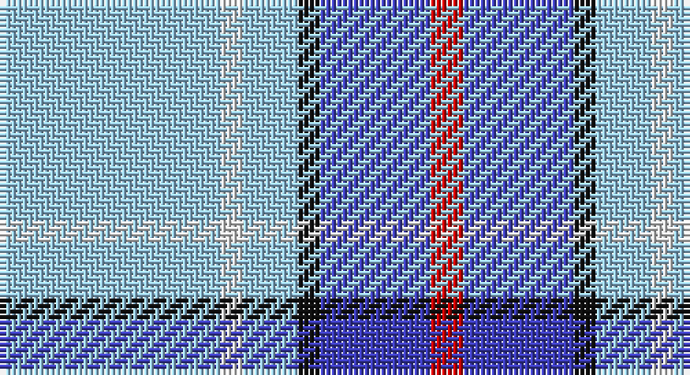

This page is one **sett** — a single exact thread-count. It belongs to the [tartan](/setts/lb20w2lb5k2b10r3/)
(the same proportion at any scale), whose colour order is pattern [RBKWWW](/stripes/rbkwww/).

Sourced from tartans-authority.  It is a [6 stripe tartan](/stripes/stripes6/).

Original link http://www.tartansauthority.com/tartan-ferret/display/8261/

## Register references

External register numbers recorded for this tartan.

- Scottish Register of Tartans: [8261](https://www.tartanregister.gov.uk/tartanDetails?ref=8261)
- Scottish Tartans Authority (ITI): 8261

## Thread count
LB/40 LN4 LB10 K4 B20 R/6

One full sett is **122 threads**.

## Palette

Palette: <strong>Tartan Register</strong> <small style="color:#888">(4 of 5 colours)</small>
<table><thead><tr><th>Colour</th><th>Threads</th><th>Shade</th><th>Base</th><th>OKLCh</th></tr></thead><tbody><tr><td>LB/</td><td style="text-align:right;font-variant-numeric:tabular-nums">40</td><td><code style="background-color:#98C8E8;">#98C8E8</code> <small style="color:#888">#98C8E8</small></td><td>W <code style="background-color:#F7F7F7;">#F7F7F7</code></td><td><small style="color:#888">oklch(81.0% 0.068 237.9)</small></td></tr><tr><td>LN</td><td style="text-align:right;font-variant-numeric:tabular-nums">4</td><td><code style="background-color:#E0E0E0;">#E0E0E0</code> <small style="color:#888">#E0E0E0</small></td><td>W <code style="background-color:#F7F7F7;">#F7F7F7</code></td><td><small style="color:#888">oklch(90.7% 0.000 89.9)</small></td></tr><tr><td>LB</td><td style="text-align:right;font-variant-numeric:tabular-nums">10</td><td><code style="background-color:#98C8E8;">#98C8E8</code> <small style="color:#888">#98C8E8</small></td><td>W <code style="background-color:#F7F7F7;">#F7F7F7</code></td><td><small style="color:#888">oklch(81.0% 0.068 237.9)</small></td></tr><tr><td>K</td><td style="text-align:right;font-variant-numeric:tabular-nums">4</td><td><code style="background-color:#101010;">#101010</code> <small style="color:#888">#101010</small></td><td>K <code style="background-color:#000000;">#000000</code></td><td><small style="color:#888">oklch(17.3% 0.000 89.9)</small></td></tr><tr><td>B</td><td style="text-align:right;font-variant-numeric:tabular-nums">20</td><td><code style="background-color:#3C3CB8;">#3C3CB8</code> <small style="color:#888">#3C3CB8</small></td><td>B <code style="background-color:#2A418A;">#2A418A</code></td><td><small style="color:#888">oklch(44.1% 0.190 275.3)</small></td></tr><tr><td>R/</td><td style="text-align:right;font-variant-numeric:tabular-nums">6</td><td><code style="background-color:#C80000;">#C80000</code> <small style="color:#888">#C80000</small></td><td>R <code style="background-color:#CC0000;">#CC0000</code></td><td><small style="color:#888">oklch(52.3% 0.215 29.2)</small></td></tr></tbody></table>

# Sample pattern

## Nearest tartans

The nearest existing variants by ΔTartan distance, with this tartan at the top so the swatches line up against it.

ΔTartan

Tartan

Sett

—

<a href="/ttd/edit/#slug=lb20w2lb5k2b10r3~x2">St. Christopher's School (Corporate)</a> <a class="nn-out" href="/variants/s6/lb20w2lb5k2b10r3~x2/" title="open its dictionary page">↗</a>

1.24

<a href="/ttd/edit/#slug=lr12dg4m4dg4lr31y3b12w4~x2&amp;base=lb20w2lb5k2b10r3~x2">Yes Scotland</a> <a class="nn-out" href="/variants/s8/lr12dg4m4dg4lr31y3b12w4~x2/" title="open its dictionary page">↗</a>

1.32

<a href="/ttd/edit/#slug=w8t30g5w3db8r5&amp;base=lb20w2lb5k2b10r3~x2">Roseberry</a> <a class="nn-out" href="/variants/s6/w8t30g5w3db8r5/" title="open its dictionary page">↗</a>

1.40

<a href="/ttd/edit/#slug=db9lb27db2ly4db2lb10db2w3~x2&amp;base=lb20w2lb5k2b10r3~x2">Alaska Highlanders P &amp; D (Corporate)</a> <a class="nn-out" href="/variants/s8/db9lb27db2ly4db2lb10db2w3~x2/" title="open its dictionary page">↗</a>

1.41

<a href="/ttd/edit/#slug=b4r2b40k11g2w16r2~x2&amp;base=lb20w2lb5k2b10r3~x2">Jack Sinclair (Personal)</a> <a class="nn-out" href="/variants/s7/b4r2b40k11g2w16r2~x2/" title="open its dictionary page">↗</a>

1.44

<a href="/ttd/edit/#slug=n3b2w10b2n6b26k2~x2&amp;base=lb20w2lb5k2b10r3~x2">MacLintock #2</a> <a class="nn-out" href="/variants/s7/n3b2w10b2n6b26k2~x2/" title="open its dictionary page">↗</a>

1.50

<a href="/ttd/edit/#slug=db9lb27db2k4db2lb10db2w3~x2&amp;base=lb20w2lb5k2b10r3~x2">Alaska Highlanders Pipes &amp; Drums Corporate Tartan</a> <a class="nn-out" href="/variants/s8/db9lb27db2k4db2lb10db2w3~x2/" title="open its dictionary page">↗</a>

1.54

<a href="/ttd/edit/#slug=w4k2w26t23w3t8p3~x2&amp;base=lb20w2lb5k2b10r3~x2">MacPherson Turquoise Dress Tartan</a> <a class="nn-out" href="/variants/s7/w4k2w26t23w3t8p3~x2/" title="open its dictionary page">↗</a>

1.54

<a href="/ttd/edit/#slug=b4g16ly2p7b28w4~x2&amp;base=lb20w2lb5k2b10r3~x2">Manx Laxey</a> <a class="nn-out" href="/variants/s6/b4g16ly2p7b28w4~x2/" title="open its dictionary page">↗</a>

1.55

<a href="/ttd/edit/#slug=w5r3w26db21w3db8ly3~x2&amp;base=lb20w2lb5k2b10r3~x2">MacPherson, Blue &amp; White</a> <a class="nn-out" href="/variants/s7/w5r3w26db21w3db8ly3~x2/" title="open its dictionary page">↗</a>

1.56

<a href="/ttd/edit/#slug=w5k3w26db21w3db8ly3~x2&amp;base=lb20w2lb5k2b10r3~x2">MacPherson Dress Blue (Dance)</a> <a class="nn-out" href="/variants/s7/w5k3w26db21w3db8ly3~x2/" title="open its dictionary page">↗</a>

## Neighbour map

Every grey dot is one of 14360 variants placed by the first two principal components of the ΔTartan feature space (44% of its variance). Red is this tartan; blue dots are its nearest — click one to open its page.

<svg viewBox="0 0 640 380" role="img" style="max-width:100%;height:auto;border:1px solid #e0e0e0;border-radius:4px;display:block" xmlns="http://www.w3.org/2000/svg"><image href="/nn/cloud.v1.png" width="640" height="380"/><a href="/variants/s8/lr12dg4m4dg4lr31y3b12w4~x2/"><circle cx="243.7" cy="139.9" r="4" fill="#3465a4"><title>Yes Scotland</title></circle></a><a href="/variants/s6/w8t30g5w3db8r5/"><circle cx="216.1" cy="173.5" r="4" fill="#3465a4"><title>Roseberry</title></circle></a><a href="/variants/s8/db9lb27db2ly4db2lb10db2w3~x2/"><circle cx="332.5" cy="153.9" r="4" fill="#3465a4"><title>Alaska Highlanders P &amp; D (Corporate)</title></circle></a><a href="/variants/s7/b4r2b40k11g2w16r2~x2/"><circle cx="286.2" cy="119.9" r="4" fill="#3465a4"><title>Jack Sinclair (Personal)</title></circle></a><a href="/variants/s7/n3b2w10b2n6b26k2~x2/"><circle cx="315.1" cy="170.1" r="4" fill="#3465a4"><title>MacLintock #2</title></circle></a><a href="/variants/s8/db9lb27db2k4db2lb10db2w3~x2/"><circle cx="319.0" cy="150.7" r="4" fill="#3465a4"><title>Alaska Highlanders Pipes &amp; Drums Corporate Tartan</title></circle></a><a href="/variants/s7/w4k2w26t23w3t8p3~x2/"><circle cx="277.7" cy="173.1" r="4" fill="#3465a4"><title>MacPherson Turquoise Dress Tartan</title></circle></a><a href="/variants/s6/b4g16ly2p7b28w4~x2/"><circle cx="271.5" cy="176.2" r="4" fill="#3465a4"><title>Manx Laxey</title></circle></a><a href="/variants/s7/w5r3w26db21w3db8ly3~x2/"><circle cx="240.9" cy="178.8" r="4" fill="#3465a4"><title>MacPherson, Blue &amp; White</title></circle></a><a href="/variants/s7/w5k3w26db21w3db8ly3~x2/"><circle cx="234.0" cy="178.1" r="4" fill="#3465a4"><title>MacPherson Dress Blue (Dance)</title></circle></a><circle cx="276.8" cy="173.0" r="5" fill="#c00000"/></svg>

ID: /variants/s6/lb20w2lb5k2b10r3~x2/
