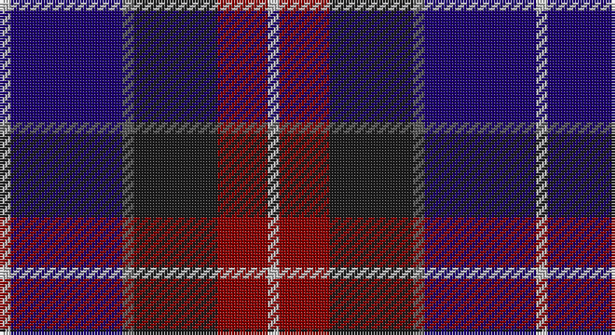

This page is one **sett** — a single exact thread-count. It belongs to the [tartan](/setts/lb2db20n2dt15r9lb2/)
(the same proportion at any scale), whose colour order is pattern [WBBBRW](/stripes/wbbbrw/).

Part of the [Open Championship](/tartans/open-championship/) tartan — the named design grouping this sett with its other cloths.

Sourced from register-of-tartans.  It is a [6 stripe tartan](/stripes/stripes6/).

Original link https://www.tartanregister.gov.uk/tartanDetails.aspx?ref=3256

2 attestations — the source records this cloth was collapsed from (oldest owns this page)

<ul>
<li>01/01/1998 — Open Championship (1998) (register-of-tartans, <a href="https://www.tartanregister.gov.uk/tartanDetails.aspx?ref=3256">record</a>)</li>
<li>1998 — Open Championship (1998) (Corporate) (tartans-authority, <a href="http://www.tartansauthority.com/tartan-ferret/display/2575/">record</a>)</li>
</ul>

## Register references

External register numbers recorded for this tartan.

- Scottish Register of Tartans: [3256](https://www.tartanregister.gov.uk/tartanDetails.aspx?ref=3256)
- Scottish Tartans Authority (ITI): 2575
- Scottish Tartans World Register: 2575

## Thread count
Na/4 DB40 N4 K30 DR18 Na/4

One full sett is **192 threads**.

## Palette

Palette: <strong>Tartan Register</strong> <small style="color:#888">(4 of 5 colours)</small>
<table><thead><tr><th>Colour</th><th>Threads</th><th>Shade</th><th>Base</th><th>OKLCh</th></tr></thead><tbody><tr><td>Na/</td><td style="text-align:right;font-variant-numeric:tabular-nums">4</td><td><code style="background-color:#C0C0C0;">#C0C0C0</code> <small style="color:#888">#C0C0C0</small></td><td>W <code style="background-color:#F7F7F7;">#F7F7F7</code></td><td><small style="color:#888">oklch(80.8% 0.000 89.9)</small></td></tr><tr><td>DB</td><td style="text-align:right;font-variant-numeric:tabular-nums">40</td><td><code style="background-color:#1C0070;">#1C0070</code> <small style="color:#888">#1C0070</small></td><td>B <code style="background-color:#2A418A;">#2A418A</code></td><td><small style="color:#888">oklch(26.3% 0.162 277.1)</small></td></tr><tr><td>N</td><td style="text-align:right;font-variant-numeric:tabular-nums">4</td><td><code style="background-color:#5C5C5C;">#5C5C5C</code> <small style="color:#888">#5C5C5C</small></td><td>B <code style="background-color:#2A418A;">#2A418A</code></td><td><small style="color:#888">oklch(47.5% 0.000 89.9)</small></td></tr><tr><td>K</td><td style="text-align:right;font-variant-numeric:tabular-nums">30</td><td><code style="background-color:#1C1C1C;">#1C1C1C</code> <small style="color:#888">#1C1C1C</small></td><td>B <code style="background-color:#2A418A;">#2A418A</code></td><td><small style="color:#888">oklch(22.6% 0.000 89.9)</small></td></tr><tr><td>DR</td><td style="text-align:right;font-variant-numeric:tabular-nums">18</td><td><code style="background-color:#880000;">#880000</code> <small style="color:#888">#880000</small></td><td>R <code style="background-color:#CC0000;">#CC0000</code></td><td><small style="color:#888">oklch(39.4% 0.162 29.2)</small></td></tr><tr><td>Na/</td><td style="text-align:right;font-variant-numeric:tabular-nums">4</td><td><code style="background-color:#C0C0C0;">#C0C0C0</code> <small style="color:#888">#C0C0C0</small></td><td>W <code style="background-color:#F7F7F7;">#F7F7F7</code></td><td><small style="color:#888">oklch(80.8% 0.000 89.9)</small></td></tr></tbody></table>

# Sample pattern

## Compared to the master

This cloth is one sett of its design; the master sett (the exemplar the design is anchored on) is below for comparison.

<figure style="margin:0"><figcaption style="color:#888;font-size:smaller">this sett</figcaption></figure>
<figure style="margin:0"><figcaption style="color:#888;font-size:smaller"><a href="/setts/dg1db2dbi5db10ly1/">master sett →</a></figcaption></figure>

## Nearest tartans

The nearest existing variants by ΔTartan distance, with this tartan at the top so the swatches line up against it.

ΔTartan

Tartan

Sett

—

<a href="/ttd/edit/#slug=lb2db20n2dt15r9lb2~x2">Open Championship (1998)</a> <a class="nn-out" href="/variants/s6/lb2db20n2dt15r9lb2~x2/" title="open its dictionary page">↗</a>

0.97

<a href="/ttd/edit/#slug=dp6k3dp21k23w3dg24r3~x2&amp;base=lb2db20n2dt15r9lb2~x2">Colquhoun #3</a> <a class="nn-out" href="/variants/s7/dp6k3dp21k23w3dg24r3~x2/" title="open its dictionary page">↗</a>

1.08

<a href="/ttd/edit/#slug=w2db15y2dbi20r9w2~x2&amp;base=lb2db20n2dt15r9lb2~x2">The Open Championship</a> <a class="nn-out" href="/variants/s6/w2db15y2dbi20r9w2~x2/" title="open its dictionary page">↗</a>

1.11

<a href="/ttd/edit/#slug=w2k1dp10k6db12ly2~x2&amp;base=lb2db20n2dt15r9lb2~x2">Soroptimist International Corporate Tartan</a> <a class="nn-out" href="/variants/s6/w2k1dp10k6db12ly2~x2/" title="open its dictionary page">↗</a>

1.14

<a href="/ttd/edit/#slug=k2w1k12g5db11r1~x2&amp;base=lb2db20n2dt15r9lb2~x2">New England (Fashion)</a> <a class="nn-out" href="/variants/s6/k2w1k12g5db11r1~x2/" title="open its dictionary page">↗</a>

1.15

<a href="/ttd/edit/#slug=dp22lo10dp6lr18dp50db71k6&amp;base=lb2db20n2dt15r9lb2~x2">Charleston Police Department</a> <a class="nn-out" href="/variants/s7/dp22lo10dp6lr18dp50db71k6/" title="open its dictionary page">↗</a>

1.16

<a href="/ttd/edit/#slug=db15r6dg8k2w2k2~x6&amp;base=lb2db20n2dt15r9lb2~x2">Stovell (2015)</a> <a class="nn-out" href="/variants/s6/db15r6dg8k2w2k2~x6/" title="open its dictionary page">↗</a>

1.17

<a href="/ttd/edit/#slug=db4dg2r18ri10dg10db29b4~x2&amp;base=lb2db20n2dt15r9lb2~x2">Ross Dempster (Personal)</a> <a class="nn-out" href="/variants/s7/db4dg2r18ri10dg10db29b4~x2/" title="open its dictionary page">↗</a>

1.18

<a href="/ttd/edit/#slug=db31t4db6k19r20ly4~x2&amp;base=lb2db20n2dt15r9lb2~x2">Fife (McGill)</a> <a class="nn-out" href="/variants/s6/db31t4db6k19r20ly4~x2/" title="open its dictionary page">↗</a>

1.19

<a href="/ttd/edit/#slug=db22r3db2r3db2k17o18dg4~x2&amp;base=lb2db20n2dt15r9lb2~x2">Scotch House 2000, antique</a> <a class="nn-out" href="/variants/s8/db22r3db2r3db2k17o18dg4~x2/" title="open its dictionary page">↗</a>

1.19

<a href="/ttd/edit/#slug=r4db24k12g14k4lb3~x2&amp;base=lb2db20n2dt15r9lb2~x2">MacPhail Hunting #2</a> <a class="nn-out" href="/variants/s6/r4db24k12g14k4lb3~x2/" title="open its dictionary page">↗</a>

## Neighbour map

Every grey dot is one of 14360 variants placed by the first two principal components of the ΔTartan feature space (44% of its variance). Red is this tartan; blue dots are its nearest — click one to open its page.

<svg viewBox="0 0 640 380" role="img" style="max-width:100%;height:auto;border:1px solid #e0e0e0;border-radius:4px;display:block" xmlns="http://www.w3.org/2000/svg"><image href="/nn/cloud.v1.png" width="640" height="380"/><a href="/variants/s7/dp6k3dp21k23w3dg24r3~x2/"><circle cx="158.1" cy="207.9" r="4" fill="#3465a4"><title>Colquhoun #3</title></circle></a><a href="/variants/s6/w2db15y2dbi20r9w2~x2/"><circle cx="176.8" cy="189.4" r="4" fill="#3465a4"><title>The Open Championship</title></circle></a><a href="/variants/s6/w2k1dp10k6db12ly2~x2/"><circle cx="169.9" cy="190.1" r="4" fill="#3465a4"><title>Soroptimist International Corporate Tartan</title></circle></a><a href="/variants/s6/k2w1k12g5db11r1~x2/"><circle cx="238.3" cy="204.6" r="4" fill="#3465a4"><title>New England (Fashion)</title></circle></a><a href="/variants/s7/dp22lo10dp6lr18dp50db71k6/"><circle cx="262.0" cy="200.9" r="4" fill="#3465a4"><title>Charleston Police Department</title></circle></a><a href="/variants/s6/db15r6dg8k2w2k2~x6/"><circle cx="182.0" cy="211.7" r="4" fill="#3465a4"><title>Stovell (2015)</title></circle></a><a href="/variants/s7/db4dg2r18ri10dg10db29b4~x2/"><circle cx="224.6" cy="184.6" r="4" fill="#3465a4"><title>Ross Dempster (Personal)</title></circle></a><a href="/variants/s6/db31t4db6k19r20ly4~x2/"><circle cx="188.2" cy="210.2" r="4" fill="#3465a4"><title>Fife (McGill)</title></circle></a><a href="/variants/s8/db22r3db2r3db2k17o18dg4~x2/"><circle cx="167.6" cy="175.1" r="4" fill="#3465a4"><title>Scotch House 2000, antique</title></circle></a><a href="/variants/s6/r4db24k12g14k4lb3~x2/"><circle cx="172.4" cy="221.9" r="4" fill="#3465a4"><title>MacPhail Hunting #2</title></circle></a><circle cx="205.1" cy="204.7" r="5" fill="#c00000"/></svg>

ID: /variants/s6/lb2db20n2dt15r9lb2~x2/
