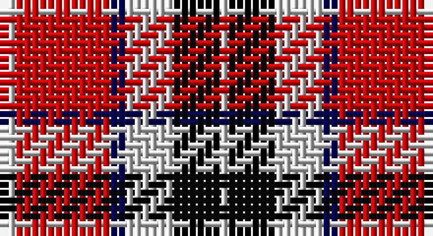

This page is one **sett** — a single exact thread-count. It belongs to the [tartan](/setts/lb2r12db2lb6k6lb1/)
(the same proportion at any scale), whose colour order is pattern [WKWBRW](/stripes/wkwbrw/).

Part of the [MacTavish](/tartans/mactavish-2/) tartan — the named design grouping this sett with its other cloths.

Sourced from weddslist.  It is a [6 stripe tartan](/stripes/stripes6/).

Original link http://www.weddslist.com/cgi-bin/tartans/pg.pl?source=rb

## Also known as

This cloth is also recorded under:

- MacTavish #2
- Thompson/Thomson/MacTavish

## Thread count
N/2 R12 DB2 N6 K6 N/1

One full sett is **55 threads**.

## Palette

Palette: <strong>Tartan Register</strong> <small style="color:#888">(2 of 4 colours)</small>
<table><thead><tr><th>Colour</th><th>Threads</th><th>Shade</th><th>Base</th><th>OKLCh</th></tr></thead><tbody><tr><td>N/</td><td style="text-align:right;font-variant-numeric:tabular-nums">2</td><td><code style="background-color:#D0D0D0;">#D0D0D0</code> <small style="color:#888">#D0D0D0</small></td><td>W <code style="background-color:#F7F7F7;">#F7F7F7</code></td><td><small style="color:#888">oklch(85.8% 0.000 89.9)</small></td></tr><tr><td>R</td><td style="text-align:right;font-variant-numeric:tabular-nums">12</td><td><code style="background-color:#C80000;">#C80000</code> <small style="color:#888">#C80000</small></td><td>R <code style="background-color:#CC0000;">#CC0000</code></td><td><small style="color:#888">oklch(52.3% 0.215 29.2)</small></td></tr><tr><td>DB</td><td style="text-align:right;font-variant-numeric:tabular-nums">2</td><td><code style="background-color:#00004C;">#00004C</code> <small style="color:#888">#00004C</small></td><td>B <code style="background-color:#2A418A;">#2A418A</code></td><td><small style="color:#888">oklch(18.8% 0.130 264.1)</small></td></tr><tr><td>N</td><td style="text-align:right;font-variant-numeric:tabular-nums">6</td><td><code style="background-color:#D0D0D0;">#D0D0D0</code> <small style="color:#888">#D0D0D0</small></td><td>W <code style="background-color:#F7F7F7;">#F7F7F7</code></td><td><small style="color:#888">oklch(85.8% 0.000 89.9)</small></td></tr><tr><td>K</td><td style="text-align:right;font-variant-numeric:tabular-nums">6</td><td><code style="background-color:#000000;">#000000</code> <small style="color:#888">#000000</small></td><td>K <code style="background-color:#000000;">#000000</code></td><td><small style="color:#888">oklch(0.0% 0.000 0.0)</small></td></tr><tr><td>N/</td><td style="text-align:right;font-variant-numeric:tabular-nums">1</td><td><code style="background-color:#D0D0D0;">#D0D0D0</code> <small style="color:#888">#D0D0D0</small></td><td>W <code style="background-color:#F7F7F7;">#F7F7F7</code></td><td><small style="color:#888">oklch(85.8% 0.000 89.9)</small></td></tr></tbody></table>

# Sample pattern

## Compared to the master

This cloth is one sett of its design; the master sett (the exemplar the design is anchored on) is below for comparison.

<figure style="margin:0"><figcaption style="color:#888;font-size:smaller">this sett</figcaption></figure>
<figure style="margin:0"><figcaption style="color:#888;font-size:smaller"><a href="/setts/db4r30k6db13k13db3/">master sett →</a></figcaption></figure>

## Nearest tartans

The nearest existing variants by ΔTartan distance, with this tartan at the top so the swatches line up against it.

ΔTartan

Tartan

Sett

—

<a href="/ttd/edit/#slug=lb2r12db2lb6k6lb1">MacTavish</a> <a class="nn-out" href="/variants/s6/lb2r12db2lb6k6lb1/" title="open its dictionary page">↗</a>

1.01

<a href="/ttd/edit/#slug=r15g3w2k10w5~x2&amp;base=lb2r12db2lb6k6lb1">SAL Cubiska Stenen</a> <a class="nn-out" href="/variants/s5/r15g3w2k10w5~x2/" title="open its dictionary page">↗</a>

1.08

<a href="/ttd/edit/#slug=r32db6k6g6w18k3&amp;base=lb2r12db2lb6k6lb1">Rose, White dress</a> <a class="nn-out" href="/variants/s6/r32db6k6g6w18k3/" title="open its dictionary page">↗</a>

1.12

<a href="/ttd/edit/#slug=w2db3r24db15w6db3ly2~x2&amp;base=lb2r12db2lb6k6lb1">Fazzolettone (Fashion?)</a> <a class="nn-out" href="/variants/s7/w2db3r24db15w6db3ly2~x2/" title="open its dictionary page">↗</a>

1.18

<a href="/ttd/edit/#slug=ly2r15k7db8ly2~x4&amp;base=lb2r12db2lb6k6lb1">Aberdeen University</a> <a class="nn-out" href="/variants/s5/ly2r15k7db8ly2~x4/" title="open its dictionary page">↗</a>

1.19

<a href="/ttd/edit/#slug=k3r28k10w28t3~x2&amp;base=lb2r12db2lb6k6lb1">Wallace Dress, Red (Dance)</a> <a class="nn-out" href="/variants/s5/k3r28k10w28t3~x2/" title="open its dictionary page">↗</a>

1.20

<a href="/ttd/edit/#slug=w4k6r3k15r3k6r27db9w2~x2&amp;base=lb2r12db2lb6k6lb1">Memery (Reston, USA)</a> <a class="nn-out" href="/variants/s9/w4k6r3k15r3k6r27db9w2~x2/" title="open its dictionary page">↗</a>

1.20

<a href="/ttd/edit/#slug=t2r12db2t6k6t1~x4&amp;base=lb2r12db2lb6k6lb1">Thompson/Thomson/MacTavish</a> <a class="nn-out" href="/variants/s6/t2r12db2t6k6t1~x4/" title="open its dictionary page">↗</a>

1.21

<a href="/ttd/edit/#slug=lb5r34k22r4o24r4~x2&amp;base=lb2r12db2lb6k6lb1">Wcwm 759-2</a> <a class="nn-out" href="/variants/s6/lb5r34k22r4o24r4~x2/" title="open its dictionary page">↗</a>

1.22

<a href="/ttd/edit/#slug=lr1k1r10g10k5lr5r10k1lr1~x4&amp;base=lb2r12db2lb6k6lb1">Graham Red</a> <a class="nn-out" href="/variants/s9/lr1k1r10g10k5lr5r10k1lr1~x4/" title="open its dictionary page">↗</a>

1.23

<a href="/ttd/edit/#slug=r4o30k6w13k13w3~x2&amp;base=lb2r12db2lb6k6lb1">Thom(p)son camel</a> <a class="nn-out" href="/variants/s6/r4o30k6w13k13w3~x2/" title="open its dictionary page">↗</a>

## Neighbour map

Every grey dot is one of 14360 variants placed by the first two principal components of the ΔTartan feature space (44% of its variance). Red is this tartan; blue dots are its nearest — click one to open its page.

<svg viewBox="0 0 640 380" role="img" style="max-width:100%;height:auto;border:1px solid #e0e0e0;border-radius:4px;display:block" xmlns="http://www.w3.org/2000/svg"><image href="/nn/cloud.v1.png" width="640" height="380"/><a href="/variants/s5/r15g3w2k10w5~x2/"><circle cx="165.2" cy="207.1" r="4" fill="#3465a4"><title>SAL Cubiska Stenen</title></circle></a><a href="/variants/s6/r32db6k6g6w18k3/"><circle cx="179.3" cy="155.8" r="4" fill="#3465a4"><title>Rose, White dress</title></circle></a><a href="/variants/s7/w2db3r24db15w6db3ly2~x2/"><circle cx="239.4" cy="159.2" r="4" fill="#3465a4"><title>Fazzolettone (Fashion?)</title></circle></a><a href="/variants/s5/ly2r15k7db8ly2~x4/"><circle cx="185.1" cy="214.9" r="4" fill="#3465a4"><title>Aberdeen University</title></circle></a><a href="/variants/s5/k3r28k10w28t3~x2/"><circle cx="182.5" cy="187.0" r="4" fill="#3465a4"><title>Wallace Dress, Red (Dance)</title></circle></a><a href="/variants/s9/w4k6r3k15r3k6r27db9w2~x2/"><circle cx="224.7" cy="152.1" r="4" fill="#3465a4"><title>Memery (Reston, USA)</title></circle></a><a href="/variants/s6/t2r12db2t6k6t1~x4/"><circle cx="215.9" cy="193.1" r="4" fill="#3465a4"><title>Thompson/Thomson/MacTavish</title></circle></a><a href="/variants/s6/lb5r34k22r4o24r4~x2/"><circle cx="205.7" cy="203.8" r="4" fill="#3465a4"><title>Wcwm 759-2</title></circle></a><a href="/variants/s9/lr1k1r10g10k5lr5r10k1lr1~x4/"><circle cx="200.4" cy="172.5" r="4" fill="#3465a4"><title>Graham Red</title></circle></a><a href="/variants/s6/r4o30k6w13k13w3~x2/"><circle cx="184.3" cy="188.4" r="4" fill="#3465a4"><title>Thom(p)son camel</title></circle></a><circle cx="185.0" cy="174.4" r="5" fill="#c00000"/></svg>

ID: /variants/s6/lb2r12db2lb6k6lb1/
