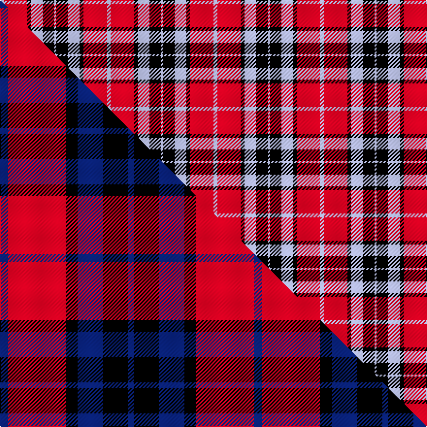

This is one **variant** — a specific cloth: this exact thread count and colourway, with its own
provenance below. It is one weaving of the [sett](/setts/lb2r12k2lb6k6lb1/) (the scale-free proportion — the
same cloth at any scale or shade), whose colour order is pattern [WKWKRW](/stripes/wkwkrw/).

Part of the [MacTavish](/tartans/m/ma/mactavish-3/) tartan — the named design grouping this sett with its other cloths.

Sourced from register-of-tartans.  It is a [6 stripe tartan](/stripes/stripes6/).

Original link [https://www.tartanregister.gov.uk/tartanDetails.aspx?ref=4115](https://www.tartanregister.gov.uk/tartanDetails.aspx?ref=4115)

2 attestations — the source records this cloth was collapsed from (oldest owns this page)

<ul>
<li>undated — Thompson/Thomson/MacTavish #2 (register-of-tartans, <a href="https://www.tartanregister.gov.uk/tartanDetails.aspx?ref=4115">record</a>)  <em>D.C. Stewart, the Setts of the Scottish Tartans, 1950.</em></li>
<li>undated — MacTavish (weddslist, <a href="http://www.weddslist.com/cgi-bin/tartans/pg.pl?source=sts">record</a>) </li>
</ul>

Dataset <small>— provenance for this record, inherited from the source manifest</small>

<dl class="dataset-prov">
<dt>source</dt><dd><a href="/sources/register-of-tartans/">Scottish Register of Tartans</a></dd>
<dt>data captured from</dt><dd><a href="https://github.com/thetartan/tartan-database/blob/master/data/register-of-tartans/data.csv">https://github.com/thetartan/tartan-database/blob/master/data/register-of-tartans/data.csv</a></dd>
<dt>data date</dt><dd>2017-01-06 <small>(dataset default)</small></dd>
<dt>licence</dt><dd><a href="https://www.tartanregister.gov.uk/copyright">Crown copyright</a></dd>
</dl>

Capture chain <small>— the hands this data passed through, oldest first; each capture carries its own licence</small>

<ol class="capture-chain">
<li><a href="https://www.tartanregister.gov.uk/">Scottish Register of Tartans</a> · <a href="https://www.tartanregister.gov.uk/copyright">Crown copyright</a> <small>the living register — still published by National Records of Scotland</small></li>
<li><a href="https://github.com/thetartan/tartan-database">thetartan/tartan-database</a> <small>2016-2017</small> · <a href="https://creativecommons.org/licenses/by-nc-nd/4.0/">CC BY-NC-ND 4.0</a> <small>Levko Kravets's frozen compilation — the capture we vendored, and where its CC licence text came from</small></li>
<li>this dictionary <small>captured 2026-06-10 · commit 5bf86c7566</small> <small>each re-capture is a git commit to data/sources</small></li>
</ol>

## Register references

External register numbers recorded for this tartan.

- Scottish Register of Tartans: [4115](https://www.tartanregister.gov.uk/tartanDetails.aspx?ref=4115)
- Scottish Tartans World Register: 229

## Thread count
LB/4 R24 K4 LB12 K12 LB/2

One full sett is **110 threads**.

## Palette
<table><thead><tr><th>Colour</th><th>Shade</th><th>OKLCh</th></tr></thead><tbody><tr><td>LB</td><td><code style="background-color:#B5BBDE;">#B5BBDE</code> <small style="color:#888">#B5BBDE</small></td><td><small style="color:#888">oklch(79.9% 0.050 277.6)</small></td></tr><tr><td>K</td><td><code style="background-color:#000000;">#000000</code> <small style="color:#888">#000000</small></td><td><small style="color:#888">oklch(0.0% 0.000 0.0)</small></td></tr><tr><td>R</td><td><code style="background-color:#D60020;">#D60020</code> <small style="color:#888">#D60020</small></td><td><small style="color:#888">oklch(55.2% 0.224 25.5)</small></td></tr></tbody></table>

# Sample pattern

## Compared to the master

This cloth is one sett of its design; the master sett (the exemplar the design is anchored on) is below for comparison.

Its **ΔTartan distance** from the master is **0.46** — the same measure the nearest-tartans table ranks by (0 is identical; a re-scale of the same cloth is near 0, a recolour or a different proportion further).

<figure class="master-compare" style="margin:0">

this sett
master sett ★

<figcaption style="color:#888;font-size:smaller">One weave of this sett against the <a href="/setts/db4r30k6db13k13db3/">master sett ★</a>, split on the diagonal: a shared proportion runs seamlessly across it with only the shades shifting; a different proportion breaks on it.</figcaption>
</figure>

## Nearest tartan variants

The nearest existing variants by ΔTartan distance, with this cloth at the top so the swatches line up against it.

ΔTartan

Threads

Variant

Sett

—

110

<a href="/variants/s6/lb2r12k2lb6k6lb1~x2/">Thompson/Thomson/MacTavish #2</a>

<a href="/ttd/edit/#slug=lb4r28k6lb12k12lb3~x2&amp;base=lb2r12k2lb6k6lb1~x2" title="compare in the TTD">0.36</a>

246

<a href="/variants/s6/lb4r28k6lb12k12lb3~x2/">Thomson, Red (Name)</a>

<a href="/ttd/edit/#slug=db4r30k6db13k13db3~x2&amp;base=lb2r12k2lb6k6lb1~x2" title="compare in the TTD">0.46</a>

262

<a href="/variants/s6/db4r30k6db13k13db3~x2/">MacTavish Clan Tartan</a>

<a href="/ttd/edit/#slug=db1r12k6y1k6db1~x4&amp;base=lb2r12k2lb6k6lb1~x2" title="compare in the TTD">1.55</a>

208

<a href="/variants/s6/db1r12k6y1k6db1~x4/">Cetoloni (Personal)</a>

<a href="/ttd/edit/#slug=ly3db22k3db3k11r20ly3~x2&amp;base=lb2r12k2lb6k6lb1~x2" title="compare in the TTD">2.15</a>

248

<a href="/variants/s7/ly3db22k3db3k11r20ly3~x2/">Biffy Clyro</a>

<a href="/ttd/edit/#slug=w5lb34k24lb4dr24lb4~x2&amp;base=lb2r12k2lb6k6lb1~x2" title="compare in the TTD">2.19</a>

362

<a href="/variants/s6/w5lb34k24lb4dr24lb4~x2/">Wcwm 759-3</a>

<a href="/ttd/edit/#slug=db12k3db2r2db2r12w2k1w2~x4&amp;base=lb2r12k2lb6k6lb1~x2" title="compare in the TTD">2.21</a>

248

<a href="/variants/s9/db12k3db2r2db2r12w2k1w2~x4/">Ainslie</a>

<a href="/ttd/edit/#slug=lb2r12db2lb6k6lb1~x4&amp;base=lb2r12k2lb6k6lb1~x2" title="compare in the TTD">2.67</a>

220

<a href="/variants/s6/lb2r12db2lb6k6lb1~x4/">Thompson/Thomson/MacTavish</a>

<a href="/ttd/edit/#slug=lb2r12db2lb6k6lb1~x2&amp;base=lb2r12k2lb6k6lb1~x2" title="compare in the TTD">2.67</a>

110

<a href="/variants/s6/lb2r12db2lb6k6lb1~x2/">MacTavish Thomson Clan Tartan</a>

<a href="/ttd/edit/#slug=lb2r12db2lb6k6lb1&amp;base=lb2r12k2lb6k6lb1~x2" title="compare in the TTD">2.67</a>

55

<a href="/variants/s6/lb2r12db2lb6k6lb1/">MacTavish</a>

<a href="/ttd/edit/#slug=r36lb3r5k21db24k3~x2~db1406275&amp;base=lb2r12k2lb6k6lb1~x2" title="compare in the TTD">2.72</a>

290

<a href="/variants/s6/r36lb3r5k21db24k3~x2~db1406275/">Graham of Menteith (Red)</a>

## Neighbour map

Every grey dot is one of 13621 variants placed by the first two principal components of the ΔTartan feature space (42% of its variance). Red is this tartan; blue dots are its nearest — click one to open its page. The map is a flat projection of a many-dimensional space — [how to read it](/posts/neighbourhood-maps/).

<svg viewBox="0 0 640 380" role="img" style="max-width:100%;height:auto;border:1px solid #e0e0e0;border-radius:4px;display:block" xmlns="http://www.w3.org/2000/svg"><image href="/nn/cloud.v1.png" width="640" height="380"/><a href="/variants/s6/lb4r28k6lb12k12lb3~x2/"><circle cx="198.1" cy="200.3" r="4" fill="#3465a4"><title>Thomson, Red (Name)</title></circle></a><a href="/variants/s6/db4r30k6db13k13db3~x2/"><circle cx="217.5" cy="199.2" r="4" fill="#3465a4"><title>MacTavish Clan Tartan</title></circle></a><a href="/variants/s6/db1r12k6y1k6db1~x4/"><circle cx="227.4" cy="167.1" r="4" fill="#3465a4"><title>Cetoloni (Personal)</title></circle></a><a href="/variants/s7/ly3db22k3db3k11r20ly3~x2/"><circle cx="152.7" cy="189.8" r="4" fill="#3465a4"><title>Biffy Clyro</title></circle></a><a href="/variants/s6/w5lb34k24lb4dr24lb4~x2/"><circle cx="175.6" cy="205.3" r="4" fill="#3465a4"><title>Wcwm 759-3</title></circle></a><a href="/variants/s9/db12k3db2r2db2r12w2k1w2~x4/"><circle cx="197.8" cy="152.1" r="4" fill="#3465a4"><title>Ainslie</title></circle></a><a href="/variants/s6/lb2r12db2lb6k6lb1~x4/"><circle cx="188.1" cy="188.0" r="4" fill="#3465a4"><title>Thompson/Thomson/MacTavish</title></circle></a><a href="/variants/s6/lb2r12db2lb6k6lb1~x2/"><circle cx="188.1" cy="188.0" r="4" fill="#3465a4"><title>MacTavish Thomson Clan Tartan</title></circle></a><a href="/variants/s6/lb2r12db2lb6k6lb1/"><circle cx="188.1" cy="188.0" r="4" fill="#3465a4"><title>MacTavish</title></circle></a><a href="/variants/s6/r36lb3r5k21db24k3~x2~db1406275/"><circle cx="207.3" cy="176.6" r="4" fill="#3465a4"><title>Graham of Menteith (Red)</title></circle></a><circle cx="198.6" cy="192.0" r="5" fill="#c00000"/><text x="320" y="376" text-anchor="middle" font-size="11" fill="#999">ground</text><text x="11" y="190" text-anchor="middle" font-size="11" fill="#999" transform="rotate(-90 11 190)">complexity</text></svg>

ID: /variants/s6/lb2r12k2lb6k6lb1~x2/
