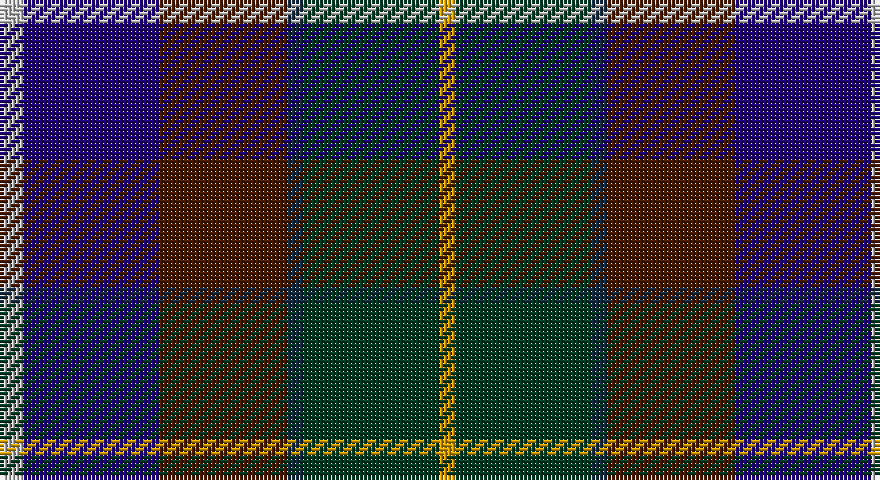

This page is one **sett** — a single exact thread-count. It belongs to the [tartan](/setts/lb3db17do16dt2dg17lo2/)
(the same proportion at any scale), whose colour order is pattern [WBBBGY](/stripes/wbbbgy/).

Part of the [Ancient Atlantic](/tartans/ancient-atlantic/) tartan — the named design grouping this sett with its other cloths.

Sourced from tartans-authority.  It is a [6 stripe tartan](/stripes/stripes6/).

Original link http://www.tartansauthority.com/tartan-ferret/display/1781/

## Also known as

This cloth is also recorded under:

- Atlantic Ancient
- Atlantic, Ancient

2 attestations — the source records this cloth was collapsed from (oldest owns this page)

<ul>
<li>1959 — Ancient Atlantic (Fashion) (tartans-authority, <a href="http://www.tartansauthority.com/tartan-ferret/display/1781/">record</a>)</li>
<li>01/01/1964 — Ancient Atlantic (SINDEX) (register-of-tartans, <a href="https://www.tartanregister.gov.uk/tartanDetails.aspx?ref=72">record</a>)</li>
</ul>

## Register references

External register numbers recorded for this tartan.

- Scottish Register of Tartans: [72](https://www.tartanregister.gov.uk/tartanDetails.aspx?ref=72)
- Scottish Tartans Authority (ITI): 1781
- Scottish Tartans World Register: 1781

## Thread count
N/6 DB34 DR32 DN4 DG34 DY/4

One full sett is **218 threads**.

## Palette

Palette: <strong>Tartan Register</strong> <small style="color:#888">(5 of 6 colours)</small>
<table><thead><tr><th>Colour</th><th>Threads</th><th>Shade</th><th>Base</th><th>OKLCh</th></tr></thead><tbody><tr><td>N/</td><td style="text-align:right;font-variant-numeric:tabular-nums">6</td><td><code style="background-color:#C0C0C0;">#C0C0C0</code> <small style="color:#888">#C0C0C0</small></td><td>W <code style="background-color:#F7F7F7;">#F7F7F7</code></td><td><small style="color:#888">oklch(80.8% 0.000 89.9)</small></td></tr><tr><td>DB</td><td style="text-align:right;font-variant-numeric:tabular-nums">34</td><td><code style="background-color:#1C0070;">#1C0070</code> <small style="color:#888">#1C0070</small></td><td>B <code style="background-color:#2A418A;">#2A418A</code></td><td><small style="color:#888">oklch(26.3% 0.162 277.1)</small></td></tr><tr><td>DR</td><td style="text-align:right;font-variant-numeric:tabular-nums">32</td><td><code style="background-color:#441800;">#441800</code> <small style="color:#888">#441800</small></td><td>B <code style="background-color:#2A418A;">#2A418A</code></td><td><small style="color:#888">oklch(27.3% 0.076 46.3)</small></td></tr><tr><td>DN</td><td style="text-align:right;font-variant-numeric:tabular-nums">4</td><td><code style="background-color:#14283C;">#14283C</code> <small style="color:#888">#14283C</small></td><td>B <code style="background-color:#2A418A;">#2A418A</code></td><td><small style="color:#888">oklch(27.1% 0.046 249.9)</small></td></tr><tr><td>DG</td><td style="text-align:right;font-variant-numeric:tabular-nums">34</td><td><code style="background-color:#003820;">#003820</code> <small style="color:#888">#003820</small></td><td>G <code style="background-color:#006100;">#006100</code></td><td><small style="color:#888">oklch(30.0% 0.070 158.3)</small></td></tr><tr><td>DY/</td><td style="text-align:right;font-variant-numeric:tabular-nums">4</td><td><code style="background-color:#D09800;">#D09800</code> <small style="color:#888">#D09800</small></td><td>Y <code style="background-color:#F2BF00;">#F2BF00</code></td><td><small style="color:#888">oklch(71.4% 0.147 82.1)</small></td></tr></tbody></table>

# Sample pattern

## Nearest tartans

The nearest existing variants by ΔTartan distance, with this tartan at the top so the swatches line up against it.

ΔTartan

Tartan

Sett

—

<a href="/ttd/edit/#slug=lb3db17do16dt2dg17lo2~x2">Ancient Atlantic (Fashion)</a> <a class="nn-out" href="/variants/s6/lb3db17do16dt2dg17lo2~x2/" title="open its dictionary page">↗</a>

0.73

<a href="/ttd/edit/#slug=w3dbi17dy16db2dg17ly2~x2&amp;base=lb3db17do16dt2dg17lo2~x2">Atlantic Ancient Trade Tartan</a> <a class="nn-out" href="/variants/s6/w3dbi17dy16db2dg17ly2~x2/" title="open its dictionary page">↗</a>

0.79

<a href="/ttd/edit/#slug=r3dp8g20k20db17k3lg3~x2&amp;base=lb3db17do16dt2dg17lo2~x2">Gracey (2013)</a> <a class="nn-out" href="/variants/s7/r3dp8g20k20db17k3lg3~x2/" title="open its dictionary page">↗</a>

0.99

<a href="/ttd/edit/#slug=dp11db2t4db21k16dg19ly4~x2&amp;base=lb3db17do16dt2dg17lo2~x2">Ayrshire (International Tartans)</a> <a class="nn-out" href="/variants/s7/dp11db2t4db21k16dg19ly4~x2/" title="open its dictionary page">↗</a>

1.01

<a href="/ttd/edit/#slug=db10dg5g5k1ly2k1dbi10~x2&amp;base=lb3db17do16dt2dg17lo2~x2">Lenaghan (Personal)</a> <a class="nn-out" href="/variants/s7/db10dg5g5k1ly2k1dbi10~x2/" title="open its dictionary page">↗</a>

1.04

<a href="/ttd/edit/#slug=r3dg20k2n11k2db20lr2~x2&amp;base=lb3db17do16dt2dg17lo2~x2">Grandfather Mountain Games (District</a> <a class="nn-out" href="/variants/s7/r3dg20k2n11k2db20lr2~x2/" title="open its dictionary page">↗</a>

1.10

<a href="/ttd/edit/#slug=k26n10dt19r6ly2db9~x2&amp;base=lb3db17do16dt2dg17lo2~x2">Meeson Hunting</a> <a class="nn-out" href="/variants/s6/k26n10dt19r6ly2db9~x2/" title="open its dictionary page">↗</a>

1.15

<a href="/ttd/edit/#slug=r4dg16k16db4dg3db12lo2~x2&amp;base=lb3db17do16dt2dg17lo2~x2">Junior Chamber International (Corp)</a> <a class="nn-out" href="/variants/s7/r4dg16k16db4dg3db12lo2~x2/" title="open its dictionary page">↗</a>

1.18

<a href="/ttd/edit/#slug=gi3dg12dpi6g3dp15lo2dp2~x2&amp;base=lb3db17do16dt2dg17lo2~x2">Myres Castle (Corporate)</a> <a class="nn-out" href="/variants/s7/gi3dg12dpi6g3dp15lo2dp2~x2/" title="open its dictionary page">↗</a>

1.20

<a href="/ttd/edit/#slug=dg17ly2k14r2db9r2db10~x2&amp;base=lb3db17do16dt2dg17lo2~x2">MacDonald (Flora.. )</a> <a class="nn-out" href="/variants/s7/dg17ly2k14r2db9r2db10~x2/" title="open its dictionary page">↗</a>

1.23

<a href="/ttd/edit/#slug=db17w2db2r2db2do12dg16lo3~x4&amp;base=lb3db17do16dt2dg17lo2~x2">Blairmore House</a> <a class="nn-out" href="/variants/s8/db17w2db2r2db2do12dg16lo3~x4/" title="open its dictionary page">↗</a>

## Neighbour map

Every grey dot is one of 14360 variants placed by the first two principal components of the ΔTartan feature space (44% of its variance). Red is this tartan; blue dots are its nearest — click one to open its page.

<svg viewBox="0 0 640 380" role="img" style="max-width:100%;height:auto;border:1px solid #e0e0e0;border-radius:4px;display:block" xmlns="http://www.w3.org/2000/svg"><image href="/nn/cloud.v1.png" width="640" height="380"/><a href="/variants/s6/w3dbi17dy16db2dg17ly2~x2/"><circle cx="132.5" cy="207.4" r="4" fill="#3465a4"><title>Atlantic Ancient Trade Tartan</title></circle></a><a href="/variants/s7/r3dp8g20k20db17k3lg3~x2/"><circle cx="111.4" cy="213.5" r="4" fill="#3465a4"><title>Gracey (2013)</title></circle></a><a href="/variants/s7/dp11db2t4db21k16dg19ly4~x2/"><circle cx="111.3" cy="203.1" r="4" fill="#3465a4"><title>Ayrshire (International Tartans)</title></circle></a><a href="/variants/s7/db10dg5g5k1ly2k1dbi10~x2/"><circle cx="131.8" cy="208.6" r="4" fill="#3465a4"><title>Lenaghan (Personal)</title></circle></a><a href="/variants/s7/r3dg20k2n11k2db20lr2~x2/"><circle cx="155.3" cy="184.5" r="4" fill="#3465a4"><title>Grandfather Mountain Games (District</title></circle></a><a href="/variants/s6/k26n10dt19r6ly2db9~x2/"><circle cx="181.3" cy="215.3" r="4" fill="#3465a4"><title>Meeson Hunting</title></circle></a><a href="/variants/s7/r4dg16k16db4dg3db12lo2~x2/"><circle cx="161.7" cy="228.1" r="4" fill="#3465a4"><title>Junior Chamber International (Corp)</title></circle></a><a href="/variants/s7/gi3dg12dpi6g3dp15lo2dp2~x2/"><circle cx="175.3" cy="202.3" r="4" fill="#3465a4"><title>Myres Castle (Corporate)</title></circle></a><a href="/variants/s7/dg17ly2k14r2db9r2db10~x2/"><circle cx="160.9" cy="221.6" r="4" fill="#3465a4"><title>MacDonald (Flora.. )</title></circle></a><a href="/variants/s8/db17w2db2r2db2do12dg16lo3~x4/"><circle cx="176.9" cy="190.5" r="4" fill="#3465a4"><title>Blairmore House</title></circle></a><circle cx="143.4" cy="214.7" r="5" fill="#c00000"/></svg>

ID: /variants/s6/lb3db17do16dt2dg17lo2~x2/
