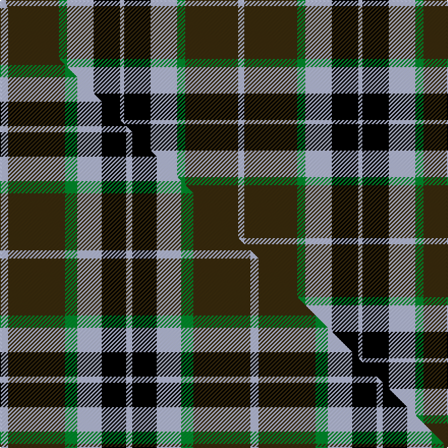

This page is one **sett** — a single exact thread-count. It belongs to the [tartan](/setts/lb3dy26g4lb13k13lb2/)
(the same proportion at any scale), whose colour order is pattern [WGGWKW](/stripes/wggwkw/).

Part of the [MacTavish Hunting](/tartans/mactavish-hunting/) tartan — the named design grouping this sett with its other cloths.

Sourced from house-of-tartan.  It is a [6 stripe tartan](/stripes/stripes6/).

Original link http://www.house-of-tartan.scotland.net/house/TartanViewjs.asp?colr=Def&tnam=232

## Provenance

Earliest known date: pre 2003 See Lord Thomson

## Thread count
LB/6 DY52 G8 LB26 K26 LB/4

One full sett is **234 threads**.

## Palette
<table><thead><tr><th>Colour</th><th>Shade</th><th>OKLCh</th></tr></thead><tbody><tr><td>LB</td><td><code style="background-color:#B5BBDE;">#B5BBDE</code> <small style="color:#888">#B5BBDE</small></td><td><small style="color:#888">oklch(79.9% 0.050 277.6)</small></td></tr><tr><td>G</td><td><code style="background-color:#008B2A;">#008B2A</code> <small style="color:#888">#008B2A</small></td><td><small style="color:#888">oklch(55.4% 0.170 145.9)</small></td></tr><tr><td>K</td><td><code style="background-color:#000000;">#000000</code> <small style="color:#888">#000000</small></td><td><small style="color:#888">oklch(0.0% 0.000 0.0)</small></td></tr><tr><td>DY</td><td><code style="background-color:#3A2B0D;">#3A2B0D</code> <small style="color:#888">#3A2B0D</small></td><td><small style="color:#888">oklch(30.0% 0.049 82.0)</small></td></tr></tbody></table>

# Sample pattern

## Compared to the master

This cloth is one sett of its design; the master sett (the exemplar the design is anchored on) is below for comparison.

Its **ΔTartan distance** from the master is **0.55** — the same measure the nearest-tartans table ranks by (0 is identical; a re-scale of the same cloth is near 0, a recolour or a different proportion further).

<figure class="master-compare" style="margin:0">

this sett
master sett ★

<figcaption style="color:#888;font-size:smaller">One weave of this sett against the <a href="/setts/lb4dy28g6lb12k12lb3/">master sett ★</a>, split on the diagonal: a shared proportion runs seamlessly across it with only the shades shifting; a different proportion breaks on it.</figcaption>
</figure>

## Nearest variants

The nearest existing variants by ΔTartan distance, with this cloth at the top so the swatches line up against it.

ΔTartan

Threads

Variant

Sett

—

234

<a href="/variants/s6/lb3dy26g4lb13k13lb2~x2/">MacTavish Hunting Clan Tartan</a>

<a href="/ttd/edit/#slug=lb4dy28g6lb12k12lb3~x2&amp;base=lb3dy26g4lb13k13lb2~x2" title="compare in the TTD">0.36</a>

246

<a href="/variants/s6/lb4dy28g6lb12k12lb3~x2/">MacTavish Hunting</a>

<a href="/ttd/edit/#slug=lb3o26g4lb13k13lb2~x2&amp;base=lb3dy26g4lb13k13lb2~x2" title="compare in the TTD">1.40</a>

234

<a href="/variants/s6/lb3o26g4lb13k13lb2~x2/">MacTavish / Thom(p)son, hunting</a>

<a href="/ttd/edit/#slug=lb4o28g6lb12k12lb3~x2&amp;base=lb3dy26g4lb13k13lb2~x2" title="compare in the TTD">1.76</a>

246

<a href="/variants/s6/lb4o28g6lb12k12lb3~x2/">MacTavish / Thom(p)son, hunting</a>

<a href="/ttd/edit/#slug=r10dy60db13w24db24dy8&amp;base=lb3dy26g4lb13k13lb2~x2" title="compare in the TTD">2.24</a>

260

<a href="/variants/s6/r10dy60db13w24db24dy8/">Bronte House Check</a>

<a href="/ttd/edit/#slug=w5lb34k24lb4dr24lb4~x2&amp;base=lb3dy26g4lb13k13lb2~x2" title="compare in the TTD">2.55</a>

362

<a href="/variants/s6/w5lb34k24lb4dr24lb4~x2/">Wcwm 759-3</a>

<a href="/ttd/edit/#slug=t5dy28w5k20ly5t47ly4~x2&amp;base=lb3dy26g4lb13k13lb2~x2" title="compare in the TTD">2.75</a>

438

<a href="/variants/s7/t5dy28w5k20ly5t47ly4~x2/">State Seal of Washington (Fashion)</a>

<a href="/ttd/edit/#slug=dy30ly5lb10k10w2k2~x2&amp;base=lb3dy26g4lb13k13lb2~x2" title="compare in the TTD">2.90</a>

172

<a href="/variants/s6/dy30ly5lb10k10w2k2~x2/">Bryan Wedding (Personal)</a>

## Neighbour map

Every grey dot is one of 13620 variants placed by the first two principal components of the ΔTartan feature space (42% of its variance). Red is this tartan; blue dots are its nearest — click one to open its page.

<svg viewBox="0 0 640 380" role="img" style="max-width:100%;height:auto;border:1px solid #e0e0e0;border-radius:4px;display:block" xmlns="http://www.w3.org/2000/svg"><image href="/nn/cloud.v1.png" width="640" height="380"/><a href="/variants/s6/lb4dy28g6lb12k12lb3~x2/"><circle cx="181.6" cy="205.1" r="4" fill="#3465a4"><title>MacTavish Hunting</title></circle></a><a href="/variants/s6/lb3o26g4lb13k13lb2~x2/"><circle cx="197.0" cy="187.0" r="4" fill="#3465a4"><title>MacTavish / Thom(p)son, hunting</title></circle></a><a href="/variants/s6/lb4o28g6lb12k12lb3~x2/"><circle cx="186.7" cy="204.8" r="4" fill="#3465a4"><title>MacTavish / Thom(p)son, hunting</title></circle></a><a href="/variants/s6/r10dy60db13w24db24dy8/"><circle cx="221.8" cy="221.5" r="4" fill="#3465a4"><title>Bronte House Check</title></circle></a><a href="/variants/s6/w5lb34k24lb4dr24lb4~x2/"><circle cx="175.6" cy="204.8" r="4" fill="#3465a4"><title>Wcwm 759-3</title></circle></a><a href="/variants/s7/t5dy28w5k20ly5t47ly4~x2/"><circle cx="185.4" cy="166.9" r="4" fill="#3465a4"><title>State Seal of Washington (Fashion)</title></circle></a><a href="/variants/s6/dy30ly5lb10k10w2k2~x2/"><circle cx="213.2" cy="148.2" r="4" fill="#3465a4"><title>Bryan Wedding (Personal)</title></circle></a><circle cx="193.9" cy="188.0" r="5" fill="#c00000"/><text x="320" y="376" text-anchor="middle" font-size="11" fill="#999">ground</text><text x="11" y="190" text-anchor="middle" font-size="11" fill="#999" transform="rotate(-90 11 190)">complexity</text></svg>

ID: /variants/s6/lb3dy26g4lb13k13lb2~x2/
