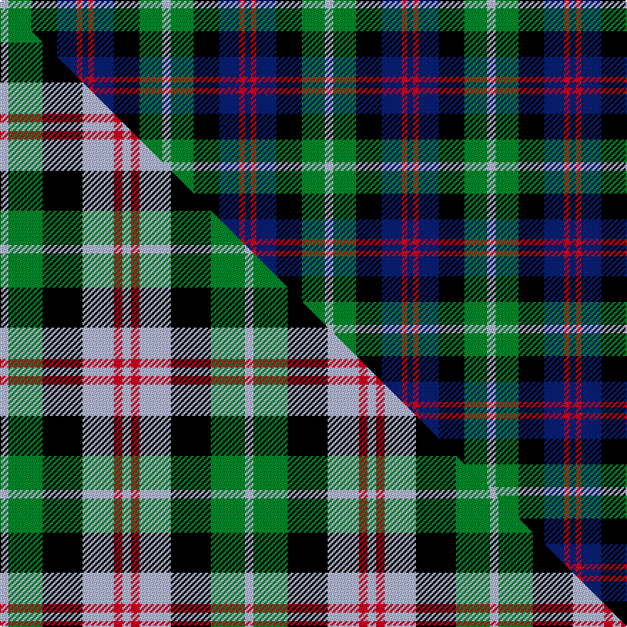

This page is one **sett** — a single exact thread-count. It belongs to the [tartan](/setts/lb3g8k9db7r2db2/)
(the same proportion at any scale), whose colour order is pattern [BRBKGW](/stripes/brbkgw/).

Part of the [Wellington or Waterloo](/tartans/wellington-or-waterloo/) tartan — the named design grouping this sett with its other cloths.

Sourced from weddslist.  It is a [6 stripe tartan](/stripes/stripes6/).

Original link http://www.weddslist.com/cgi-bin/tartans/pg.pl?source=sts

## Thread count
LB/6 G16 K18 DB14 R4 DB/4

One full sett is **114 threads**.

## Palette
<table><thead><tr><th>Colour</th><th>Shade</th><th>OKLCh</th></tr></thead><tbody><tr><td>DB</td><td><code style="background-color:#082077;">#082077</code> <small style="color:#888">#082077</small></td><td><small style="color:#888">oklch(30.0% 0.149 265.1)</small></td></tr><tr><td>LB</td><td><code style="background-color:#B5BBDE;">#B5BBDE</code> <small style="color:#888">#B5BBDE</small></td><td><small style="color:#888">oklch(79.9% 0.050 277.6)</small></td></tr><tr><td>G</td><td><code style="background-color:#008B2A;">#008B2A</code> <small style="color:#888">#008B2A</small></td><td><small style="color:#888">oklch(55.4% 0.170 145.9)</small></td></tr><tr><td>K</td><td><code style="background-color:#000000;">#000000</code> <small style="color:#888">#000000</small></td><td><small style="color:#888">oklch(0.0% 0.000 0.0)</small></td></tr><tr><td>R</td><td><code style="background-color:#D60020;">#D60020</code> <small style="color:#888">#D60020</small></td><td><small style="color:#888">oklch(55.2% 0.224 25.5)</small></td></tr></tbody></table>

# Sample pattern

## Compared to the master

This cloth is one sett of its design; the master sett (the exemplar the design is anchored on) is below for comparison.

Its **ΔTartan distance** from the master is **1.69** — the same measure the nearest-tartans table ranks by (0 is identical; a re-scale of the same cloth is near 0, a recolour or a different proportion further).

<figure class="master-compare" style="margin:0">

this sett
master sett ★

<figcaption style="color:#888;font-size:smaller">One weave of this sett against the <a href="/setts/lb3g12k14lb11r3lb3/">master sett ★</a>, split on the diagonal: a shared proportion runs seamlessly across it with only the shades shifting; a different proportion breaks on it.</figcaption>
</figure>

## Nearest tartan variants

The nearest existing variants by ΔTartan distance, with this cloth at the top so the swatches line up against it.

ΔTartan

Threads

Variant

Sett

—

114

<a href="/variants/s6/lb3g8k9db7r2db2~x2/">Wellington, or Waterloo</a>

<a href="/ttd/edit/#slug=b4g17k17db17r3db3~x2&amp;base=lb3g8k9db7r2db2~x2" title="compare in the TTD">0.38</a>

230

<a href="/variants/s6/b4g17k17db17r3db3~x2/">Royal Highland</a>

<a href="/ttd/edit/#slug=db1r1db6k6g6w1~x2&amp;base=lb3g8k9db7r2db2~x2" title="compare in the TTD">0.72</a>

80

<a href="/variants/s6/db1r1db6k6g6w1~x2/">Wellington</a>

<a href="/ttd/edit/#slug=db3g12k13w2db13w3~x2~db1406275&amp;base=lb3g8k9db7r2db2~x2" title="compare in the TTD">1.41</a>

172

<a href="/variants/s6/db3g12k13w2db13w3~x2~db1406275/">Herd/Hurd</a>

<a href="/ttd/edit/#slug=k2g8k7db8r2~x2&amp;base=lb3g8k9db7r2db2~x2" title="compare in the TTD">1.52</a>

100

<a href="/variants/s5/k2g8k7db8r2~x2/">Denholme</a>

<a href="/ttd/edit/#slug=k5g20k18db20r5~x2&amp;base=lb3g8k9db7r2db2~x2" title="compare in the TTD">1.52</a>

252

<a href="/variants/s5/k5g20k18db20r5~x2/">Denholm (Fashion)</a>

<a href="/ttd/edit/#slug=r2db12k7g8lb2~x4&amp;base=lb3g8k9db7r2db2~x2" title="compare in the TTD">1.55</a>

232

<a href="/variants/s5/r2db12k7g8lb2~x4/">Forbo Nairn</a>

<a href="/ttd/edit/#slug=lb2g6y1k6db6k1db1~x2&amp;base=lb3g8k9db7r2db2~x2" title="compare in the TTD">1.66</a>

86

<a href="/variants/s7/lb2g6y1k6db6k1db1~x2/">Hogarth of Firhill</a>

<a href="/ttd/edit/#slug=b2g6y1k6db6k1db1~x2&amp;base=lb3g8k9db7r2db2~x2" title="compare in the TTD">1.66</a>

86

<a href="/variants/s7/b2g6y1k6db6k1db1~x2/">Hogarth, of Firhill</a>

<a href="/ttd/edit/#slug=r1db7k7g7w1~x6&amp;base=lb3g8k9db7r2db2~x2" title="compare in the TTD">1.73</a>

264

<a href="/variants/s5/r1db7k7g7w1~x6/">Davidson of Tulloch (Clan)</a>

<a href="/ttd/edit/#slug=r4g15k15db15w4~x2&amp;base=lb3g8k9db7r2db2~x2" title="compare in the TTD">1.74</a>

196

<a href="/variants/s5/r4g15k15db15w4~x2/">Dalmeny</a>

## Neighbour map

Every grey dot is one of 13620 variants placed by the first two principal components of the ΔTartan feature space (42% of its variance). Red is this tartan; blue dots are its nearest — click one to open its page.

<svg viewBox="0 0 640 380" role="img" style="max-width:100%;height:auto;border:1px solid #e0e0e0;border-radius:4px;display:block" xmlns="http://www.w3.org/2000/svg"><image href="/nn/cloud.v1.png" width="640" height="380"/><a href="/variants/s6/b4g17k17db17r3db3~x2/"><circle cx="96.8" cy="222.3" r="4" fill="#3465a4"><title>Royal Highland</title></circle></a><a href="/variants/s6/db1r1db6k6g6w1~x2/"><circle cx="96.7" cy="213.2" r="4" fill="#3465a4"><title>Wellington</title></circle></a><a href="/variants/s6/db3g12k13w2db13w3~x2~db1406275/"><circle cx="108.4" cy="226.8" r="4" fill="#3465a4"><title>Herd/Hurd</title></circle></a><a href="/variants/s5/k2g8k7db8r2~x2/"><circle cx="95.2" cy="268.7" r="4" fill="#3465a4"><title>Denholme</title></circle></a><a href="/variants/s5/k5g20k18db20r5~x2/"><circle cx="96.9" cy="268.4" r="4" fill="#3465a4"><title>Denholm (Fashion)</title></circle></a><a href="/variants/s5/r2db12k7g8lb2~x4/"><circle cx="114.8" cy="230.9" r="4" fill="#3465a4"><title>Forbo Nairn</title></circle></a><a href="/variants/s7/lb2g6y1k6db6k1db1~x2/"><circle cx="79.9" cy="207.4" r="4" fill="#3465a4"><title>Hogarth of Firhill</title></circle></a><a href="/variants/s7/b2g6y1k6db6k1db1~x2/"><circle cx="89.6" cy="210.6" r="4" fill="#3465a4"><title>Hogarth, of Firhill</title></circle></a><a href="/variants/s5/r1db7k7g7w1~x6/"><circle cx="91.3" cy="223.1" r="4" fill="#3465a4"><title>Davidson of Tulloch (Clan)</title></circle></a><a href="/variants/s5/r4g15k15db15w4~x2/"><circle cx="37.1" cy="258.3" r="4" fill="#3465a4"><title>Dalmeny</title></circle></a><circle cx="52.2" cy="240.3" r="5" fill="#c00000"/><text x="320" y="376" text-anchor="middle" font-size="11" fill="#999">ground</text><text x="11" y="190" text-anchor="middle" font-size="11" fill="#999" transform="rotate(-90 11 190)">complexity</text></svg>

ID: /variants/s6/lb3g8k9db7r2db2~x2/
