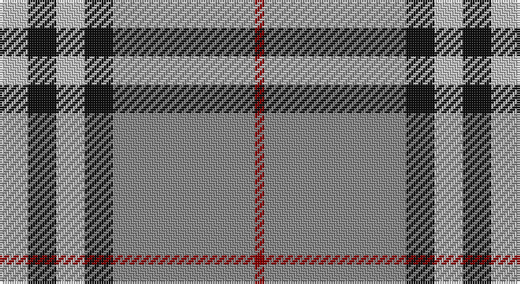

This page is one **sett** — a single exact thread-count. It belongs to the [tartan](/setts/lb3k3lb3k3o15r1/)
(the same proportion at any scale), whose colour order is pattern [RRKWKW](/stripes/rrkwkw/).

Part of the [Tiree](/tartans/tiree/) tartan — the named design grouping this sett with its other cloths.

Sourced from register-of-tartans.  It is a [6 stripe tartan](/stripes/stripes6/).

Original link https://www.tartanregister.gov.uk/tartanDetails.aspx?ref=4130

## Also known as

This cloth is also recorded under:

- Tiree Grey

2 attestations — the source records this cloth was collapsed from (oldest owns this page)

<ul>
<li>01/01/2002 — Tiree Grey (register-of-tartans, <a href="https://www.tartanregister.gov.uk/tartanDetails.aspx?ref=4130">record</a>)</li>
<li>pre 2002 — Tiree Grey (Fashion) (tartans-authority, <a href="http://www.tartansauthority.com/tartan-ferret/display/5110/">record</a>)</li>
</ul>

## Register references

External register numbers recorded for this tartan.

- Scottish Register of Tartans: [4130](https://www.tartanregister.gov.uk/tartanDetails.aspx?ref=4130)
- Scottish Tartans Authority (ITI): 5110

## Thread count
N/12 K12 N12 K12 Na60 DR/4

One full sett is **208 threads**.

## Palette

Palette: <strong>Tartan Register</strong>
<table><thead><tr><th>Colour</th><th>Threads</th><th>Shade</th><th>Base</th><th>OKLCh</th></tr></thead><tbody><tr><td>N/</td><td style="text-align:right;font-variant-numeric:tabular-nums">12</td><td><code style="background-color:#C0C0C0;">#C0C0C0</code> <small style="color:#888">#C0C0C0</small></td><td>W <code style="background-color:#F7F7F7;">#F7F7F7</code></td><td><small style="color:#888">oklch(80.8% 0.000 89.9)</small></td></tr><tr><td>K</td><td style="text-align:right;font-variant-numeric:tabular-nums">12</td><td><code style="background-color:#101010;">#101010</code> <small style="color:#888">#101010</small></td><td>K <code style="background-color:#000000;">#000000</code></td><td><small style="color:#888">oklch(17.3% 0.000 89.9)</small></td></tr><tr><td>N</td><td style="text-align:right;font-variant-numeric:tabular-nums">12</td><td><code style="background-color:#C0C0C0;">#C0C0C0</code> <small style="color:#888">#C0C0C0</small></td><td>W <code style="background-color:#F7F7F7;">#F7F7F7</code></td><td><small style="color:#888">oklch(80.8% 0.000 89.9)</small></td></tr><tr><td>K</td><td style="text-align:right;font-variant-numeric:tabular-nums">12</td><td><code style="background-color:#101010;">#101010</code> <small style="color:#888">#101010</small></td><td>K <code style="background-color:#000000;">#000000</code></td><td><small style="color:#888">oklch(17.3% 0.000 89.9)</small></td></tr><tr><td>Na</td><td style="text-align:right;font-variant-numeric:tabular-nums">60</td><td><code style="background-color:#888888;">#888888</code> <small style="color:#888">#888888</small></td><td>R <code style="background-color:#CC0000;">#CC0000</code></td><td><small style="color:#888">oklch(62.7% 0.000 89.9)</small></td></tr><tr><td>DR/</td><td style="text-align:right;font-variant-numeric:tabular-nums">4</td><td><code style="background-color:#880000;">#880000</code> <small style="color:#888">#880000</small></td><td>R <code style="background-color:#CC0000;">#CC0000</code></td><td><small style="color:#888">oklch(39.4% 0.162 29.2)</small></td></tr></tbody></table>

# Sample pattern

## Nearest tartans

The nearest existing variants by ΔTartan distance, with this tartan at the top so the swatches line up against it.

ΔTartan

Tartan

Sett

—

<a href="/ttd/edit/#slug=lb3k3lb3k3o15r1~x4">Tiree Grey</a> <a class="nn-out" href="/variants/s6/lb3k3lb3k3o15r1~x4/" title="open its dictionary page">↗</a>

0.89

<a href="/ttd/edit/#slug=dp2k1dp16g16w2~x4&amp;base=lb3k3lb3k3o15r1~x4">Kansai Highland Games Corporate Tartan</a> <a class="nn-out" href="/variants/s5/dp2k1dp16g16w2~x4/" title="open its dictionary page">↗</a>

0.90

<a href="/ttd/edit/#slug=k5w7k5y20db1~x4&amp;base=lb3k3lb3k3o15r1~x4">Burberry Grey (Original)</a> <a class="nn-out" href="/variants/s5/k5w7k5y20db1~x4/" title="open its dictionary page">↗</a>

0.94

<a href="/ttd/edit/#slug=k3t10ly5t29k10r6k2~x2&amp;base=lb3k3lb3k3o15r1~x4">Perkins 2015</a> <a class="nn-out" href="/variants/s7/k3t10ly5t29k10r6k2~x2/" title="open its dictionary page">↗</a>

0.95

<a href="/ttd/edit/#slug=dp2k1dp16g17w2~x4&amp;base=lb3k3lb3k3o15r1~x4">Kansai Highland Games</a> <a class="nn-out" href="/variants/s5/dp2k1dp16g17w2~x4/" title="open its dictionary page">↗</a>

1.00

<a href="/ttd/edit/#slug=r1lb5k8o18lb1k1lb1~x4&amp;base=lb3k3lb3k3o15r1~x4">Merrick, Camel</a> <a class="nn-out" href="/variants/s7/r1lb5k8o18lb1k1lb1~x4/" title="open its dictionary page">↗</a>

1.05

<a href="/ttd/edit/#slug=r4o41k5w14k18r4~x2&amp;base=lb3k3lb3k3o15r1~x4">Downside (Corporate)</a> <a class="nn-out" href="/variants/s6/r4o41k5w14k18r4~x2/" title="open its dictionary page">↗</a>

1.06

<a href="/ttd/edit/#slug=k4ly18n44k3ly10k4&amp;base=lb3k3lb3k3o15r1~x4">Stutterheim</a> <a class="nn-out" href="/variants/s6/k4ly18n44k3ly10k4/" title="open its dictionary page">↗</a>

1.11

<a href="/ttd/edit/#slug=o19k2w4k2n5k2n5~x2&amp;base=lb3k3lb3k3o15r1~x4">Kyle Tartan</a> <a class="nn-out" href="/variants/s7/o19k2w4k2n5k2n5~x2/" title="open its dictionary page">↗</a>

1.15

<a href="/ttd/edit/#slug=r12ly3w14dt10ly2dt24r2~x2&amp;base=lb3k3lb3k3o15r1~x4">Yusra (Malay) (Personal)</a> <a class="nn-out" href="/variants/s7/r12ly3w14dt10ly2dt24r2~x2/" title="open its dictionary page">↗</a>

1.16

<a href="/ttd/edit/#slug=g6lo2g32k8w6lo20g5~x2&amp;base=lb3k3lb3k3o15r1~x4">Pollock (Name)</a> <a class="nn-out" href="/variants/s7/g6lo2g32k8w6lo20g5~x2/" title="open its dictionary page">↗</a>

## Neighbour map

Every grey dot is one of 14360 variants placed by the first two principal components of the ΔTartan feature space (44% of its variance). Red is this tartan; blue dots are its nearest — click one to open its page.

<svg viewBox="0 0 640 380" role="img" style="max-width:100%;height:auto;border:1px solid #e0e0e0;border-radius:4px;display:block" xmlns="http://www.w3.org/2000/svg"><image href="/nn/cloud.v1.png" width="640" height="380"/><a href="/variants/s5/dp2k1dp16g16w2~x4/"><circle cx="292.1" cy="181.0" r="4" fill="#3465a4"><title>Kansai Highland Games Corporate Tartan</title></circle></a><a href="/variants/s5/k5w7k5y20db1~x4/"><circle cx="279.8" cy="176.8" r="4" fill="#3465a4"><title>Burberry Grey (Original)</title></circle></a><a href="/variants/s7/k3t10ly5t29k10r6k2~x2/"><circle cx="316.4" cy="176.8" r="4" fill="#3465a4"><title>Perkins 2015</title></circle></a><a href="/variants/s5/dp2k1dp16g17w2~x4/"><circle cx="287.5" cy="176.9" r="4" fill="#3465a4"><title>Kansai Highland Games</title></circle></a><a href="/variants/s7/r1lb5k8o18lb1k1lb1~x4/"><circle cx="294.4" cy="143.3" r="4" fill="#3465a4"><title>Merrick, Camel</title></circle></a><a href="/variants/s6/r4o41k5w14k18r4~x2/"><circle cx="223.5" cy="182.6" r="4" fill="#3465a4"><title>Downside (Corporate)</title></circle></a><a href="/variants/s6/k4ly18n44k3ly10k4/"><circle cx="305.0" cy="178.3" r="4" fill="#3465a4"><title>Stutterheim</title></circle></a><a href="/variants/s7/o19k2w4k2n5k2n5~x2/"><circle cx="255.1" cy="189.1" r="4" fill="#3465a4"><title>Kyle Tartan</title></circle></a><a href="/variants/s7/r12ly3w14dt10ly2dt24r2~x2/"><circle cx="229.2" cy="181.5" r="4" fill="#3465a4"><title>Yusra (Malay) (Personal)</title></circle></a><a href="/variants/s7/g6lo2g32k8w6lo20g5~x2/"><circle cx="293.0" cy="174.7" r="4" fill="#3465a4"><title>Pollock (Name)</title></circle></a><circle cx="290.6" cy="171.5" r="5" fill="#c00000"/></svg>

ID: /variants/s6/lb3k3lb3k3o15r1~x4/
