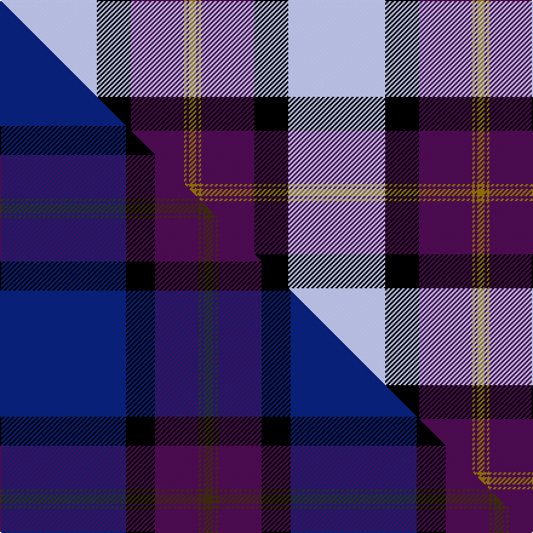

This is one **variant** — a specific cloth: this exact thread count and colourway, with its own
provenance below. It is one weaving of the [sett](/setts/lb40k14dp22y1dp1y3/) (the scale-free proportion — the
same cloth at any scale or shade), whose colour order is pattern [GBGBKW](/stripes/gbgbkw/).

Part of the [British Energy](/tartans/british-energy/) tartan — the named design grouping this sett with its other cloths.

Sourced from house-of-tartan.  It is a [6 stripe tartan](/stripes/stripes6/).

Original link [http://www.house-of-tartan.scotland.net/house/TartanViewjs.asp?colr=Def&tnam=2324](http://www.house-of-tartan.scotland.net/house/TartanViewjs.asp?colr=Def&tnam=2324)

## Provenance

Earliest known date: 1996 Nothing

Dataset <small>— provenance for this record, inherited from the source manifest</small>

<dl class="dataset-prov">
<dt>source</dt><dd><a href="/sources/house-of-tartan/">House of Tartan</a></dd>
<dt>data captured from</dt><dd><a href="https://github.com/thetartan/tartan-database/blob/master/data/house-of-tartan/data.csv">https://github.com/thetartan/tartan-database/blob/master/data/house-of-tartan/data.csv</a></dd>
<dt>data date</dt><dd>1996 <small>(this record)</small></dd>
<dt>licence</dt><dd><a href="https://creativecommons.org/licenses/by-nc-nd/4.0/">CC BY-NC-ND 4.0</a></dd>
</dl>

Capture chain <small>— the hands this data passed through, oldest first; each capture carries its own licence</small>

<ol class="capture-chain">
<li><a href="http://www.house-of-tartan.scotland.net/">House of Tartan</a> <small>the weaver/retailer's database — the site is now offline; the URL is kept as the ultimate source's identity</small></li>
<li><a href="https://github.com/thetartan/tartan-database">thetartan/tartan-database</a> <small>2016-2017</small> · <a href="https://creativecommons.org/licenses/by-nc-nd/4.0/">CC BY-NC-ND 4.0</a> <small>Levko Kravets's frozen compilation — the capture we vendored, and where its CC licence text came from</small></li>
<li>this dictionary <small>captured 2026-06-10 · commit 5bf86c7566</small> <small>each re-capture is a git commit to data/sources</small></li>
</ol>

## Thread count
LB/80 K28 DP44 Y2 DP2 Y/6

One full sett is **238 threads**.

## Palette
<table><thead><tr><th>Colour</th><th>Shade</th><th>OKLCh</th></tr></thead><tbody><tr><td>K</td><td><code style="background-color:#000000;">#000000</code> <small style="color:#888">#000000</small></td><td><small style="color:#888">oklch(0.0% 0.000 0.0)</small></td></tr><tr><td>LB</td><td><code style="background-color:#B5BBDE;">#B5BBDE</code> <small style="color:#888">#B5BBDE</small></td><td><small style="color:#888">oklch(79.9% 0.050 277.6)</small></td></tr><tr><td>DP</td><td><code style="background-color:#4B0B4F;">#4B0B4F</code> <small style="color:#888">#4B0B4F</small></td><td><small style="color:#888">oklch(30.1% 0.125 325.4)</small></td></tr><tr><td>Y</td><td><code style="background-color:#8B6E00;">#8B6E00</code> <small style="color:#888">#8B6E00</small></td><td><small style="color:#888">oklch(55.1% 0.113 90.4)</small></td></tr></tbody></table>

# Sample pattern

## Compared to the master

This cloth is one sett of its design; the master sett (the exemplar the design is anchored on) is below for comparison.

Its **ΔTartan distance** from the master is **0.61** — the same measure the nearest-tartans table ranks by (0 is identical; a re-scale of the same cloth is near 0, a recolour or a different proportion further).

<figure class="master-compare" style="margin:0">

this sett
master sett ★

<figcaption style="color:#888;font-size:smaller">One weave of this sett against the <a href="/setts/db52k12dp18dy1dp1dy4/">master sett ★</a>, split on the diagonal: a shared proportion runs seamlessly across it with only the shades shifting; a different proportion breaks on it.</figcaption>
</figure>

## Nearest tartan variants

The nearest existing variants by ΔTartan distance, with this cloth at the top so the swatches line up against it.

ΔTartan

Threads

Variant

Sett

—

238

<a href="/variants/s6/lb40k14dp22y1dp1y3~x2/">British Energy Corporate Tartan</a>

<a href="/ttd/edit/#slug=b40k14dp22y1dp1y3~x2&amp;base=lb40k14dp22y1dp1y3~x2" title="compare in the TTD">0.18</a>

238

<a href="/variants/s6/b40k14dp22y1dp1y3~x2/">British Energy</a>

<a href="/ttd/edit/#slug=b8r11b28r4k17o1k7r2~x2&amp;base=lb40k14dp22y1dp1y3~x2" title="compare in the TTD">3.12</a>

292

<a href="/variants/s8/b8r11b28r4k17o1k7r2~x2/">Kilbranan Sound (Personal)</a>

<a href="/ttd/edit/#slug=db26w28db14y3k1y2k1~x2&amp;base=lb40k14dp22y1dp1y3~x2" title="compare in the TTD">3.21</a>

246

<a href="/variants/s7/db26w28db14y3k1y2k1~x2/">Gothenburg/Goteborg</a>

<a href="/ttd/edit/#slug=w8k1w40dp1k16db16w6db3dp3db6~x2&amp;base=lb40k14dp22y1dp1y3~x2" title="compare in the TTD">3.35</a>

372

<a href="/variants/s10/w8k1w40dp1k16db16w6db3dp3db6~x2/">Lochnagar Dress fashion Tartan</a>

<a href="/ttd/edit/#slug=lb60k6lb8k2lb8w2dr12k49ly4&amp;base=lb40k14dp22y1dp1y3~x2" title="compare in the TTD">3.43</a>

238

<a href="/variants/s9/lb60k6lb8k2lb8w2dr12k49ly4/">Motherwell Football Club. Modern</a>

<a href="/ttd/edit/#slug=t18k2t4k6dp12lo1~x2&amp;base=lb40k14dp22y1dp1y3~x2" title="compare in the TTD">3.45</a>

134

<a href="/variants/s6/t18k2t4k6dp12lo1~x2/">Joker, The</a>

<a href="/ttd/edit/#slug=k4ly4lb32ly1k32ly4k2~x4&amp;base=lb40k14dp22y1dp1y3~x2" title="compare in the TTD">3.48</a>

608

<a href="/variants/s7/k4ly4lb32ly1k32ly4k2~x4/">Gleneagles Gold (Dalgleish)</a>

<a href="/ttd/edit/#slug=db3r2db30r1w18o30r2o3~x2&amp;base=lb40k14dp22y1dp1y3~x2" title="compare in the TTD">3.49</a>

344

<a href="/variants/s8/db3r2db30r1w18o30r2o3~x2/">Bannockbane Navy</a>

<a href="/ttd/edit/#slug=k5w7k5n20db1~x4&amp;base=lb40k14dp22y1dp1y3~x2" title="compare in the TTD">3.56</a>

280

<a href="/variants/s5/k5w7k5n20db1~x4/">Burberry Grey (Original)</a>

<a href="/ttd/edit/#slug=db5w4r1db26r25w1r8w5k1~x2&amp;base=lb40k14dp22y1dp1y3~x2" title="compare in the TTD">3.57</a>

292

<a href="/variants/s9/db5w4r1db26r25w1r8w5k1~x2/">Boring and Dull</a>

## Neighbour map

Every grey dot is one of 13621 variants placed by the first two principal components of the ΔTartan feature space (42% of its variance). Red is this tartan; blue dots are its nearest — click one to open its page.

<svg viewBox="0 0 640 380" role="img" style="max-width:100%;height:auto;border:1px solid #e0e0e0;border-radius:4px;display:block" xmlns="http://www.w3.org/2000/svg"><image href="/nn/cloud.v1.png" width="640" height="380"/><a href="/variants/s6/b40k14dp22y1dp1y3~x2/"><circle cx="302.8" cy="132.1" r="4" fill="#3465a4"><title>British Energy</title></circle></a><a href="/variants/s8/b8r11b28r4k17o1k7r2~x2/"><circle cx="228.9" cy="132.4" r="4" fill="#3465a4"><title>Kilbranan Sound (Personal)</title></circle></a><a href="/variants/s7/db26w28db14y3k1y2k1~x2/"><circle cx="276.5" cy="127.3" r="4" fill="#3465a4"><title>Gothenburg/Goteborg</title></circle></a><a href="/variants/s10/w8k1w40dp1k16db16w6db3dp3db6~x2/"><circle cx="268.8" cy="95.5" r="4" fill="#3465a4"><title>Lochnagar Dress fashion Tartan</title></circle></a><a href="/variants/s9/lb60k6lb8k2lb8w2dr12k49ly4/"><circle cx="250.3" cy="90.0" r="4" fill="#3465a4"><title>Motherwell Football Club. Modern</title></circle></a><a href="/variants/s6/t18k2t4k6dp12lo1~x2/"><circle cx="261.1" cy="175.4" r="4" fill="#3465a4"><title>Joker, The</title></circle></a><a href="/variants/s7/k4ly4lb32ly1k32ly4k2~x4/"><circle cx="270.1" cy="121.0" r="4" fill="#3465a4"><title>Gleneagles Gold (Dalgleish)</title></circle></a><a href="/variants/s8/db3r2db30r1w18o30r2o3~x2/"><circle cx="229.1" cy="133.3" r="4" fill="#3465a4"><title>Bannockbane Navy</title></circle></a><a href="/variants/s5/k5w7k5n20db1~x4/"><circle cx="252.2" cy="168.8" r="4" fill="#3465a4"><title>Burberry Grey (Original)</title></circle></a><a href="/variants/s9/db5w4r1db26r25w1r8w5k1~x2/"><circle cx="261.6" cy="117.1" r="4" fill="#3465a4"><title>Boring and Dull</title></circle></a><circle cx="266.9" cy="120.4" r="5" fill="#c00000"/><text x="320" y="376" text-anchor="middle" font-size="11" fill="#999">ground</text><text x="11" y="190" text-anchor="middle" font-size="11" fill="#999" transform="rotate(-90 11 190)">complexity</text></svg>

ID: /variants/s6/lb40k14dp22y1dp1y3~x2/
