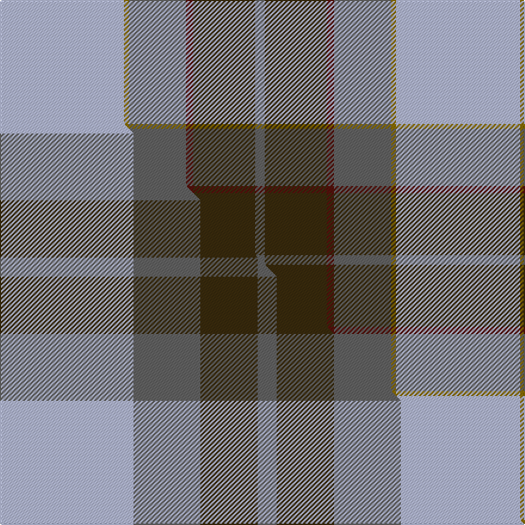

This is one **variant** — a specific cloth: this exact thread count and colourway, with its own
provenance below. It is one weaving of the [sett](/tartans/o/ou/outlander-4/) (the scale-free proportion — the
same cloth at any scale or shade), whose colour order is pattern [BGBBGW](/stripes/bgbbgw/).

Part of the [Outlander](/tartans/o/ou/outlander-4/) tartan — the named design grouping this sett with its other cloths.

Sourced from register-of-tartans.  It is a [6 stripe tartan](/stripes/stripes6/).

Original link [https://www.tartanregister.gov.uk/tartanDetails.aspx?ref=11113](https://www.tartanregister.gov.uk/tartanDetails.aspx?ref=11113)

Dataset <small>— provenance for this record, inherited from the source manifest</small>

<dl class="dataset-prov">
<dt>source</dt><dd><a href="/sources/register-of-tartans/">Scottish Register of Tartans</a></dd>
<dt>data captured from</dt><dd><a href="https://github.com/thetartan/tartan-database/blob/master/data/register-of-tartans/data.csv">https://github.com/thetartan/tartan-database/blob/master/data/register-of-tartans/data.csv</a></dd>
<dt>data date</dt><dd>01/08/2014 <small>(this record)</small></dd>
<dt>licence</dt><dd><a href="https://www.tartanregister.gov.uk/copyright">Crown copyright</a></dd>
</dl>

Capture chain <small>— the hands this data passed through, oldest first; each capture carries its own licence</small>

<ol class="capture-chain">
<li><a href="https://www.tartanregister.gov.uk/">Scottish Register of Tartans</a> · <a href="https://www.tartanregister.gov.uk/copyright">Crown copyright</a> <small>the living register — still published by National Records of Scotland</small></li>
<li><a href="https://github.com/thetartan/tartan-database">thetartan/tartan-database</a> <small>2016-2017</small> · <a href="https://creativecommons.org/licenses/by-nc-nd/4.0/">CC BY-NC-ND 4.0</a> <small>Levko Kravets's frozen compilation — the capture we vendored, and where its CC licence text came from</small></li>
<li>this dictionary <small>captured 2026-06-10 · commit 5bf86c7566</small> <small>each re-capture is a git commit to data/sources</small></li>
</ol>

## Register references

External register numbers recorded for this tartan.

- Scottish Register of Tartans: [11113](https://www.tartanregister.gov.uk/tartanDetails.aspx?ref=11113)

## Thread count
LB/104 Y4 N48 DR6 DY52 N/8

One full sett is **332 threads**.

## Palette
<table><thead><tr><th>Colour</th><th>Shade</th><th>OKLCh</th></tr></thead><tbody><tr><td>DR</td><td><code style="background-color:#55120C;">#55120C</code> <small style="color:#888">#55120C</small></td><td><small style="color:#888">oklch(30.0% 0.099 29.3)</small></td></tr><tr><td>DY</td><td><code style="background-color:#3A2B0D;">#3A2B0D</code> <small style="color:#888">#3A2B0D</small></td><td><small style="color:#888">oklch(30.0% 0.049 82.0)</small></td></tr><tr><td>LB</td><td><code style="background-color:#B5BBDE;">#B5BBDE</code> <small style="color:#888">#B5BBDE</small></td><td><small style="color:#888">oklch(79.9% 0.050 277.6)</small></td></tr><tr><td>N</td><td><code style="background-color:#636363;">#636363</code> <small style="color:#888">#636363</small></td><td><small style="color:#888">oklch(50.0% 0.000 89.9)</small></td></tr><tr><td>Y</td><td><code style="background-color:#8B6E00;">#8B6E00</code> <small style="color:#888">#8B6E00</small></td><td><small style="color:#888">oklch(55.1% 0.113 90.4)</small></td></tr></tbody></table>

# Sample pattern

[Sample sheet (PDF)](swatch.pdf) — the woven sample, thread count and palette on one printable A4, rendered on demand (the same sheet the TTD print page downloads).

## Compared to the master

This cloth is one sett of its design; the master sett (the exemplar the design is anchored on) is below for comparison.

Its **ΔTartan distance** from the master is **1.27** — the same measure the nearest-tartans table ranks by (0 is identical; a re-scale of the same cloth is near 0, a recolour or a different proportion further).

<figure class="master-compare" style="margin:0">

this sett
master sett ★

<figcaption style="color:#888;font-size:smaller">One weave of this sett against the <a href="/setts/lb14n7dy6n2/">master sett ★</a>, split on the diagonal: a shared proportion runs seamlessly across it with only the shades shifting; a different proportion breaks on it.</figcaption>
</figure>

## Nearest tartan variants

The nearest existing variants by ΔTartan distance, with this cloth at the top so the swatches line up against it.

ΔTartan

Threads

Variant

Sett

—

332

<a href="/variants/s6/lb52y2n24dr3dy26n4~x2/">Outlander #1</a>

<a href="/ttd/edit/#slug=w36db12w1r12g16y2~x2&amp;base=lb52y2n24dr3dy26n4~x2" title="compare in the TTD">2.42</a>

240

<a href="/variants/s6/w36db12w1r12g16y2~x2/">MacNappy Tartan</a>

<a href="/ttd/edit/#slug=lb30db1w4n10y18~x2&amp;base=lb52y2n24dr3dy26n4~x2" title="compare in the TTD">2.60</a>

156

<a href="/variants/s5/lb30db1w4n10y18~x2/">Alloway Primary School (Ayr)</a>

<a href="/ttd/edit/#slug=w15y2db5lr3n40db10~lr70-n5805249&amp;base=lb52y2n24dr3dy26n4~x2" title="compare in the TTD">2.69</a>

125

<a href="/variants/s6/w15y2db5lr3n40db10~lr70-n5805249/">Herriot (New Zealand) (Name)</a>

<a href="/ttd/edit/#slug=db2w14dp4y1g8db2~x2&amp;base=lb52y2n24dr3dy26n4~x2" title="compare in the TTD">2.75</a>

116

<a href="/variants/s6/db2w14dp4y1g8db2~x2/">Manx Laxey, dress green</a>

<a href="/ttd/edit/#slug=w14dp4dy1g8db2~x2&amp;base=lb52y2n24dr3dy26n4~x2" title="compare in the TTD">2.80</a>

84

<a href="/variants/s5/w14dp4dy1g8db2~x2/">Manx Laxey Dress Green</a>

<a href="/ttd/edit/#slug=w4lb28dp7y2dg16lb4~x2&amp;base=lb52y2n24dr3dy26n4~x2" title="compare in the TTD">2.98</a>

228

<a href="/variants/s6/w4lb28dp7y2dg16lb4~x2/">Manx Laxey (Blue)</a>

<a href="/ttd/edit/#slug=y21g26db62w2dg2w2&amp;base=lb52y2n24dr3dy26n4~x2" title="compare in the TTD">3.02</a>

207

<a href="/variants/s6/y21g26db62w2dg2w2/">Nynashamn Whisky Society (Corporate)</a>

<a href="/ttd/edit/#slug=g4w28dp8y2db17g4~x2&amp;base=lb52y2n24dr3dy26n4~x2" title="compare in the TTD">3.19</a>

236

<a href="/variants/s6/g4w28dp8y2db17g4~x2/">Manx Dress District Tartan</a>

<a href="/ttd/edit/#slug=g4w28dp8dy2db17g4~x2&amp;base=lb52y2n24dr3dy26n4~x2" title="compare in the TTD">3.20</a>

236

<a href="/variants/s6/g4w28dp8dy2db17g4~x2/">Manx Dress</a>

<a href="/ttd/edit/#slug=w4lb30g6dr2g6dr28y2dr3~x2&amp;base=lb52y2n24dr3dy26n4~x2" title="compare in the TTD">3.21</a>

310

<a href="/variants/s8/w4lb30g6dr2g6dr28y2dr3~x2/">Scotland 2000 Commemorative Tartan</a>

## Neighbour map

Every grey dot is one of 13662 variants placed by the first two principal components of the ΔTartan feature space (42% of its variance). Red is this tartan; blue dots are its nearest — click one to open its page. The map is a flat projection of a many-dimensional space — [how to read it](/posts/neighbourhood-maps/).

<svg viewBox="0 0 640 380" role="img" style="max-width:100%;height:auto;border:1px solid #e0e0e0;border-radius:4px;display:block" xmlns="http://www.w3.org/2000/svg"><image href="/nn/cloud.v1.png" width="640" height="380"/><a href="/variants/s6/w36db12w1r12g16y2~x2/"><circle cx="232.7" cy="141.4" r="4" fill="#3465a4"><title>MacNappy Tartan</title></circle></a><a href="/variants/s5/lb30db1w4n10y18~x2/"><circle cx="281.2" cy="172.0" r="4" fill="#3465a4"><title>Alloway Primary School (Ayr)</title></circle></a><a href="/variants/s6/w15y2db5lr3n40db10~lr70-n5805249/"><circle cx="318.7" cy="176.2" r="4" fill="#3465a4"><title>Herriot (New Zealand) (Name)</title></circle></a><a href="/variants/s6/db2w14dp4y1g8db2~x2/"><circle cx="213.3" cy="190.9" r="4" fill="#3465a4"><title>Manx Laxey, dress green</title></circle></a><a href="/variants/s5/w14dp4dy1g8db2~x2/"><circle cx="232.9" cy="202.9" r="4" fill="#3465a4"><title>Manx Laxey Dress Green</title></circle></a><a href="/variants/s6/w4lb28dp7y2dg16lb4~x2/"><circle cx="272.4" cy="189.6" r="4" fill="#3465a4"><title>Manx Laxey (Blue)</title></circle></a><a href="/variants/s6/y21g26db62w2dg2w2/"><circle cx="344.1" cy="156.0" r="4" fill="#3465a4"><title>Nynashamn Whisky Society (Corporate)</title></circle></a><a href="/variants/s6/g4w28dp8y2db17g4~x2/"><circle cx="207.3" cy="188.2" r="4" fill="#3465a4"><title>Manx Dress District Tartan</title></circle></a><a href="/variants/s6/g4w28dp8dy2db17g4~x2/"><circle cx="206.6" cy="187.8" r="4" fill="#3465a4"><title>Manx Dress</title></circle></a><a href="/variants/s8/w4lb30g6dr2g6dr28y2dr3~x2/"><circle cx="238.3" cy="165.2" r="4" fill="#3465a4"><title>Scotland 2000 Commemorative Tartan</title></circle></a><circle cx="300.3" cy="172.7" r="5" fill="#c00000"/><text x="320" y="376" text-anchor="middle" font-size="11" fill="#999">ground</text><text x="11" y="190" text-anchor="middle" font-size="11" fill="#999" transform="rotate(-90 11 190)">complexity</text></svg>

ID: /variants/s6/lb52y2n24dr3dy26n4~x2/
