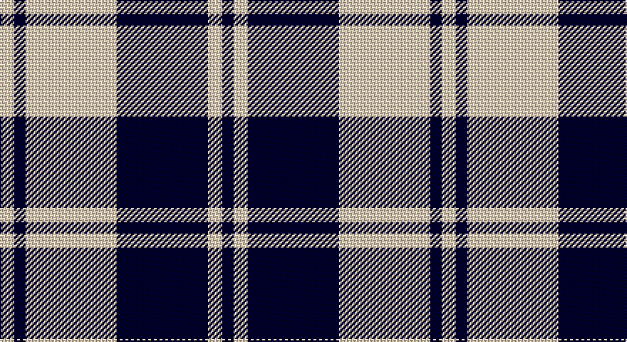

This page is one **sett** — a single exact thread-count. It belongs to the [tartan](/setts/lb5k4lb32k32lb5k4/)
(the same proportion at any scale), whose colour order is pattern [KWKWKW](/stripes/kwkwkw/).

Sourced from tartans-authority.  It is a [6 stripe tartan](/stripes/stripes6/).

Original link http://www.tartansauthority.com/tartan-ferret/display/8681/

## Register references

External register numbers recorded for this tartan.

- Scottish Tartans Authority (ITI): 8681

## Thread count
LR/10 DB8 LR64 DB64 LR10 DB/8

One full sett is **310 threads**.

## Palette

Palette: <strong>Tartan Register</strong> <small style="color:#888">(1 of 2 colours)</small>
<table><thead><tr><th>Colour</th><th>Threads</th><th>Shade</th><th>Base</th><th>OKLCh</th></tr></thead><tbody><tr><td>LR/</td><td style="text-align:right;font-variant-numeric:tabular-nums">10</td><td><code style="background-color:#E8CCB8;">#E8CCB8</code> <small style="color:#888">#E8CCB8</small></td><td>W <code style="background-color:#F7F7F7;">#F7F7F7</code></td><td><small style="color:#888">oklch(86.3% 0.042 57.7)</small></td></tr><tr><td>DB</td><td style="text-align:right;font-variant-numeric:tabular-nums">8</td><td><code style="background-color:#00002C;">#00002C</code> <small style="color:#888">#00002C</small></td><td>K <code style="background-color:#000000;">#000000</code></td><td><small style="color:#888">oklch(13.2% 0.092 264.1)</small></td></tr><tr><td>LR</td><td style="text-align:right;font-variant-numeric:tabular-nums">64</td><td><code style="background-color:#E8CCB8;">#E8CCB8</code> <small style="color:#888">#E8CCB8</small></td><td>W <code style="background-color:#F7F7F7;">#F7F7F7</code></td><td><small style="color:#888">oklch(86.3% 0.042 57.7)</small></td></tr><tr><td>DB</td><td style="text-align:right;font-variant-numeric:tabular-nums">64</td><td><code style="background-color:#00002C;">#00002C</code> <small style="color:#888">#00002C</small></td><td>K <code style="background-color:#000000;">#000000</code></td><td><small style="color:#888">oklch(13.2% 0.092 264.1)</small></td></tr><tr><td>LR</td><td style="text-align:right;font-variant-numeric:tabular-nums">10</td><td><code style="background-color:#E8CCB8;">#E8CCB8</code> <small style="color:#888">#E8CCB8</small></td><td>W <code style="background-color:#F7F7F7;">#F7F7F7</code></td><td><small style="color:#888">oklch(86.3% 0.042 57.7)</small></td></tr><tr><td>DB/</td><td style="text-align:right;font-variant-numeric:tabular-nums">8</td><td><code style="background-color:#00002C;">#00002C</code> <small style="color:#888">#00002C</small></td><td>K <code style="background-color:#000000;">#000000</code></td><td><small style="color:#888">oklch(13.2% 0.092 264.1)</small></td></tr></tbody></table>

# Sample pattern

## Nearest tartans

The nearest existing variants by ΔTartan distance, with this tartan at the top so the swatches line up against it.

ΔTartan

Tartan

Sett

—

<a href="/ttd/edit/#slug=lb5k4lb32k32lb5k4~x2">Valley Forge (Artefact)</a> <a class="nn-out" href="/variants/s6/lb5k4lb32k32lb5k4~x2/" title="open its dictionary page">↗</a>

0.69

<a href="/ttd/edit/#slug=k2w1k9w9k1w2~x3&amp;base=lb5k4lb32k32lb5k4~x2">Erskine BW MINI Design Tartan</a> <a class="nn-out" href="/variants/s6/k2w1k9w9k1w2~x3/" title="open its dictionary page">↗</a>

0.85

<a href="/ttd/edit/#slug=k2w1k8w8k1~x8&amp;base=lb5k4lb32k32lb5k4~x2">Cairn (Marton Mills)</a> <a class="nn-out" href="/variants/s5/k2w1k8w8k1~x8/" title="open its dictionary page">↗</a>

0.90

<a href="/ttd/edit/#slug=k2w1k9w9k1w2~x6&amp;base=lb5k4lb32k32lb5k4~x2">Erskine (Black and White)</a> <a class="nn-out" href="/variants/s6/k2w1k9w9k1w2~x6/" title="open its dictionary page">↗</a>

1.25

<a href="/ttd/edit/#slug=k3lr16k4lr3k12w2~x3&amp;base=lb5k4lb32k32lb5k4~x2">MacMugen</a> <a class="nn-out" href="/variants/s6/k3lr16k4lr3k12w2~x3/" title="open its dictionary page">↗</a>

1.28

<a href="/ttd/edit/#slug=w8k1w8k12w1~x2&amp;base=lb5k4lb32k32lb5k4~x2">MacLeod, Black &amp; White</a> <a class="nn-out" href="/variants/s5/w8k1w8k12w1~x2/" title="open its dictionary page">↗</a>

1.34

<a href="/ttd/edit/#slug=w2k1w6k6w2k1w1~x2&amp;base=lb5k4lb32k32lb5k4~x2">Scott (Abbreviated)</a> <a class="nn-out" href="/variants/s7/w2k1w6k6w2k1w1~x2/" title="open its dictionary page">↗</a>

1.35

<a href="/ttd/edit/#slug=k22w3k3w22~x2&amp;base=lb5k4lb32k32lb5k4~x2">MacPhee (Black and White)</a> <a class="nn-out" href="/variants/s4/k22w3k3w22~x2/" title="open its dictionary page">↗</a>

1.36

<a href="/ttd/edit/#slug=db8w3db28w32k3w4~x2&amp;base=lb5k4lb32k32lb5k4~x2">Ailsa, Navy (Dance)</a> <a class="nn-out" href="/variants/s6/db8w3db28w32k3w4~x2/" title="open its dictionary page">↗</a>

1.46

<a href="/ttd/edit/#slug=db4w35db31w4~x2&amp;base=lb5k4lb32k32lb5k4~x2">Lewis, Navy (Dance)</a> <a class="nn-out" href="/variants/s4/db4w35db31w4~x2/" title="open its dictionary page">↗</a>

1.46

<a href="/ttd/edit/#slug=w2k11w2k2w16k2w2k11lo2~x4&amp;base=lb5k4lb32k32lb5k4~x2">MacFie of Colonsay Dress (Fashion?)</a> <a class="nn-out" href="/variants/s9/w2k11w2k2w16k2w2k11lo2~x4/" title="open its dictionary page">↗</a>

## Neighbour map

Every grey dot is one of 14360 variants placed by the first two principal components of the ΔTartan feature space (44% of its variance). Red is this tartan; blue dots are its nearest — click one to open its page.

<svg viewBox="0 0 640 380" role="img" style="max-width:100%;height:auto;border:1px solid #e0e0e0;border-radius:4px;display:block" xmlns="http://www.w3.org/2000/svg"><image href="/nn/cloud.v1.png" width="640" height="380"/><a href="/variants/s6/k2w1k9w9k1w2~x3/"><circle cx="298.3" cy="218.6" r="4" fill="#3465a4"><title>Erskine BW MINI Design Tartan</title></circle></a><a href="/variants/s5/k2w1k8w8k1~x8/"><circle cx="311.7" cy="238.5" r="4" fill="#3465a4"><title>Cairn (Marton Mills)</title></circle></a><a href="/variants/s6/k2w1k9w9k1w2~x6/"><circle cx="293.5" cy="214.6" r="4" fill="#3465a4"><title>Erskine (Black and White)</title></circle></a><a href="/variants/s6/k3lr16k4lr3k12w2~x3/"><circle cx="251.0" cy="222.2" r="4" fill="#3465a4"><title>MacMugen</title></circle></a><a href="/variants/s5/w8k1w8k12w1~x2/"><circle cx="319.2" cy="230.5" r="4" fill="#3465a4"><title>MacLeod, Black &amp; White</title></circle></a><a href="/variants/s7/w2k1w6k6w2k1w1~x2/"><circle cx="298.8" cy="232.3" r="4" fill="#3465a4"><title>Scott (Abbreviated)</title></circle></a><a href="/variants/s4/k22w3k3w22~x2/"><circle cx="283.4" cy="249.7" r="4" fill="#3465a4"><title>MacPhee (Black and White)</title></circle></a><a href="/variants/s6/db8w3db28w32k3w4~x2/"><circle cx="278.4" cy="190.9" r="4" fill="#3465a4"><title>Ailsa, Navy (Dance)</title></circle></a><a href="/variants/s4/db4w35db31w4~x2/"><circle cx="306.3" cy="242.5" r="4" fill="#3465a4"><title>Lewis, Navy (Dance)</title></circle></a><a href="/variants/s9/w2k11w2k2w16k2w2k11lo2~x4/"><circle cx="262.7" cy="183.0" r="4" fill="#3465a4"><title>MacFie of Colonsay Dress (Fashion?)</title></circle></a><circle cx="303.7" cy="220.3" r="5" fill="#c00000"/></svg>

ID: /variants/s6/lb5k4lb32k32lb5k4~x2/
