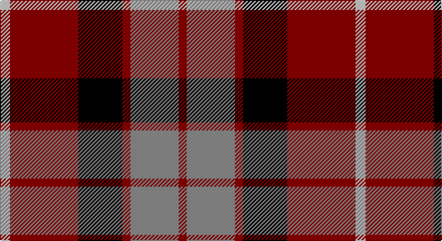

This page is one **sett** — a single exact thread-count. It belongs to the [tartan](/setts/lb5r34k22r4o24r4/)
(the same proportion at any scale), whose colour order is pattern [RRRKRW](/stripes/rrrkrw/).

Sourced from register-of-tartans.  It is a [6 stripe tartan](/stripes/stripes6/).

Original link https://www.tartanregister.gov.uk/tartanDetails.aspx?ref=4551

## Register references

External register numbers recorded for this tartan.

- Scottish Register of Tartans: [4551](https://www.tartanregister.gov.uk/tartanDetails.aspx?ref=4551)
- Scottish Tartans Authority (ITI): 4282

## Thread count
Na/10 DR68 K44 DR8 N48 DR/8

One full sett is **354 threads**.

## Palette

Palette: <strong>Tartan Register</strong> <small style="color:#888">(2 of 4 colours)</small>
<table><thead><tr><th>Colour</th><th>Threads</th><th>Shade</th><th>Base</th><th>OKLCh</th></tr></thead><tbody><tr><td>Na/</td><td style="text-align:right;font-variant-numeric:tabular-nums">10</td><td><code style="background-color:#C8C8C8;">#C8C8C8</code> <small style="color:#888">#C8C8C8</small></td><td>W <code style="background-color:#F7F7F7;">#F7F7F7</code></td><td><small style="color:#888">oklch(83.3% 0.000 89.9)</small></td></tr><tr><td>DR</td><td style="text-align:right;font-variant-numeric:tabular-nums">68</td><td><code style="background-color:#8C0000;">#8C0000</code> <small style="color:#888">#8C0000</small></td><td>R <code style="background-color:#CC0000;">#CC0000</code></td><td><small style="color:#888">oklch(40.2% 0.165 29.2)</small></td></tr><tr><td>K</td><td style="text-align:right;font-variant-numeric:tabular-nums">44</td><td><code style="background-color:#000000;">#000000</code> <small style="color:#888">#000000</small></td><td>K <code style="background-color:#000000;">#000000</code></td><td><small style="color:#888">oklch(0.0% 0.000 0.0)</small></td></tr><tr><td>DR</td><td style="text-align:right;font-variant-numeric:tabular-nums">8</td><td><code style="background-color:#8C0000;">#8C0000</code> <small style="color:#888">#8C0000</small></td><td>R <code style="background-color:#CC0000;">#CC0000</code></td><td><small style="color:#888">oklch(40.2% 0.165 29.2)</small></td></tr><tr><td>N</td><td style="text-align:right;font-variant-numeric:tabular-nums">48</td><td><code style="background-color:#8C8C8C;">#8C8C8C</code> <small style="color:#888">#8C8C8C</small></td><td>R <code style="background-color:#CC0000;">#CC0000</code></td><td><small style="color:#888">oklch(64.0% 0.000 89.9)</small></td></tr><tr><td>DR/</td><td style="text-align:right;font-variant-numeric:tabular-nums">8</td><td><code style="background-color:#8C0000;">#8C0000</code> <small style="color:#888">#8C0000</small></td><td>R <code style="background-color:#CC0000;">#CC0000</code></td><td><small style="color:#888">oklch(40.2% 0.165 29.2)</small></td></tr></tbody></table>

# Sample pattern

## Nearest tartans

The nearest existing variants by ΔTartan distance, with this tartan at the top so the swatches line up against it.

ΔTartan

Tartan

Sett

—

<a href="/ttd/edit/#slug=lb5r34k22r4o24r4~x2">Wcwm 759-2</a> <a class="nn-out" href="/variants/s6/lb5r34k22r4o24r4~x2/" title="open its dictionary page">↗</a>

0.65

<a href="/ttd/edit/#slug=ly2r15k7db8ly2~x4&amp;base=lb5r34k22r4o24r4~x2">Aberdeen University</a> <a class="nn-out" href="/variants/s5/ly2r15k7db8ly2~x4/" title="open its dictionary page">↗</a>

0.71

<a href="/ttd/edit/#slug=r26t3r4k16db16k4~x2&amp;base=lb5r34k22r4o24r4~x2">Graham of Menteith, (Red)</a> <a class="nn-out" href="/variants/s6/r26t3r4k16db16k4~x2/" title="open its dictionary page">↗</a>

0.79

<a href="/ttd/edit/#slug=lb5o34k24o4r24o4~x2&amp;base=lb5r34k22r4o24r4~x2">Wcwm 759-3</a> <a class="nn-out" href="/variants/s6/lb5o34k24o4r24o4~x2/" title="open its dictionary page">↗</a>

1.05

<a href="/ttd/edit/#slug=ly4r27k12db15ly4~x2&amp;base=lb5r34k22r4o24r4~x2">Aberdeen University (1992)</a> <a class="nn-out" href="/variants/s5/ly4r27k12db15ly4~x2/" title="open its dictionary page">↗</a>

1.07

<a href="/ttd/edit/#slug=k23r27db3r5w3k14ly6~x2&amp;base=lb5r34k22r4o24r4~x2">Hoffman Texas German</a> <a class="nn-out" href="/variants/s7/k23r27db3r5w3k14ly6~x2/" title="open its dictionary page">↗</a>

1.07

<a href="/ttd/edit/#slug=r15g3w2k10w5~x2&amp;base=lb5r34k22r4o24r4~x2">SAL Cubiska Stenen</a> <a class="nn-out" href="/variants/s5/r15g3w2k10w5~x2/" title="open its dictionary page">↗</a>

1.11

<a href="/ttd/edit/#slug=r9k4r9k25ly3dp18k4~x2&amp;base=lb5r34k22r4o24r4~x2">Wounded Warriors Canada</a> <a class="nn-out" href="/variants/s7/r9k4r9k25ly3dp18k4~x2/" title="open its dictionary page">↗</a>

1.11

<a href="/ttd/edit/#slug=g3k15r8g2o8k2~x4&amp;base=lb5r34k22r4o24r4~x2">Thompson Black (Fashion)</a> <a class="nn-out" href="/variants/s6/g3k15r8g2o8k2~x4/" title="open its dictionary page">↗</a>

1.14

<a href="/ttd/edit/#slug=k3ly18dg6r17k31dg3~x2&amp;base=lb5r34k22r4o24r4~x2">MacMillan Varient (Unidentified)</a> <a class="nn-out" href="/variants/s6/k3ly18dg6r17k31dg3~x2/" title="open its dictionary page">↗</a>

1.15

<a href="/ttd/edit/#slug=b2r12db2b6k6b1~x2&amp;base=lb5r34k22r4o24r4~x2">MacTavish</a> <a class="nn-out" href="/variants/s6/b2r12db2b6k6b1~x2/" title="open its dictionary page">↗</a>

## Neighbour map

Every grey dot is one of 14360 variants placed by the first two principal components of the ΔTartan feature space (44% of its variance). Red is this tartan; blue dots are its nearest — click one to open its page.

<svg viewBox="0 0 640 380" role="img" style="max-width:100%;height:auto;border:1px solid #e0e0e0;border-radius:4px;display:block" xmlns="http://www.w3.org/2000/svg"><image href="/nn/cloud.v1.png" width="640" height="380"/><a href="/variants/s5/ly2r15k7db8ly2~x4/"><circle cx="185.1" cy="214.9" r="4" fill="#3465a4"><title>Aberdeen University</title></circle></a><a href="/variants/s6/r26t3r4k16db16k4~x2/"><circle cx="205.3" cy="208.7" r="4" fill="#3465a4"><title>Graham of Menteith, (Red)</title></circle></a><a href="/variants/s6/lb5o34k24o4r24o4~x2/"><circle cx="190.3" cy="203.2" r="4" fill="#3465a4"><title>Wcwm 759-3</title></circle></a><a href="/variants/s5/ly4r27k12db15ly4~x2/"><circle cx="187.3" cy="223.5" r="4" fill="#3465a4"><title>Aberdeen University (1992)</title></circle></a><a href="/variants/s7/k23r27db3r5w3k14ly6~x2/"><circle cx="206.5" cy="174.1" r="4" fill="#3465a4"><title>Hoffman Texas German</title></circle></a><a href="/variants/s5/r15g3w2k10w5~x2/"><circle cx="165.2" cy="207.1" r="4" fill="#3465a4"><title>SAL Cubiska Stenen</title></circle></a><a href="/variants/s7/r9k4r9k25ly3dp18k4~x2/"><circle cx="229.3" cy="211.0" r="4" fill="#3465a4"><title>Wounded Warriors Canada</title></circle></a><a href="/variants/s6/g3k15r8g2o8k2~x4/"><circle cx="200.8" cy="224.2" r="4" fill="#3465a4"><title>Thompson Black (Fashion)</title></circle></a><a href="/variants/s6/k3ly18dg6r17k31dg3~x2/"><circle cx="188.9" cy="191.9" r="4" fill="#3465a4"><title>MacMillan Varient (Unidentified)</title></circle></a><a href="/variants/s6/b2r12db2b6k6b1~x2/"><circle cx="209.9" cy="196.7" r="4" fill="#3465a4"><title>MacTavish</title></circle></a><circle cx="205.7" cy="203.8" r="5" fill="#c00000"/></svg>

ID: /variants/s6/lb5r34k22r4o24r4~x2/
