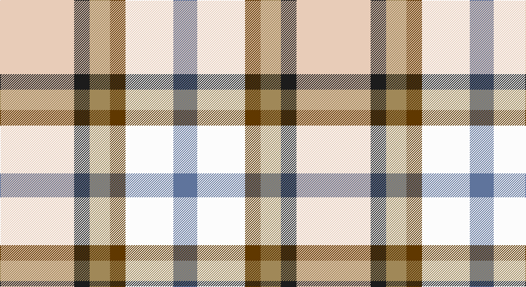

This page is one **sett** — a single exact thread-count. It belongs to the [tartan](/setts/lb62dt13lo17dy13w40t20/)
(the same proportion at any scale), whose colour order is pattern [BWGYBW](/stripes/bwgybw/).

Part of the [MacGregor-Ryan](/tartans/macgregor-ryan/) tartan — the named design grouping this sett with its other cloths.

Sourced from register-of-tartans.  It is a [6 stripe tartan](/stripes/stripes6/).

Original link https://www.tartanregister.gov.uk/tartanDetails.aspx?ref=11030

## Register references

External register numbers recorded for this tartan.

- Scottish Register of Tartans: [11030](https://www.tartanregister.gov.uk/tartanDetails.aspx?ref=11030)

## Thread count
LR/124 K26 LT34 T26 W80 B/40

One full sett is **496 threads**.

## Palette

Palette: <strong>Tartan Register</strong>
<table><thead><tr><th>Colour</th><th>Threads</th><th>Shade</th><th>Base</th><th>OKLCh</th></tr></thead><tbody><tr><td>LR/</td><td style="text-align:right;font-variant-numeric:tabular-nums">124</td><td><code style="background-color:#E8CCB8;">#E8CCB8</code> <small style="color:#888">#E8CCB8</small></td><td>W <code style="background-color:#F7F7F7;">#F7F7F7</code></td><td><small style="color:#888">oklch(86.3% 0.042 57.7)</small></td></tr><tr><td>K</td><td style="text-align:right;font-variant-numeric:tabular-nums">26</td><td><code style="background-color:#1C1C1C;">#1C1C1C</code> <small style="color:#888">#1C1C1C</small></td><td>B <code style="background-color:#2A418A;">#2A418A</code></td><td><small style="color:#888">oklch(22.6% 0.000 89.9)</small></td></tr><tr><td>LT</td><td style="text-align:right;font-variant-numeric:tabular-nums">34</td><td><code style="background-color:#A08858;">#A08858</code> <small style="color:#888">#A08858</small></td><td>Y <code style="background-color:#F2BF00;">#F2BF00</code></td><td><small style="color:#888">oklch(63.7% 0.071 84.0)</small></td></tr><tr><td>T</td><td style="text-align:right;font-variant-numeric:tabular-nums">26</td><td><code style="background-color:#603800;">#603800</code> <small style="color:#888">#603800</small></td><td>G <code style="background-color:#006100;">#006100</code></td><td><small style="color:#888">oklch(38.1% 0.084 66.7)</small></td></tr><tr><td>W</td><td style="text-align:right;font-variant-numeric:tabular-nums">80</td><td><code style="background-color:#FCFCFC;">#FCFCFC</code> <small style="color:#888">#FCFCFC</small></td><td>W <code style="background-color:#F7F7F7;">#F7F7F7</code></td><td><small style="color:#888">oklch(99.1% 0.000 89.9)</small></td></tr><tr><td>B/</td><td style="text-align:right;font-variant-numeric:tabular-nums">40</td><td><code style="background-color:#5F749C;">#5F749C</code> <small style="color:#888">#5F749C</small></td><td>B <code style="background-color:#2A418A;">#2A418A</code></td><td><small style="color:#888">oklch(55.8% 0.067 262.9)</small></td></tr></tbody></table>

# Sample pattern

## Nearest tartans

The nearest existing variants by ΔTartan distance, with this tartan at the top so the swatches line up against it.

ΔTartan

Tartan

Sett

—

<a href="/ttd/edit/#slug=lb62dt13lo17dy13w40t20~x2">MacGregor-Ryan (Personal)</a> <a class="nn-out" href="/variants/s6/lb62dt13lo17dy13w40t20~x2/" title="open its dictionary page">↗</a>

0.68

<a href="/variants/s6/lb67k13dyi17dy13w40t20~x2/">MacGregor-Ryan (Personal)</a>

1.24

<a href="/ttd/edit/#slug=db3r2lr15w10k2lo3~x2&amp;base=lb62dt13lo17dy13w40t20~x2">SCH '67 Class</a> <a class="nn-out" href="/variants/s6/db3r2lr15w10k2lo3~x2/" title="open its dictionary page">↗</a>

1.47

<a href="/ttd/edit/#slug=db4w2k3lb8g2lb8w2r4~x4&amp;base=lb62dt13lo17dy13w40t20~x2">Desang (Corporate)</a> <a class="nn-out" href="/variants/s8/db4w2k3lb8g2lb8w2r4~x4/" title="open its dictionary page">↗</a>

1.52

<a href="/ttd/edit/#slug=t8ly2g4ly2dp4ly2t8w15lo2~x4&amp;base=lb62dt13lo17dy13w40t20~x2">Edmonton, City of</a> <a class="nn-out" href="/variants/s9/t8ly2g4ly2dp4ly2t8w15lo2~x4/" title="open its dictionary page">↗</a>

1.53

<a href="/ttd/edit/#slug=r4db18ri4g19w25r10w4~x2&amp;base=lb62dt13lo17dy13w40t20~x2">Fraser, Red dress</a> <a class="nn-out" href="/variants/s7/r4db18ri4g19w25r10w4~x2/" title="open its dictionary page">↗</a>

1.61

<a href="/ttd/edit/#slug=w5y4t1y4r4t1dg4ly1~x6&amp;base=lb62dt13lo17dy13w40t20~x2">Devon Rural Skills Trust</a> <a class="nn-out" href="/variants/s8/w5y4t1y4r4t1dg4ly1~x6/" title="open its dictionary page">↗</a>

1.63

<a href="/ttd/edit/#slug=o17y5db2w12db2ly4g7~x2&amp;base=lb62dt13lo17dy13w40t20~x2">Ontario, Northern</a> <a class="nn-out" href="/variants/s7/o17y5db2w12db2ly4g7~x2/" title="open its dictionary page">↗</a>

1.65

<a href="/ttd/edit/#slug=g25r9b3ly7w3dp11&amp;base=lb62dt13lo17dy13w40t20~x2">Montessori School of Denver</a> <a class="nn-out" href="/variants/s6/g25r9b3ly7w3dp11/" title="open its dictionary page">↗</a>

1.65

<a href="/ttd/edit/#slug=dr4w2lb8dg2lb8k3w2db4~x2&amp;base=lb62dt13lo17dy13w40t20~x2">Desang</a> <a class="nn-out" href="/variants/s8/dr4w2lb8dg2lb8k3w2db4~x2/" title="open its dictionary page">↗</a>

1.69

<a href="/ttd/edit/#slug=r4db18ri4dg19w25r10w4~x2&amp;base=lb62dt13lo17dy13w40t20~x2">Fraser Red Dress</a> <a class="nn-out" href="/variants/s7/r4db18ri4dg19w25r10w4~x2/" title="open its dictionary page">↗</a>

## Neighbour map

Every grey dot is one of 14360 variants placed by the first two principal components of the ΔTartan feature space (44% of its variance). Red is this tartan; blue dots are its nearest — click one to open its page.

<svg viewBox="0 0 640 380" role="img" style="max-width:100%;height:auto;border:1px solid #e0e0e0;border-radius:4px;display:block" xmlns="http://www.w3.org/2000/svg"><image href="/nn/cloud.v1.png" width="640" height="380"/><a href="/variants/s6/lb67k13dyi17dy13w40t20~x2/"><circle cx="89.4" cy="191.9" r="4" fill="#3465a4"><title>MacGregor-Ryan (Personal)</title></circle></a><a href="/variants/s6/db3r2lr15w10k2lo3~x2/"><circle cx="132.3" cy="156.7" r="4" fill="#3465a4"><title>SCH '67 Class</title></circle></a><a href="/variants/s8/db4w2k3lb8g2lb8w2r4~x4/"><circle cx="96.5" cy="191.9" r="4" fill="#3465a4"><title>Desang (Corporate)</title></circle></a><a href="/variants/s9/t8ly2g4ly2dp4ly2t8w15lo2~x4/"><circle cx="87.9" cy="154.3" r="4" fill="#3465a4"><title>Edmonton, City of</title></circle></a><a href="/variants/s7/r4db18ri4g19w25r10w4~x2/"><circle cx="86.0" cy="193.7" r="4" fill="#3465a4"><title>Fraser, Red dress</title></circle></a><a href="/variants/s8/w5y4t1y4r4t1dg4ly1~x6/"><circle cx="36.2" cy="200.2" r="4" fill="#3465a4"><title>Devon Rural Skills Trust</title></circle></a><a href="/variants/s7/o17y5db2w12db2ly4g7~x2/"><circle cx="104.5" cy="174.6" r="4" fill="#3465a4"><title>Ontario, Northern</title></circle></a><a href="/variants/s6/g25r9b3ly7w3dp11/"><circle cx="126.3" cy="168.8" r="4" fill="#3465a4"><title>Montessori School of Denver</title></circle></a><a href="/variants/s8/dr4w2lb8dg2lb8k3w2db4~x2/"><circle cx="91.6" cy="191.7" r="4" fill="#3465a4"><title>Desang</title></circle></a><a href="/variants/s7/r4db18ri4dg19w25r10w4~x2/"><circle cx="85.3" cy="192.2" r="4" fill="#3465a4"><title>Fraser Red Dress</title></circle></a><circle cx="68.9" cy="190.9" r="5" fill="#c00000"/></svg>

ID: /variants/s6/lb62dt13lo17dy13w40t20~x2/
