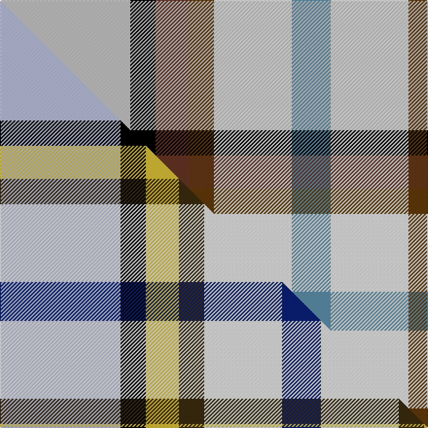

This page is one **sett** — a single exact thread-count. It belongs to the [tartan](/setts/lb67k13dy17dyi13w40t20/)
(the same proportion at any scale), whose colour order is pattern [BWGGKW](/stripes/bwggkw/).

Part of the [MacGregor-Ryan](/tartans/macgregor-ryan/) tartan — the named design grouping this sett with its other cloths.

Sourced from tartans-authority.  It is a [6 stripe tartan](/stripes/stripes6/).

Original link http://www.tartansauthority.com/tartan-ferret/display/11030/

## Register references

External register numbers recorded for this tartan.

- Scottish Register of Tartans: [11030](https://www.tartanregister.gov.uk/tartanDetails?ref=11030)
- Scottish Tartans Authority (ITI): 11030

## Thread count
LB/134 K26 DY34 DYi26 W80 T/40

One full sett is **506 threads**.

## Palette
<table><thead><tr><th>Colour</th><th>Shade</th><th>OKLCh</th></tr></thead><tbody><tr><td>T</td><td><code style="background-color:#5C8CA8;">#5C8CA8</code> <small style="color:#888">#5C8CA8</small></td><td><small style="color:#888">oklch(61.7% 0.067 235.0)</small></td></tr><tr><td>K</td><td><code style="background-color:#000000;">#000000</code> <small style="color:#888">#000000</small></td><td><small style="color:#888">oklch(0.0% 0.000 0.0)</small></td></tr><tr><td>W</td><td><code style="background-color:#F7F7F7;">#F7F7F7</code> <small style="color:#888">#F7F7F7</small></td><td><small style="color:#888">oklch(97.6% 0.000 89.9)</small></td></tr><tr><td>LB</td><td><code style="background-color:#C0C0C0;">#C0C0C0</code> <small style="color:#888">#C0C0C0</small></td><td><small style="color:#888">oklch(80.8% 0.000 89.9)</small></td></tr><tr><td>DY</td><td><code style="background-color:#643424;">#643424</code> <small style="color:#888">#643424</small></td><td><small style="color:#888">oklch(38.3% 0.074 39.1)</small></td></tr><tr><td>DY</td><td><code style="background-color:#603800;">#603800</code> <small style="color:#888">#603800</small></td><td><small style="color:#888">oklch(38.1% 0.084 66.7)</small></td></tr></tbody></table>

# Sample pattern

## Compared to the master

This cloth is one sett of its design; the master sett (the exemplar the design is anchored on) is below for comparison.

Its **ΔTartan distance** from the master is **0.71** — the same measure the nearest-tartans table ranks by (0 is identical; a re-scale of the same cloth is near 0, a recolour or a different proportion further).

<figure class="master-compare" style="margin:0">

this sett
master sett ★

<figcaption style="color:#888;font-size:smaller">One weave of this sett against the <a href="/setts/lb62k13ly17dy13w40db20/">master sett ★</a>, split on the diagonal: a shared proportion runs seamlessly across it with only the shades shifting; a different proportion breaks on it.</figcaption>
</figure>

## Nearest variants

The nearest existing variants by ΔTartan distance, with this cloth at the top so the swatches line up against it.

ΔTartan

Threads

Variant

Sett

—

506

<a href="/variants/s6/lb67k13dy17dyi13w40t20~x2~lb3200000-dy1503038-dyi1503076-t2503227/">MacGregor-Ryan (Personal)</a>

<a href="/ttd/edit/#slug=db3r2n15w10k2y3~x2&amp;base=lb67k13dy17dyi13w40t20~x2~lb3200000-dy1503038-dyi1503076-t2503227" title="compare in the TTD">1.94</a>

128

<a href="/variants/s6/db3r2n15w10k2y3~x2/">SCH '67 Class</a>

<a href="/ttd/edit/#slug=lb3w10db10g10k2~x4&amp;base=lb67k13dy17dyi13w40t20~x2~lb3200000-dy1503038-dyi1503076-t2503227" title="compare in the TTD">2.61</a>

260

<a href="/variants/s5/lb3w10db10g10k2~x4/">MacTeddy</a>

<a href="/ttd/edit/#slug=lb62k13ly17dy13w40db20~x2&amp;base=lb67k13dy17dyi13w40t20~x2~lb3200000-dy1503038-dyi1503076-t2503227" title="compare in the TTD">2.68</a>

496

<a href="/variants/s6/lb62k13ly17dy13w40db20~x2/">MacGregor-Ryan (Personal)</a>

<a href="/ttd/edit/#slug=o17n5db2w12db2y4g7~x2&amp;base=lb67k13dy17dyi13w40t20~x2~lb3200000-dy1503038-dyi1503076-t2503227" title="compare in the TTD">2.71</a>

148

<a href="/variants/s7/o17n5db2w12db2y4g7~x2/">Ontario, Northern</a>

<a href="/ttd/edit/#slug=o5g2o2g26k9lr9lb13w5~x2~g2203152-lr2800000-lb3203246&amp;base=lb67k13dy17dyi13w40t20~x2~lb3200000-dy1503038-dyi1503076-t2503227" title="compare in the TTD">2.77</a>

264

<a href="/variants/s8/o5g2o2g26k9lr9lb13w5~x2~g2203152-lr2800000-lb3203246/">Alexander of Menstry Hunting</a>

<a href="/ttd/edit/#slug=dp2w12t11lb12k1g2~x4&amp;base=lb67k13dy17dyi13w40t20~x2~lb3200000-dy1503038-dyi1503076-t2503227" title="compare in the TTD">2.86</a>

304

<a href="/variants/s6/dp2w12t11lb12k1g2~x4/">Isle of Barra (District)</a>

<a href="/ttd/edit/#slug=dp2w12t11lb12k1g2~x4~dp1607327&amp;base=lb67k13dy17dyi13w40t20~x2~lb3200000-dy1503038-dyi1503076-t2503227" title="compare in the TTD">2.86</a>

304

<a href="/variants/s6/dp2w12t11lb12k1g2~x4~dp1607327/">Isle of Barra</a>

<a href="/ttd/edit/#slug=ly3r3lb4w2db11g13k2~x2&amp;base=lb67k13dy17dyi13w40t20~x2~lb3200000-dy1503038-dyi1503076-t2503227" title="compare in the TTD">2.88</a>

142

<a href="/variants/s7/ly3r3lb4w2db11g13k2~x2/">Kentucky, State of (District)</a>

<a href="/ttd/edit/#slug=ly3r3lb4w2db11dg13k2~x2~r2109032-db1406275-dg1806142&amp;base=lb67k13dy17dyi13w40t20~x2~lb3200000-dy1503038-dyi1503076-t2503227" title="compare in the TTD">2.88</a>

142

<a href="/variants/s7/ly3r3lb4w2db11dg13k2~x2~r2109032-db1406275-dg1806142/">Kentucky State American District Tartan</a>

<a href="/ttd/edit/#slug=dr2db4dr6db2w6k1ly2~x2&amp;base=lb67k13dy17dyi13w40t20~x2~lb3200000-dy1503038-dyi1503076-t2503227" title="compare in the TTD">2.93</a>

84

<a href="/variants/s7/dr2db4dr6db2w6k1ly2~x2/">Unidentified Printing</a>

## Neighbour map

Every grey dot is one of 13620 variants placed by the first two principal components of the ΔTartan feature space (42% of its variance). Red is this tartan; blue dots are its nearest — click one to open its page.

<svg viewBox="0 0 640 380" role="img" style="max-width:100%;height:auto;border:1px solid #e0e0e0;border-radius:4px;display:block" xmlns="http://www.w3.org/2000/svg"><image href="/nn/cloud.v1.png" width="640" height="380"/><a href="/variants/s6/db3r2n15w10k2y3~x2/"><circle cx="133.3" cy="175.8" r="4" fill="#3465a4"><title>SCH '67 Class</title></circle></a><a href="/variants/s5/lb3w10db10g10k2~x4/"><circle cx="47.0" cy="249.3" r="4" fill="#3465a4"><title>MacTeddy</title></circle></a><a href="/variants/s6/lb62k13ly17dy13w40db20~x2/"><circle cx="69.4" cy="215.9" r="4" fill="#3465a4"><title>MacGregor-Ryan (Personal)</title></circle></a><a href="/variants/s7/o17n5db2w12db2y4g7~x2/"><circle cx="125.4" cy="200.2" r="4" fill="#3465a4"><title>Ontario, Northern</title></circle></a><a href="/variants/s8/o5g2o2g26k9lr9lb13w5~x2~g2203152-lr2800000-lb3203246/"><circle cx="119.8" cy="153.5" r="4" fill="#3465a4"><title>Alexander of Menstry Hunting</title></circle></a><a href="/variants/s6/dp2w12t11lb12k1g2~x4/"><circle cx="116.0" cy="183.8" r="4" fill="#3465a4"><title>Isle of Barra (District)</title></circle></a><a href="/variants/s6/dp2w12t11lb12k1g2~x4~dp1607327/"><circle cx="120.1" cy="184.9" r="4" fill="#3465a4"><title>Isle of Barra</title></circle></a><a href="/variants/s7/ly3r3lb4w2db11g13k2~x2/"><circle cx="57.7" cy="174.1" r="4" fill="#3465a4"><title>Kentucky, State of (District)</title></circle></a><a href="/variants/s7/ly3r3lb4w2db11dg13k2~x2~r2109032-db1406275-dg1806142/"><circle cx="66.0" cy="174.8" r="4" fill="#3465a4"><title>Kentucky State American District Tartan</title></circle></a><a href="/variants/s7/dr2db4dr6db2w6k1ly2~x2/"><circle cx="82.1" cy="217.9" r="4" fill="#3465a4"><title>Unidentified Printing</title></circle></a><circle cx="87.1" cy="207.4" r="5" fill="#c00000"/><text x="320" y="376" text-anchor="middle" font-size="11" fill="#999">ground</text><text x="11" y="190" text-anchor="middle" font-size="11" fill="#999" transform="rotate(-90 11 190)">complexity</text></svg>

ID: /variants/s6/lb67k13dy17dyi13w40t20~x2~lb3200000-dy1503038-dyi1503076-t2503227/
