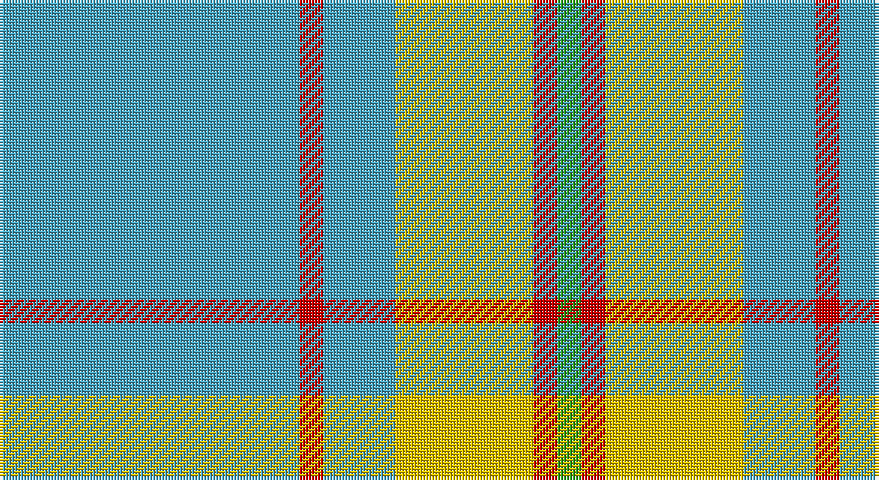

This page is one **sett** — a single exact thread-count. It belongs to the [tartan](/setts/lg50r4lg12ly23r4g4/)
(the same proportion at any scale), whose colour order is pattern [GRYYRY](/stripes/gryyry/).

Sourced from register-of-tartans.  It is a [6 stripe tartan](/stripes/stripes6/).

Original link https://www.tartanregister.gov.uk/tartanDetails.aspx?ref=1824

2 attestations — the source records this cloth was collapsed from (oldest owns this page)

<ul>
<li>01/09/2006 — Ingenico (register-of-tartans, <a href="https://www.tartanregister.gov.uk/tartanDetails.aspx?ref=1824">record</a>)</li>
<li>2006 September — Ingenico (Corporate) (tartans-authority, <a href="http://www.tartansauthority.com/tartan-ferret/display/7004/">record</a>)</li>
</ul>

## Register references

External register numbers recorded for this tartan.

- Scottish Register of Tartans: [1824](https://www.tartanregister.gov.uk/tartanDetails.aspx?ref=1824)
- Scottish Tartans Authority (ITI): 7004

## Thread count
B/100 R8 B24 Y46 R8 Ga/8

One full sett is **280 threads**.

## Palette

Palette: <strong>Tartan Register</strong>
<table><thead><tr><th>Colour</th><th>Threads</th><th>Shade</th><th>Base</th><th>OKLCh</th></tr></thead><tbody><tr><td>B/</td><td style="text-align:right;font-variant-numeric:tabular-nums">100</td><td><code style="background-color:#48A4C0;">#48A4C0</code> <small style="color:#888">#48A4C0</small></td><td>Y <code style="background-color:#F2BF00;">#F2BF00</code></td><td><small style="color:#888">oklch(67.5% 0.096 221.0)</small></td></tr><tr><td>R</td><td style="text-align:right;font-variant-numeric:tabular-nums">8</td><td><code style="background-color:#C80000;">#C80000</code> <small style="color:#888">#C80000</small></td><td>R <code style="background-color:#CC0000;">#CC0000</code></td><td><small style="color:#888">oklch(52.3% 0.215 29.2)</small></td></tr><tr><td>B</td><td style="text-align:right;font-variant-numeric:tabular-nums">24</td><td><code style="background-color:#48A4C0;">#48A4C0</code> <small style="color:#888">#48A4C0</small></td><td>Y <code style="background-color:#F2BF00;">#F2BF00</code></td><td><small style="color:#888">oklch(67.5% 0.096 221.0)</small></td></tr><tr><td>Y</td><td style="text-align:right;font-variant-numeric:tabular-nums">46</td><td><code style="background-color:#E8C000;">#E8C000</code> <small style="color:#888">#E8C000</small></td><td>Y <code style="background-color:#F2BF00;">#F2BF00</code></td><td><small style="color:#888">oklch(81.9% 0.168 93.7)</small></td></tr><tr><td>R</td><td style="text-align:right;font-variant-numeric:tabular-nums">8</td><td><code style="background-color:#C80000;">#C80000</code> <small style="color:#888">#C80000</small></td><td>R <code style="background-color:#CC0000;">#CC0000</code></td><td><small style="color:#888">oklch(52.3% 0.215 29.2)</small></td></tr><tr><td>Ga/</td><td style="text-align:right;font-variant-numeric:tabular-nums">8</td><td><code style="background-color:#289C18;">#289C18</code> <small style="color:#888">#289C18</small></td><td>G <code style="background-color:#006100;">#006100</code></td><td><small style="color:#888">oklch(60.6% 0.191 141.6)</small></td></tr></tbody></table>

# Sample pattern

## Nearest tartans

The nearest existing variants by ΔTartan distance, with this tartan at the top so the swatches line up against it.

ΔTartan

Tartan

Sett

—

<a href="/ttd/edit/#slug=lg50r4lg12ly23r4g4~x2">Ingenico</a> <a class="nn-out" href="/variants/s6/lg50r4lg12ly23r4g4~x2/" title="open its dictionary page">↗</a>

1.02

<a href="/ttd/edit/#slug=o57w5g20o5ly10&amp;base=lg50r4lg12ly23r4g4~x2">Jahore District Tartan</a> <a class="nn-out" href="/variants/s5/o57w5g20o5ly10/" title="open its dictionary page">↗</a>

1.22

<a href="/ttd/edit/#slug=y57w5g20y5ly10&amp;base=lg50r4lg12ly23r4g4~x2">Jahore</a> <a class="nn-out" href="/variants/s5/y57w5g20y5ly10/" title="open its dictionary page">↗</a>

1.51

<a href="/ttd/edit/#slug=o57w5g20o5lo10~x2&amp;base=lg50r4lg12ly23r4g4~x2">Johore (District)</a> <a class="nn-out" href="/variants/s5/o57w5g20o5lo10~x2/" title="open its dictionary page">↗</a>

1.58

<a href="/ttd/edit/#slug=k2t28g7w3r2~x2&amp;base=lg50r4lg12ly23r4g4~x2">Cleland Corporate Tartan</a> <a class="nn-out" href="/variants/s5/k2t28g7w3r2~x2/" title="open its dictionary page">↗</a>

1.60

<a href="/ttd/edit/#slug=t11ly2r1ly2r1~x4&amp;base=lg50r4lg12ly23r4g4~x2">Carlisle, Ancient</a> <a class="nn-out" href="/variants/s5/t11ly2r1ly2r1~x4/" title="open its dictionary page">↗</a>

1.67

<a href="/ttd/edit/#slug=w8r6lo2g34b3~x2&amp;base=lg50r4lg12ly23r4g4~x2">Milling-Kristensen (Personal)</a> <a class="nn-out" href="/variants/s5/w8r6lo2g34b3~x2/" title="open its dictionary page">↗</a>

1.68

<a href="/ttd/edit/#slug=ly5n1ly1n12r1~x8&amp;base=lg50r4lg12ly23r4g4~x2">Ceredigion (Personal)</a> <a class="nn-out" href="/variants/s5/ly5n1ly1n12r1~x8/" title="open its dictionary page">↗</a>

1.68

<a href="/ttd/edit/#slug=t11ly5k1ly2r1ly2t11~x12&amp;base=lg50r4lg12ly23r4g4~x2">Carlisle</a> <a class="nn-out" href="/variants/s7/t11ly5k1ly2r1ly2t11~x12/" title="open its dictionary page">↗</a>

1.68

<a href="/ttd/edit/#slug=k2t36dg12w3r2~x2&amp;base=lg50r4lg12ly23r4g4~x2">Cleland (Name)</a> <a class="nn-out" href="/variants/s5/k2t36dg12w3r2~x2/" title="open its dictionary page">↗</a>

1.71

<a href="/variants/s8/o57w5g20o5lo10~x2/">Johore</a>

## Neighbour map

Every grey dot is one of 14360 variants placed by the first two principal components of the ΔTartan feature space (44% of its variance). Red is this tartan; blue dots are its nearest — click one to open its page.

<svg viewBox="0 0 640 380" role="img" style="max-width:100%;height:auto;border:1px solid #e0e0e0;border-radius:4px;display:block" xmlns="http://www.w3.org/2000/svg"><image href="/nn/cloud.v1.png" width="640" height="380"/><a href="/variants/s5/o57w5g20o5ly10/"><circle cx="402.0" cy="218.9" r="4" fill="#3465a4"><title>Jahore District Tartan</title></circle></a><a href="/variants/s5/y57w5g20y5ly10/"><circle cx="409.3" cy="223.5" r="4" fill="#3465a4"><title>Jahore</title></circle></a><a href="/variants/s5/o57w5g20o5lo10~x2/"><circle cx="420.7" cy="229.1" r="4" fill="#3465a4"><title>Johore (District)</title></circle></a><a href="/variants/s5/k2t28g7w3r2~x2/"><circle cx="395.0" cy="179.5" r="4" fill="#3465a4"><title>Cleland Corporate Tartan</title></circle></a><a href="/variants/s5/t11ly2r1ly2r1~x4/"><circle cx="407.1" cy="208.9" r="4" fill="#3465a4"><title>Carlisle, Ancient</title></circle></a><a href="/variants/s5/w8r6lo2g34b3~x2/"><circle cx="367.9" cy="169.8" r="4" fill="#3465a4"><title>Milling-Kristensen (Personal)</title></circle></a><a href="/variants/s5/ly5n1ly1n12r1~x8/"><circle cx="432.6" cy="219.4" r="4" fill="#3465a4"><title>Ceredigion (Personal)</title></circle></a><a href="/variants/s7/t11ly5k1ly2r1ly2t11~x12/"><circle cx="365.9" cy="191.7" r="4" fill="#3465a4"><title>Carlisle</title></circle></a><a href="/variants/s5/k2t36dg12w3r2~x2/"><circle cx="399.3" cy="169.9" r="4" fill="#3465a4"><title>Cleland (Name)</title></circle></a><a href="/variants/s8/o57w5g20o5lo10~x2/"><circle cx="328.8" cy="195.8" r="4" fill="#3465a4"><title>Johore</title></circle></a><circle cx="387.1" cy="197.8" r="5" fill="#c00000"/></svg>

ID: /variants/s6/lg50r4lg12ly23r4g4~x2/
